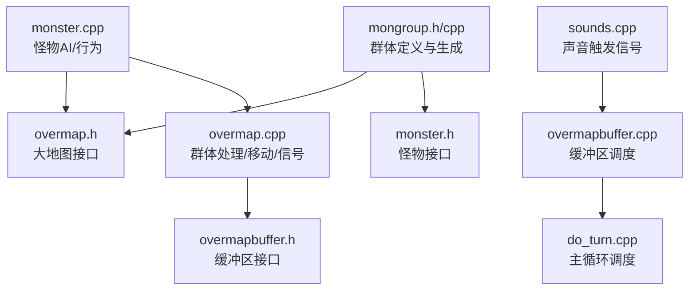
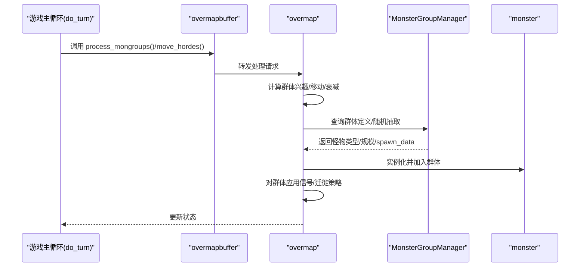
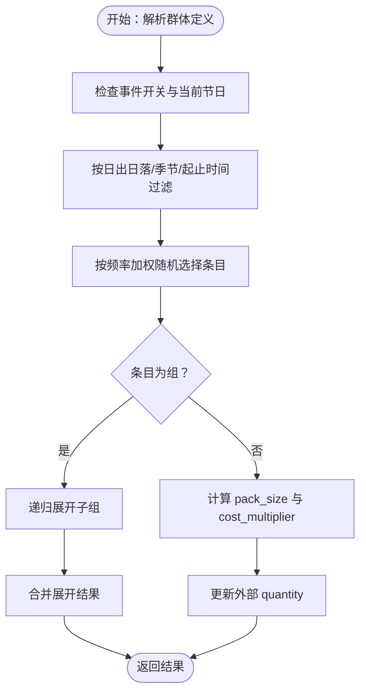
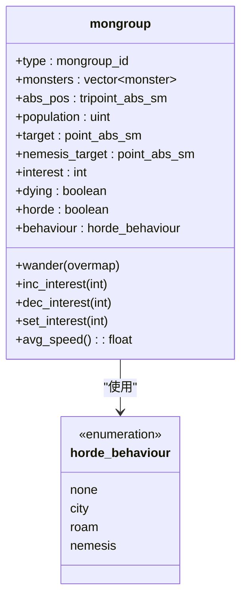
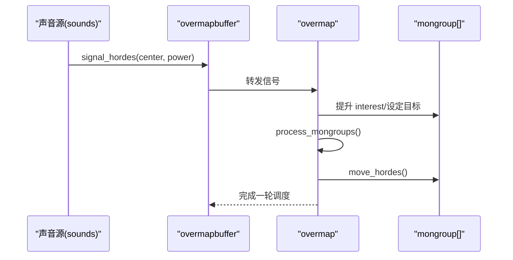
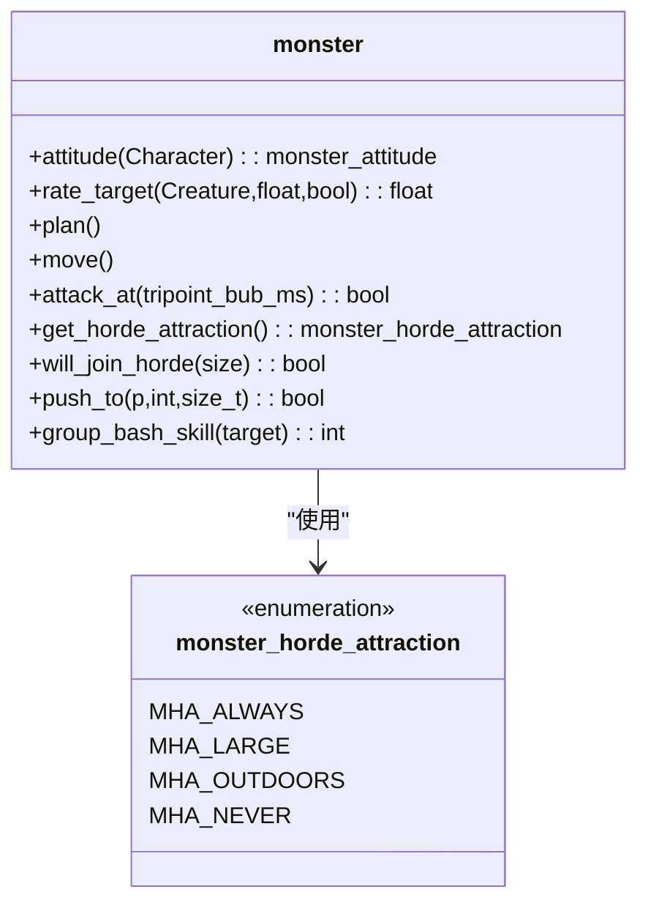
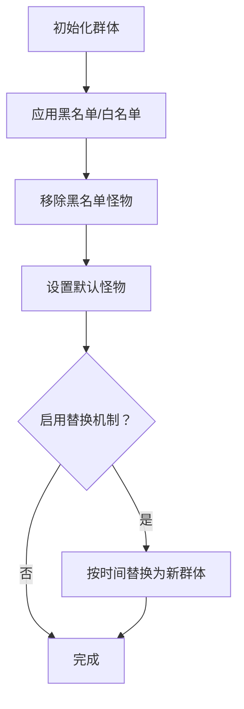
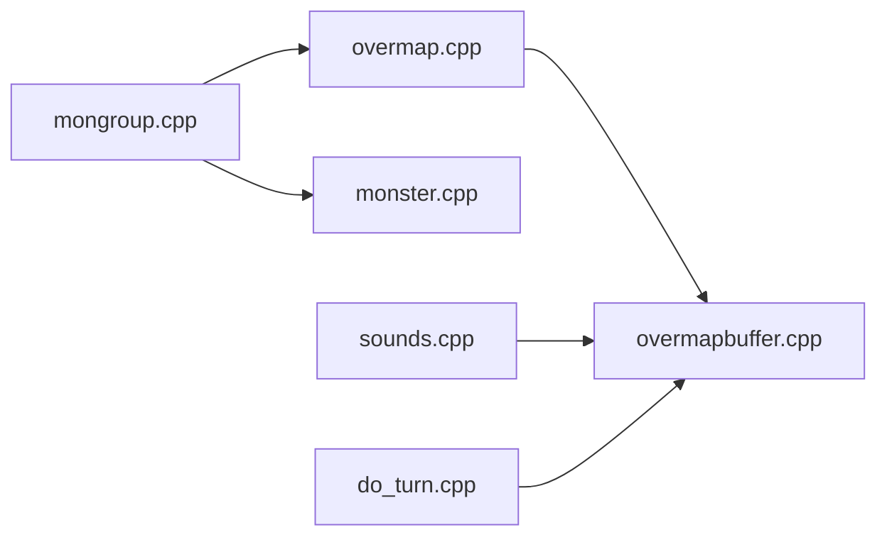

# 怪物群体管理系统

<cite>
**本文档引用的文件**
- mongroup.h
- mongroup.cpp
- mongroup_test.cpp
- monster.h
- monster.cpp
- overmap.h
- overmap.cpp
- overmapbuffer.h
- overmapbuffer.cpp
- do_turn.cpp
- sounds.cpp
</cite>

## 目录
1. [简介](#简介)
2. [项目结构](#项目结构)
3. [核心组件](#核心组件)
4. [架构总览](#架构总览)
5. [详细组件分析](#详细组件分析)
6. [依赖关系分析](#依赖关系分析)
7. [性能考量](#性能考量)
8. [故障排查指南](#故障排查指南)
9. [结论](#结论)
10. [附录](#附录)

## 简介
本文件系统性梳理 Cataclysm-DDA 的怪物群体管理系统，覆盖以下关键主题：
- 群体生成：基于“怪物群体”定义的随机生成与嵌套组合、事件与时间条件筛选、群体规模（pack_size）控制。
- 群体行为协调：在大地图层（overmap）上对群体进行“迁徙/游荡/追击”等行为驱动，兴趣度（interest）与目标（target）决定移动速度与反应强度。
- 群体规模控制：通过 cost_multiplier、pack_size、event_adjusted_freq_total 等参数实现动态规模与成本控制。
- 群体吸引力与移动策略：结合 horde_attraction、signal_hordes、move_hordes 等机制，实现对玩家声音、爆炸、陷阱等信号的响应。
- 群体战斗行为：单体怪物 AI（monster）与群体行为的协同，包括路径规划、目标选择、攻击与防御。
- 群体平衡性与管理工具：黑名单/白名单、默认怪物回退、替换机制、测试用例验证。

## 项目结构
围绕怪物群体管理的核心代码主要分布在以下模块：
- 群体定义与生成：src/mongroup.{h,cpp}
- 单体怪物与群体行为：src/monster.{h,cpp}
- 大地图群体调度：src/overmap.{h,cpp} 及其缓冲区 overmapbuffer.{h,cpp}
- 游戏主循环中的处理：src/do_turn.cpp
- 声音触发信号：src/sounds.cpp
- 测试：tests/mongroup_test.cpp

**图表来源**
- mongroup.h
- mongroup.cpp
- overmap.h
- overmap.cpp
- overmapbuffer.h
- overmapbuffer.cpp
- do_turn.cpp
- monster.h
- monster.cpp
- sounds.cpp

**章节来源**
- mongroup.h
- mongroup.cpp
- overmap.h
- overmap.cpp
- overmapbuffer.h
- overmapbuffer.cpp
- do_turn.cpp
- monster.h
- monster.cpp
- sounds.cpp

## 核心组件
- MonsterGroup 与 MonsterGroupEntry：描述“怪物群体”的定义，包含默认怪物、条目列表（含频率、成本倍率、pack_size、spawn_data、条件、起止时间、节日事件等），以及事件调整后的总频率。
- mongroup：描述“已生成的群体实例”，包含类型、个体列表或总人口、绝对坐标、目标点、兴趣度、是否为群、行为模式（city/roam/nemesis）、衰减标记等。
- MonsterGroupManager：提供加载、校验、查询、随机抽取、结果展开（含嵌套）等功能；支持黑名单/白名单过滤与最终化处理。
- overmap/overmapbuffer：负责群体的生命周期管理（生成、移动、信号响应、衰减）。
- monster：单体怪物的 AI 行为，包括目标选择、路径规划、战斗与特殊能力。

**章节来源**
- mongroup.h
- mongroup.h
- mongroup.h
- mongroup.cpp
- mongroup.cpp
- overmap.cpp
- overmapbuffer.cpp
- monster.h

## 架构总览
下图展示从游戏主循环到大地图群体处理的整体流程，以及声音信号如何影响群体行为。

**图表来源**
- do_turn.cpp
- overmapbuffer.cpp
- overmap.cpp
- mongroup.cpp

**章节来源**
- do_turn.cpp
- overmapbuffer.cpp
- overmap.cpp
- mongroup.cpp

## 详细组件分析

### 组件A：怪物群体定义与生成（MonsterGroup/Entry）
- 关键点
  - MonsterGroupEntry：包含 mtype/group、frequency、cost_multiplier、pack_minimum/pack_maximum、spawn_data、conditions、starts/ends、holiday 等。
  - MonsterGroup：维护 id、defaultMonster、monsters 列表、freq_total、event_freq、is_animal、replace_* 等字段。
  - MonsterGroupManager::GetResultFromGroup：按事件与时间条件筛选有效条目，按频率加权随机抽取，支持嵌套组展开与 pack_size 扩展，同时更新外部 quantity（cost_multiplier*pack_size）。
  - 事件与时间筛选：is_spawn_valid 检查节日、日出日落时段、季节限制等。
  - 黑名单/白名单：Finalize 阶段移除黑名单怪物，白名单优先；exclusive 模式下仅允许白名单。
- 群体规模控制
  - pack_size 由 [pack_minimum, pack_maximum] 决定，若 use_pack_size，则每个子项重复 pack_size 次；否则以条目为单位扩展。
  - cost_multiplier 用于消耗外部 quantity，实现“群体成本预算”的动态控制。
- 嵌套组展开
  - 当条目为组时，递归调用 GetResultFromGroup 并将结果合并；嵌套层的 pack_size 与顶层 pack_size 的乘法关系在测试中得到验证。

**图表来源**
- mongroup.cpp
- mongroup.cpp

**章节来源**
- mongroup.h
- mongroup.cpp
- mongroup.cpp
- mongroup_test.cpp

### 组件B：群体实例与行为（mongroup）
- 关键点
  - mongroup 描述“已生成的群体”，可直接持有个体列表（优先于 population），记录绝对坐标、目标点、兴趣度 interest（15%-100%边界控制）、是否为群（horde）、行为模式（city/roam/nemesis）。
  - avg_speed：当个体列表为空时，按频率加权平均各成员速度；否则取实际个体平均速度。
  - wander：在 overmap 上随机游荡，用于 roamed 群体。
  - set_target/set_nemesis_target/inc_interest/dec_interest/set_interest：对目标与兴趣度进行安全设置，保证上下界。
- 群体行为模式
  - none：无特定行为
  - city：尽量靠近城市并返回
  - roam：随机游荡
  - nemesis：追踪特定目标（如玩家）

**图表来源**
- mongroup.h

**章节来源**
- mongroup.h

### 组件C：大地图群体调度（overmap/overmapbuffer）
- 关键点
  - process_mongroups：遍历并处理群体，根据 interest、目标与行为模式决定移动与衰减。
  - move_hordes：依据 interest 与目标方向移动群体，实现“向目标靠近”的策略。
  - signal_hordes：接收来自声音、爆炸等信号，提升 interest 或改变目标，触发群体响应。
  - overmapbuffer：作为 overmap 的缓冲区接口，统一调度 process_mongroups/move_hordes/signal_hordes。
- 与主循环集成
  - do_turn 中调用 overmap_buffer 的上述方法，形成每回合的群体处理流水线。

**图表来源**
- overmap.cpp
- overmapbuffer.cpp
- sounds.cpp

**章节来源**
- overmap.cpp
- overmapbuffer.cpp
- sounds.cpp
- do_turn.cpp

### 组件D：单体怪物AI与群体协作（monster）
- 关键点
  - monster.h 定义了怪物的属性、行为枚举（如 monster_attitude、monster_horde_attraction）、目标选择、路径规划接口等。
  - monster.cpp 实现了怪物的行动、战斗、效果处理、特殊能力等，与 overmap 的群体行为协同（例如被群体吸引、跟随或被推挤）。
  - get_horde_attraction/will_join_horde：决定怪物是否愿意加入群体及其规模阈值，影响群体吸引力算法。
- 群体吸引力算法
  - 结合 horde_attraction（如 MHA_LARGE/MHA_OUTDOORS 等）与 interest，决定怪物是否加入群体以及加入后的行为倾向。
  - push_to、group_bash_skill 等机制体现群体内部的协作与推挤。

**图表来源**
- monster.h
- monster.h
- monster.h

**章节来源**
- monster.h
- monster.h
- monster.cpp

### 组件E：群体平衡性与管理工具
- 黑名单/白名单
  - 支持按怪物 ID、类别、物种维度配置；支持 exclusive 模式，仅允许白名单。
  - Finalize 阶段移除黑名单怪物，校验白名单有效性。
- 默认怪物回退
  - 若所有条目均不可用，回退到 defaultMonster；mon_null 可显式指定为默认回退。
- 替换机制
  - replace_monster_group/new_monster_group/monster_group_time：在探索新区域一段时间后替换群体类型，实现“怪物演化”。

**图表来源**
- mongroup.cpp
- mongroup.cpp

**章节来源**
- mongroup.cpp
- mongroup.cpp

## 依赖关系分析
- 模块耦合
  - mongroup 与 MonsterGroupManager 为纯数据与逻辑层，不直接依赖 overmap。
  - overmap/overmapbuffer 依赖 MonsterGroupManager 进行群体定义查询与随机抽取。
  - monster 与 overmap 交互，通过 horde_attraction 与 interest 影响加入与行为。
- 外部依赖
  - 时间系统（calendar）、选项系统（options）、随机数（rng）等贯穿群体生成与行为判定。

**图表来源**
- mongroup.cpp
- overmap.cpp
- overmapbuffer.cpp
- sounds.cpp
- do_turn.cpp
- monster.cpp

**章节来源**
- mongroup.cpp
- overmap.cpp
- overmapbuffer.cpp
- sounds.cpp
- do_turn.cpp
- monster.cpp

## 性能考量
- 频率加权与事件筛选：通过 event_adjusted_freq_total 与 is_spawn_valid 在生成阶段快速剔除无效条目，减少后续开销。
- 嵌套展开：递归展开可能带来额外开销，建议合理控制嵌套层级与 pack_size 上限。
- overmap 群体处理：每回合对群体进行 interest 更新、移动与衰减，注意大规模群体时的循环次数与信号传播范围。
- 路径规划冷却：monster 内置路径寻找指数回退机制，降低卡死场景下的 CPU 占用。

[本节为通用指导，无需具体文件来源]

## 故障排查指南
- 群体未生成
  - 检查 EVENT_SPAWNS 选项与当前节日是否匹配；确认条目的 starts/ends 与 conditions 是否导致不可用。
  - 使用 check_group_definitions 校验群体定义中的未知怪物或子群体。
- 群体规模异常
  - 检查 cost_multiplier 与 quantity 的消耗逻辑；核对 pack_size 的叠加规则（嵌套组与顶层 pack_size 的乘法）。
- 群体不移动
  - 检查 interest 是否过低（低于 15% 上限）；确认目标点与行为模式（city/roam/nemesis）。
- 群体不响应信号
  - 确认 signal_hordes 的调用位置与功率；检查 overmapbuffer/process_mongroups 的调度顺序。
- 单体怪物不加入群体
  - 检查 get_horde_attraction 与 will_join_horde 的阈值；确认 horde_attraction 设置与环境因素（如 outdoors）。

**章节来源**
- mongroup.cpp
- mongroup.cpp
- mongroup.cpp
- overmap.cpp
- overmapbuffer.cpp
- monster.h

## 结论
Cataclysm-DDA 的怪物群体管理系统通过“群体定义 + 实例调度 + 单体 AI 协同”的方式，实现了灵活而可控的群体生成、行为与规模管理。其核心优势在于：
- 明确的事件与时间筛选机制，确保群体生成符合游戏节奏。
- 嵌套组与 pack_size 的组合提供了强大的规模与成本控制能力。
- overmap 层的 interest/target/behavior 模型使群体具备动态迁移与响应能力。
- 黑名单/白名单与替换机制为平衡性与可扩展性提供了基础。

[本节为总结，无需具体文件来源]

## 附录
- 配置示例要点（基于源码语义说明）
  - 群体定义（mongroup_id）包含 id、default、monsters（含 weight/freq、cost_multiplier、pack_size、conditions、starts/ends、event）与可选的 replace_* 字段。
  - 事件开关（EVENT_SPAWNS）控制节日相关条目是否生效。
  - 黑白名单（monsters/categories/species）支持 exclusive 模式。
  - 测试用例覆盖事件筛选、嵌套组概率、pack_size 乘法规则、multi-spawn 与时间限制等场景。

**章节来源**
- mongroup.cpp
- mongroup.cpp
- mongroup_test.cpp
- mongroup_test.cpp
- mongroup_test.cpp