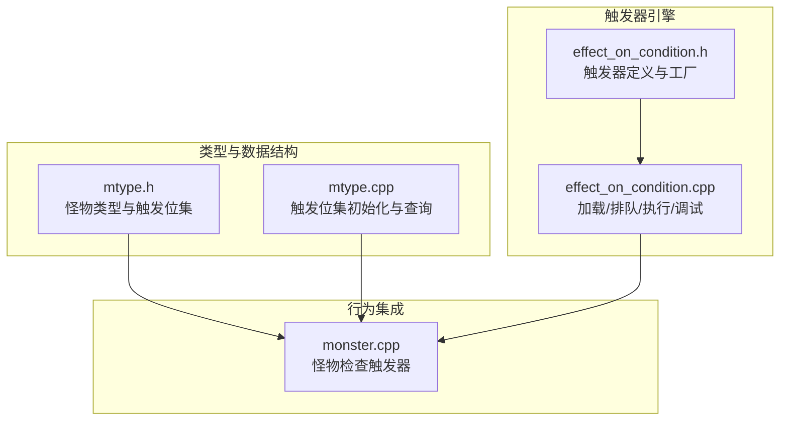
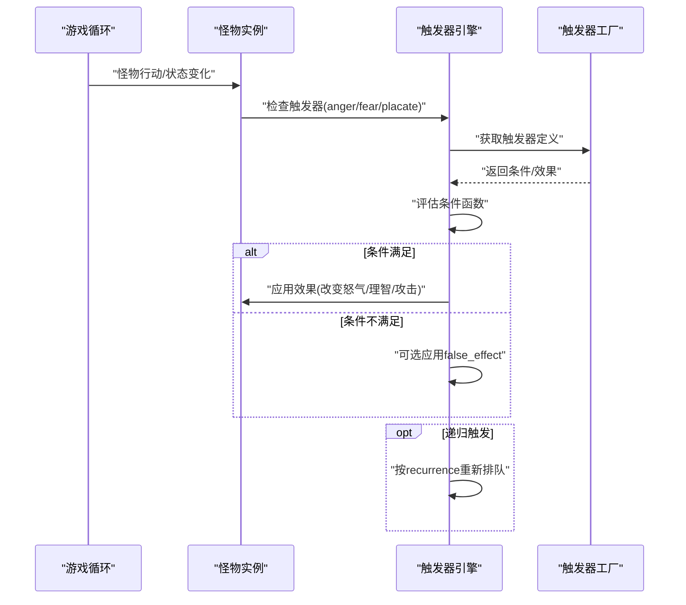
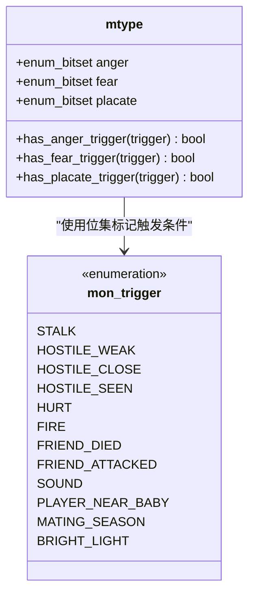
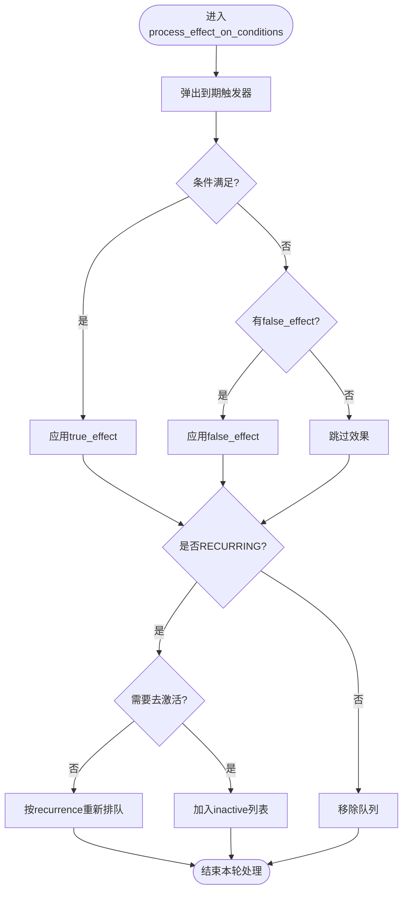
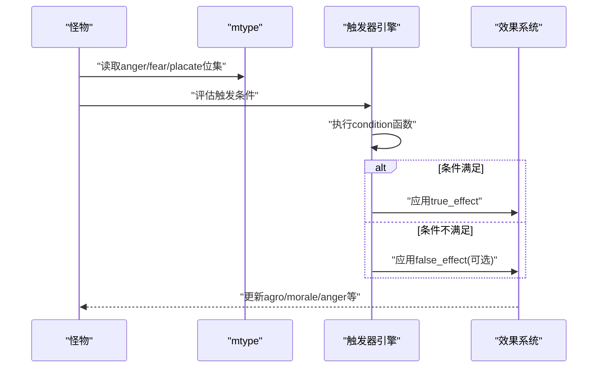
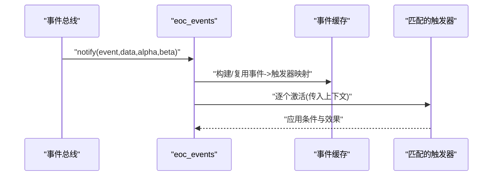
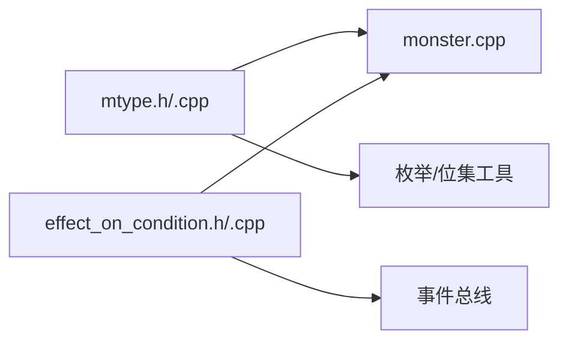

# 怪物触发器系统

<cite>
**本文档引用的文件**
- effect_on_condition.h
- effect_on_condition.cpp
- mtype.h
- mtype.cpp
- monster.cpp
- effect_on_condition.json
</cite>

## 目录
1. [简介](#简介)
2. [项目结构](#项目结构)
3. [核心组件](#核心组件)
4. [架构总览](#架构总览)
5. [详细组件分析](#详细组件分析)
6. [依赖关系分析](#依赖关系分析)
7. [性能考虑](#性能考虑)
8. [故障排除指南](#故障排除指南)
9. [结论](#结论)
10. [附录](#附录)

## 简介
本文件系统性梳理 Cataclysm-DDA 中“怪物触发器”（Monster Triggers）的设计与实现，重点覆盖以下方面：
- 触发器类型与分类：包括愤怒、恐惧、安抚三类触发条件，以及与之对应的 anger/fear/placate 位集管理。
- 触发条件判断逻辑：如何在怪物状态变化时评估触发条件，以及触发后对怪物行为的影响。
- 响应机制设计：触发后如何改变怪物的怒气值、理智值、攻击倾向等。
- 触发器优先级与链式触发：多触发条件并存时的处理顺序与相互影响。
- 调试与测试工具：如何导出与检查触发器队列，定位问题。
- 扩展方法：如何为新怪物类型添加自定义触发器。

本说明面向不同技术背景的读者，既提供高层概览，也包含代码级细节与可视化图示，帮助开发者快速理解并扩展怪物触发器系统。

## 项目结构
怪物触发器系统主要由三部分构成：
- 类型与数据结构层：怪物类型定义与触发位集管理（mtype.h/.cpp）
- 触发器执行引擎：基于事件的条件触发与效果应用（effect_on_condition.h/.cpp）
- 怪物行为集成：怪物在特定情境下调用触发器判断（monster.cpp）

**图表来源**
- mtype.h
- mtype.cpp
- effect_on_condition.h
- effect_on_condition.cpp
- monster.cpp

**章节来源**
- mtype.h
- mtype.cpp
- effect_on_condition.h
- effect_on_condition.cpp
- monster.cpp

## 核心组件
- 触发器类型枚举：mon_trigger 定义了 STALK、HOSTILE_WEAK、HOSTILE_CLOSE、HOSTILE_SEEN、HURT、FIRE、FRIEND_DIED、FRIEND_ATTACKED、SOUND、PLAYER_NEAR_BABY、MATING_SEASON、BRIGHT_LIGHT 等触发条件。
- 触发位集：mtype 内部维护 anger/fear/placate 三个 enum_bitset，分别记录该怪物类型的愤怒、恐惧、安抚触发条件集合。
- 触发器执行引擎：effect_on_condition 提供条件函数、效果函数、激活/去激活逻辑、递归触发、全局/角色队列管理、事件驱动触发缓存等能力。
- 行为集成点：怪物在合适时机调用触发器检查逻辑，根据结果调整自身状态（如怒气、理智、攻击倾向）。

**章节来源**
- mtype.h
- mtype.h
- effect_on_condition.h
- effect_on_condition.cpp

## 架构总览
触发器系统采用“事件驱动 + 条件函数 + 效果应用”的模式：
- 数据层：怪物类型定义触发条件位集；JSON 中可配置触发器的条件与效果。
- 引擎层：加载所有 effect_on_condition，按类型排队执行；支持递归触发与全局/本地队列。
- 集成层：怪物在特定情境下调用触发器检查，更新自身情绪与行为参数。

**图表来源**
- effect_on_condition.h
- effect_on_condition.cpp
- effect_on_condition.cpp

## 详细组件分析

### 组件A：怪物触发器类型与位集管理
- 触发器类型：通过 mon_trigger 枚举列出所有可触发条件，便于统一管理与扩展。
- 位集存储：mtype 内部使用 enum_bitset<mon_trigger> 分别保存 anger/fear/placate 三类触发条件，查询效率高且内存紧凑。
- 初始化与查询：mtype.cpp 中提供 has_anger_trigger/has_fear_trigger/has_placate_trigger 等方法，用于快速判断某怪物是否具备某种触发条件。

**图表来源**
- mtype.h
- mtype.h
- mtype.cpp

**章节来源**
- mtype.h
- mtype.h
- mtype.cpp

### 组件B：触发器执行引擎（effect_on_condition）
- 触发器类型：eoc_type 支持 ACTIVATION、RECURRING、AVATAR_DEATH、NPC_DEATH、PREVENT_DEATH、EVENT 六种类型，满足一次性触发、周期性触发、事件驱动等多种场景。
- 条件与效果：每个触发器包含 condition 函数（可选）、true_effect/false_effect（可选），以及 deactivate_condition（可选）用于去激活。
- 排队与执行：支持全局队列与角色本地队列，按时间点排序；递归触发器会在成功激活后按 recurrence 重新排队。
- 事件驱动：eoc_events 缓存 EVENT 类型的触发器，收到对应 event 后批量激活。
- 调试输出：提供 write_eocs_to_file/write_global_eocs_to_file 将当前队列写入文件，便于调试。

**图表来源**
- effect_on_condition.cpp
- effect_on_condition.cpp
- effect_on_condition.cpp

**章节来源**
- effect_on_condition.h
- effect_on_condition.h
- effect_on_condition.cpp
- effect_on_condition.cpp
- effect_on_condition.cpp
- effect_on_condition.cpp

### 组件C：怪物行为与触发器集成
- 行为入口：monster.cpp 中怪物在行动或状态变化时调用触发器检查流程，依据 mtype 的 anger/fear/placate 位集决定评估哪些触发条件。
- 影响范围：触发后可能改变怪物的 aggro（攻击倾向）、morale（理智）、anger（怒气）等参数，从而影响后续行为决策。
- 与效果系统协作：触发器的效果可通过 effect_on_condition 的 true/false_effect 应用到怪物或其周围环境。

**图表来源**
- monster.cpp
- mtype.h
- effect_on_condition.cpp

**章节来源**
- monster.cpp
- mtype.h
- effect_on_condition.cpp

### 组件D：事件驱动触发器（EVENT 类型）
- 缓存机制：eoc_events 在首次收到事件时构建事件到触发器的映射缓存，避免每次遍历全部触发器。
- 上下文传递：事件携带的上下文变量会注入到触发器的 dialogue 中，供 condition 和 effect 使用。
- 全局与局部：EVENT 类型触发器可同时作用于玩家与 NPC，具体取决于触发器定义。

**图表来源**
- effect_on_condition.cpp

**章节来源**
- effect_on_condition.cpp

## 依赖关系分析
- mtype 依赖枚举与位集工具，提供触发条件的静态定义与查询接口。
- effect_on_condition 依赖事件总线、对话系统、工厂加载机制，负责动态加载与执行。
- monster 依赖 mtype 与 effect_on_condition，作为触发器的调用方与状态变更的受益者。

**图表来源**
- mtype.h
- effect_on_condition.h
- effect_on_condition.cpp
- monster.cpp

**章节来源**
- mtype.h
- effect_on_condition.h
- effect_on_condition.cpp
- monster.cpp

## 性能考虑
- 位集查询：anger/fear/placate 使用 enum_bitset，查询复杂度为 O(1)，适合频繁检查。
- 触发器队列：使用优先队列按到期时间排序，单次处理弹出到期项，避免全量扫描。
- 事件缓存：EVENT 类型触发器仅在首次收到事件时建立缓存，后续事件复用映射，降低遍历成本。
- 递归触发：RECURRING 类型按 recurrence 重新排队，注意避免无限递归，建议配合 deactivate_condition 或上限控制。

[本节为通用性能讨论，无需引用具体文件]

## 故障排除指南
- 导出触发器队列：使用 write_eocs_to_file/write_global_eocs_to_file 将当前排队与非活动触发器写入文件，核对触发器 ID、剩余时间与是否仍在队列中。
- 检查条件函数：确认 condition 函数依赖的上下文变量是否正确传入，必要时在 condition 中打印调试信息。
- 避免无限递归：RECURRING 触发器若无去激活条件，可能导致持续排队，建议设置 deactivate_condition 或合理的时间间隔。
- 死亡与复活：PREVENT_DEATH/AVATAR_DEATH 类型触发器在特定时机自动执行，可结合调试输出验证是否被正确触发。

**章节来源**
- effect_on_condition.cpp
- effect_on_condition.cpp
- effect_on_condition.cpp

## 结论
怪物触发器系统通过“类型定义 + 条件函数 + 效果应用 + 事件驱动”的组合，实现了灵活而高效的怪物行为控制。其核心优势在于：
- 易扩展：新增触发器类型与条件只需遵循现有接口与工厂机制。
- 高性能：位集查询与优先队列处理保证了运行时效率。
- 可调试：完善的日志与导出工具便于定位问题与优化行为。

对于扩展需求，建议：
- 在 mtype 中声明新的触发条件位集，并在怪物 JSON 中启用相应标志。
- 在 effect_on_condition 中定义新的触发器，编写清晰的 condition 与 effect。
- 使用 EVENT 类型连接游戏事件，确保上下文变量正确传递。

[本节为总结性内容，无需引用具体文件]

## 附录

### A. 触发器类型与触发时机对照
- STALK：跟随玩家时增加愤怒
- HOSTILE_WEAK/HOSTILE_CLOSE/HOSTILE_SEEN：看到/靠近/伤害玩家时触发
- HURT/FIRE：自身受伤/附近起火时触发
- FRIEND_DIED/FRIEND_ATTACKED：同类死亡/被攻击时触发
- SOUND：听到声音时触发
- PLAYER_NEAR_BABY：玩家/NPC靠近同种幼体时触发
- MATING_SEASON：处于繁殖期时触发
- BRIGHT_LIGHT：光照强烈时触发

**章节来源**
- mtype.h

### B. 触发器实现代码路径参考
- 触发器定义与工厂：effect_on_condition.h
- 加载/排队/执行/调试：effect_on_condition.cpp
- 事件驱动触发器：effect_on_condition.cpp
- 怪物触发器检查入口：monster.cpp
- 怪物类型与位集：mtype.h, mtype.cpp

**章节来源**
- effect_on_condition.h
- effect_on_condition.cpp
- effect_on_condition.cpp
- monster.cpp
- mtype.h
- mtype.cpp