# 怪物路径规划系统

<cite>
**本文档引用的文件**
- pathfinding.cpp
- pathfinding.h
- simple_pathfinding.cpp
- simple_pathfinding.h
- map_path_test.cpp
- simple_pathfinding_test.cpp
- map.h
- debug_menu.cpp
- character.cpp
- game.cpp
</cite>

## 目录
1. [简介](#简介)
2. [项目结构](#项目结构)
3. [核心组件](#核心组件)
4. [架构概览](#架构概览)
5. [详细组件分析](#详细组件分析)
6. [依赖关系分析](#依赖关系分析)
7. [性能考虑](#性能考虑)
8. [故障排除指南](#故障排除指南)
9. [结论](#结论)

## 简介

Cataclysm-DDA的怪物路径规划系统是一个复杂的寻路引擎，专门为后末日游戏环境设计。该系统实现了多种路径规划算法，包括A*算法、贪婪最佳优先搜索和专门的overmap寻路算法，能够处理复杂的地形、障碍物、动态变化的环境和不同移动类型的生物。

系统的核心特点包括：
- 支持3D空间寻路（包含垂直移动）
- 动态路径重规划机制
- 智能障碍物避让和拥挤避免
- 多种移动类型适配
- 高效的缓存机制
- 丰富的调试工具

## 项目结构

路径规划系统主要分布在以下文件中：

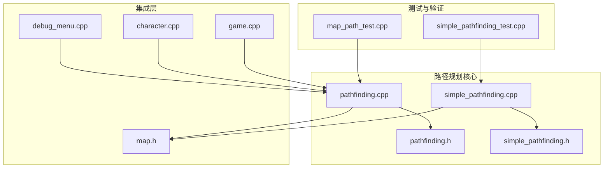

**图表来源**
- pathfinding.cpp
- simple_pathfinding.cpp
- map_path_test.cpp
- simple_pathfinding_test.cpp

**章节来源**
- pathfinding.cpp
- simple_pathfinding.cpp

## 核心组件

### 路径规划标志系统

系统使用PathfindingFlags枚举来描述地图格子的各种属性：

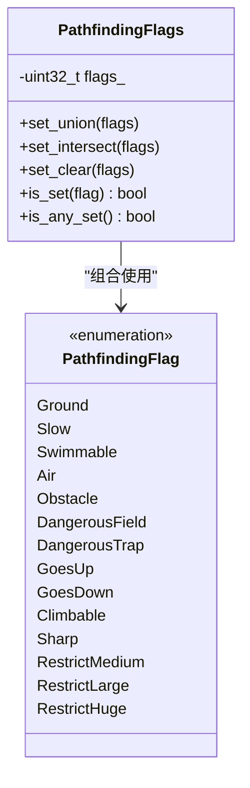

**图表来源**
- pathfinding.h

### 路径规划设置

路径规划器支持多种可配置参数：

| 参数 | 类型 | 描述 | 默认值 |
|------|------|------|--------|
| bash_strength | int | 破坏强度 | 0 |
| max_dist | int | 最大距离 | 0 |
| max_length | int | 最大路径长度 | 0 |
| climb_cost | int | 爬升成本 | 0 |
| allow_open_doors | bool | 允许开门 | false |
| allow_unlock_doors | bool | 允许解锁 | false |
| avoid_traps | bool | 避开陷阱 | false |
| allow_climb_stairs | bool | 允许爬楼梯 | true |
| avoid_rough_terrain | bool | 避开崎岖地形 | false |
| avoid_sharp | bool | 避开尖锐物品 | false |
| size | optional<creature_size> | 生物体型限制 | nullopt |

**章节来源**
- pathfinding.h

## 架构概览

系统采用分层架构设计，从底层的地图数据到高层的寻路算法：

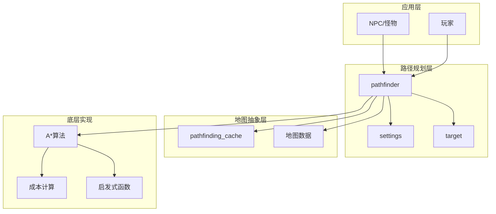

**图表来源**
- pathfinding.cpp
- pathfinding.h

## 详细组件分析

### A*算法实现

核心A*算法实现在`pathfinder`类中，采用了优化的数据结构来提高性能：

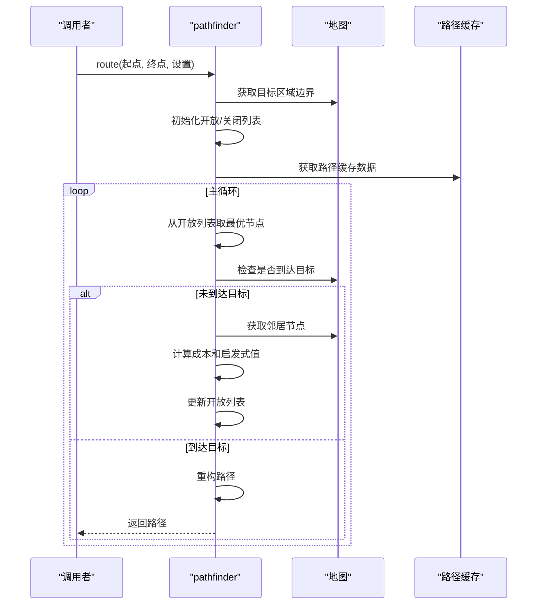

**图表来源**
- pathfinding.cpp

#### 成本计算机制

系统实现了多层次的成本计算：

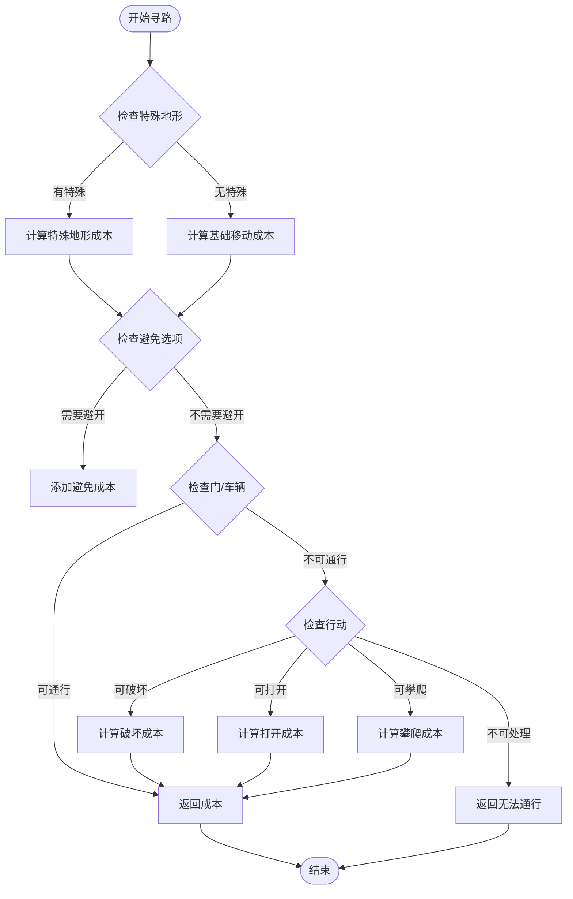

**图表来源**
- pathfinding.cpp

**章节来源**
- pathfinding.cpp

### 地形可达性检查

系统通过`pathfinding_cache`实现高效的地形可达性检查：

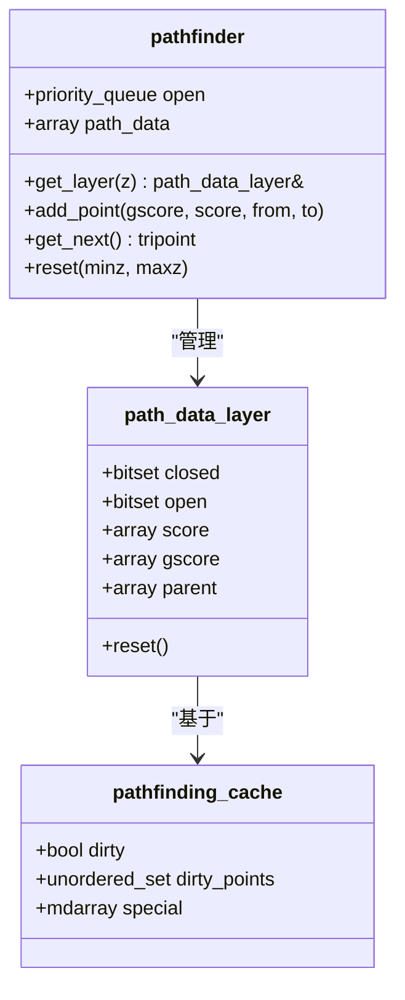

**图表来源**
- pathfinding.cpp
- pathfinding.h

### 动态路径重规划

系统支持动态路径重规划，能够响应环境变化：

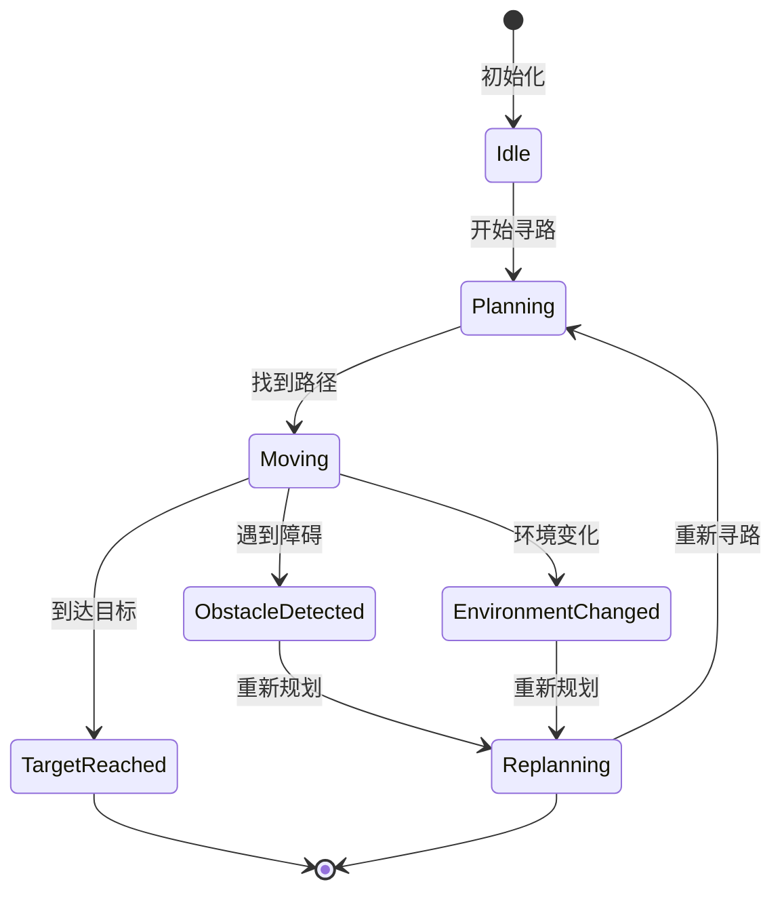

**图表来源**
- pathfinding.cpp

**章节来源**
- pathfinding.cpp

### 不同移动类型的路径规划

系统为不同生物类型提供了专门的路径规划支持：

| 移动类型 | 特殊处理 | 限制条件 |
|----------|----------|----------|
| 步行生物 | 基础A*算法 | 地面行走 |
| 爬行生物 | 支持攀爬标志 | 可攀爬表面 |
| 水生生物 | 支持游泳标志 | 深水区域 |
| 飞行生物 | 支持空中标志 | 高空路径 |
| 大型生物 | 体型限制检查 | 通道宽度 |

**章节来源**
- pathfinding.h

### 路径缓存机制

系统实现了多层缓存机制来提高性能：

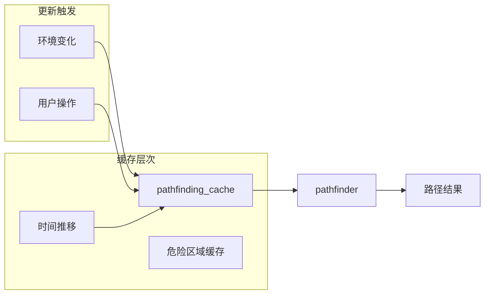

**图表来源**
- pathfinding.h

**章节来源**
- pathfinding.h

### 寻路调试工具

系统提供了丰富的调试功能：

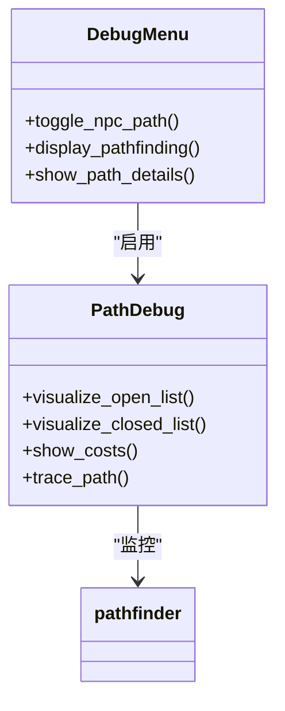

**图表来源**
- debug_menu.cpp

**章节来源**
- debug_menu.cpp

## 依赖关系分析

路径规划系统与其他模块的依赖关系：

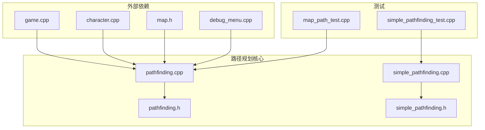

**图表来源**
- pathfinding.cpp
- simple_pathfinding.cpp

**章节来源**
- pathfinding.cpp
- simple_pathfinding.cpp

## 性能考虑

### 空间复杂度优化

系统采用了多种技术来优化内存使用：

1. **位集优化**: 使用`std::bitset`存储开放/关闭列表
2. **扁平化数组**: 将二维坐标映射到一维数组
3. **延迟初始化**: 仅在需要时创建路径数据层

### 时间复杂度优化

1. **启发式函数**: 使用曼哈顿距离作为启发式函数
2. **早期终止**: 当达到最大距离时提前终止
3. **缓存利用**: 重用之前的计算结果

### 内存管理

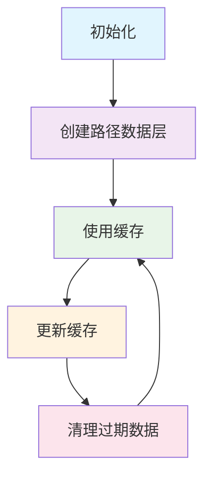

## 故障排除指南

### 常见问题诊断

1. **路径不完整**: 检查`max_length`设置是否过小
2. **性能问题**: 验证缓存是否正常工作
3. **错误路径**: 检查地形标志是否正确设置

### 调试技巧

- 启用路径可视化显示
- 检查路径缓存状态
- 验证成本计算逻辑
- 分析开放列表大小

**章节来源**
- debug_menu.cpp

## 结论

Cataclysm-DDA的怪物路径规划系统是一个高度优化的寻路引擎，具有以下特点：

1. **功能完整性**: 支持3D空间、多种移动类型和复杂地形
2. **性能高效**: 通过缓存和优化算法实现快速寻路
3. **可扩展性**: 模块化设计便于添加新功能
4. **可维护性**: 清晰的代码结构和完善的测试覆盖

该系统为游戏中的AI行为提供了坚实的基础，能够处理各种复杂的寻路场景，从简单的直线路径到复杂的多层建筑导航。