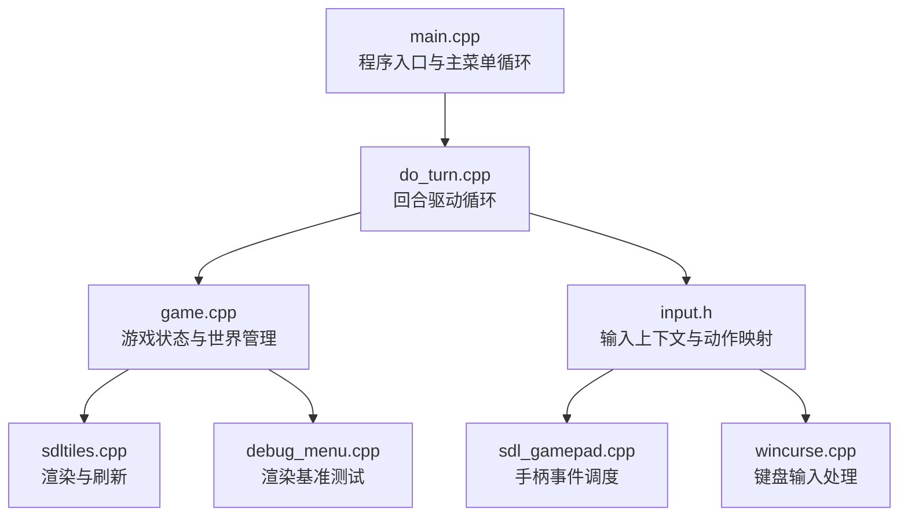
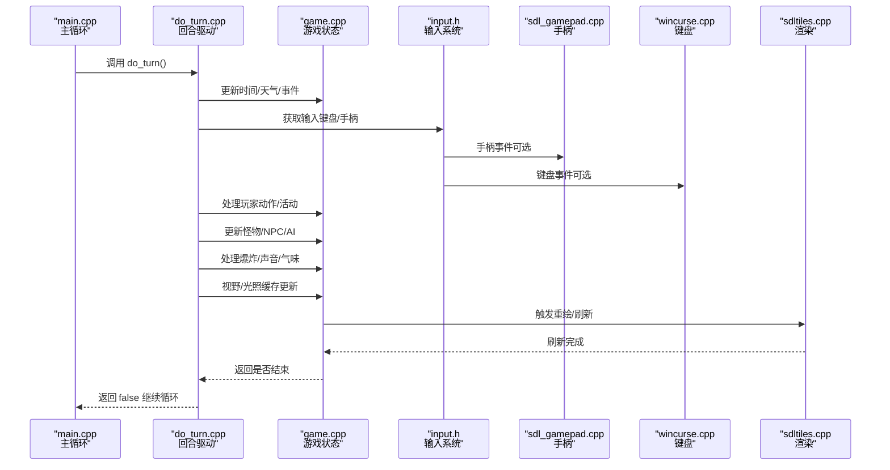
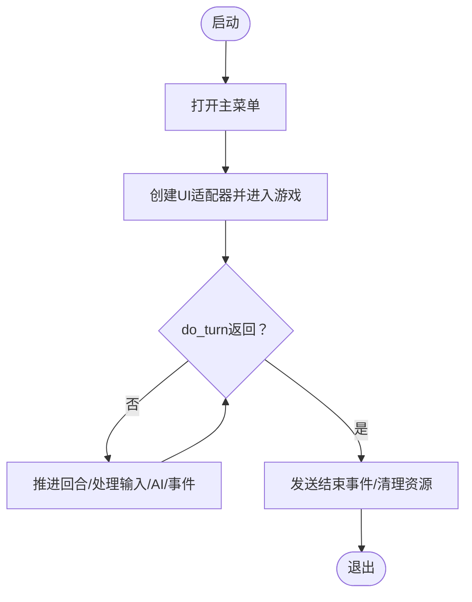
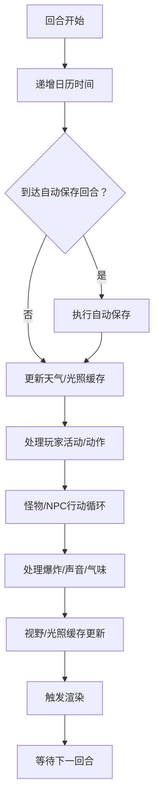
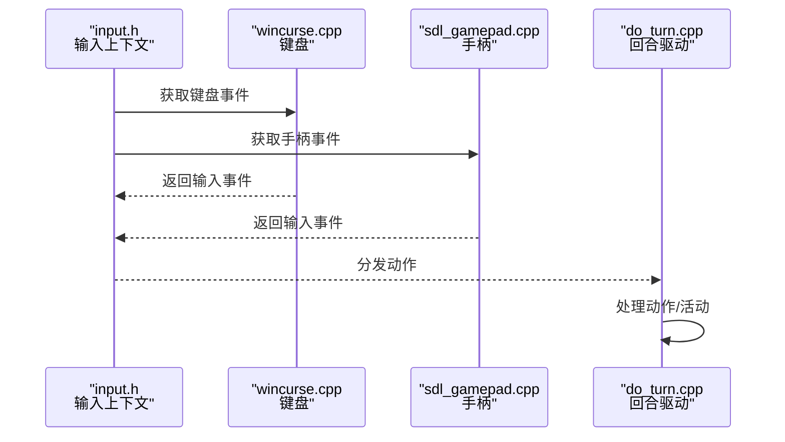
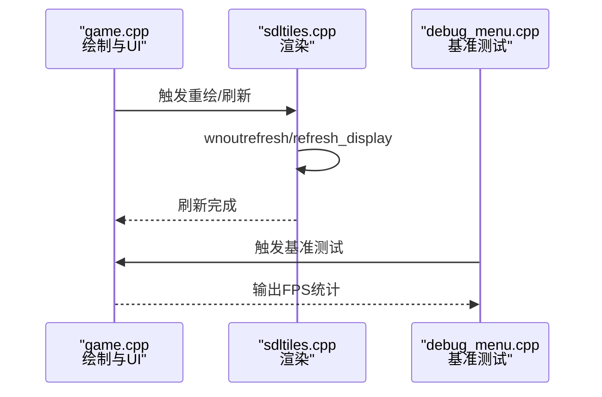
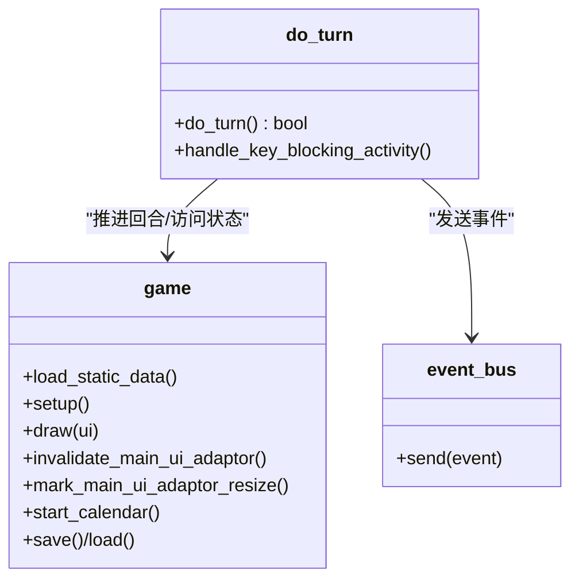
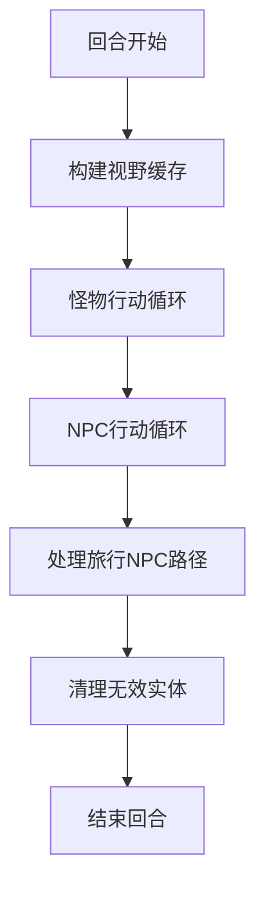
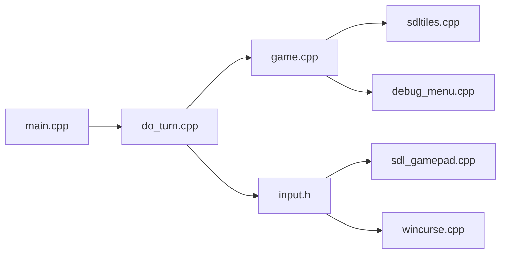

# 游戏主循环

<cite>
**本文档引用的文件**
- main.cpp
- game.cpp
- game.h
- do_turn.cpp
- do_turn.h
- input.h
- sdl_gamepad.cpp
- sdl_gamepad.h
- sdltiles.cpp
- wincurse.cpp
- debug_menu.cpp
</cite>

## 目录
1. [简介](#简介)
2. [项目结构](#项目结构)
3. [核心组件](#核心组件)
4. [架构总览](#架构总览)
5. [详细组件分析](#详细组件分析)
6. [依赖关系分析](#依赖关系分析)
7. [性能考虑](#性能考虑)
8. [故障排除指南](#故障排除指南)
9. [结论](#结论)

## 简介
本文件系统性解析 Cataclysm-DDA 的游戏主循环体系，涵盖游戏生命周期管理、回合制机制、帧率与时间推进、状态管理、事件处理循环、输入响应与渲染调度等关键主题。文档以循序渐进的方式组织，既适合初学者理解整体流程，也提供面向开发者的代码级分析与优化建议。

## 项目结构
围绕主循环的关键文件与职责如下：
- main.cpp：程序入口、主菜单循环、调用 do_turn 实现游戏主循环
- game.cpp / game.h：游戏状态容器、世界数据、UI 适配器、绘制与刷新、时间推进
- do_turn.cpp / do_turn.h：回合驱动的核心逻辑，处理玩家输入、AI 行动、事件与天气等
- 输入与控制器：input.h 定义输入抽象；sdl_gamepad.* 提供手柄支持；wincurse.* 提供 Windows 控制台输入
- 渲染与显示：sdltiles.cpp 负责 SDL 渲染路径与刷新；debug_menu.cpp 包含渲染基准测试

图表来源
- main.cpp
- do_turn.cpp
- game.cpp
- input.h
- sdl_gamepad.cpp
- wincurse.cpp
- sdltiles.cpp
- debug_menu.cpp

章节来源
- main.cpp
- do_turn.cpp
- game.cpp

## 核心组件
- 主循环入口与菜单：main.cpp 中的主循环负责打开主菜单并进入 do_turn 驱动的回合循环
- 回合驱动器：do_turn.cpp 提供 do_turn 函数，封装回合推进、输入处理、AI 更新、事件处理与渲染触发
- 游戏状态与世界：game.cpp 维护地图、角色、计时器、事件管理器、UI 适配器等
- 输入系统：input.h 定义输入上下文与动作映射；sdl_gamepad.* 处理手柄事件；wincurse.* 处理键盘输入
- 渲染与刷新：sdltiles.cpp 负责窗口刷新与渲染；debug_menu.cpp 提供渲染性能基准

章节来源
- main.cpp
- do_turn.cpp
- game.cpp
- input.h
- sdl_gamepad.cpp
- sdltiles.cpp

## 架构总览
下图展示了从主循环到回合驱动、输入、AI 与渲染的整体交互：

图表来源
- main.cpp
- do_turn.cpp
- input.h
- sdl_gamepad.cpp
- wincurse.cpp
- sdltiles.cpp

## 详细组件分析

### 主循环与生命周期管理
- 入口与菜单：main.cpp 在循环中打开主菜单，随后创建 UI 适配器并进入 do_turn 驱动的回合循环
- 生命周期：每次进入 do_turn 前后通过事件总线发送“开始游戏”与“结束游戏”事件，确保资源正确初始化与清理
- 结束条件：当 do_turn 返回 true 或游戏状态为结束（死亡、退出等）时，主循环退出并执行收尾

图表来源
- main.cpp
- do_turn.cpp

章节来源
- main.cpp
- do_turn.cpp

### 回合制机制与时间推进
- 时间推进：do_turn 每次循环递增日历时间（turn），并根据选项控制天气、自动保存等周期性行为
- 自动保存：按设定回合数触发 autosave
- 天气与光照：每回合重置温度缓存并更新天气；光照级别在回合开始重置
- NPC/怪物移动：按移动点数循环执行，直到耗尽或达到限制；对卡死的 NPC 进行保护性重启

图表来源
- do_turn.cpp

章节来源
- do_turn.cpp

### 输入响应机制
- 输入上下文：input.h 定义 input_manager 与输入上下文，将动作映射到具体按键/手柄
- 键盘输入：wincurse.cpp 处理键盘字符与特殊键，支持超时与错误类型
- 手柄输入：sdl_gamepad.cpp 初始化控制器、定时器与重复调度，将手柄事件转换为统一输入事件
- 快捷通道：do_turn 中在睡眠/等待状态下降低输入轮询频率，避免过度 CPU 占用

图表来源
- input.h
- wincurse.cpp
- sdl_gamepad.cpp
- do_turn.cpp

章节来源
- input.h
- wincurse.cpp
- sdl_gamepad.cpp
- do_turn.cpp

### 渲染调度与帧率控制
- 渲染触发：game.cpp 中的绘制回调与 UI 适配器在 do_turn 中被调用，触发重绘
- 刷新策略：sdltiles.cpp 在需要时调用刷新函数，避免无意义的屏幕更新；在某些平台下使用 try_sdl_update 优化鼠标移动期间的刷新
- 基准测试：debug_menu.cpp 提供渲染基准测试，统计不同选项下的平均帧率

图表来源
- game.cpp
- sdltiles.cpp
- debug_menu.cpp

章节来源
- game.cpp
- sdltiles.cpp
- debug_menu.cpp

### 游戏状态管理与事件处理
- 状态容器：game.cpp 提供地图、角色、计时器、事件管理器、UI 适配器等核心状态
- 事件总线：do_turn 中使用事件总线发送“游戏开始/结束”等事件，便于模块间解耦通信
- 死亡与结束：turn_handler::cleanup_at_end 负责死亡/退出后的清理与保存

图表来源
- game.cpp
- do_turn.cpp

章节来源
- game.cpp
- do_turn.cpp

### AI 逻辑与非玩家角色
- 怪物与 NPC：do_turn 中对怪物与 NPC 循环处理其移动、计划与行动，包含异常保护与重启逻辑
- 路径与感知：构建视野缓存、应用声音与气味影响，驱动 AI 决策
- 旅行 NPC：定期重新计算过载地图上的旅行路径并加载刷新

图表来源
- do_turn.cpp

章节来源
- do_turn.cpp

## 依赖关系分析
- 主循环依赖：main.cpp 依赖 do_turn；do_turn 依赖 game、input、weather、timed_event 等模块
- 输入依赖：input.h 与 sdl_gamepad.*、wincurse.* 共同构成输入层
- 渲染依赖：sdltiles.cpp 依赖 UI 适配器与渲染管线

图表来源
- main.cpp
- do_turn.cpp
- input.h
- sdl_gamepad.cpp
- wincurse.cpp
- game.cpp
- sdltiles.cpp
- debug_menu.cpp

章节来源
- main.cpp
- do_turn.cpp
- input.h
- sdl_gamepad.cpp
- wincurse.cpp
- game.cpp
- sdltiles.cpp
- debug_menu.cpp

## 性能考虑
- 输入轮询节流：在睡眠/等待状态下降低输入轮询频率，减少 CPU 占用
- 渲染优化：仅在需要时刷新屏幕，避免鼠标移动时的无效刷新；基准测试用于评估不同渲染选项的性能
- 缓存与批处理：构建视野/光照缓存、批量处理爆炸与声音事件，减少重复计算
- 异常保护：对 NPC 行动设置上限与重启保护，防止无限循环导致卡顿

## 故障排除指南
- 渲染卡顿：检查渲染选项与帧缓冲加速设置；使用 debug_menu 的基准测试输出 FPS 统计，定位瓶颈
- 输入延迟：确认手柄初始化与定时器配置；核对键盘输入超时设置
- 回合卡死：关注 NPC 行动中的“认知暂停”保护提示；检查活动中断与目的地状态
- 资源清理：确保在游戏结束时通过事件总线发送清理信号，避免残留状态

章节来源
- debug_menu.cpp
- do_turn.cpp
- sdltiles.cpp

## 结论
Cataclysm-DDA 的主循环以 do_turn 为核心，围绕回合推进、输入处理、AI 更新与渲染调度形成稳定的工作流。通过事件总线与 UI 适配器实现模块解耦，借助缓存与节流策略提升性能。开发者可在保证回合一致性的同时，针对输入、渲染与 AI 行为进行针对性优化与调试。