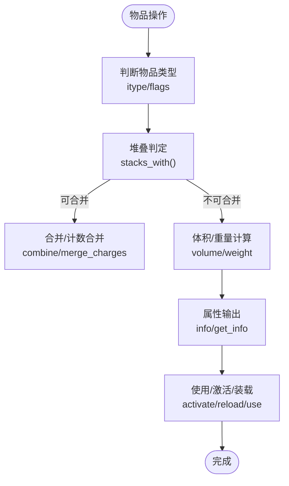

# 游戏核心系统

<cite>
**本文档引用的文件**
- game.h
- do_turn.cpp
- map.h
- monster.h
- item.h
- character.h
- creature.h
- worldfactory.h
- calendar.h
- timed_event.cpp
- point.h
- coords_fwd.h
</cite>

## 目录
1. [引言](#引言)
2. [项目结构](#项目结构)
3. [核心组件](#核心组件)
4. [架构总览](#架构总览)
5. [详细组件分析](#详细组件分析)
6. [依赖关系分析](#依赖关系分析)
7. [性能考量](#性能考量)
8. [故障排查指南](#故障排查指南)
9. [结论](#结论)
10. [附录](#附录)

## 引言
本文件面向Cataclysm-DDA（灾变）游戏的核心系统，系统性梳理地图系统、角色系统、物品系统、怪物系统与世界生成系统，并解释回合制机制、三维空间管理、属性技能体系、装备与背包管理等关键特性。文档以代码级分析为基础，辅以图示与使用模式，帮助开发者与模组作者理解与扩展核心系统。

## 项目结构
- 游戏主循环与回合推进由全局时间轴驱动，每回合推进时处理天气、NPC、任务、定时事件等。
- 地图系统负责二维子图网格与三维坐标系下的可见性、移动成本、路径规划与渲染。
- 角色系统抽象出Creature基类，派生出Character（玩家）与NPC、Monster（怪物），统一战斗、效果、状态与行动。
- 物品系统提供可堆叠、可组合、可附魔的复杂实体，支持内容与属性信息输出。
- 世界生成通过WorldFactory管理世界配置、存档与模组加载，支持多世界并行与切换。

图表来源
- game.h
- map.h
- creature.h
- character.h
- monster.h
- worldfactory.h
- calendar.h
- timed_event.cpp
- do_turn.cpp

章节来源
- game.h
- map.h
- creature.h
- character.h
- monster.h
- worldfactory.h
- calendar.h
- timed_event.cpp
- do_turn.cpp

## 核心组件
- 游戏主控与回合推进：全局时间推进、天气更新、NPC加载、定时事件处理、任务处理。
- 地图与空间：子图网格、三维坐标、可见性与光照、移动成本、路径规划、车辆与地形交互。
- 生物与战斗：Creature基类统一角色、怪物、NPC；战斗判定、伤害吸收、效果系统、死亡清理。
- 物品与背包：物品类型、属性、堆叠合并、内容存储、附魔与耐久、价格与体积计算。
- 世界生成：世界配置、模组加载顺序、存档管理、最近世界/角色记录。

章节来源
- game.h
- map.h
- creature.h
- item.h
- worldfactory.h

## 架构总览
游戏采用“全局时间轴 + 子图网格 + 统一生物模型”的架构：
- 时间轴：calendar.h提供turn推进与时间单位换算，do_turn.cpp在每回合执行天气、NPC、任务与定时事件处理。
- 空间模型：coords_fwd.h定义tripoint系列坐标类型，point.h提供三维度向量运算，地图以子图为单位组织，支持三维Z层。
- 生物统一：creature.h定义Creature基类，character.h与monster.h分别实现玩家与怪物的行为与属性。
- 物品系统：item.h提供物品类型、属性、堆叠、内容、附魔与耐久等能力。
- 世界工厂：worldfactory.h负责世界配置、模组加载与存档管理。

图表来源
- game.h
- creature.h
- character.h
- monster.h
- map.h
- item.h
- worldfactory.h

## 详细组件分析

### 地图系统（Map）
- 子图网格与坐标：地图以11×11子图覆盖现实气泡，支持三维Z层；tripoint系列坐标用于绝对/相对/过图/现实气泡等不同场景。
- 可见性与光照：提供apparent_light_at、get_visibility等方法，结合lightmap与视野缓存。
- 移动成本与路径：move_cost、combined_movecost、route、find_clear_path、straight_route等，支持地形、障碍、陷阱与车辆。
- 车辆与地形：veh_at、get_vehicles、vehmove、destroy_vehicle等，处理车辆碰撞、移位与缓存失效。
- 渲染与绘制：drawsqaure、draw等，支持高亮、物品显示、昼夜与灯光叠加。

图表来源
- map.h
- point.h
- coords_fwd.h

章节来源
- map.h
- point.h
- coords_fwd.h

### 角色系统（Creature/Character/NPC）
- Creature基类：统一生命值、速度、命中/闪避、伤害吸收、效果系统、死亡检查与清理。
- Character（玩家）：继承Creature，扩展统计、饥饿/口渴/睡眠、技能、附魔速度加成、护甲抗性、枪械瞄准与射击参数。
- NPC：作为Character的特化，参与对话、任务、派系与跟随行为。
- 态势与互动：attitude_to、auto_find_hostile_target、avoid_trap等，支持AI与交互。

图表来源
- creature.h
- character.h
- monster.h

章节来源
- creature.h
- character.h
- monster.h

### 物品系统（Item）
- 类型与属性：item.h定义物品类型、属性、附魔、耐久、损坏等级、能量电池等。
- 堆叠与合并：stacks_with、combine、merge_charges、display_stacked_with，支持计数型与液体物品。
- 体积与重量：volume、weight、base_volume、collapsed_volume_delta，考虑内容与积分包裹。
- 信息输出：info/get_info，按类别输出属性与修饰，支持批量合成倍数。
- 使用与动作：ammo_set/ammo_unset、activate/deactivate、reload等。

图表来源
- item.h

章节来源
- item.h

### 怪物系统（Monster）
- 行为与AI：plan、rate_target、anger_*、wander_to、set_dest/unset_dest，支持巡逻、追击与群聚。
- 感知与移动：can_move_to、will_move_to、know_danger_at、calc_movecost、push_to、bash_at、attack_at。
- 战斗与抗性：melee_attack、deal_damage_handle_type、block_hit、absorb_hit、get_armor_type、fall_damage_mod。
- 特殊能力：reset_special、has_special、special_available，支持冷却与可用性管理。

图表来源
- monster.h
- map.h

章节来源
- monster.h
- map.h

### 世界生成系统（WorldFactory）
- 世界配置：WORLD结构体保存世界名称、选项、模组列表、存档列表与时间戳。
- 工厂接口：make_new_world、get_world、set_active_world、all_worldnames、delete_world等。
- 最近世界/角色：last_world_name、last_character_name，用于菜单与启动流程。

图表来源
- worldfactory.h

章节来源
- worldfactory.h

### 回合制机制与时间推进
- 时间推进：calendar.h提供turn、start_of_cataclysm、season等全局时间变量；do_turn.cpp在每回合递增turn并处理天气、NPC、任务与定时事件。
- 定时事件：timed_event_manager::process按turn触发事件，支持 Faction/地点/强度/键值管理。

图表来源
- calendar.h
- do_turn.cpp
- timed_event.cpp

章节来源
- calendar.h
- do_turn.cpp
- timed_event.cpp

## 依赖关系分析
- 组件耦合
  - game.h与map.h、creature.h、worldfactory.h存在强耦合：游戏主控负责加载/保存、生物管理、世界切换。
  - creature.h与character.h、monster.h通过继承形成层次化设计，共享战斗与效果系统。
  - item.h被character.h与monster.h广泛使用，贯穿战斗、制作与拾取链路。
- 外部依赖
  - 坐标系统依赖coords_fwd.h与point.h，确保跨模块一致的三维度运算。
  - 时间推进依赖calendar.h，所有周期性逻辑围绕turn展开。

图表来源
- game.h
- map.h
- creature.h
- character.h
- monster.h
- item.h
- point.h
- coords_fwd.h
- calendar.h
- timed_event.cpp

章节来源
- game.h
- map.h
- creature.h
- character.h
- monster.h
- item.h
- point.h
- coords_fwd.h
- calendar.h
- timed_event.cpp

## 性能考量
- 地图缓存与失效
  - set_transparency_cache_dirty、set_seen_cache_dirty、set_pathfinding_cache_dirty等用于细粒度失效，避免全图重算。
  - 通过invalidate_map_cache与memory_cache_*接口控制记忆与装饰缓存一致性。
- 路径与可见性
  - route/find_clear_path/straight_route采用A*与Bresenham预过滤，结合move_cost与passable减少无效搜索。
- 物品合并与堆叠
  - stacks_with/same_for_rle与combine/merge_charges降低UI与网络传输开销，提升大背包场景性能。
- 时间推进
  - do_turn中仅在必要时处理NPC与定时事件，避免每回合全量扫描。

## 故障排查指南
- 地图卡顿/寻路异常
  - 检查是否正确调用set_pathfinding_cache_dirty或invalidate_map_cache。
  - 确认move_cost/impassable/passable逻辑未被自定义地形破坏。
- 物品显示错乱
  - 确保stacks_with与display_stacked_with的比较条件一致，避免误判堆叠。
  - 合并前检查combine/merge_charges的返回值与数量边界。
- 怪物不移动/卡死
  - 检查pathfinding_cd/backoff指数退避逻辑，确认monster::can_act与move_effects。
  - 核查know_danger_at与will_move_to的地形/陷阱判定。
- 回合推进异常
  - 确认calendar::turn递增与timed_event_manager::process调用顺序。
  - 检查天气与NPC加载分支，避免重复加载或遗漏。

章节来源
- map.h
- item.h
- monster.h
- do_turn.cpp
- timed_event.cpp

## 结论
Cataclysm-DDA的核心系统以统一的生物模型与三维度空间为基础，通过严格的回合推进与缓存失效策略，实现了高效的地图、战斗与物品管理。世界工厂与时间轴进一步增强了可扩展性与可玩性。开发者可在上述组件上进行定制与扩展，同时遵循现有接口与缓存策略以保证性能与稳定性。

## 附录
- 关键API与路径参考
  - 地图加载/绘制：map.h, map.h
  - 寻路与移动成本：map.h, map.h
  - 生物回合处理：creature.h, monster.h
  - 物品堆叠与合并：item.h
  - 世界工厂接口：worldfactory.h
  - 回合推进与事件：do_turn.cpp, timed_event.cpp