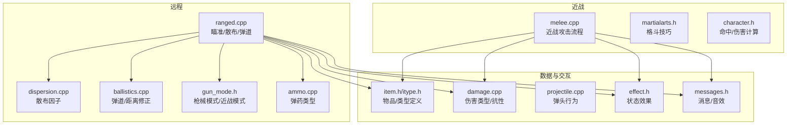
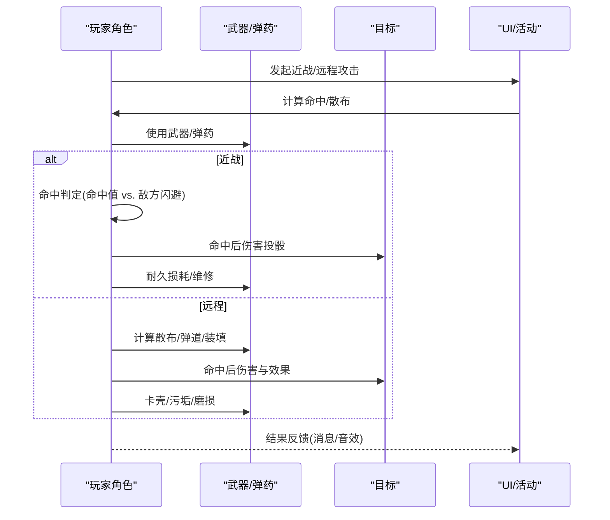
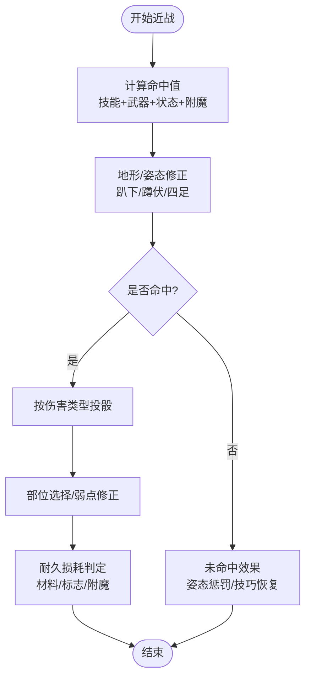
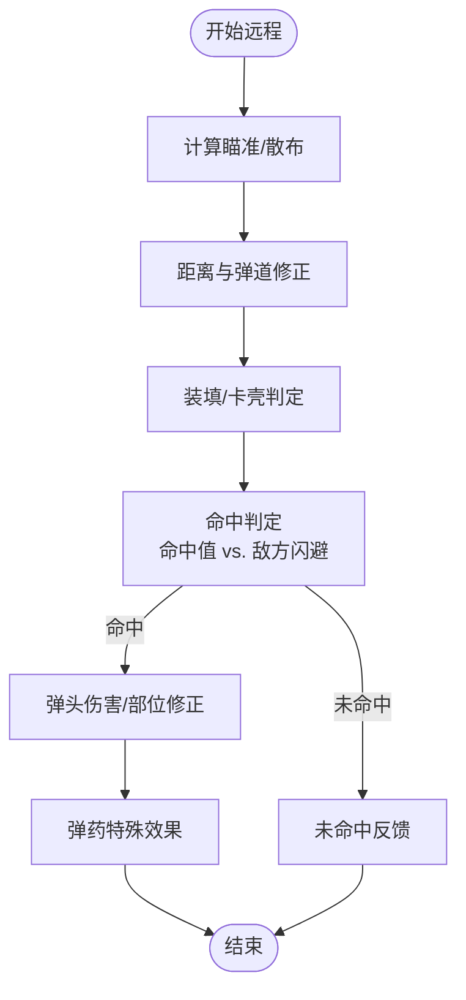
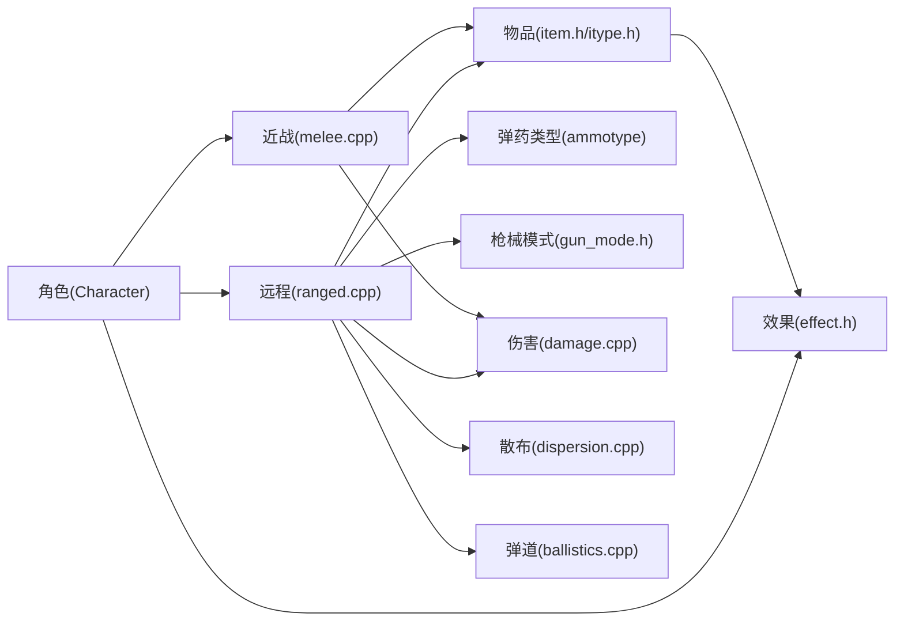

# 武器装备系统

<cite>
**本文引用的文件**
- melee.cpp
- ranged.cpp
- item.cpp
- itype.cpp
- ammo.cpp
- gun_mode.h
- dispersion.cpp
- ballistics.cpp
- damage.cpp
- projectile.cpp
- character.h
- creature.h
- itype.h
- item.h
- enums.h
- flag.h
- skill.h
- proficiency.h
- bionics.h
- effect.h
- magic_enchantment.h
- rng.h
- game_constants.h
- game.h
- map.h
- messages.h
- sounds.h
- output.h
- translation.h
- string_formatter.h
- math_defines.h
- weakpoint.h
- martialarts.h
- martial_arts.h
- npc.h
- monster.h
- vehicle.h
- vehicle_part.h
- turret.h
- debug.h
- options.h
- input.h
- input_context.h
- panels.h
- ui_manager.h
- uilist.h
- cursesdef.h
- cursesport.h
- sdltiles.h
- sdlsound.h
- sdl_font.h
- sdl_gamepad.h
- platform_win.h
- wincurse.h
- pixel_minimap.h
- lightmap.h
- overlay_ordering.h
- savegame.h
- savegame_json.h
- worldfactory.h
- scenario.h
- gamemode.h
- mission.h
- achievement.h
- calendar.h
- time_point.h
- point.h
- rect_range.h
- line.h
- coordinates.h
- coordinate_conversions.h
- map_iterator.h
- mapbuffer.h
- mapdata.h
- map_extras.h
- map_field.h
- map_item_stack.h
- map_scale_constants.h
- mapgen.h
- mapgen_functions.h
- mapgen_parameter.h
- mapgen_primitives.h
- mapgendata.h
- mapgenformat.h
- mapsharing.h
- overmap.h
- overmapbuffer.h
- overmap_connection.h
- overmap_location.h
- overmap_noise.h
- overmap_types.h
- overmap_ui.h
- region_settings.h
- regional_settings.h
- weather.h
- weather_gen.h
- weather_type.h
- trap.h
- trapfunc.h
- field.h
- field_type.h
- emit.h
- emit_type.h
- explosion.h
- fire.h
- furn.h
- furn_type.h
- light_emission.h
- material.h
- material_id.h
- flag_id.h
- effect_id.h
- skill_id.h
- proficiency_id.h
- bionic_id.h
- matec_id.h
- ammotype.h
- damage_type_id.h
- bodypart_id.h
- subbodypart_str_id.h
- weapon_category_id.h
- gun_mode_id.h
- anatomy_id.h
- json_character_flag.h
- character_modifier_id.h
- move_mode_id.h
- efftype_id.h
- itype_id.h
- item_category_id.h
- string_id.h
- type_id.h
- enchant_vals.h
- enchant_vals.cpp
- enchantment_cache.h
- enchantment_cache.cpp
- magic_enchantment.cpp
- magic_spell_effect.h
- magic_spell_effect.cpp
- effect_on_condition.h
- effect_on_condition.cpp
- effect_source.h
- effect_source.cpp
- effect_type.h
- effect_type.cpp
- effect.h
- effect.cpp
- effect_source.h
- effect_source.cpp
- effect_on_condition.h
- effect_on_condition.cpp
- effect_type.h
- effect_type.cpp
- effect.h
- effect.cpp
- effect_source.h
- effect_source.cpp
- effect_on_condition.h
- effect_on_condition.cpp
- effect_type.h
- effect_type.cpp
- effect.h
- effect.cpp
- effect_source.h
- effect_source.cpp
- effect_on_condition.h
- effect_on_condition.cpp
- effect_type.h
- effect_type.cpp
- effect.h
- effect.cpp
- effect_source.h
- effect_source.cpp
- effect_on_condition.h
- effect_on_condition.cpp
- effect_type.h
- effect_type.cpp
- effect.h
- effect.cpp
- effect_source.h
- effect_source.cpp
- effect_on_condition.h
- effect_on_condition.cpp
- effect_type.h
- effect_type.cpp
- effect.h
- effect.cpp
- effect_source.h
- effect_source.cpp
- effect_on_condition.h
- effect_on_condition.cpp
- effect_type.h
- effect_type.cpp
- effect.h
- effect.cpp
- effect_source.h
2. [项目结构](#项目结构)
3. [核心组件](#核心组件)
4. [架构总览](#架构总览)
5. [详细组件分析](#详细组件分析)
6. [依赖关系分析](#依赖关系分析)
7. [性能考量](#性能考量)
8. [故障排查指南](#故障排查指南)
9. [结论](#结论)
10. [附录](#附录)

## 引言
本文件系统化梳理 Cataclysm: Dark Days Ahead（CDDA）中的武器与防具系统，重点覆盖以下方面：
- 近战与远程武器设计差异与交互
- 命中判定、伤害计算与命中部位选择
- 耐久度衰减、维修与损坏表现
- 弹药系统、装填机制与射击精度
- 特殊效果与魔法附魔、弹道与散布
- 平衡性调整建议与扩展开发指引

目标是帮助开发者与模组制作者快速理解并高效扩展武器系统。

## 项目结构
武器系统主要由以下模块构成：
- 近战：角色攻击、命中判定、伤害投骰、技术与技巧、耐久损耗
- 远程：瞄准与散布、弹道、装填与卡壳、命中判定、伤害与弹头效应
- 数据层：物品类型、弹药类型、枪械模式、附魔与效果
- 交互层：UI、活动系统、音效与消息

图示来源
- melee.cpp
- ranged.cpp
- dispersion.cpp
- ballistics.cpp
- gun_mode.h
- ammo.cpp
- item.h
- itype.h
- damage.cpp
- projectile.cpp
- effect.h
- messages.h

章节来源
- melee.cpp
- ranged.cpp

## 核心组件
- 角色与目标接口：Character、Creature 提供命中、闪避、伤害修正等基础能力
- 近战系统：命中判定、伤害投骰、部位选择、耐久损耗、技巧触发
- 远程系统：瞄准/散布、弹道、装填/卡壳、命中判定、伤害与弹头效果
- 数据模型：物品类型（itype）、弹药类型、枪械模式、伤害类型、附魔与效果
- UI与交互：目标选择、瞄准界面、活动系统、消息与音效

章节来源
- character.h
- creature.h
- itype.h
- item.h
- enums.h
- flag.h
- skill.h
- proficiency.h
- bionics.h
- effect.h
- magic_enchantment.h
- rng.h
- game_constants.h
- game.h
- map.h
- messages.h
- sounds.h
- output.h
- translation.h
- string_formatter.h
- math_defines.h
- weakpoint.h
- martialarts.h
- martial_arts.h
- npc.h
- monster.h
- vehicle.h
- vehicle_part.h
- turret.h
- debug.h
- options.h
- input.h
- input_context.h
- panels.h
- ui_manager.h
- uilist.h
- cursesdef.h
- cursesport.h
- sdltiles.h
- sdlsound.h
- sdl_font.h
- sdl_gamepad.h
- platform_win.h
- wincurse.h
- pixel_minimap.h
- lightmap.h
- overlay_ordering.h
- savegame.h
- savegame_json.h
- worldfactory.h
- scenario.h
- gamemode.h
- mission.h
- achievement.h
- calendar.h
- time_point.h
- point.h
- rect_range.h
- line.h
- coordinates.h
- coordinate_conversions.h
- map_iterator.h
- mapbuffer.h
- mapdata.h
- map_extras.h
- map_field.h
- map_item_stack.h
- map_scale_constants.h
- mapgen.h
- mapgen_functions.h
- mapgen_parameter.h
- mapgen_primitives.h
- mapgendata.h
- mapgenformat.h
- mapsharing.h
- overmap.h
- overmapbuffer.h
- overmap_connection.h
- overmap_location.h
- overmap_noise.h
- overmap_types.h
- overmap_ui.h
- region_settings.h
- regional_settings.h
- weather.h
- weather_gen.h
- weather_type.h
- trap.h
- trapfunc.h
- field.h
- field_type.h
- emit.h
- emit_type.h
- explosion.h
- fire.h
- furn.h
- furn_type.h
- light_emission.h
- material.h
- material_id.h
- flag_id.h
- effect_id.h
- skill_id.h
- proficiency_id.h
- bionic_id.h
- matec_id.h
- ammotype.h
- damage_type_id.h
- bodypart_id.h
- subbodypart_str_id.h
- weapon_category_id.h
- gun_mode_id.h
- anatomy_id.h
- json_character_flag.h
- character_modifier_id.h
- move_mode_id.h
- efftype_id.h
- itype_id.h
- item_category_id.h
- string_id.h
- type_id.h
- enchant_vals.h
- enchant_vals.cpp
- enchantment_cache.h
- enchantment_cache.cpp
- magic_enchantment.cpp
- magic_spell_effect.h
- magic_spell_effect.cpp
- effect_on_condition.h
- effect_on_condition.cpp
- effect_source.h
- effect_source.cpp
- effect_type.h
- effect_type.cpp
- effect.h
- effect.cpp
- effect_source.h
- effect_source.cpp
- effect_on_condition.h
- effect_on_condition.cpp
- effect_type.h
- effect_type.cpp
- effect.h
- effect.cpp
- effect_source.h
- effect_source.cpp
- effect_on_condition.h
- effect_on_condition.cpp
- effect_type.h
- effect_type.cpp
- effect.h
- effect.cpp
- effect_source.h
- effect_source.cpp
- effect_on_condition.h
- effect_on_condition.cpp
- effect_type.h
- effect_type.cpp
- effect.h
- effect.cpp
- effect_source.h
- effect_source.cpp
- effect_on_condition.h
- effect_on_condition.cpp
- effect_type.h
- effect_type.cpp
- effect.h
- effect.cpp
- effect_source.h
- effect_source.cpp
- effect_on_condition.h
- effect_on_condition.cpp
- effect_type.h
- effect_type.cpp
- effect.h
- effect.cpp
- effect_source.h
- effect_source.cpp
- effect_on_condition.h
- effect_on_condition.cpp
- effect_type.h
- effect_type.cpp
- effect.h
- effect.cpp
- effect_source.h

## 架构总览
武器系统围绕“角色-武器-弹药-目标”的交互展开，核心流程如下：
- 近战：角色选择武器/徒手，计算命中，判定是否命中，计算伤害与部位，应用附魔与技巧，损耗耐久
- 远程：角色选择目标与模式，计算散布与弹道，处理装填/卡壳，命中判定，计算伤害与效果，应用附魔与环境因素

图示来源
- melee.cpp
- ranged.cpp
- dispersion.cpp
- ballistics.cpp
- gun_mode.h
- ammo.cpp
- messages.h
- sounds.h

## 详细组件分析

### 近战系统
- 命中判定
  - 基础命中值由技能、武器加成、状态与附魔共同决定
  - 地形与姿态（趴下/蹲伏/四足）影响命中
  - 通过范围化函数将命中值映射为命中概率
- 伤害计算
  - 按伤害类型分别投骰，支持附魔对伤害的增减
  - 部位选择与弱点修正，近身距离与姿态进一步影响伤害
- 耐久损耗
  - 使用武器或盾牌进行打击时按统计、材料、附魔与标志计算损坏概率
  - 破损/易碎标志导致更易损坏；“持久”标志降低损坏概率
  - 损坏后可能丢弃内容物、分解为组件或直接摧毁
- 技巧与训练
  - 格斗技巧在未命中时可触发恢复动作，命中后按武器伤害分布分配练习点

图示来源
- melee.cpp
- melee.cpp
- melee.cpp

章节来源
- melee.cpp
- melee.cpp
- melee.cpp
- martial_arts.h
- character.h

### 远程系统
- 瞄准与散布
  - 总散布 = 武器固有散布 + 瞄准时长带来的减少 + 额外散布（如移动、持弹、弹药类型）
  - 瞄准效率随时间线性提升，存在最小改善阈值
- 弹道与距离
  - 子弹速度、重力、风阻等影响弹道，远距离命中率下降
- 装填与卡壳
  - 污垢值、枪械/弹夹损伤等级决定卡壳概率
  - 水下/防水标志影响水下射击可靠性
- 命中判定
  - 命中值 = 技能 + 瞄准修正 + 环境修正
  - 目标尺寸与姿态影响命中概率
- 伤害与弹头效果
  - 弹头类型决定伤害类型与穿透，结合护甲与部位修正
  - 弹药特殊效果（燃烧、爆炸、EMP等）在命中后触发

图示来源
- ranged.cpp
- ranged.cpp
- dispersion.cpp
- ballistics.cpp
- ammo.cpp

章节来源
- ranged.cpp
- dispersion.cpp
- ballistics.cpp
- ammo.cpp

### 数据模型与属性
- 物品类型（itype）
  - 定义武器/弹药/工具等基本属性，包括伤害、射程、重量、体积、耐久、附魔等
  - 支持变体与默认弹药类型
- 弹药类型（ammunition_type）
  - 维护弹药种类与默认弹药映射，确保兼容性校验
- 枪械模式（gun_mode）
  - 将主武器与附件组合为不同射击/近战模式，含数量与标志
- 伤害类型（damage_type）
  - 定义伤害类型与抗性，支持附魔与装备修正

章节来源
- itype.cpp
- itype.cpp
- ammo.cpp
- gun_mode.h
- damage.cpp

### 附魔与效果
- 附魔缓存（enchantment_cache）
  - 对命中、伤害、抗性等进行统一修正
- 特殊效果（effect）
  - 命中后触发状态效果（流血、燃烧、EMP等），部分效果可叠加或持续

章节来源
- enchantment_cache.h
- enchantment_cache.cpp
- magic_enchantment.cpp
- effect.h
- effect.cpp

## 依赖关系分析
- 近战依赖：角色技能、武器属性、附魔、部位与姿态、随机数
- 远程依赖：瞄准/散布、弹道、弹药类型、装填状态、卡壳判定、环境与目标尺寸
- 数据依赖：itype、ammotype、gun_mode、damage_type、flag、effect

图示来源
- melee.cpp
- ranged.cpp
- item.h
- itype.h
- ammotype.h
- gun_mode.h
- damage.cpp
- dispersion.cpp
- ballistics.cpp
- effect.h

章节来源
- melee.cpp
- ranged.cpp
- item.h
- itype.h
- ammotype.h
- gun_mode.h
- damage.cpp
- dispersion.cpp
- ballistics.cpp
- effect.h

## 性能考量
- 命中与伤害投骰使用高效随机数与查表（如散布阈值表），避免复杂循环
- 附魔与修正通过缓存一次性计算，减少重复开销
- 远程命中判定在UI层限制最大瞄准回合，防止长时间等待
- 大量消息与音效在必要时才输出，避免冗余

## 故障排查指南
- 命中异常
  - 检查角色姿态与地形修正是否生效
  - 核对技能等级与武器加成是否正确
- 未命中频繁
  - 检查散布来源（武器、瞄准、移动、弹药）
  - 关注目标尺寸与姿态修正
- 卡壳/误射
  - 检查污垢值、枪械/弹夹损伤等级
  - 确认是否处于水下且无防水标志
- 伤害异常
  - 核对伤害类型与护甲覆盖
  - 检查附魔与部位修正
- 耐久异常
  - 检查易碎/持久标志与材料抗性
  - 确认破损后的内容物与分解逻辑

章节来源
- ranged.cpp
- melee.cpp
- dispersion.cpp
- ballistics.cpp
- damage.cpp

## 结论
CDDA 的武器系统在“近战”与“远程”之间实现了清晰的差异化设计：近战强调姿态、部位与技巧，远程强调瞄准、散布与弹道。通过附魔缓存、伤害类型与部位修正、弹药与枪械模式的组合，系统提供了高度可扩展的平衡性与可玩性。开发者可基于现有数据模型与流程，安全地添加新武器、弹药与效果，并通过平衡性参数与测试用例验证其影响。

## 附录
- 扩展开发建议
  - 新增武器：在 itype 中定义伤害、射程、重量、耐久与附魔；若为远程，补充弹药类型与枪械模式
  - 新增弹药：在 ammunition_type 中注册类型与默认弹药映射
  - 新增效果：在 effect 系统中定义状态与触发条件，结合附魔缓存进行全局修正
  - 新增技巧：在 martial_arts 中定义命中/伤害/耐久相关修正
  - 平衡性调整：优先从命中、散布、伤害分布、卡壳概率与耐久衰减四个维度入手，辅以数值测试与玩家反馈