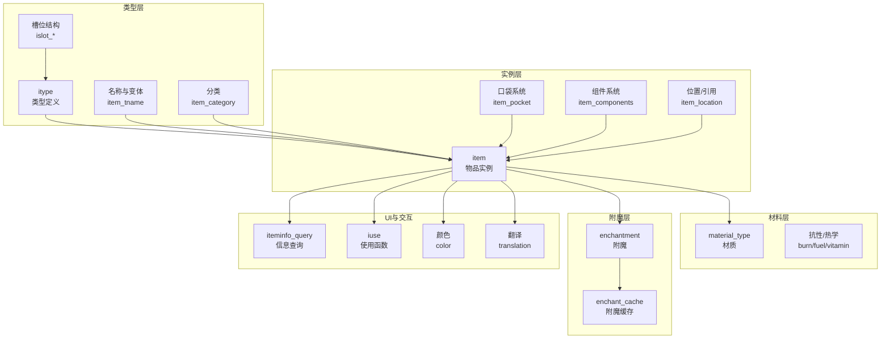
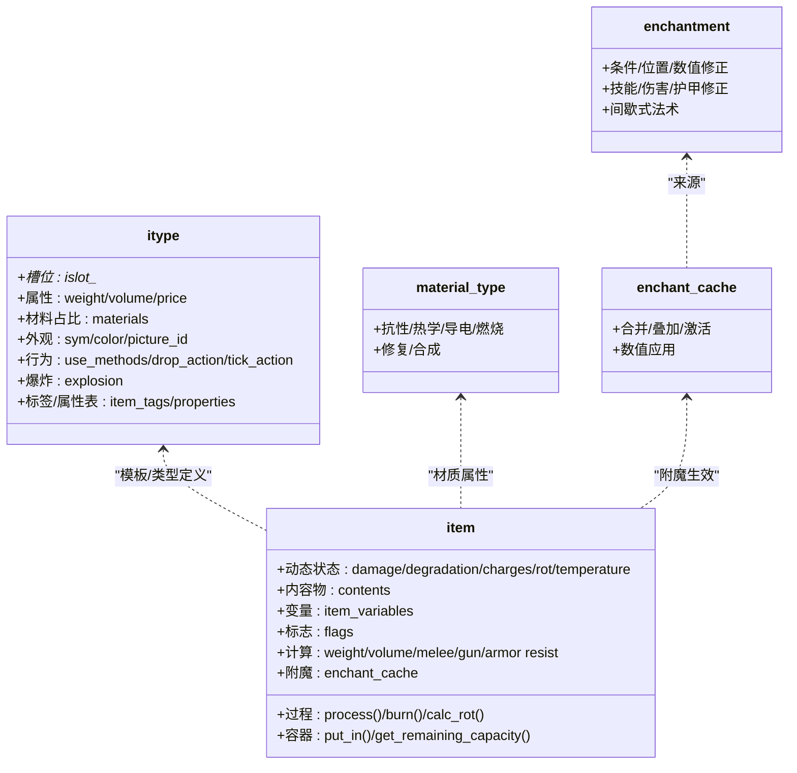
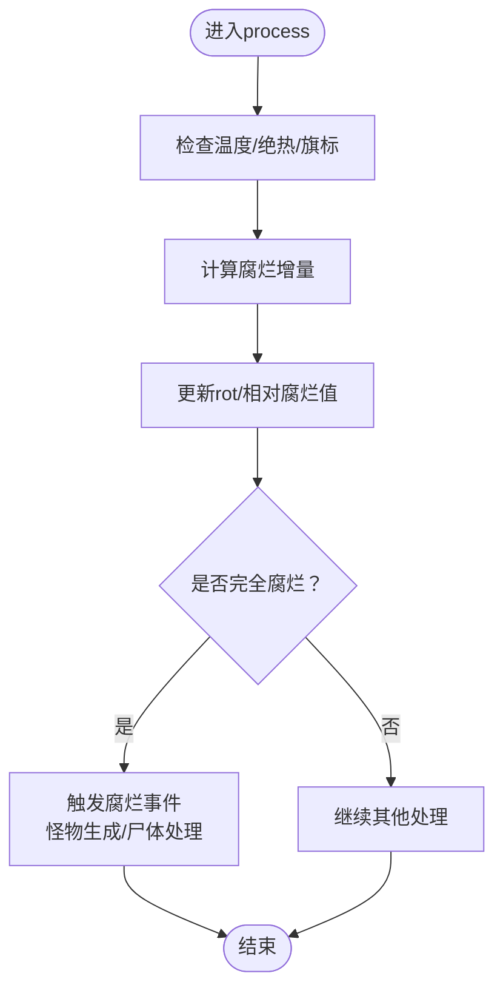
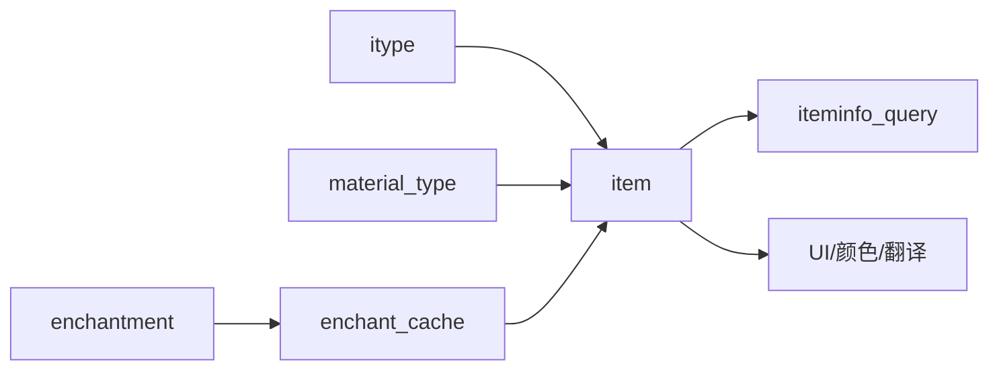

# 物品属性系统

<cite>
**本文引用的文件**
- item.h
- item.cpp
- itype.h
- material.h
- magic_enchantment.h
- item_stack.h
- iteminfo_query.h
- item_tname.h
- item_category.h
- item_pocket.h
- item_components.h
- item_location.h
- iuse.h
- effect_on_condition.h
- ammo_effect.h
- gun_mode.h
- gunmod_location.h
- color.h
- translation.h
- enums.h
- units.h
- calendar.h
- game_constants.h
- math_parser_diag_value.h
- value_ptr.h
- safe_reference.h
- type_id.h
- io_tags.h
- flag.h
- damage.h
- emit.h
- effect.h
- effect_source.h
- effect_type.h
- effect_on_condition.h
- effect_source.h
- effect_type.h
- effect_on_condition.h
- effect_source.h
- effect_type.h
</cite>

## 目录
1. [简介](#简介)
2. [项目结构](#项目结构)
3. [核心组件](#核心组件)
4. [架构总览](#架构总览)
5. [详细组件分析](#详细组件分析)
6. [依赖关系分析](#依赖关系分析)
7. [性能考量](#性能考量)
8. [故障排查指南](#故障排查指南)
9. [结论](#结论)
10. [附录](#附录)

## 简介
本文件系统化梳理 Cataclysm-DDA 的物品属性系统，覆盖以下主题：
- 物品基础属性与类型槽位（itype）设计
- 材料系统与耐久度/抗性机制
- 附魔与被动效果缓存（enchantment）
- 腐烂/温度/过期等状态变化与处理
- 颜色显示、名称生成与信息展示
- 特殊效果、持续时间与触发条件
- 属性计算公式、数值范围与平衡性调整建议

目标是帮助开发者与模组制作者高效理解与扩展物品系统。

## 项目结构
物品系统由“类型定义（itype）+ 实例（item）+ 材料（material）+ 附魔（magic_enchantment）”四大部分构成，并通过多种子模块协同工作：
- 类型层：定义物品的静态属性与行为（槽位、属性、外观、用途等）
- 实例层：承载物品的动态状态（耐久、腐烂、电量、内容物、变量等）
- 材料层：提供抗性、导电性、燃烧产物等材质特性
- 附魔层：统一管理被动加成、技能修正、伤害/护甲修正、间歇式法术等

图示来源
- item.h
- itype.h
- material.h
- magic_enchantment.h
- iteminfo_query.h
- item_tname.h
- item_category.h
- item_pocket.h
- item_components.h
- item_location.h
- iuse.h
- color.h
- translation.h

章节来源
- item.h
- itype.h
- material.h
- magic_enchantment.h

## 核心组件
- 物品类型（itype）：集中定义物品的静态属性、槽位数据、外观、价格、标签、属性表、材料占比、使用方法、爆炸设定等。类型层还包含大量槽位结构（如武器、弹药、工具、书籍、枪械、弹夹、电池、种子等），用于在实例层组合出复杂行为。
- 物品实例（item）：承载动态状态（耐久、损伤等级、腐烂值、温度、电量、内容物、变量、标志位等），并提供大量计算与处理逻辑（重量/体积、伤害修正、抗性、过程处理、容器容量、附魔应用等）。
- 材质（material_type）：描述材料的抗性、密度、比热、潜热、冻结点、透气性、导电性、可修复性、燃烧产物等，为物品的物理与生存表现提供基础。
- 附魔（enchantment/enchant_cache）：统一管理被动加成、技能修正、伤害/护甲修正、间歇式法术、特殊视觉等，支持多来源合并与条件激活。

章节来源
- itype.h
- item.h
- material.h
- magic_enchantment.h

## 架构总览
物品系统采用“类型驱动 + 实例状态”的双层设计：
- 类型层（itype）决定物品能做什么、能装什么、外观如何、初始属性为何
- 实例层（item）负责运行时状态管理与行为执行，包括过程处理（腐烂、温度、过期）、容器操作、附魔生效、伤害/抗性计算等

图示来源
- itype.h
- item.h
- material.h
- magic_enchantment.h

## 详细组件分析

### 基础属性与类型槽位
- 类型槽位（islot_*）：武器（伤害/射程/精度/后坐力/过热）、弹药（单发伤害/散布/爆炸/回收）、工具（耗电/功率/端口/内存）、书籍（技能/章节/配方）、枪械（弹容量/换弹/瞄准/能量消耗）、弹夹（容量/兼容）、电池（容量）、种子（生长时间/果实/副产品）等。
- 关键属性：
  - 重量/体积/堆叠：影响携带与容器容量
  - 材料占比：决定抗性、厚度、环境抗性
  - 使用方法/动作：drop_action/countdown_action/tick_action
  - 标签/属性表：flags/properties
  - 爆炸设定：explosion

章节来源
- itype.h

### 材料系统与耐久度/抗性
- 材质特性：
  - 抗性/芯片抗性/密度/比热/潜热/冻结点/透气性/风阻/导电性/可修复性/维生素含量/燃烧数据/燃烧产物
- 耐久与损伤：
  - 损伤（item.damage）与降级（item.degradation）分级，damage_max/degrade_increments 控制上限与阶段
  - damage_level/damage_adjusted_* 用于武器/护甲/抗性的动态修正
- 护甲抗性与Mitigation：
  - 护甲部位数据（coverage/env_resist/breathability/thickness）与材质组合
  - mitigate_damage 对伤害进行按部位/材质的削减模拟

章节来源
- material.h
- item.h

### 附魔机制与被动效果
- 附魔（enchantment）：
  - 条件（持有/穿戴/对话条件等）、位置（装备/持有/激活状态）
  - 数值修正（enchant_vals::mod）：属性/技能/伤害/护甲/抗性/移动成本/睡眠/饥饿/饮水/体温调节/射程/闪避/格挡/命中/速度/法力/耐力/学习专注等
  - 技能修正、身体部位限制、伤害/护甲加成、额外伤害、间歇式法术、特殊视觉（红外/精确度/锥形）
- 附魔缓存（enchant_cache）：
  - 合并多个附魔（同条件相加/不同条件独立），提供统一的数值应用接口
  - 支持角色/怪物/载具场景下的激活与施法

章节来源
- magic_enchantment.h
- item.h

### 状态变化、污染与腐烂系统
- 温度与腐烂：
  - process_temperature_rot 计算并更新腐烂值，考虑容器密封性、绝热系数、温度旗标
  - calc_hourly_rotpoints_at_temp/get_shelf_life/set_relative_rot/rotten/is_going_bad 等接口管理腐烂生命周期
  - 腐烂达到阈值会触发怪物生成或尸体处理
- 过期与倒计时：
  - countdown_interval/countdown_action/revert_to 支持到期自动转换或销毁
- 环境事件：
  - 燃烧（burn/simulate_burn）、湿/干/灭火、枪管过热/冷却、EMP重启等

图示来源
- item.h
- item.cpp

章节来源
- item.h
- item.cpp

### 颜色显示、名称生成与信息展示
- 颜色：
  - 默认颜色（itype::color）与库存颜色（item::color_in_inventory）区分实用性与美观性
  - 发光/亮度（light_emission）与光照贴图关联
- 名称：
  - 类型名（itype::nname）、实例名（item::tname/display_name）、变体（variants/conditional_names）
  - 条件名（conditional_name）根据标志/维生素/组件/变量/片段ID动态拼接
- 信息展示：
  - iteminfo_query 控制信息输出的分段与筛选
  - 多类信息函数（basic_info/food_info/rot_info/gun_info/armor_info/book_info/tool_info/...）按类别输出统计

章节来源
- item.h
- item_tname.h
- iteminfo_query.h
- color.h
- translation.h

### 特殊效果、持续时间与触发条件
- 使用函数（iuse）：定义物品被使用的具体行为（如点燃、阅读、投掷、激活）
- 效果与条件（effect_on_condition）：基于对话/场景条件触发的临时效果
- 弹药效果（ammo_effect）：子弹命中/落地/穿透时附加的特殊效果（燃烧、爆炸、黑火药堵塞等）
- 枪械模式（gun_mode）：不同射击模式对精度/噪音/能量消耗的影响
- 间歇式附魔（enchant_cache::intermittent_activation）：按周期施放法术或触发效果

章节来源
- iuse.h
- effect_on_condition.h
- ammo_effect.h
- gun_mode.h
- magic_enchantment.h

### 属性计算公式与数值范围
- 重量/体积：
  - item::weight/volume/base_volume/体积子项累加与积分体积
- 伤害修正：
  - damage_adjusted_melee_weapon_damage/damage_adjusted_gun_damage/damage_adjusted_armor_resist
- 护甲抗性：
  - 抗性按部位/材质平均厚度与覆盖率计算，mitigate_damage 按roll或固定值削减
- 腐烂速率：
  - calc_hourly_rotpoints_at_temp × spoil_modifier × 时间差
- 电量/能量：
  - get_gun_energy_drain/get_gun_ups_drain/get_gun_bionic_drain 组合主武器与附件的能耗
- 附魔修正：
  - enchant_cache::modify_value/force_add/add/stacks_with 提供加法/乘法合并与数值应用

章节来源
- item.h
- item.cpp
- magic_enchantment.h

## 依赖关系分析
- 类型到实例：itype 为 item 提供模板与默认值；实例在运行时叠加槽位与变量
- 材质到实例：item.made_of/made_of_types/armor_made_of 提供抗性与厚度来源
- 附魔到实例：enchant_cache 在角色/怪物/载具场景下统一应用数值修正
- UI到实例：iteminfo_query 与各类 info 函数将实例状态转化为用户可见信息

图示来源
- item.h
- itype.h
- material.h
- magic_enchantment.h
- iteminfo_query.h
- color.h
- translation.h

章节来源
- item.h
- itype.h
- material.h
- magic_enchantment.h

## 性能考量
- 容器与堆叠：
  - item_stack 提供批量容量/体积计算与匹配插入，避免逐项遍历
  - stacks_with/display_stacked_with/same_contents/same_for_rle 优化显示与合并
- 过程处理：
  - process 递归处理内容物，但仅对活跃物品调用，减少不必要开销
  - 温度/腐烂按需计算，避免每tick全量扫描
- 附魔缓存：
  - enchant_cache 合并同类附魔，减少重复计算与条件判断

章节来源
- item_stack.h
- item.h
- item.cpp
- magic_enchantment.h

## 故障排查指南
- 常见问题定位：
  - 腐烂异常：检查 spoil_modifier/insulation/温度旗标/容器密封性
  - 电量不足：核对 get_gun_energy_drain 与附件能耗倍率/修正
  - 附魔无效：确认 enchant_cache::stacks_with/is_active 条件与位置
  - 名称/颜色异常：检查 conditional_names/variants 与 item_tname 的拼接顺序
- 调试技巧：
  - 使用 debugmsg 输出关键路径参数（如 charges/damage/rot）
  - 利用 item::info 与 iteminfo_query 分段输出验证属性来源

章节来源
- item.cpp
- item.h
- magic_enchantment.h

## 结论
Cataclysm-DDA 的物品属性系统以类型驱动为核心，结合实例状态与材质/附魔的动态修正，形成高度可扩展且平衡可控的物品生态。通过合理的槽位设计、清晰的状态机与完善的 UI 输出，既满足玩法深度，又便于模组扩展与平衡调整。

## 附录
- 平衡性调整实践建议：
  - 重量/体积与堆叠：优先保证常用物品的堆叠上限合理，避免“占位”导致的背包拥挤
  - 材质与抗性：高价值材料应有明显抗性优势，同时避免“无敌”材质
  - 附魔与被动：避免单一附魔过强，采用多来源低强度叠加策略
  - 腐烂与过期：根据游戏阶段调整 spoil_modifier 与 shelf_life，确保早期与后期体验均衡
  - 电量与能耗：枪械/工具的能耗应与收益匹配，避免“无限动力”破坏经济循环