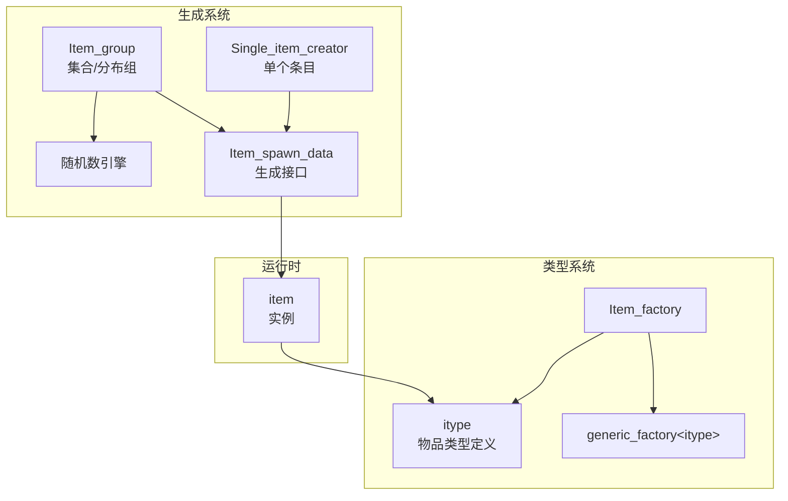
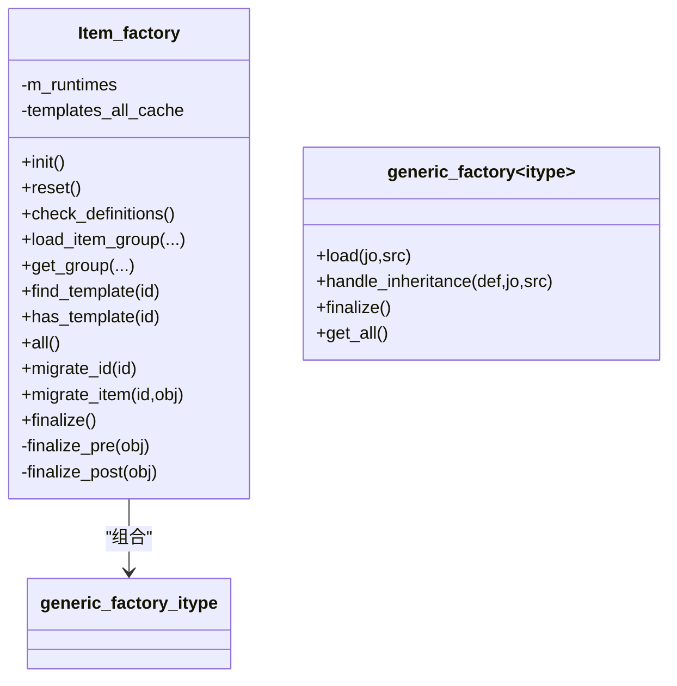
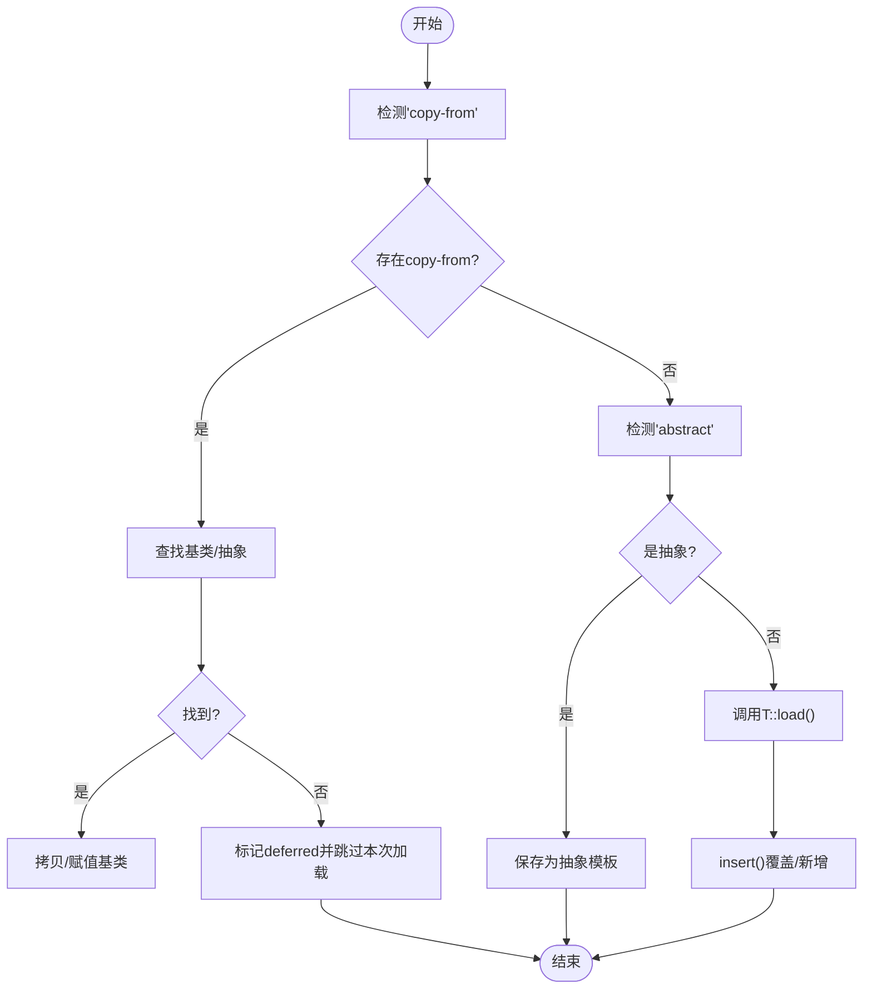
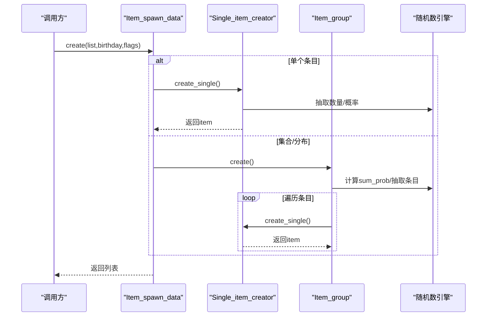
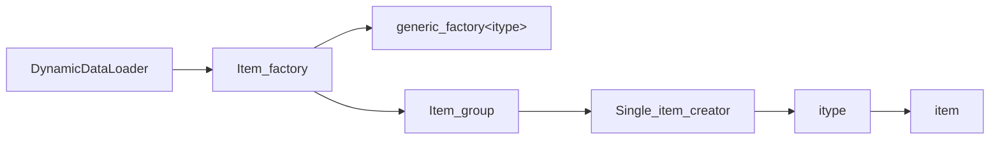

# 物品工厂系统

<cite>
**本文档引用的文件**
- item_factory.h
- item_factory.cpp
- generic_factory.h
- generic_factory.cpp
- item_group.h
- item_group.cpp
- itype.h
- itype.cpp
- item.h
- item.cpp
- json_loader.h
- init.h
- init.cpp
</cite>

## 目录
1. [简介](#简介)
2. [项目结构](#项目结构)
3. [核心组件](#核心组件)
4. [架构总览](#架构总览)
5. [详细组件分析](#详细组件分析)
6. [依赖分析](#依赖分析)
7. [性能考虑](#性能考虑)
8. [故障排查指南](#故障排查指南)
9. [结论](#结论)
10. [附录](#附录)

## 简介
本文件系统化阐述Cataclysm-DDA的物品工厂系统，围绕以下目标展开：
- 深入解释物品工厂模式的设计原理与JSON数据驱动的物品定义机制
- 描述动态加载流程、类型注册、继承关系处理与冲突解决策略
- 覆盖物品ID管理、类型安全检查与性能优化技术
- 提供JSON配置示例路径、工厂扩展方法与调试技巧
- 解析物品生成算法、随机性控制与稀有度分级的实现细节

## 项目结构
物品工厂系统由“类型工厂”和“掉落/生成组”两大子系统构成：
- 类型工厂：负责从JSON加载并管理所有物品类型（itype），支持继承、覆盖、最终化校验与缓存
- 掉落/生成组：负责按概率或分布规则从一组条目中生成具体物品，支持容器嵌套、弹药/弹匣注入、变体与随机修饰



图表来源
- item_factory.h
- generic_factory.h
- item_group.h
- item.h

章节来源
- item_factory.h
- generic_factory.h
- item_group.h
- item.h

## 核心组件
- Item_factory：中央工厂类，封装类型工厂、掉落组管理、迁移与黑名单、最终化阶段等
- `generic_factory<T>`：通用模板工厂，统一处理JSON加载、继承、覆盖、延迟加载与版本失效
- Item_group/Single_item_creator：掉落/生成组的实现，支持集合/分布两种模式与概率叠加
- itype：物品类型定义，承载所有属性槽位（武器、弹药、工具、书籍、护甲等）
- item：物品实例，运行时持有具体属性与状态

章节来源
- item_factory.h
- generic_factory.h
- item_group.h
- itype.h
- item.h

## 架构总览
下图展示从JSON到实例的完整流程：DynamicDataLoader解析JSON，调用Item_factory进行类型加载与继承处理，随后进入finalization阶段完成跨类型关联与缓存；掉落组在运行时根据概率生成具体item。

```mermaid
sequenceDiagram
participant Loader as "DynamicDataLoader"
participant IF as "Item_factory"
participant GF as "generic_factory&lt;itype&gt;"
participant IT as "itype"
participant IG as "Item_group"
participant RNG as "随机数引擎"
Loader->>IF : load_item_group(json)
IF->>IG : 构建/填充Item_group
IG->>RNG : 计算概率/抽取条目
Loader->>IF : load(json)
IF->>GF : handle_inheritance()/load()
GF->>IT : 反序列化字段/默认值
GF-->>IF : 注册/覆盖类型
IF->>IF : finalize()/check_definitions()
IG-->>Loader : 生成物品列表
```

图表来源
- init.cpp
- item_factory.cpp
- generic_factory.h
- item_group.cpp

章节来源
- init.cpp
- item_factory.cpp
- generic_factory.h
- item_group.cpp

## 详细组件分析

### 组件A：Item_factory（类型工厂）
职责与能力
- 统一初始化、重置、一致性检查与最终化
- 管理掉落/生成组（Item_group）与运行时类型（runtime types）
- 处理迁移（migrations）、黑名单（blacklist）、工具子类型映射
- 提供查询接口（find_template、has_template、all、find）

设计要点
- 内部持有generic_factory<itype>，通过其handle_inheritance实现JSON继承
- finalize阶段分两步：finalize_pre（预处理，如补全默认值、生成缓存）与finalize_post（后处理，如修复标签、计算修理材料）
- 运行时类型缓存与失效：m_runtimes与templates_all_cache，避免重复构建



图表来源
- item_factory.h
- generic_factory.h

章节来源
- item_factory.h
- item_factory.cpp
- generic_factory.h

### 组件B：generic_factory<T>（通用工厂）
职责与能力
- 统一JSON加载入口，支持“抽象”与“继承”（copy-from）
- 支持返回false的load以延迟加载（deferred），在finalization阶段统一处理
- 版本号机制用于失效string_id缓存，保证ID查询正确性
- 提供insert覆盖、check一致性检查、reset清理

继承与覆盖机制
- 若JSON含“abstract”，则仅加载为抽象模板，等待后续copy-from引用
- 若JSON含“copy-from”，优先查找已存在类型，否则查找抽象模板，若均未找到则defer并等待后续加载



图表来源
- generic_factory.h
- generic_factory.h

章节来源
- generic_factory.h
- generic_factory.cpp

### 组件C：掉落/生成组（Item_group/Single_item_creator）
职责与能力
- Item_group：集合（百分比概率）或分布（相对概率）两种模式
- Single_item_creator：单个条目包装器，支持容器、弹药、变体、随机修饰
- 支持容器溢出行为（溢出/丢弃/不处理），以及密封容器

生成流程
- Item_spawn_data::create/create_single负责抽取与生成
- Single_item_creator::create先按count范围生成数量，再决定是否放入容器
- Item_group::create对每个条目按概率抽取，支持最大化模式（spawn_flags::maximized）



图表来源
- item_group.h
- item_group.h
- item_group.cpp
- item_group.cpp

章节来源
- item_group.h
- item_group.h
- item_group.cpp
- item_group.cpp

### 组件D：物品类型定义（itype）
职责与能力
- 定义各类物品的结构化属性槽位（武器、弹药、工具、书籍、护甲、枪械模块等）
- 提供默认值推导逻辑（如堆叠大小、体积/重量、伤害、射击参数等）
- 提供查询接口（名称、标志、使用函数、损伤等级等）

关键点
- 使用多个结构体槽位承载不同功能域（如islot_gun、islot_armor、islot_comestible等）
- finalize_pre/finalize_post中完成默认值补齐与跨类型关联（如弹药兼容、枪械模式、修理材料）

章节来源
- itype.h
- itype.cpp
- item_factory.cpp

### 组件E：物品实例（item）
职责与能力
- 运行时物品实体，持有具体属性与状态（标志、变体、内容物、损坏度等）
- 提供构造方式：基于类型ID、基于配方、基于组件等
- 支持继承标志（craft_inherit）与内容物系统

章节来源
- item.h
- item.cpp

## 依赖分析
- Item_factory依赖generic_factory<itype>进行类型加载与继承
- Item_group/Single_item_creator依赖Item_factory查询类型与执行生成
- itype与item之间通过string_id/指针建立强关联
- DynamicDataLoader负责调度JSON加载与finalization



图表来源
- init.cpp
- item_factory.h
- item_group.h
- itype.h
- item.h

章节来源
- init.cpp
- item_factory.h
- item_group.h
- itype.h
- item.h

## 性能考虑
- 版本号与缓存失效：generic_factory维护version，插入新类型或覆盖时递增，使string_id缓存失效，避免陈旧查询结果
- 运行时类型缓存：Item_factory对运行时类型与静态类型合并缓存，减少遍历成本
- 最大化生成：spawn_flags::maximized可一次性生成最大数量，降低多次调用开销
- 延迟加载：部分类型load返回false可推迟至finalization阶段，减少首帧阻塞
- 预计算与缓存：finalize_pre中生成弹药兼容表、枪械模式、修理材料等，避免运行时重复计算

章节来源
- generic_factory.h
- generic_factory.h
- item_factory.cpp
- item_group.cpp

## 故障排查指南
常见问题与定位建议
- JSON循环依赖：DynamicDataLoader在单轮无进展时会报错并丢弃对象，检查copy-from链路
- 未知标志/标签：finalize_post会过滤无效flag并输出提示，需在对应json_flag中补充
- 无效容器/弹药：check_definitions会验证容器与弹药兼容性，修正类型ID或属性
- 生成异常：检查Item_group概率设置、容器容量与溢出行为，必要时启用最大化模式验证

调试技巧
- 使用items::check_consistency触发check_definitions
- 在finalize阶段断点观察类型与组的最终状态
- 利用日志输出（debugmsg）定位具体ID与上下文

章节来源
- init.cpp
- item_factory.cpp
- item_group.cpp

## 结论
物品工厂系统通过“通用工厂+类型工厂+掉落组”的分层设计，实现了高度可扩展且类型安全的物品定义与生成体系。JSON驱动的数据模型与继承机制使得内容创作者可以快速扩展与复用物品类型；运行时的缓存与延迟加载策略兼顾了性能与灵活性。配合完善的最终化与一致性检查，系统在复杂mod环境下仍能保持稳定与可维护性。

## 附录

### JSON配置示例（路径指引）
- 物品类型定义（示例路径）
  - data/json/items/
- 掉落组定义（示例路径）
  - data/json/item_groups/
- 动态加载入口（示例路径）
  - src/init.cpp

章节来源
- init.cpp

### 工厂扩展方法
- 新增物品类型：在JSON中定义新类型，利用“abstract/copy-from”复用基础属性
- 自定义生成组：编写集合/分布组，设置概率与容器/弹药注入
- 扩展使用函数：通过Item_factory::add_iuse注册新的iuse动作
- 迁移与黑名单：使用migrations与黑名单机制平滑更新与剔除

章节来源
- item_factory.h
- item_factory.cpp

### 随机性与稀有度
- 随机性控制
  - Item_group支持集合（百分比）与分布（相对概率）两种模式
  - Single_item_creator支持数量范围与概率抽取
  - 容器/弹药注入概率可通过with_ammo/with_magazine继承
- 稀有度分级
  - 通过概率权重与容器容量间接控制稀有度
  - 变体与随机修饰（snippets）可增加多样性但不改变基础概率

章节来源
- item_group.h
- item_group.cpp