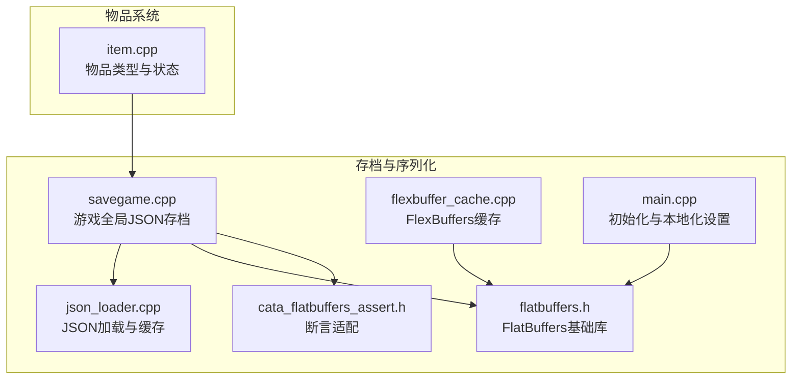
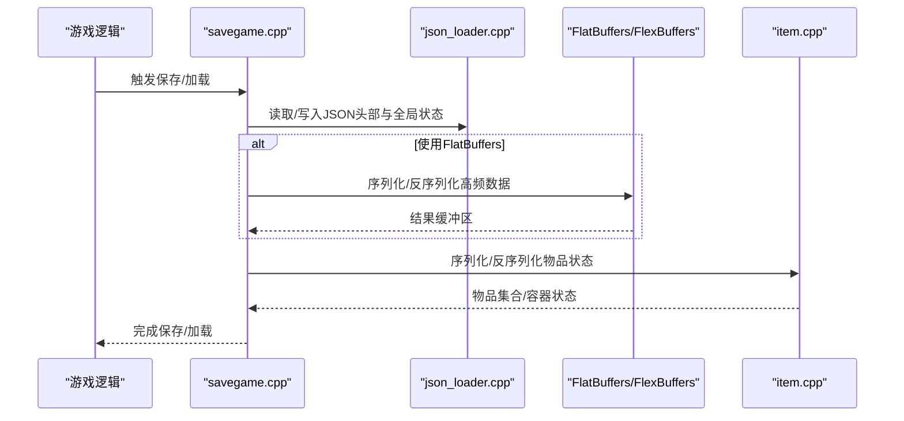
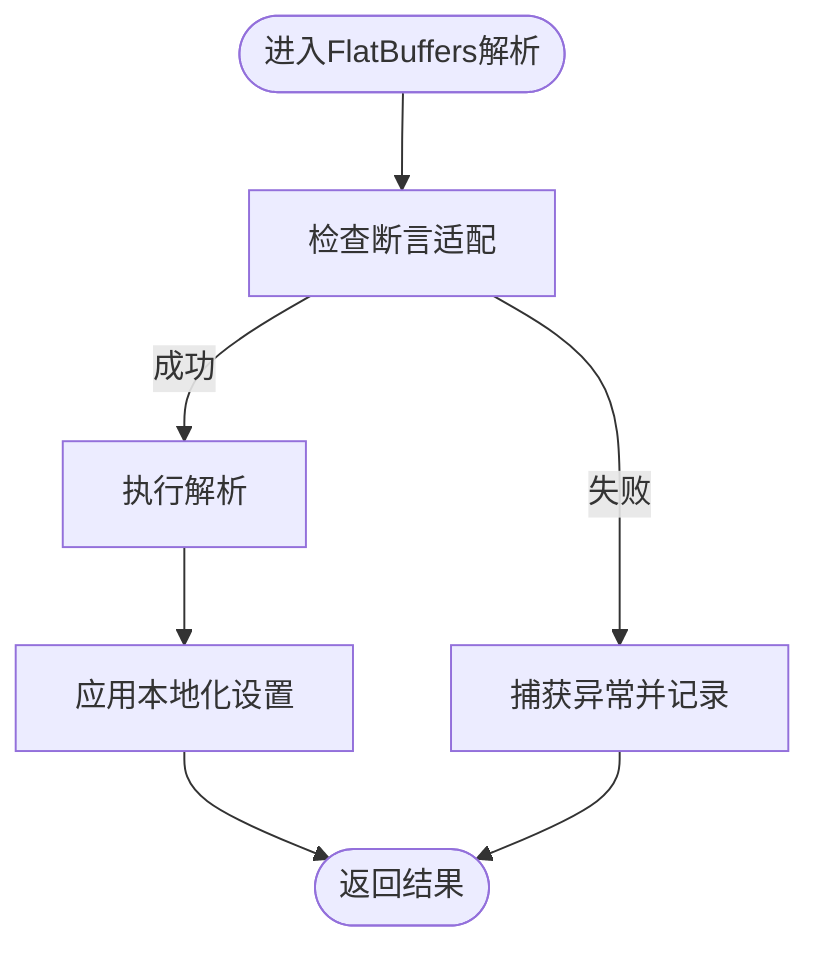
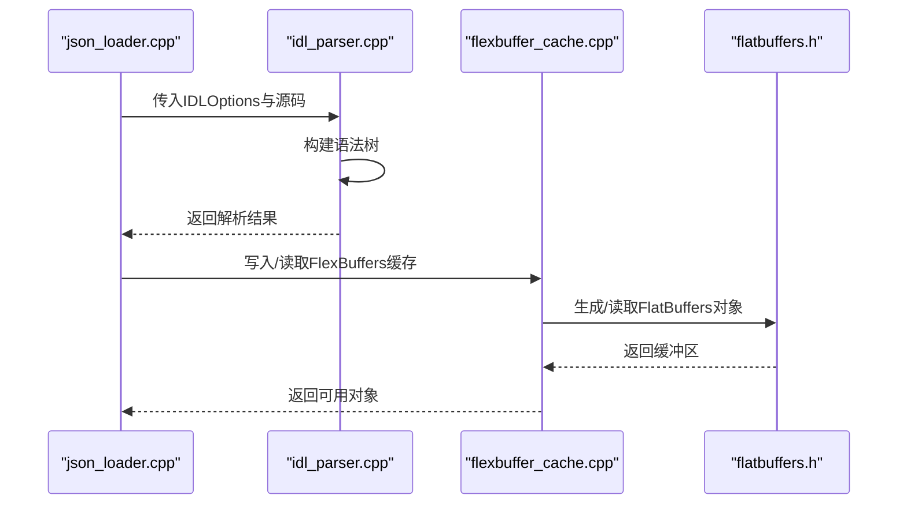
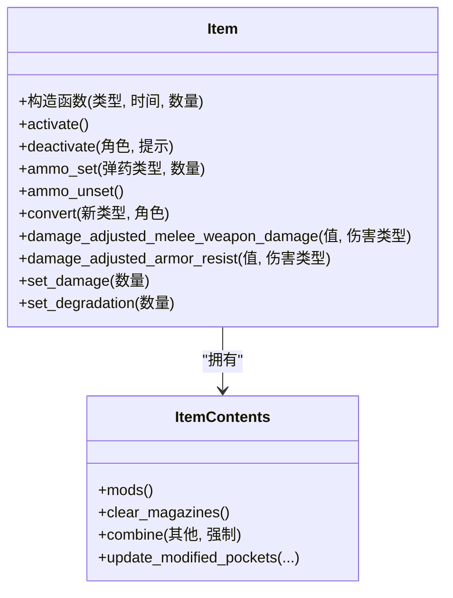
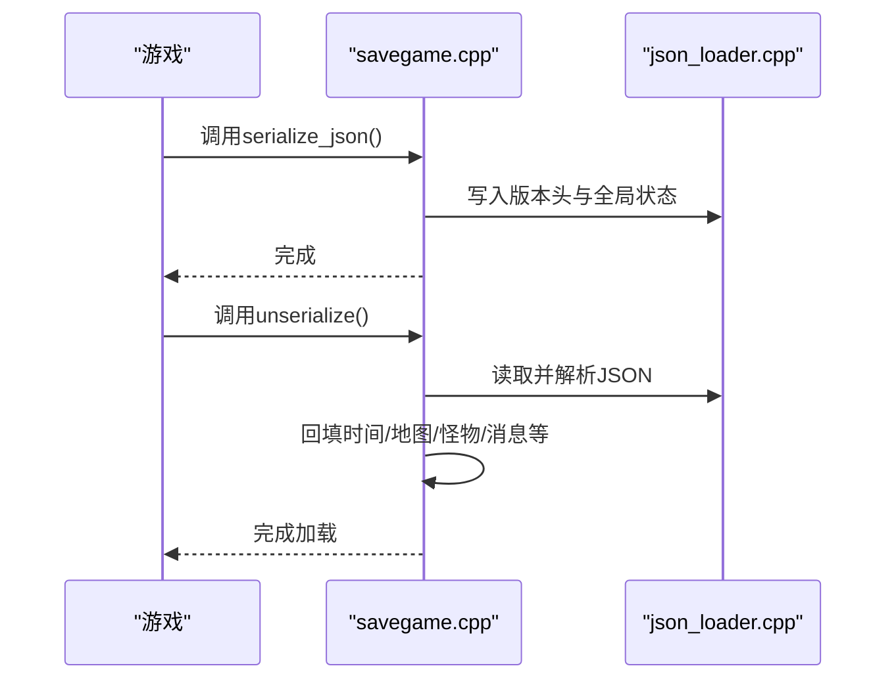
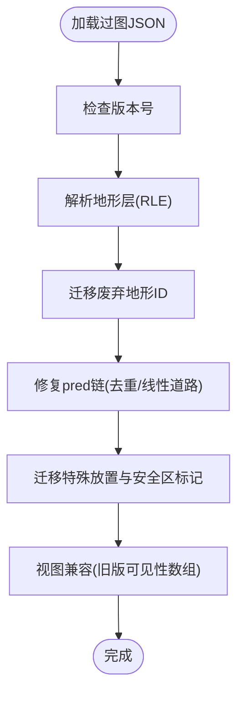
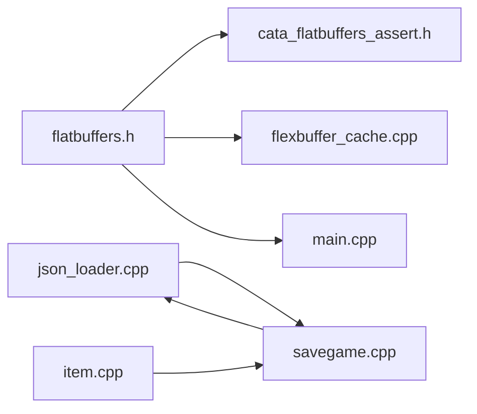

# 物品序列化系统

<cite>
**本文档引用的文件**
- savegame.cpp
- item.cpp
- cata_flatbuffers_assert.h
- flatbuffers.h
- flexbuffer_cache.cpp
- json_loader.cpp
- main.cpp
</cite>

## 目录
1. [简介](#简介)
2. [项目结构](#项目结构)
3. [核心组件](#核心组件)
4. [架构总览](#架构总览)
5. [详细组件分析](#详细组件分析)
6. [依赖关系分析](#依赖关系分析)
7. [性能考虑](#性能考虑)
8. [故障排除指南](#故障排除指南)
9. [结论](#结论)
10. [附录](#附录)

## 简介
本文件系统性梳理 Cataclysm: Dark Days Ahead（CDDA）中的“物品序列化系统”，重点覆盖以下方面：
- FlatBuffers 序列化机制与在游戏中的集成方式
- 版本兼容性与数据迁移策略
- 物品状态的保存与加载流程及错误恢复机制
- 批量操作、增量更新与性能优化技术
- 序列化格式规范、调试工具与故障排除实践
- 面向扩展开发的指导建议

说明：CDDA 在主存中使用 JSON 进行大部分存档（如角色、世界、过图等），但对特定高频数据（如地图子块、过图视图等）采用 FlatBuffers 以提升性能与体积效率。本文将分别阐述两套机制及其协同工作方式。

## 项目结构
围绕物品序列化系统的关键目录与文件：
- 存档与序列化入口：src/savegame.cpp
- 物品类型与状态：src/item.cpp
- FlatBuffers 基础与断言适配：src/third-party/flatbuffers/* 与 src/cata_flatbuffers_assert.h
- FlexBuffers 缓存与解析：src/flexbuffer_cache.cpp
- JSON 加载器与缓存策略：src/json_loader.cpp
- 主程序初始化与本地化设置：src/main.cpp

**图表来源**
- savegame.cpp
- json_loader.cpp
- flatbuffers.h
- cata_flatbuffers_assert.h
- flexbuffer_cache.cpp
- main.cpp
- item.cpp

**章节来源**
- savegame.cpp
- item.cpp

## 核心组件
- 游戏全局 JSON 存档：负责保存时间、天气、玩家、怪物、消息、统计等全局状态，版本号统一管理，便于跨版本兼容与迁移。
- 物品系统：定义物品类型、变量、内容容器、损坏度、计数等状态，支持激活/非激活、弹药、附件、变体等复杂属性。
- FlatBuffers/FlexBuffers：用于高性能序列化与反序列化，断言适配确保解析错误可捕获并友好提示；缓存机制减少重复解析开销。
- JSON 加载器：提供从路径或字符串加载 JSON 的统一接口，支持偏移读取与错误处理。
- 主程序初始化：设置本地化环境，保证数值解析一致性。

**章节来源**
- savegame.cpp
- item.cpp
- cata_flatbuffers_assert.h
- json_loader.cpp
- main.cpp

## 架构总览
整体架构由“JSON 存档层 + FlatBuffers/FlexBuffers 层 + 物品系统层”构成，二者在不同场景下协同工作：

**图表来源**
- savegame.cpp
- json_loader.cpp
- item.cpp

## 详细组件分析

### FlatBuffers 断言与本地化适配
- 断言替换：通过宏将 FlatBuffers 的断言替换为项目自定义断言，使解析错误可捕获并记录，避免崩溃。
- 本地化设置：主程序在启动时启用与 FlatBuffers 相关的本地化独立模式，确保数值解析不受系统区域影响。

**图表来源**
- cata_flatbuffers_assert.h
- main.cpp

**章节来源**
- cata_flatbuffers_assert.h
- main.cpp

### FlexBuffers 缓存与解析
- 缓存策略：为避免持久化 FlatBuffers 解析结果，采用按世界内存缓存的方式，解析后直接使用，减少磁盘 IO。
- 解析流程：通过 IDL 选项与解析器进行语法树构建，随后生成可读对象，供后续序列化/反序列化使用。

**图表来源**
- json_loader.cpp
- flexbuffer_cache.cpp
- flatbuffers.h

**章节来源**
- json_loader.cpp
- flexbuffer_cache.cpp

### 物品序列化与状态管理
- 物品构造与默认状态：构造函数根据类型信息初始化物品，包括计数、内容容器、变体、激活状态等。
- 变更传播：当物品类型变更或转换时，继承相对腐烂度、重置计数器并更新链接特性与前缀/后缀标志。
- 弹药与弹匣：支持设置/卸载弹药、自动选择合适弹匣、容量校验与警告日志。
- 损坏与降级：根据损坏等级调整武器/护甲伤害与抗性，同时考虑故障修正。

**图表来源**
- item.cpp
- item.cpp
- item.cpp
- item.cpp

**章节来源**
- item.cpp
- item.cpp
- item.cpp
- item.cpp

### 全局JSON存档与版本兼容
- 版本号：全局保存版本号，用于判断加载器与兼容策略。
- 头部信息：保存时间、日历起点、初始季节、自动旅行模式、安全模式、视角偏移、气味地图等。
- 加载流程：读取版本头，解析 JSON，回填到游戏状态；对错误进行捕获与日志输出。
- 过图视图与地图：采用紧凑序列（RLE）存储可见/探索状态与注记、额外标记，支持旧版本字段映射与兼容。

**图表来源**
- savegame.cpp
- savegame.cpp
- json_loader.cpp

**章节来源**
- savegame.cpp
- savegame.cpp

### 数据迁移与兼容策略
- 过图地形与特殊放置：对废弃地形 ID 进行迁移，安全区标记与预decessors 链去重与修复，保证地图生成一致性。
- 过图视图兼容：对旧版可见性数组进行解码映射，确保新旧存档互通。
- 预备字段与空值处理：对历史遗留字段进行忽略或默认处理，避免解析失败。

**图表来源**
- savegame.cpp
- savegame.cpp

**章节来源**
- savegame.cpp
- savegame.cpp

## 依赖关系分析
- FlatBuffers 与断言：通过断言适配确保解析错误可控；主程序设置本地化以保证数值解析稳定。
- JSON 与存档：JSON 加载器为存档提供统一入口，支持偏移读取与错误处理。
- 物品系统与存档：物品状态作为 JSON 或 FlatBuffers 的一部分被序列化，涉及弹药、附件、损坏度等复杂字段。

**图表来源**
- flatbuffers.h
- cata_flatbuffers_assert.h
- flexbuffer_cache.cpp
- main.cpp
- json_loader.cpp
- savegame.cpp
- item.cpp

**章节来源**
- flatbuffers.h
- cata_flatbuffers_assert.h
- json_loader.cpp
- savegame.cpp
- item.cpp

## 性能考虑
- 紧凑序列（RLE）：对布尔/枚举数组进行 RLE 编码，显著降低过图视图与地图层的存储体积与 IO 开销。
- 内存缓存：FlexBuffers 解析结果仅驻留于内存，避免磁盘持久化带来的额外开销。
- 字段分层：将频繁访问的数据（如地图子块）迁移到 FlatBuffers，常规状态仍用 JSON，平衡性能与可维护性。
- 批量与增量：对相同组的怪物群进行分组压缩（bin），减少重复序列化；对视图注记与额外标记按层级组织，便于增量更新。

**章节来源**
- savegame.cpp
- savegame.cpp
- json_loader.cpp

## 故障排除指南
- JSON 解析错误：捕获 JsonError 并记录调试信息，定位问题字段与版本不匹配。
- FlatBuffers 断言失败：检查断言适配是否生效，确认本地化设置是否正确；查看解析深度限制。
- 物品状态异常：核对弹药/弹匣容量、损坏度与降级计算；检查附件与变体是否正确继承。
- 地图/过图加载失败：关注废弃地形 ID 迁移与预decessors 修复；确认 RLE 编码与解码顺序一致。

**章节来源**
- savegame.cpp
- cata_flatbuffers_assert.h
- main.cpp
- item.cpp

## 结论
CDDA 的物品序列化系统通过“JSON + FlatBuffers/FlexBuffers”的组合，在保证可读性与可扩展性的同时，兼顾了性能与体积效率。版本号与迁移策略确保跨版本兼容，RLE 与缓存机制进一步优化了高频数据的处理。对于扩展开发者而言，遵循现有断言与本地化约定、复用 JSON/FB 的加载/缓存模式，是实现稳定与高性能序列化的重要保障。

## 附录

### 序列化格式规范（概要）
- JSON 存档
  - 头部字段：版本号、时间、日历起点、初始季节、自动旅行模式、安全模式、视角偏移、气味地图等。
  - 全局集合：玩家、怪物追踪器、消息、统计与成就、唯一 NPC 列表等。
- 过图视图（FlatBuffers/FlexBuffers）
  - 可见/探索状态：按层级编码的 RLE 数组。
  - 注记与额外标记：二维列表，每项包含坐标与附加信息。
- 物品状态
  - 类型、计数、激活状态、弹药与弹匣、附件、损坏度、变体与变量等。

**章节来源**
- savegame.cpp
- savegame.cpp
- item.cpp