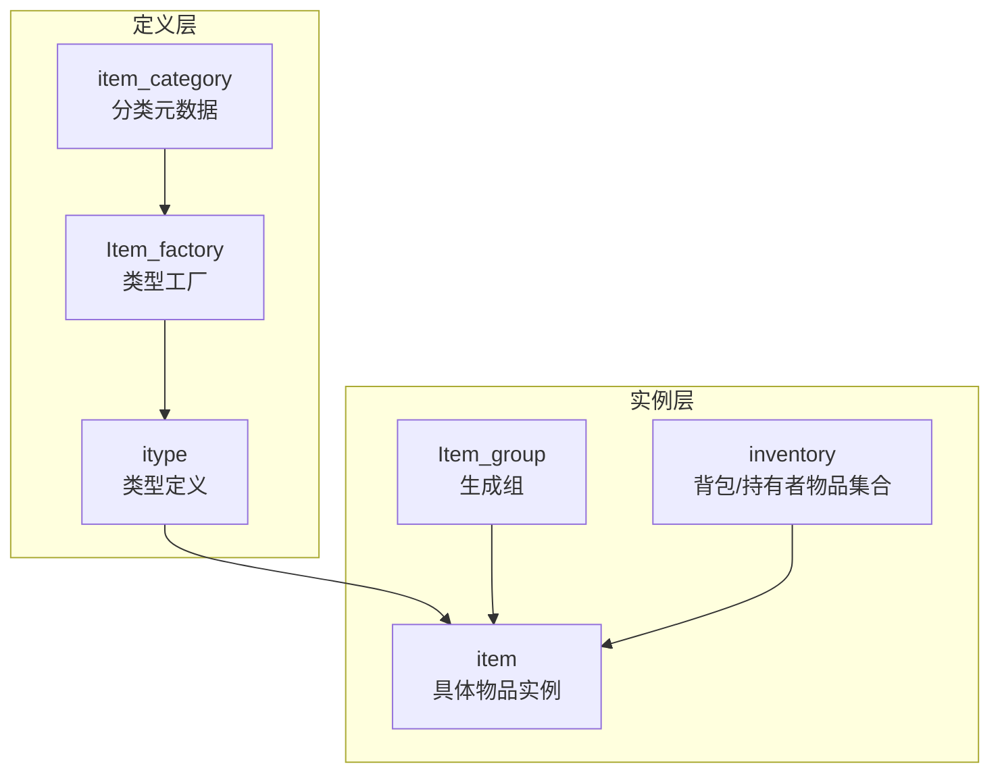
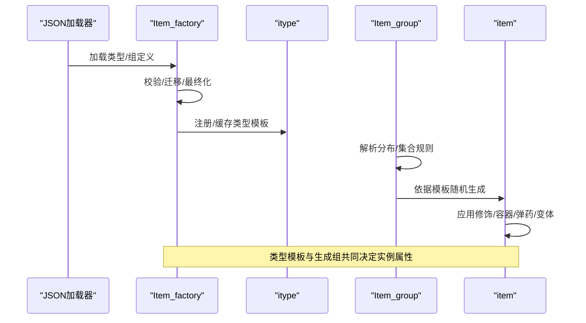
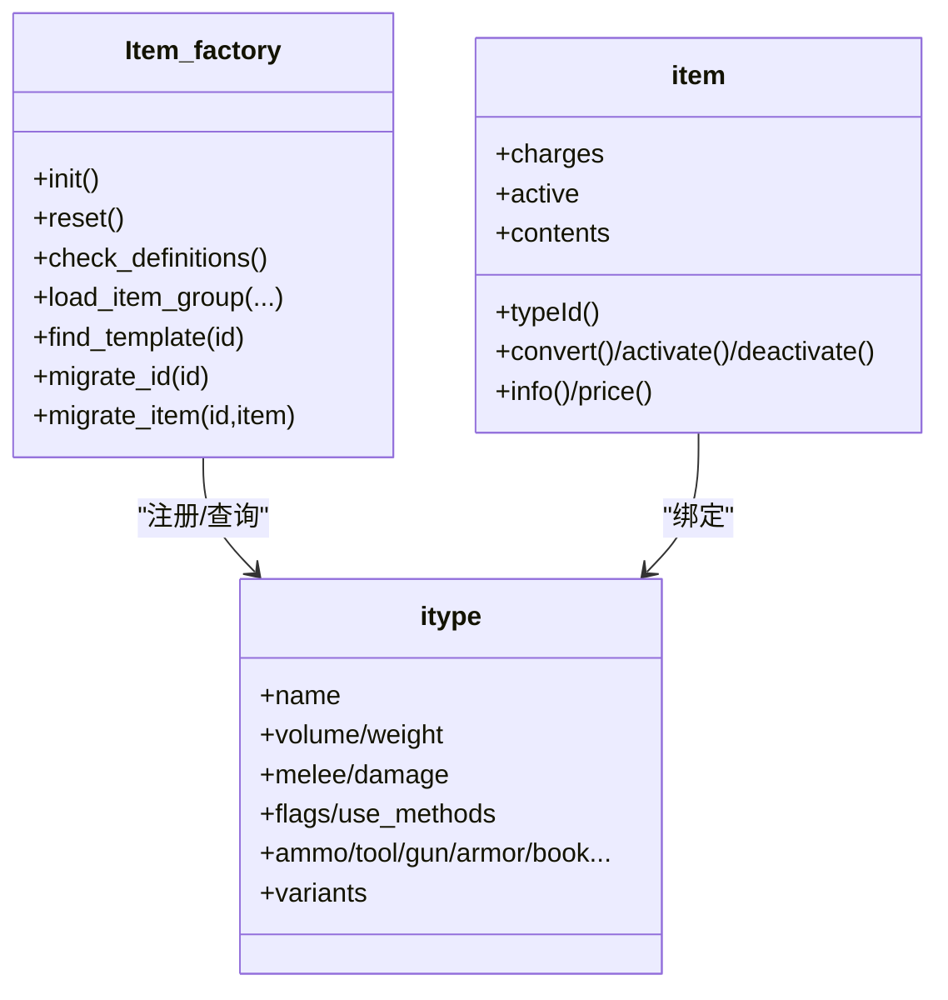
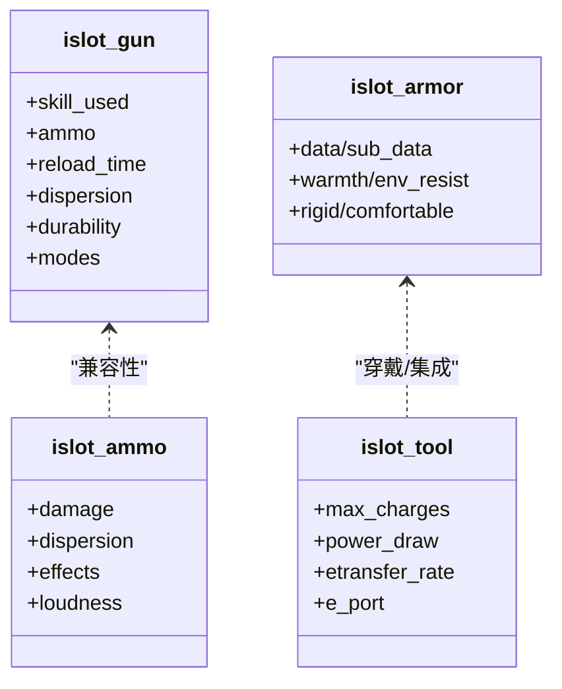
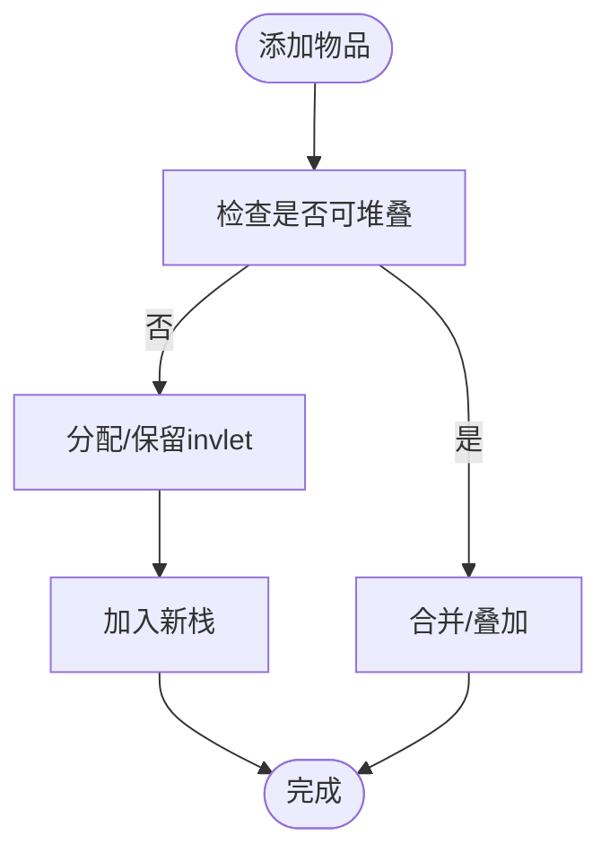
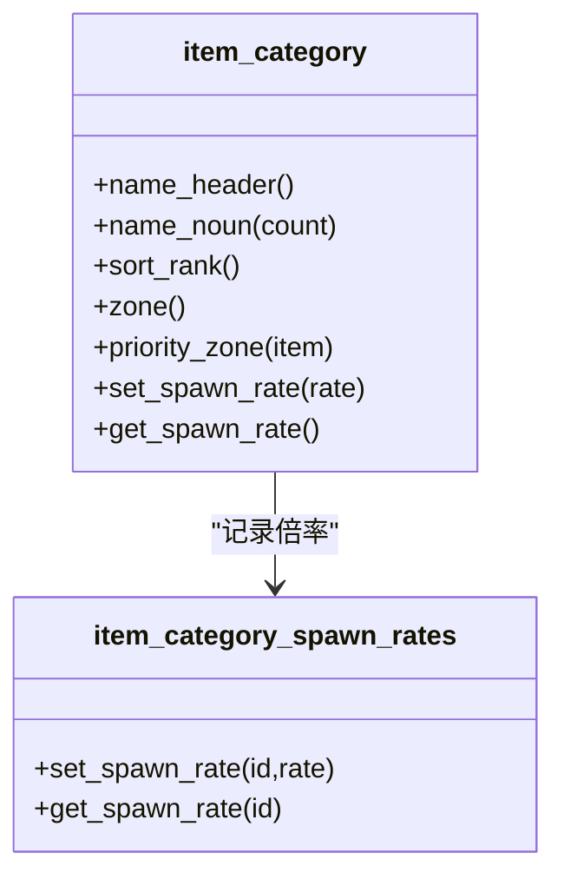
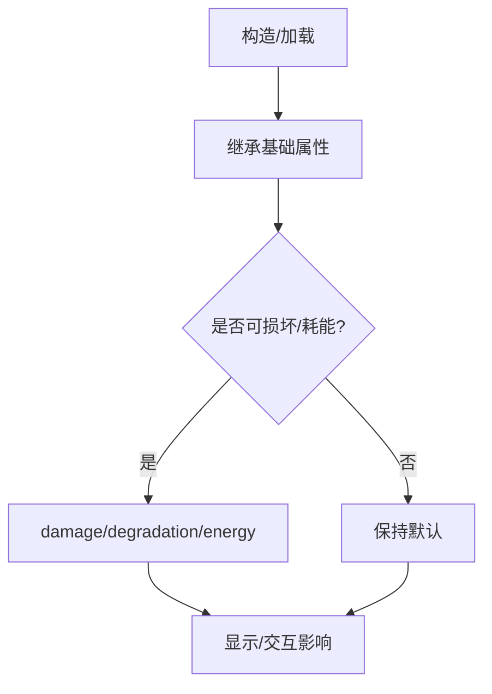
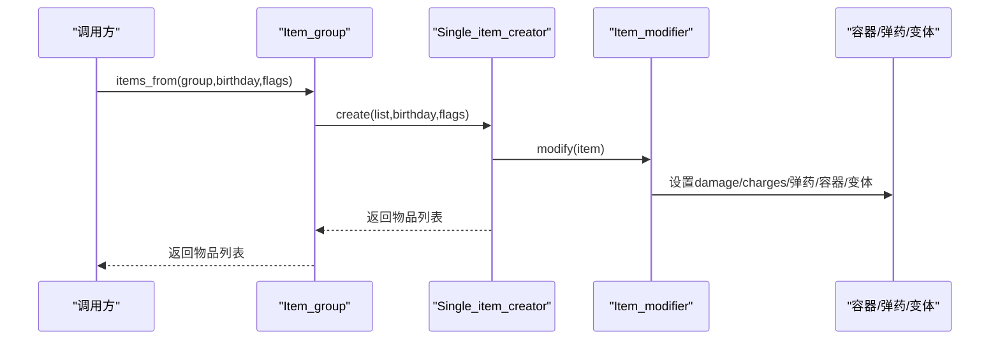
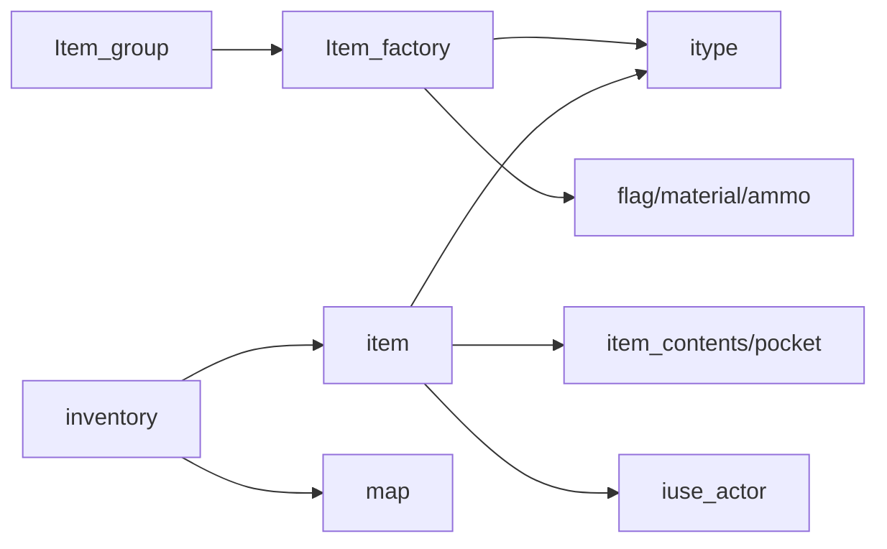

# 物品系统

<cite>
**本文引用的文件**
- src/item.h
- src/item.cpp
- src/itype.h
- src/itype.cpp
- src/item_factory.h
- src/item_factory.cpp
- src/item_group.h
- src/item_group.cpp
- src/inventory.h
- src/inventory.cpp
- src/item_category.h
- src/item_category.cpp
</cite>

## 目录
1. [简介](#简介)
2. [项目结构](#项目结构)
3. [核心组件](#核心组件)
4. [架构总览](#架构总览)
5. [详细组件分析](#详细组件分析)
6. [依赖关系分析](#依赖关系分析)
7. [性能考量](#性能考量)
8. [故障排查指南](#故障排查指南)
9. [结论](#结论)
10. [附录](#附录)

## 简介
本文件系统化梳理 Cataclysm-DDA 的物品系统，围绕“工厂模式”“装备系统”“背包管理”“道具分类机制”展开；同时覆盖“物品属性系统”“耐久度机制”“污染处理”“随机性与稀有度分级”“生成算法与平衡性调整”“批量操作与性能优化”等主题，并提供可直接定位到源码的路径指引与扩展开发建议。

## 项目结构
- 物品类型定义与工厂：itype + Item_factory 负责加载、校验与模板管理
- 实例对象与行为：item 负责具体实例的状态、属性、行为调用
- 随机生成：Item_group 提供组内随机生成、容器封装、概率与溢出策略
- 背包与交互：inventory 提供堆叠、排序、查找、批量使用等
- 分类与展示：item_category 提供 UI 分区、优先区域、生成速率等

图表来源
- src/itype.h
- src/item_factory.h
- src/item.h
- src/inventory.h
- src/item_group.h

章节来源
- src/itype.h
- src/item_factory.h
- src/item.h
- src/inventory.h
- src/item_group.h

## 核心组件
- 物品类型（itype）：承载所有静态属性（体积、重量、伤害、材料、用途、标签、变体等），由 Item_factory 统一加载与校验
- 物品实例（item）：基于 itype 创建的具体对象，维护状态（耐久、污染、电能、温度、变量、内容物等），并提供行为调用（激活/转换/拆分/合并/信息输出）
- 物品工厂（Item_factory）：集中式类型管理器，负责加载 JSON、构建模板、迁移与最终化、黑名单、运行时模板注册
- 物品生成组（Item_group）：按分布/集合规则从组中随机产出物品，支持容器封装、默认弹药/弹夹、溢出策略、 relic 生成
- 背包（inventory）：对物品进行堆叠、排序、查找、批量使用、伪工具提供、容量统计等
- 分类（item_category）：为 UI 展示与生成速率提供元数据（名称、排序、优先区域、生成倍率）

章节来源
- src/itype.h
- src/item.h
- src/item_factory.h
- src/item_group.h
- src/inventory.h
- src/item_category.h

## 架构总览
下面以“从 JSON 到实例”的视角展示工厂与生成链路：

图表来源
- src/item_factory.cpp
- src/item_group.cpp
- src/item.cpp

章节来源
- src/item_factory.cpp
- src/item_group.cpp
- src/item.cpp

## 详细组件分析

### 工厂模式：类型与实例的解耦
- 类型（itype）：集中定义物品的静态属性与行为入口（如 use_methods、flags、slots 等）
- 实例（item）：在构造时绑定 itype，继承其默认值与规则，同时维护自身状态（如 charges、active、contents 等）
- 工厂（Item_factory）：统一加载、校验、迁移、缓存与最终化，保证类型一致性与运行期稳定性

图表来源
- src/item_factory.h
- src/itype.h
- src/item.h

章节来源
- src/item_factory.h
- src/itype.h
- src/item.h

### 装备系统：武器/弹药/护甲/工具
- 武器（gun）：射程、精度、后坐力、射速、弹容量、模式、故障、能量消耗等
- 弹药（ammo）：伤害、散布修正、燃烧/特殊效果、计数与噪音
- 护甲（armor）：部位覆盖、厚度、抗环境、透气性、刚性/舒适度、分层
- 工具（tool）：最大/默认充能、功率消耗、电子端口、ememory 转移速率等

图表来源
- src/itype.h
- src/itype.h
- src/itype.h
- src/itype.h

章节来源
- src/itype.h
- src/itype.h
- src/itype.h

### 背包管理：堆叠、排序与批量操作
- 堆叠与合并：基于 item::stacks_with 与 merge_charges，支持按“计数/电能/液体”等不同维度合并
- 排序与分配：restack 保证同堆一致的 invlet，assign_empty_invlet 为未占用字母分配
- 批量使用与查找：use_amount、reduce_stack、position_by_item/type、invlet_to_position
- 容量与重量：weight/volume 计算考虑 contents 与积分化体积/重量

图表来源
- src/inventory.cpp

章节来源
- src/inventory.h
- src/inventory.cpp

### 道具分类机制：UI 展示与生成速率
- 分类元数据：名称、排序权重、优先区域（含“脏污”标志）、生成倍率
- 优先区域：根据物品 flags 或脏污状态选择特定区域
- 生成速率：通过 item_category_spawn_rates 控制类别生成倍率

图表来源
- src/item_category.h
- src/item_category.cpp

章节来源
- src/item_category.h
- src/item_category.cpp

### 物品属性系统与耐久度机制
- 属性来源：itype 中定义的基础属性（体积、重量、伤害、材料、标签等）
- 实例状态：item 维护 damage/degradation、active、energy、rot/spoil、变量等
- 耐久与损坏：set_damage/set_degradation、deterioration 符号、能量电池 mod_energy
- 污染与过热：dirt_symbol/overheat_symbol、故障（fault）与安全机制

图表来源
- src/item.cpp
- src/item.cpp
- src/item.cpp

章节来源
- src/item.cpp
- src/item.cpp
- src/item.cpp

### 污染处理与特殊效果
- 污染（dirt）：影响散布与可靠性，可通过 dirt_symbol 显示等级
- 过热（overheat）：影响命中与安全机制（fault_overheat_safety）
- 特殊效果：ammo_effects（燃烧、燃烧开火等）、gun 故障列表、relic 生成
- 变体与描述：itype_variant_data 支持替换描述/符号/颜色/ASCII 艺术

章节来源
- src/item.cpp
- src/item_group.cpp
- src/itype.h

### 物品生成算法与随机性控制
- Item_group：支持“集合/分布”，按概率或相对权重抽取
- 随机性：spawn_flags 控制最大化/使用全局 spawn_rate；单次生成与批量生成
- 容器与弹药：自动为枪/工具填充默认弹夹/弹药，容器封装与溢出策略
- Relic：按规则生成 artifact

图表来源
- src/item_group.h
- src/item_group.cpp
- src/item_group.cpp

章节来源
- src/item_group.h
- src/item_group.cpp
- src/item_group.cpp

### 稀有度分级与平衡性调整
- 稀有度：通过 Item_group 的概率与 Item_modifier 的 count/damage/charges 区分
- 平衡性：itype 中 damage/encumbrance/材料/功能限制；Item_factory 最终化阶段统一修正
- 生成速率：item_category_spawn_rates 控制类别生成倍率；spawn_flags 影响实际产出

章节来源
- src/item_group.cpp
- src/item_category.cpp
- src/item_factory.cpp

### 批量操作与性能优化
- 批量生成：items_from 支持批量产出，配合 spawn_flags 控制随机性
- 背包批量：inventory 提供 operator+=、restack、dump 等减少重复遍历
- 缓存与索引：inventory::get_binned_items、itype_bin 快速按类型检索
- 合并与去重：restack 合并同类项，减少 UI 渲染与交互成本

章节来源
- src/inventory.h
- src/inventory.cpp
- src/item_group.h

## 依赖关系分析
- Item_factory 依赖 itype、flag、material、ammo、recipe 等模块，统一校验与最终化
- item 依赖 itype、item_contents、item_pocket、iuse_actor 等，承载复杂行为
- Item_group 依赖 Item_factory 查询组与类型，支持递归与容器封装
- inventory 依赖 item、map、pocket_type 等，提供交互与统计

图表来源
- src/item_factory.cpp
- src/item.cpp
- src/item_group.cpp
- src/inventory.cpp

章节来源
- src/item_factory.cpp
- src/item.cpp
- src/item_group.cpp
- src/inventory.cpp

## 性能考量
- 避免频繁 restack：在大量物品变动后统一调用，减少多次排序与 invlet 更新
- 使用 itype_bin 快速检索：inventory::get_binned_items 降低 O(n) 查找成本
- 合理使用 spawn_flags：最大化模式减少随机分支，提高生成效率
- 控制容器封装与弹药填充：仅在必要时进行，避免额外拷贝与校验

## 故障排查指南
- 无法找到类型/组：检查 Item_factory::check_definitions 与 group_is_defined
- 生成异常或递归：检查 Item_spawn_data::RecursionList 与 Single_item_creator 的递归保护
- 背包 invlet 冲突：使用 update_invlet 或 assign_empty_invlet 修复
- 价格/价值异常：核对 price_no_contents 与 pratical 参数

章节来源
- src/item_factory.cpp
- src/item_group.cpp
- src/inventory.cpp

## 结论
CDDA 的物品系统以“类型模板 + 实例状态 + 工厂/生成器 + 背包管理 + 分类元数据”为核心，实现了高扩展性与强一致性的平衡。通过合理的工厂与生成链路、完善的属性与状态模型、以及面向 UI 的分类与速率控制，既满足了玩法深度，也兼顾了性能与可维护性。

## 附录
- 扩展开发建议
  - 新增物品类型：在 JSON 中定义 itype，确保 flags、slots、use_methods、variants 完整
  - 新增生成组：使用 Item_group 定义分布/集合，设置 with_ammo/with_magazine 与容器策略
  - 新增分类：通过 item_category 定义 UI 名称、排序与优先区域
  - 性能优化：批量生成时使用 spawn_flags，背包操作后统一 restack，利用 bin 缓存快速检索