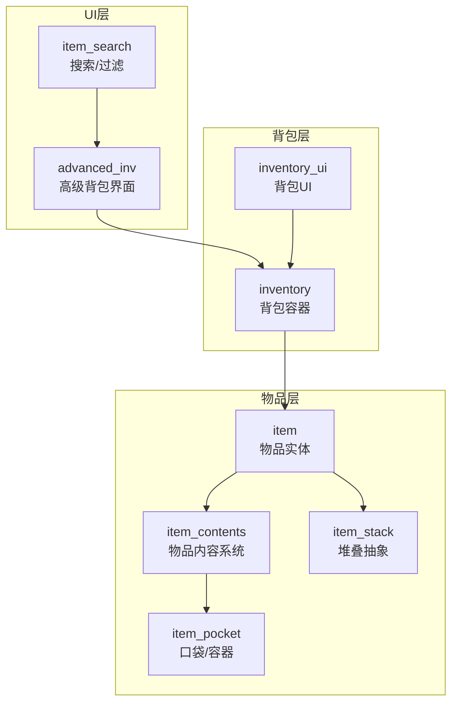
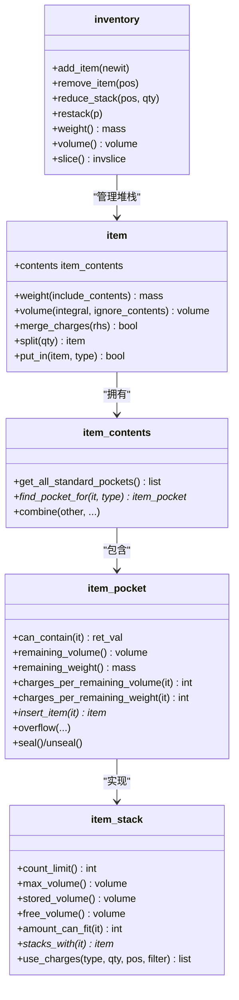
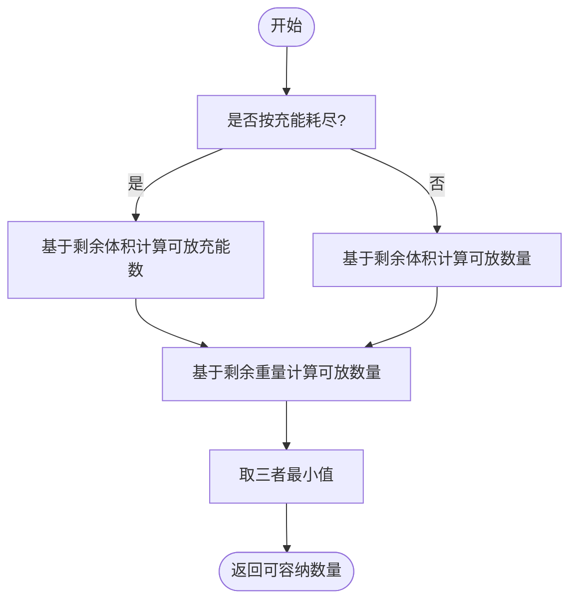
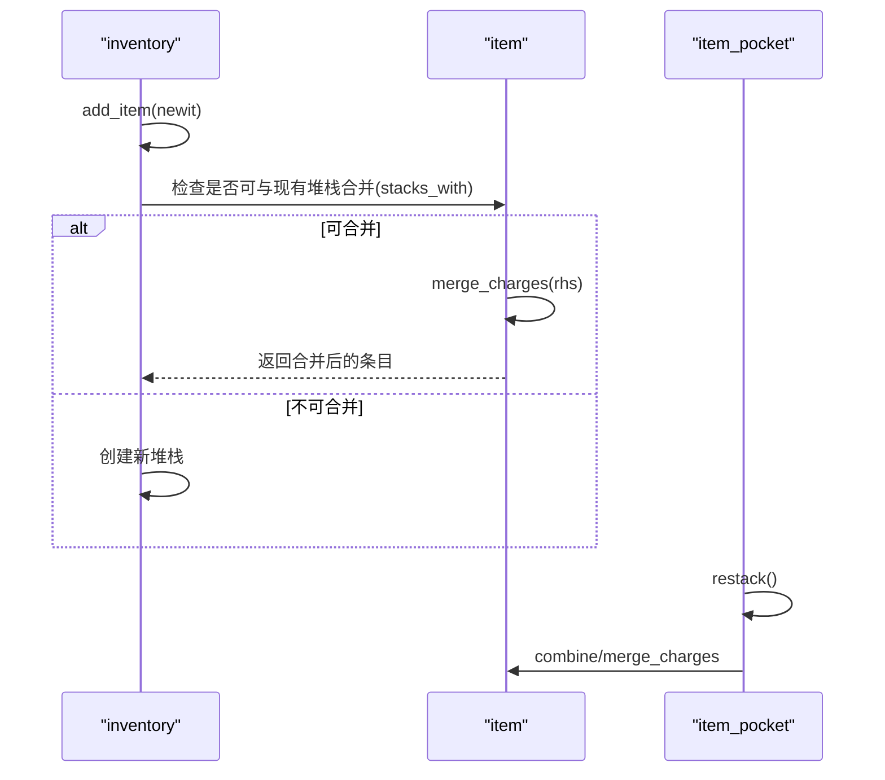
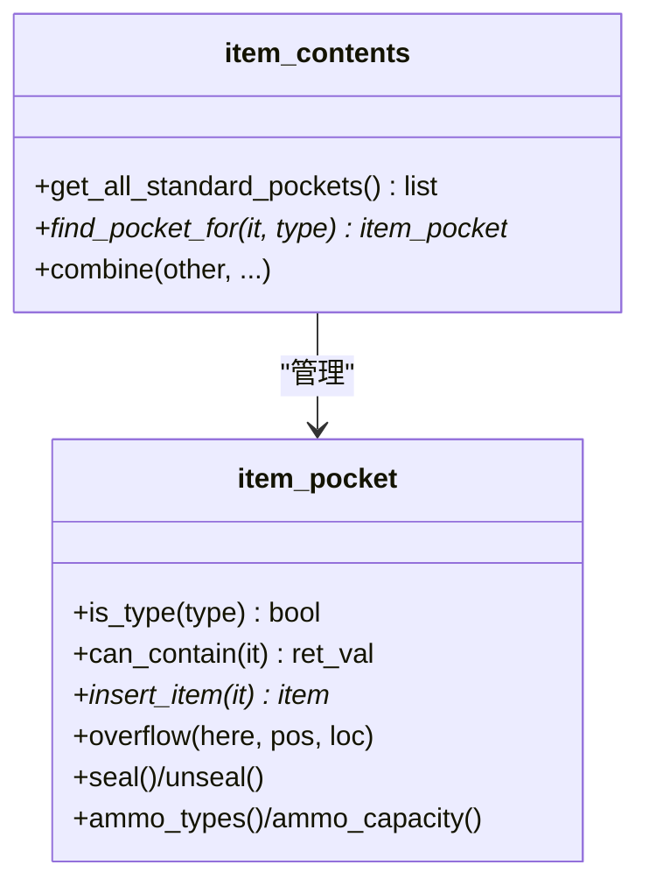
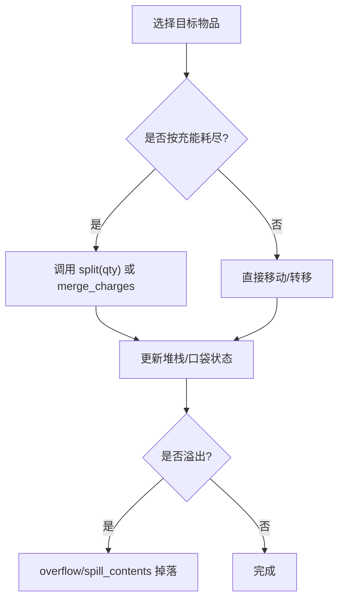
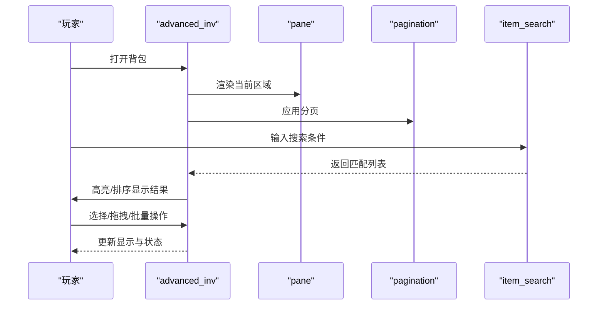
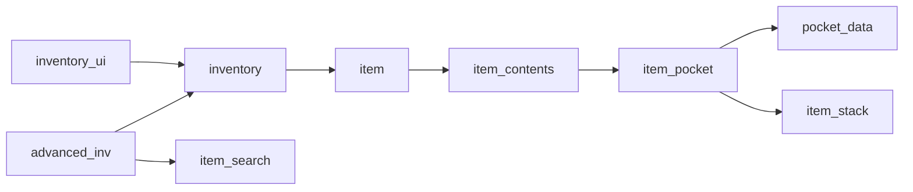

# 背包管理系统

<cite>
**本文档引用的文件**
- src/inventory.h
- src/inventory.cpp
- src/item_stack.h
- src/item_stack.cpp
- src/item_pocket.h
- src/item_pocket.cpp
- src/item.h
- src/item.cpp
- src/item_contents.h
- src/item_contents.cpp
- src/advanced_inv.h
- src/advanced_inv.cpp
- src/advanced_inv_listitem.h
- src/advanced_inv_listitem.cpp
- src/advanced_inv_pane.h
- src/advanced_inv_pane.cpp
- src/advanced_inv_pagination.h
- src/advanced_inv_pagination.cpp
- src/advanced_inv_area.h
- src/advanced_inv_area.cpp
- src/inventory_ui.h
- src/inventory_ui.cpp
- src/item_search.h
- src/item_search.cpp
</cite>

## 目录
1. [简介](#简介)
2. [项目结构](#项目结构)
3. [核心组件](#核心组件)
4. [架构总览](#架构总览)
5. [详细组件分析](#详细组件分析)
6. [依赖关系分析](#依赖关系分析)
7. [性能考虑](#性能考虑)
8. [故障排除指南](#故障排除指南)
9. [结论](#结论)
10. [附录](#附录)

## 简介
本文件为 Cataclysm-DDA 背包管理系统的综合技术文档，覆盖以下主题：
- 背包容量计算与重量限制系统
- 物品堆叠机制（按类型、按充能/电荷）
- 物品槽位管理、Pocket 系统与容器嵌套
- 物品移动、分割与合并操作
- 背包 UI 交互、排序与搜索功能
- 性能优化策略、内存管理与批量操作实践

该系统以 C++ 实现，采用分层设计：顶层是角色背包（inventory），中间层是物品（item）及其内容系统（item_contents），底层是口袋（item_pocket）与堆叠抽象（item_stack）。UI 层通过高级背包界面（advanced_inv）提供交互。

## 项目结构
背包管理相关代码主要分布在以下模块：
- 背包与库存：inventory.h/.cpp
- 物品与内容：item.h/.cpp、item_contents.h/.cpp
- 口袋与容器：item_pocket.h/.cpp
- 堆叠抽象：item_stack.h/.cpp
- 高级背包 UI：advanced_inv*.h/.cpp
- 搜索与排序：item_search.h/.cpp
- 背包 UI：inventory_ui.h/.cpp

图表来源
- src/inventory.h
- src/item.h
- src/item_contents.h
- src/item_pocket.h
- src/item_stack.h
- src/advanced_inv.h
- src/inventory_ui.h

章节来源
- src/inventory.h
- src/inventory.cpp
- src/item.h
- src/item_contents.h
- src/item_pocket.h
- src/item_stack.h

## 核心组件
- inventory：背包主容器，维护物品堆栈列表，提供增删改查、重量/体积统计、重排、从地图收集等能力。
- item：物品实体，支持显示名、重量/体积计算、充能/电荷合并、内容嵌套、属性与标志等。
- item_contents：物品内部的内容系统，管理所有标准与附加口袋，负责插入/取出、容量计算与遍历。
- item_pocket：具体口袋/容器实现，定义容量、密封性、限制条件、可兼容性检查、剩余空间计算、溢出处理等。
- item_stack：堆叠抽象基类，统一地图/容器上的物品集合接口，提供计数上限、体积上限、可用空间、叠加判断与消耗逻辑。
- advanced_inv：高级背包界面，提供排序、搜索、分页、批量操作等交互能力。
- inventory_ui：基础背包 UI，与 inventory 协作进行显示与交互。
- item_search：搜索与过滤工具，支持按名称、类别、标志等条件筛选。

章节来源
- src/inventory.h
- src/inventory.cpp
- src/item.h
- src/item_contents.h
- src/item_pocket.h
- src/item_stack.h
- src/advanced_inv.h
- src/inventory_ui.h

## 架构总览
背包系统采用“容器-内容-口袋”的层次化设计：
- inventory 作为顶层容器，管理多个 item 堆栈（每堆代表一类可堆叠的物品）。
- item 内部通过 item_contents 维护标准口袋列表，并可附加额外口袋。
- item_pocket 定义了具体的容器行为（容量、限制、密封、溢出等）。
- item_stack 提供统一的堆叠接口，既可用于地图地面堆叠，也可用于容器内堆叠。
- UI 层通过 advanced_inv 对 inventory 进行展示与操作，结合 item_search 提供搜索与过滤。

图表来源
- src/inventory.h
- src/item.h
- src/item_contents.h
- src/item_pocket.h
- src/item_stack.h

## 详细组件分析

### 背包容量计算与重量限制系统
- inventory 提供整体重量与体积统计，以及按排除项计算的净重/体积。
- item 的重量/体积计算会递归包含其 contents 中的所有物品；对于按充能耗尽的物品，使用“每充能量积”估算体积与重量。
- item_pocket 提供：
  - 体积/重量容量上限（volume_capacity/weight_capacity）
  - 已用体积/重量（contains_volume/contains_weight）
  - 剩余空间（remaining_volume/remaining_weight）
  - 充能/电荷剩余容量计算（charges_per_remaining_volume/charges_per_remaining_weight）
- item_stack 提供：
  - 计数上限与体积上限
  - 存储体积与可用体积
  - amount_can_fit 判断在不违反限制的前提下还能放入多少个指定物品或充能数量

图表来源
- src/item_pocket.cpp
- src/item_stack.cpp

章节来源
- src/inventory.cpp
- src/item.cpp
- src/item_pocket.cpp
- src/item_stack.cpp

### 物品堆叠机制
- 同类物品在 inventory 中被组织为堆栈（std::list<item>），同一堆栈内的物品必须满足“可堆叠”条件（如类型一致、状态相同）。
- item::stacks_with 与 item::merge_charges 控制按类型堆叠与按充能耗尽堆叠。
- item_pocket::restack 与 item_pocket::restack(item*) 支持在容器内部对同类充能物品进行合并。
- inventory::restack 会对整个背包进行重排，确保同类型物品合并、保持 invlet 一致性，并移除非匹配堆栈。

图表来源
- src/inventory.cpp
- src/item.cpp
- src/item_pocket.cpp

章节来源
- src/inventory.cpp
- src/item.cpp
- src/item_pocket.cpp

### 物品槽位管理、Pocket 系统与容器嵌套
- item_contents 管理标准口袋列表与附加口袋，提供查找最佳口袋、组合内容等功能。
- item_pocket 定义多种口袋类型（CONTAINER/MAGAZINE/MAGAZINE_WELL/MOD/CORPSE/SOFTWARE/EBOOK/CABLE/MIGRATION/E_FILE_STORAGE），并支持：
  - 体积/重量限制、最小/最大尺寸限制
  - watertight/airtight、rigid、透明、继承标志等属性
  - 溢出处理（overflow/spill_contents）、密封（seal/unseal）
  - 弹药限制（ammo_restriction）、物品/材料/标志限制
- 容器嵌套：item_contents::find_pocket_for 支持在 CONTAINER 类型的多层口袋中递归查找最佳适配口袋。

图表来源
- src/item_contents.h
- src/item_pocket.h

章节来源
- src/item_contents.h
- src/item_pocket.h
- src/item_pocket.cpp

### 物品移动、分割与合并操作
- inventory::reduce_stack：按位置拆分/移除整堆或部分堆。
- inventory::remove_item：按位置移除顶部物品并维护 invlet。
- item::split：将按充能耗尽的物品分割为独立副本。
- item::combine/merge_charges：将同类物品合并，优先合并到已有堆栈。
- item_pocket::insert_item/add：向口袋添加物品，忽略内容时跳过复杂检查。
- item_pocket::overflow/spill_contents：当容量不足时，按规则溢出或掉落物品。

图表来源
- src/inventory.cpp
- src/item.cpp
- src/item_pocket.cpp
- src/item_pocket.cpp

章节来源
- src/inventory.cpp
- src/item.cpp
- src/item_pocket.cpp

### 背包 UI 交互、排序算法与搜索功能
- advanced_inv 提供：
  - 分页（pagination）与区域（area）划分，支持快速定位
  - 列表项（advanced_inv_listitem）的渲染与交互
  - 排序（按重量、体积、名称、类别等）
  - 批量操作（选中多个物品进行移动/分割/合并）
- inventory_ui 提供基础背包界面与快捷键绑定。
- item_search 提供按名称、类别、标志等条件的过滤与高亮。

图表来源
- src/advanced_inv.h
- src/advanced_inv_pane.h
- src/advanced_inv_pagination.h
- src/advanced_inv_listitem.h
- src/item_search.h

章节来源
- src/advanced_inv.h
- src/advanced_inv_pane.h
- src/advanced_inv_pagination.h
- src/advanced_inv_listitem.h
- src/item_search.h

## 依赖关系分析
- inventory 依赖 item、item_contents、item_pocket、item_stack 等组件，负责顶层的增删改查与统计。
- item_contents 依赖 item_pocket，提供口袋查找与组合逻辑。
- item_pocket 依赖 pocket_data（定义口袋属性），并与 item_stack 接口协作。
- advanced_inv 依赖 inventory 与 item_search，提供 UI 与交互。
- inventory_ui 依赖 inventory，提供基础显示与快捷键。

图表来源
- src/inventory.h
- src/item.h
- src/item_contents.h
- src/item_pocket.h
- src/item_stack.h
- src/advanced_inv.h
- src/inventory_ui.h

章节来源
- src/inventory.h
- src/item.h
- src/item_contents.h
- src/item_pocket.h
- src/item_stack.h
- src/advanced_inv.h
- src/inventory_ui.h

## 性能考虑
- 时间复杂度
  - inventory::add_item：最坏 O(n_items_in_stack)，n_items_in_stack 通常较小，摊还接近 O(1)。
  - inventory::restack：双重循环合并堆栈，复杂度 O(n_stacks^2)，但实际 n_stacks 很小。
  - item_pocket::restack：对充能物品合并，复杂度 O(n_contents^2)。
  - item_stack::amount_can_fit：线性扫描，O(n_items_on_tile)。
- 空间复杂度
  - inventory 使用 std::list<std::list<item>> 存储堆栈，内存占用与物品数量线性相关。
  - item_contents 与 item_pocket 使用 std::list 存放物品，便于频繁插入/删除。
- 优化建议
  - 使用 invlet 缓存与 binning（按类型分组）减少重复遍历。
  - 在高频操作（如地图拾取）中，先进行“可容纳数量”预估，避免无效插入。
  - 对于大量物品的批量操作，尽量使用 inventory::operator+= 一次性合并，减少多次重建索引。
  - 在 UI 层使用分页与延迟加载，避免一次性渲染过多物品。

[本节为通用指导，无需特定文件引用]

## 故障排除指南
- 物品无法放入容器
  - 检查 item_pocket::can_contain 的错误码（ERR_TOO_BIG/ERR_TOO_HEAVY/ERR_NO_SPACE/ERR_CANNOT_SUPPORT/ERR_LIQUID/ERR_GAS/ERR_FLAG/ERR_AMMO）。
  - 确认容器 watertight/airtight 与物品相态匹配。
  - 若为弹药容器，确认 ammo_restriction 与 ammo 类型一致。
- 密封容器问题
  - sealable() 为真且 sealed_data 存在才可密封；密封后某些属性变化（如 spoil_multiplier）。
- 溢出与掉落
  - 当容器超容或打开容器（open_container）时，触发 overflow/spill_contents，物品可能掉落。
- 重量/体积异常
  - 检查 item::weight/volume 是否包含 contents；确认 item_pocket::item_weight_modifier/item_size_modifier 的乘数影响。

章节来源
- src/item_pocket.cpp
- src/item_pocket.cpp
- src/item_pocket.cpp

## 结论
Cataclysm-DDA 的背包管理系统通过清晰的分层设计实现了灵活的物品管理：inventory 负责顶层容器与统计，item 与 item_contents 提供内容与嵌套能力，item_pocket 定义了丰富的容器语义与限制，item_stack 抽象了堆叠行为，UI 层则提供了强大的交互与批量操作能力。通过合理的容量计算、堆叠机制与溢出处理，系统在保证真实感的同时兼顾了可玩性与性能。

[本节为总结，无需特定文件引用]

## 附录
- 关键 API 路径参考
  - 背包增删改查与统计：src/inventory.cpp
  - 物品堆叠与分割：src/item.cpp
  - 容器容量与剩余空间：src/item_pocket.cpp
  - 地面堆叠与可用空间：src/item_stack.cpp
  - 高级背包界面与搜索：src/advanced_inv.h、src/item_search.h

[本节为补充说明，无需特定文件引用]