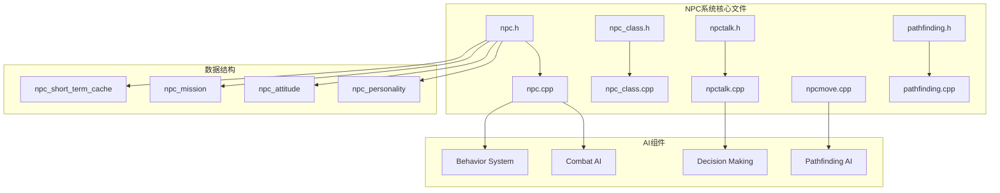
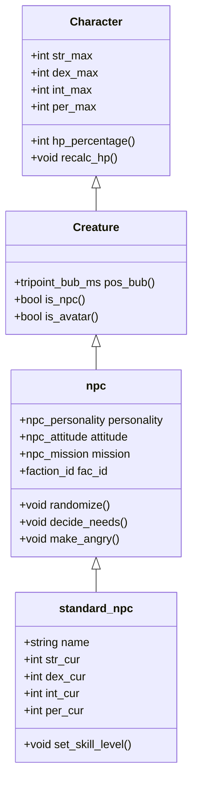
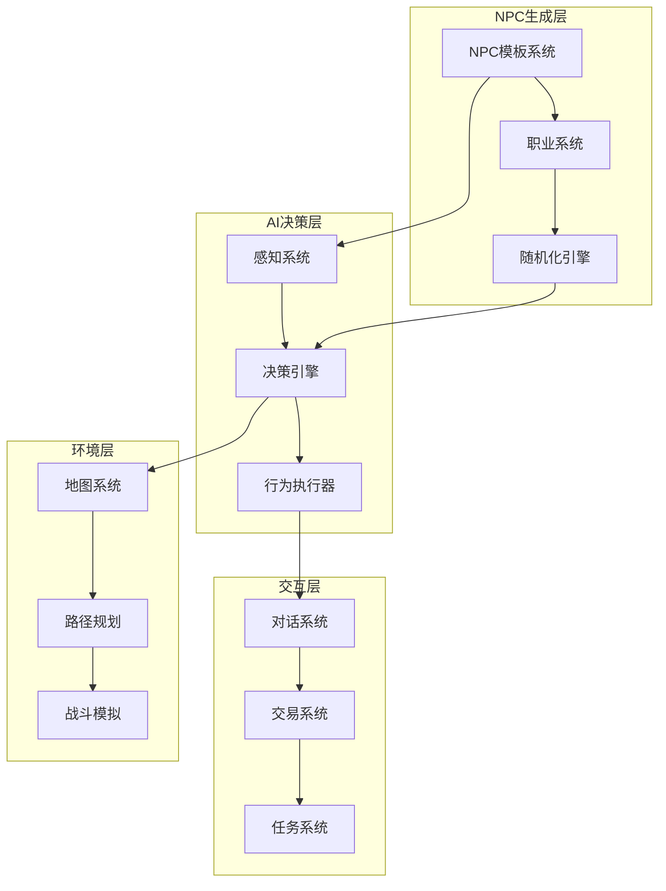
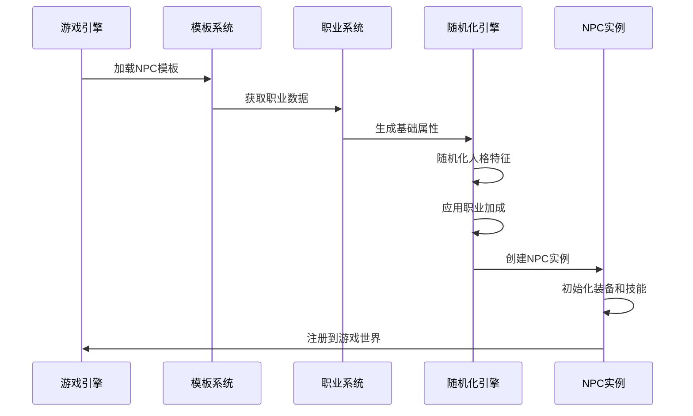
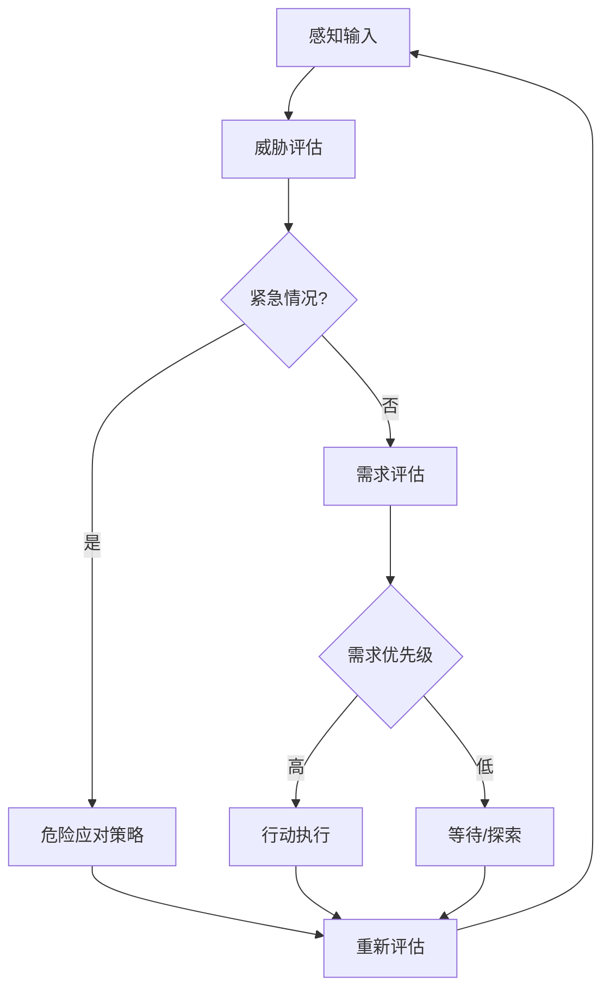
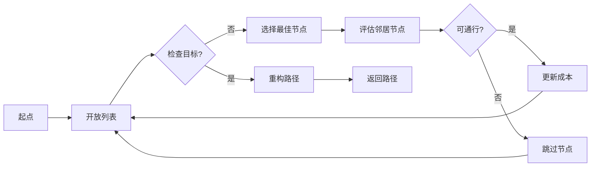
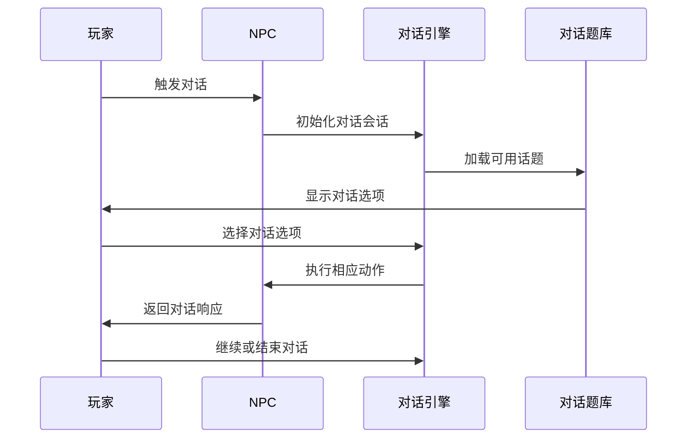
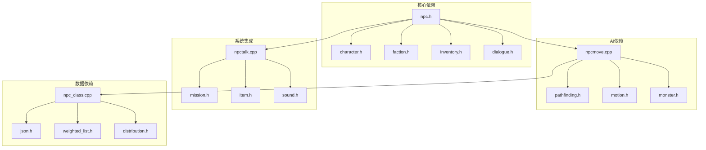

# NPC系统设计

<cite>
**本文档引用的文件**
- npc.h
- npc.cpp
- npc_class.h
- npc_class.cpp
- npctalk.h
- npctalk.cpp
- npcmove.cpp
- pathfinding.h
- pathfinding.cpp
</cite>

## 目录
1. [简介](#简介)
2. [项目结构](#项目结构)
3. [核心组件](#核心组件)
4. [架构概览](#架构概览)
5. [详细组件分析](#详细组件分析)
6. [依赖关系分析](#依赖关系分析)
7. [性能考虑](#性能考虑)
8. [故障排除指南](#故障排除指南)
9. [结论](#结论)

## 简介

Cataclysm-DDA中的NPC（非玩家角色）系统是一个复杂的AI驱动的模拟系统，负责管理游戏世界中所有非玩家角色的行为、决策和交互。该系统涵盖了从基础的角色生成到高级的AI决策、寻路算法、战斗行为以及与玩家的复杂交互。

NPC系统的核心目标是为玩家提供丰富、动态且具有挑战性的游戏体验，通过智能的角色行为和真实的社交互动来增强游戏的沉浸感。

## 项目结构

NPC系统主要分布在以下核心文件中：

**图表来源**
- npc.h
- npc.cpp
- npc_class.h
- npc_class.cpp

**章节来源**
- npc.h
- npc.cpp

## 核心组件

### NPC类层次结构

NPC系统基于一个继承自Character基类的完整层次结构：

**图表来源**
- npc.h
- npc.cpp

### 人格特征系统

NPC的人格由四个核心维度组成，每个维度范围在-10到10之间：

| 人格维度 | 描述 | 影响 |
|---------|------|------|
| Aggression | 攻击性 | 决定攻击倾向和战斗决策 |
| Bravery | 勇气 | 影响危险评估和逃跑行为 |
| Collector | 收集欲 | 驱动物品收集和交易行为 |
| Altruism | 利他主义 | 影响帮助他人和团队合作 |

**章节来源**
- npc.h
- npc.cpp

## 架构概览

NPC系统的整体架构采用模块化设计，各个组件职责明确且相互协作：

**图表来源**
- npc.h
- npc_class.h

## 详细组件分析

### NPC生成与随机化机制

NPC的生成过程是一个多阶段的随机化过程，确保每个NPC的独特性和平衡性：

**图表来源**
- npc.cpp
- npc_class.cpp

#### 随机化算法特点

1. **属性生成**：使用骰子函数生成基础属性值
2. **人格随机化**：独立随机化四个核心人格维度
3. **职业加成**：根据职业类型应用特定的属性加成
4. **技能训练**：基于时间影响进行技能追赶训练

**章节来源**
- npc.cpp

### AI决策系统

NPC的AI决策系统基于实时感知和情境评估：

**图表来源**
- npc.cpp
- npcmove.cpp

#### 危险评估机制

NPC使用多维度的危险评估系统：

| 评估因素 | 权重 | 计算方法 |
|---------|------|----------|
| 敌人威胁 | 40% | 武器价值 × 生命值百分比 |
| 自身健康 | 25% | 伤害修正和止血效果 |
| 地形优势 | 20% | 防御工事和掩护 |
| 团队支持 | 15% | 友军距离和火力支援 |

**章节来源**
- npcmove.cpp

### 寻路算法实现

NPC的寻路系统基于A*算法的改进版本，专门优化了游戏场景的需求：

**图表来源**
- pathfinding.cpp
- pathfinding.h

#### 寻路优化特性

1. **多层级寻路**：支持楼梯、坡道和垂直移动
2. **动态避障**：实时检测和避开移动障碍物
3. **成本计算**：综合考虑地形、障碍物和敌人的威胁
4. **路径平滑**：优化路径减少不必要的转向

**章节来源**
- pathfinding.cpp

### 对话与交互系统

NPC的对话系统提供了丰富的交互体验：

**图表来源**
- npctalk.cpp

#### 对话系统功能

1. **话题管理**：动态加载和管理可用对话主题
2. **情感状态**：根据NPC的个性和历史交互调整态度
3. **条件触发**：基于任务状态和玩家行为触发特定对话
4. **结果反馈**：对话选择影响NPC的后续行为和关系

**章节来源**
- npctalk.h

### 职业系统设计

NPC职业系统提供了多样化的角色类型和行为模式：

| 职业类别 | 特征 | 行为模式 | 装备配置 |
|---------|------|----------|----------|
| 普通市民 | 随机生成 | 基本生存行为 | 基础日常用品 |
| 商人 | 交易导向 | 守护商店位置 | 商业装备和武器 |
| 武士 | 战斗专家 | 主动攻击敌人 | 各种武器和防具 |
| 法师 | 魔法使用者 | 施法和远程攻击 | 魔法道具和法杖 |

**章节来源**
- npc_class.h
- npc_class.cpp

## 依赖关系分析

**图表来源**
- npc.h
- npcmove.cpp
- npctalk.cpp

### 关键依赖关系

1. **继承关系**：NPC完全继承Character的所有功能
2. **组合关系**：NPC组合使用多个子系统（对话、战斗、寻路）
3. **工厂模式**：使用工厂类管理NPC的创建和配置
4. **事件驱动**：通过事件总线实现组件间的松耦合通信

**章节来源**
- npc.h

## 性能考虑

### 内存管理优化

NPC系统采用了多种内存管理策略来确保性能：

1. **对象池**：复用频繁创建的对象实例
2. **延迟初始化**：按需创建昂贵的计算缓存
3. **弱引用**：避免循环引用和内存泄漏
4. **批量操作**：合并相似的更新操作

### 计算优化

1. **缓存机制**：大量使用LRU缓存存储昂贵的计算结果
2. **增量更新**：只在必要时重新计算AI状态
3. **简化算法**：在保证准确性的前提下使用简化的数学模型
4. **并行处理**：利用多核CPU并行处理独立的NPC计算

## 故障排除指南

### 常见问题诊断

1. **NPC不响应**：检查AI缓存是否正确更新
2. **寻路异常**：验证路径规划设置和地图数据
3. **对话错误**：确认话题ID和条件检查逻辑
4. **性能问题**：分析内存使用和计算密集度

### 调试工具

1. **日志系统**：详细的调试日志输出AI决策过程
2. **可视化工具**：显示NPC的感知范围和决策树
3. **性能分析器**：监控CPU和内存使用情况
4. **状态检查器**：验证NPC的内部状态一致性

**章节来源**
- npc.cpp

## 结论

Cataclysm-DDA的NPC系统展现了现代游戏AI设计的复杂性和完整性。通过精心设计的模块化架构、智能的决策算法和丰富的交互机制，该系统为玩家提供了深度而真实的游戏体验。

系统的主要优势包括：

1. **高度可定制性**：通过模板和职业系统支持无限的角色变体
2. **智能行为模式**：基于现实心理学原理的行为决策
3. **优化的性能表现**：高效的算法和内存管理确保流畅的游戏体验
4. **丰富的交互内容**：多层次的对话和任务系统增强沉浸感

未来的发展方向可能包括更先进的机器学习算法、更精细的物理模拟以及更好的多人协作支持。这个NPC系统为Cataclysm-DDA的成功奠定了坚实的基础，也为其他游戏项目的AI开发提供了宝贵的参考。