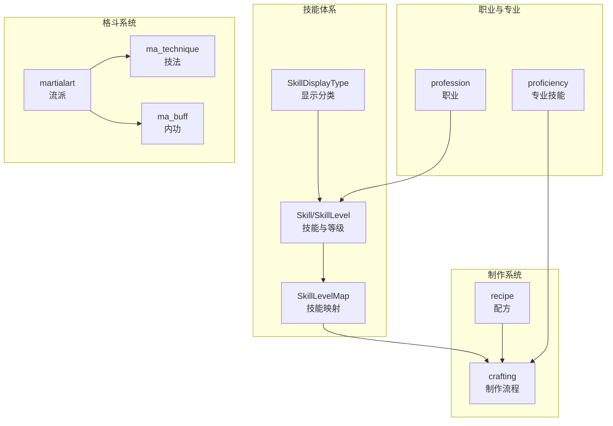
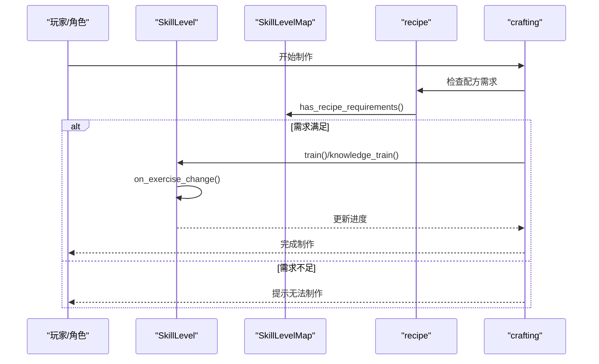
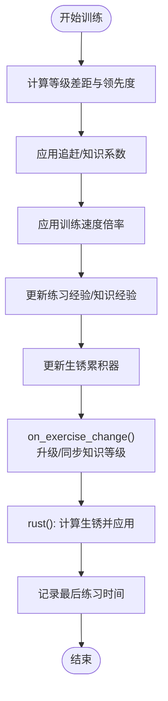
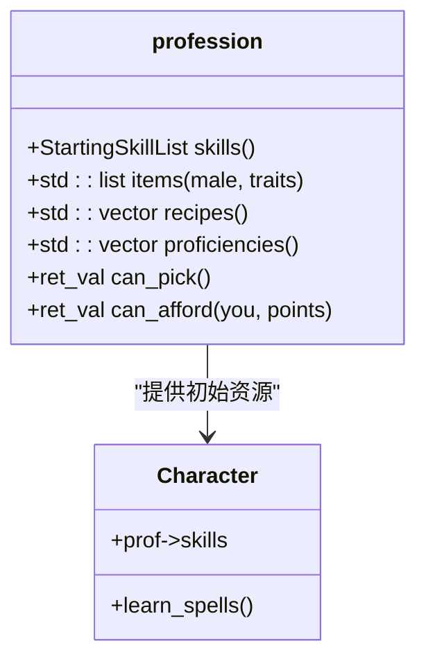
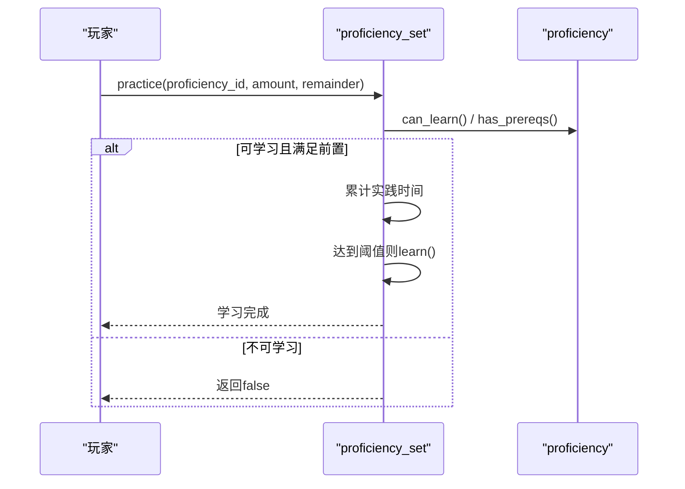
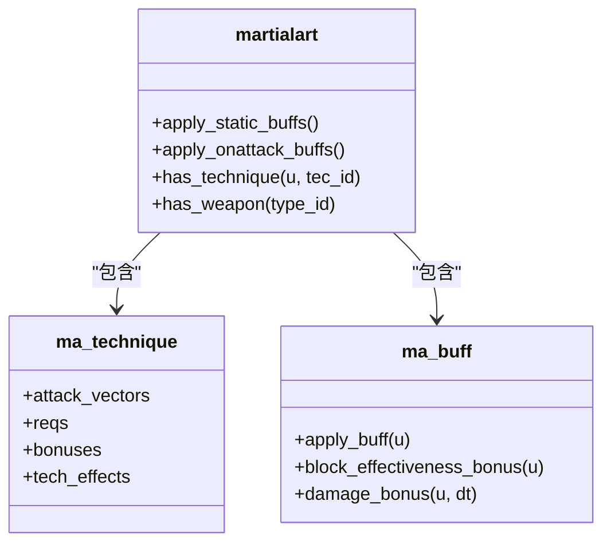
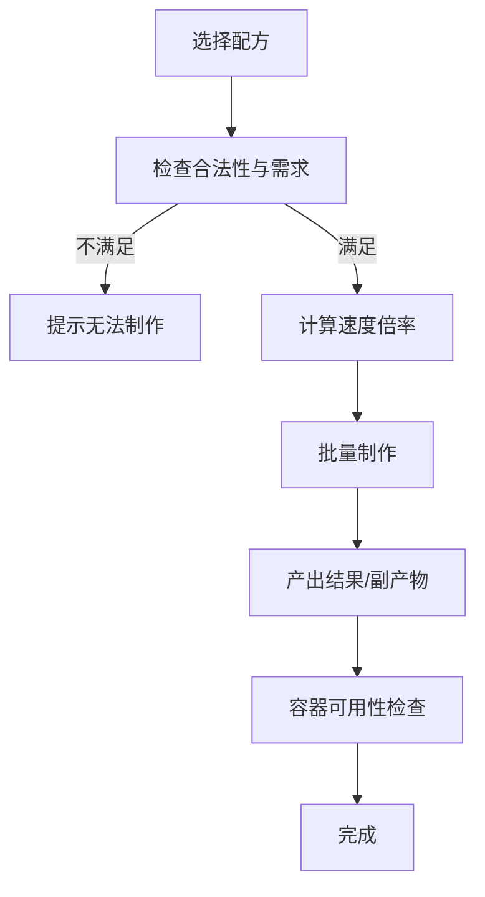
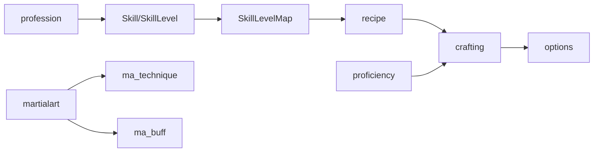

# 技能与经验系统

<cite>
**本文档引用的文件**
- skill.h
- skill.cpp
- profession.h
- profession.cpp
- martialarts.h
- martialarts.cpp
- proficiency.h
- proficiency.cpp
- crafting.h
- crafting.cpp
- recipe.h
- recipe.cpp
- character.h
- character.cpp
- game_constants.h
- options.h
- options.cpp
</cite>

## 目录
1. [简介](#简介)
2. [项目结构](#项目结构)
3. [核心组件](#核心组件)
4. [架构总览](#架构总览)
5. [详细组件分析](#详细组件分析)
6. [依赖关系分析](#依赖关系分析)
7. [性能考虑](#性能考虑)
8. [故障排除指南](#故障排除指南)
9. [结论](#结论)

## 简介
本文件系统性梳理Cataclysm-DDA中的技能与经验系统，覆盖技能树设计理念、学习机制、经验值获取与等级提升算法、角色专业技能（Proficiency）、职业特性（Profession）与特殊技能（Martial Arts）实现、制作配方系统（Recipe）与材料需求处理、技能加点与自动学习/强制训练功能，以及技能与物品使用、战斗技巧、生存技能的关联机制。文档以代码为依据，结合图示帮助不同技术背景的读者理解系统。

## 项目结构
技能与经验系统主要由以下模块构成：
- 技能定义与等级管理：Skill、SkillLevel、SkillLevelMap、SkillDisplayType
- 职业系统：profession 及其起始技能、物品、CBM、专长等
- 专业技能（Proficiency）：学习时间、前置要求、属性加成
- 格斗流派（Martial Arts）：技法、内功、武器限制、条件触发
- 制作系统（Crafting/Recipe）：配方需求、材料消耗、工具使用、环境影响
- 角色与全局常量：Character、游戏常量、选项系统

**图表来源**
- skill.h
- skill.cpp
- profession.h
- proficiency.h
- martialarts.h
- crafting.h

**章节来源**
- skill.h
- skill.cpp
- profession.h
- profession.cpp
- martialarts.h
- martialarts.cpp
- proficiency.h
- proficiency.cpp
- crafting.h
- crafting.cpp

## 核心组件
- 技能（Skill）：描述技能名称、描述、标签、显示类型、排序权重、时间参数、同伴实践权重等；支持理论/实践等级描述、战斗技能判定、上下文技能判定。
- 技能等级（SkillLevel）：包含等级、练习经验、知识经验、生锈累积器、最后练习时间；提供训练、知识训练、生锈、读书、进度计算等方法。
- 技能映射（SkillLevelMap）：封装技能字典，提供查询、比较、配方需求检查、进度计算等。
- 显示类型（SkillDisplayType）：用于UI分组显示。
- 职业（profession）：包含起始技能、物品、CBM、专长、配方、流派、任务等；支持检查定义、是否可解锁、是否黑名单等。
- 专业技能（proficiency）：学习时间、前置要求、类别加成、可否教学、忽略专注等；提供学习集合（proficiency_set）进行实践、学习、移除、统计。
- 格斗系统（martialart/ma_technique/ma_buff）：技法、内功、武器类别、攻击向量、条件触发、效果等。
- 制作系统（crafting/recipe）：配方需求、材料过滤、工具/工作台、环境影响、批量制作、容器选择等。

**章节来源**
- skill.h
- skill.cpp
- profession.h
- profession.cpp
- proficiency.h
- proficiency.cpp
- martialarts.h
- crafting.h

## 架构总览
技能与经验系统围绕“技能等级”和“学习/训练”两条主线构建：
- 经验值（Exercise/Knowledge Experience）通过训练、知识训练、读书等方式增长，达到升级阈值后提升等级。
- 生锈（Rust）机制防止长期不练习导致能力退化，受等级、时间、抗性等因素影响。
- 配方系统（Recipe）与技能/专业技能联动，决定能否制作及制作速度。
- 职业与格斗系统提供额外的起始加成、学习路径与战斗增益。

**图表来源**
- crafting.cpp
- skill.cpp
- skill.cpp
- skill.cpp

**章节来源**
- crafting.cpp
- skill.cpp
- skill.cpp
- skill.cpp

## 详细组件分析

### 技能树与等级系统
- 设计理念
  - 将“实践经验（Exercise）”与“理论知识（Knowledge Experience）”分离，避免理论领先过多导致学习效率问题。
  - 引入“生锈（Rust）”机制，鼓励定期练习维持技能。
  - 支持上下文技能（如特定物品使用的技能），在映射中禁止直接赋值。
- 数据结构与复杂度
  - SkillLevelMap 使用 map<skill_id, SkillLevel> 存储，查询/修改为 O(log N)。
  - 训练与升级在 on_exercise_change 中统一处理，单次调用复杂度近似 O(1)（循环次数与等级差有关但通常很小）。
- 关键算法
  - 训练：根据“追赶系数”和“知识系数”动态调整，考虑等级差距与理论领先度，上限受训练速度倍率与等级上限约束。
  - 知识训练：基于“理论领先度”降低速率，避免理论与实践脱节。
  - 生锈：按时间与等级累积，受抗性与倍率影响，等级越高门槛越高。
  - 进度计算：练习进度 = 练习经验 / (100 * (等级+1)^2)，理论进度 = 知识经验 / (100 * (知识等级+1)^2)。

**图表来源**
- skill.cpp
- skill.cpp
- skill.cpp
- skill.cpp

**章节来源**
- skill.h
- skill.cpp

### 职业系统（Profession）
- 起始资源：职业提供起始金钱、物品组、CBM、专长、配方、流派、任务等；支持性别差异与NPC背景。
- 技能加成：起始技能列表（StartingSkills）在角色创建时生效。
- 检查与验证：加载时校验物品、CBM、专长、宠物、任务等定义有效性。
- 解锁机制：可通过成就或选项控制是否启用元进度解锁。

**图表来源**
- profession.h
- profession.cpp
- character.h

**章节来源**
- profession.h
- profession.cpp
- profession.cpp

### 专业技能系统（Proficiency）
- 学习机制：通过“实践时间”累计，达到 time_to_learn 后自动学习；支持递归学习前置专业技能。
- 奖励与惩罚：默认时间倍率、技能惩罚、弱点加成/惩罚；可从书籍获得时间/失败减免。
- 属性加成：按类别累加专业技能带来的属性加成。
- 交互窗口：提供可视化界面展示已知/学习中的专业技能及其进度。

**图表来源**
- proficiency.cpp
- proficiency.cpp
- proficiency.cpp

**章节来源**
- proficiency.h
- proficiency.cpp

### 格斗系统（Martial Arts）
- 流派（martialart）：定义优先级、主技能、学习难度、可否教学、阻断/闪避/内功等。
- 技法（ma_technique）：描述攻击向量、条件、效果、AOE、重复次数等。
- 内功（ma_buff）：提供命中、闪避、伤害、护甲等加成，支持持续叠加与栈数。
- 条件与武器：技法/内功可绑定角色状态、武器类别、最小技能等条件。

**图表来源**
- martialarts.h
- martialarts.cpp

**章节来源**
- martialarts.h
- martialarts.cpp

### 制作配方系统（Recipe/Crafting）
- 配方需求：技能难度、所需技能等级、必需/可选材料、工具/工作台、环境标志（如黑暗、无手等）。
- 材料与工具：支持材料过滤、起始仅需少量材料（start_only）、工具耐久消耗。
- 制作流程：检查合法性、容器可用性、批量制作、结果掉落/放置、失败处理。
- 速度影响：光照、工作台、心情、疼痛、魔法附魔、肢体状况、专业技能时间倍率等综合影响。

**图表来源**
- crafting.cpp
- crafting.cpp
- crafting.cpp
- crafting.cpp

**章节来源**
- crafting.h
- crafting.cpp
- crafting.cpp
- crafting.cpp

### 技能与物品使用、战斗技巧、生存技能的关联
- 技能与攻击时间：每个技能可配置“最小攻击时间”、“基础时间”和“每级减少时间”，用于计算攻击耗时。
- 格斗与技能：技法/内功可要求最小技能等级、武器类别、角色状态等；流派可提供块/闪/命中等加成。
- 生存与制作：制作速度受光照、心情、肢体状况、疼痛、工作台、魔法附魔等影响；配方可设置“盲人友好/困难”标志。

**章节来源**
- skill.h
- martialarts.cpp
- crafting.cpp

## 依赖关系分析
- SkillLevelMap 依赖 Skill、recipe、item 的上下文技能解析，用于配方需求检查与进度计算。
- crafting 依赖 recipe、proficiency、SkillLevelMap、Character 状态（光照、心情、工作台、疼痛等）。
- profession 与 martialart 通过字符串ID相互引用，最终在加载阶段完成解析与校验。
- 选项系统（options）提供训练速度倍率（SKILL_TRAINING_SPEED、PROFICIENCY_TRAINING_SPEED）影响学习/训练效率。

**图表来源**
- skill.cpp
- crafting.cpp
- options.h

**章节来源**
- skill.cpp
- crafting.cpp
- options.cpp

## 性能考虑
- 技能等级更新：on_exercise_change 在单次训练中最多执行一次升级循环，复杂度近似 O(1)。
- 配方需求检查：SkillLevelMap::has_recipe_requirements 对每个需求项进行一次查询，整体 O(K)（K为需求数量）。
- 专业技能学习：实践累计采用浮点余数累积，避免频繁取整误差；learn/remove 支持递归处理前置。
- 制作速度计算：多因子相乘，建议缓存常用因子（如工作台倍率）以减少重复计算。

## 故障排除指南
- 训练无效或溢出：当传入负值或内部溢出时会记录调试信息，检查训练入口与倍率设置。
- 上下文技能赋值：上下文技能不可直接赋值，需通过物品上下文解析后查询。
- 配方无法制作：检查技能等级、理论等级、专业技能、材料与工具、环境标志（如BLIND标志）。
- 生锈过快：确认角色抗性、时间间隔与等级倍率；适当练习可重置最后练习时间。
- 职业定义错误：检查物品/CBM/专长/宠物/任务等定义是否存在，必要时修正JSON。

**章节来源**
- skill.cpp
- skill.cpp
- crafting.cpp
- profession.cpp

## 结论
Cataclysm-DDA的技能与经验系统通过“实践经验+理论知识”的双轨设计、严格的生锈机制与多维度的制作/格斗影响因素，构建了深度而平衡的角色成长体验。职业与专业技能提供了多样化的起始路径，配方系统将技能、工具与环境紧密结合，形成可探索、可优化的策略空间。通过合理利用训练速度倍率、定期练习与选择合适的流派/专业技能，玩家可在末世世界中建立强大的生存与战斗体系。