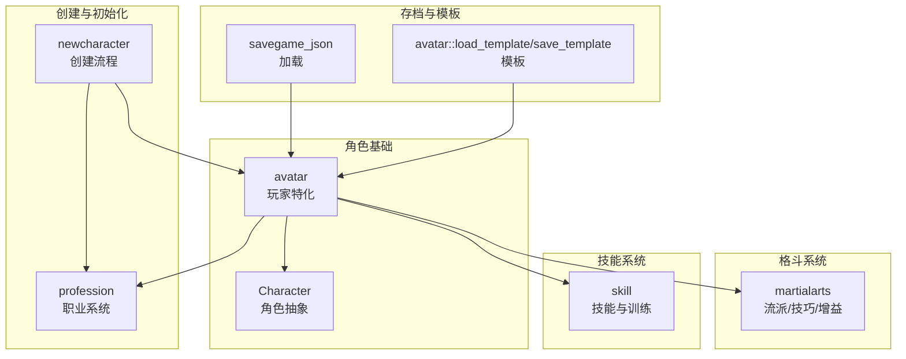
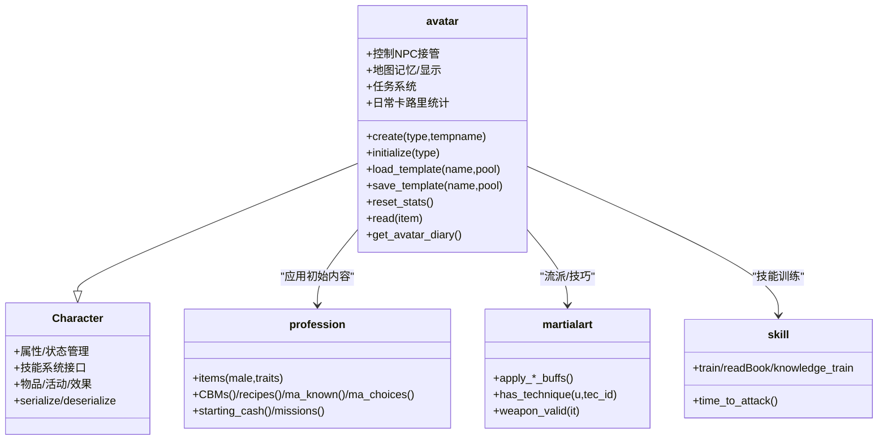
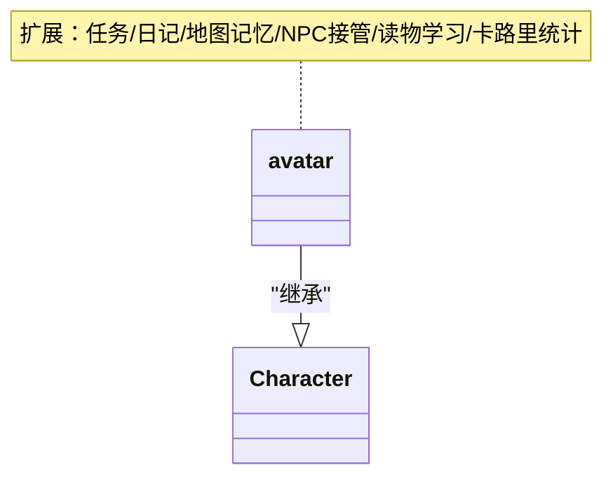
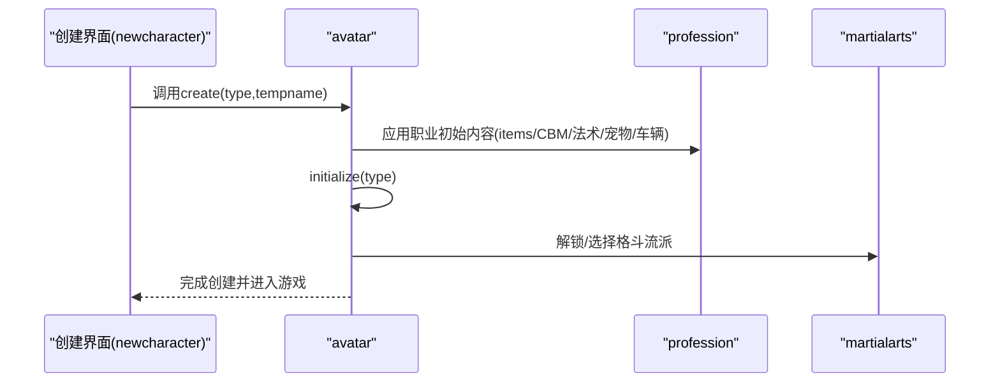
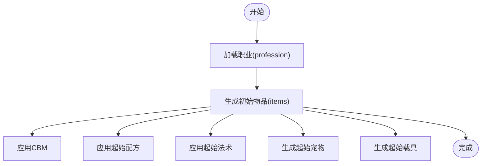
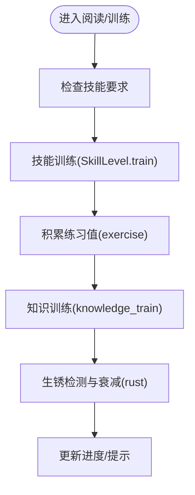
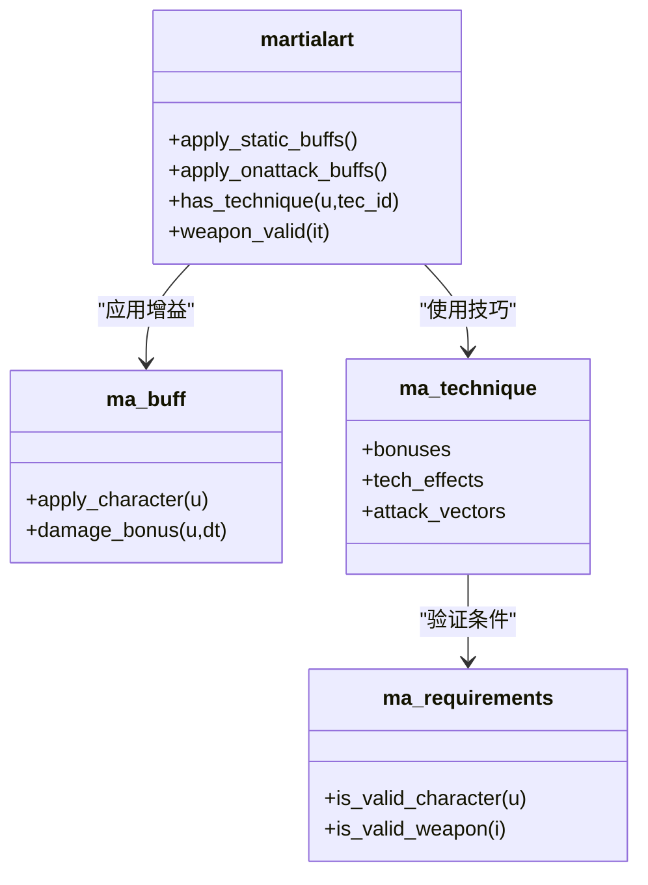
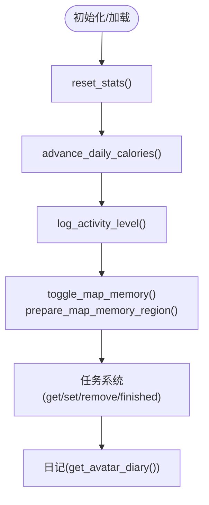
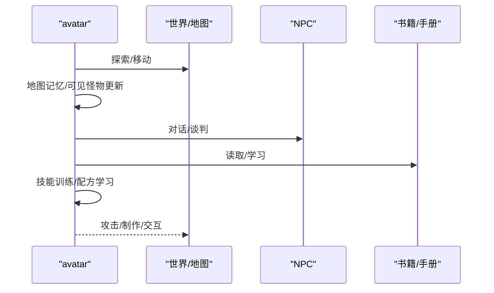
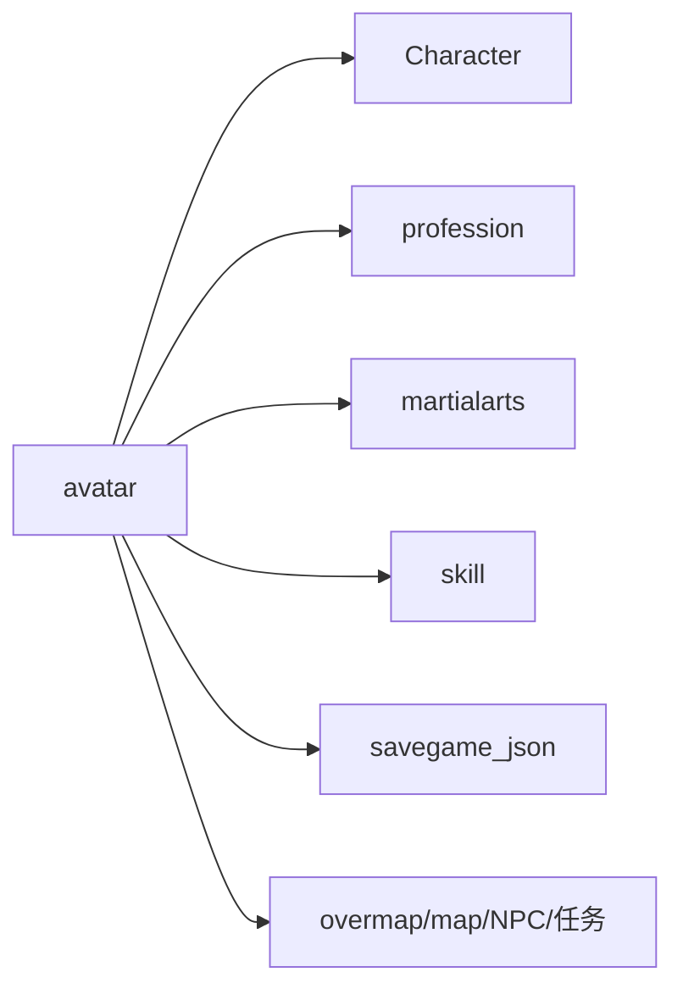

# 玩家角色管理

<cite>
**本文引用的文件**
- avatar.h
- avatar.cpp
- newcharacter.cpp
- profession.h
- profession.cpp
- martialarts.h
- martialarts.cpp
- character.h
- skill.h
- savegame_json.cpp
- gamemode_tutorial.cpp
</cite>

## 目录
1. [简介](#简介)
2. [项目结构](#项目结构)
3. [核心组件](#核心组件)
4. [架构总览](#架构总览)
5. [详细组件分析](#详细组件分析)
6. [依赖关系分析](#依赖关系分析)
7. [性能考量](#性能考量)
8. [故障排除指南](#故障排除指南)
9. [结论](#结论)

## 简介
本文件系统性梳理Cataclysm-DDA中“玩家角色管理”子系统，围绕Avatar类与Character基类的关系、角色创建与初始化流程、核心属性与状态管理、技能树与经验体系、职业与初始装备、Martial Arts（格斗流派）集成与特殊能力机制，以及与游戏世界的交互（探索、战斗、制作等）进行深入解析。文档兼顾技术深度与可读性，既适合开发者也适合希望理解底层机制的高级用户。

## 项目结构
玩家角色管理涉及以下关键模块：
- 角色基础：Character（角色抽象）、avatar（玩家特化）
- 创建与初始化：newcharacter（角色创建UI与逻辑）、profession（职业系统）
- 格斗系统：martialarts（格斗流派、技巧、增益）
- 技能系统：skill（技能定义与训练）
- 存档与模板：savegame_json（存档加载）、avatar::load_template（模板保存/加载）

**图表来源**
- avatar.h
- character.h
- newcharacter.cpp
- profession.h
- martialarts.h
- skill.h
- savegame_json.cpp

**章节来源**
- avatar.h
- character.h
- newcharacter.cpp
- profession.h
- martialarts.h
- skill.h
- savegame_json.cpp

## 核心组件
- 角色抽象与玩家特化
  - Character提供通用角色能力（属性、技能、物品、活动、状态等）
  - avatar继承自Character，扩展玩家专属功能（任务、日记、地图记忆、NPC接管、读物学习、日常卡路里统计等）
- 职业系统
  - profession定义职业名称、描述、初始物品、CBM、专业技能、起始法术、起始宠物、起始车辆、起始任务等
  - avatar在初始化时应用职业的起始内容
- 格斗系统
  - martialarts定义流派、技巧、攻击向量、需求条件、效果与增益
  - avatar通过职业或特性解锁/选择格斗流派，并在战斗中应用
- 技能系统
  - skill定义技能元数据与训练机制；avatar使用技能进行阅读、制作、战斗等
- 创建与模板
  - newcharacter负责交互式角色创建（点池、场景、职业、背景、属性、特质、技能、描述）
  - avatar支持模板保存/加载，便于快速复用角色

**章节来源**
- avatar.h
- avatar.cpp
- profession.h
- martialarts.h
- skill.h
- newcharacter.cpp

## 架构总览
Avatar作为玩家角色的核心，承担以下职责：
- 角色创建与初始化：调用newcharacter流程，应用profession与场景设定
- 属性与状态管理：重置统计、处理疲劳/饥饿/口渴/睡眠等状态
- 技能与经验：基于技能系统进行训练与知识积累
- 职业与初始装备：从profession加载初始物品、CBM、起始法术、起始宠物与车辆
- 格斗系统集成：根据职业/特性解锁/选择格斗流派，应用技巧与增益
- 世界交互：任务系统、日记、地图记忆、NPC接管、读物学习、日常卡路里统计

**图表来源**
- avatar.h
- avatar.cpp
- profession.h
- martialarts.h
- skill.h

**章节来源**
- avatar.h
- avatar.cpp
- profession.h
- martialarts.h
- skill.h

## 详细组件分析

### 组件A：Avatar类与Character的关系
- 继承关系：avatar继承自Character，获得通用角色能力后扩展玩家专属功能
- 玩家标识：is_avatar返回true，便于系统区分玩家与其他角色
- 初始化：avatar::initialize调用Character::initialize并应用profession的起始内容（包括格斗流派）
- 状态重置：avatar::reset_stats在进入新游戏或加载存档后重置统计与临时效果缓存

**图表来源**
- avatar.h
- avatar.cpp

**章节来源**
- avatar.h
- avatar.cpp

### 组件B：角色创建与初始化流程
- 创建入口：avatar::create(type,tempname)负责交互式角色创建
- 流程要点：
  - 设置默认职业与场景
  - 交互式界面（点池、场景、职业、背景、属性、特质、技能、描述）
  - 随机化模式：随机场景/随机姓名/完全随机
  - 应用profession的初始物品、CBM、起始法术、起始宠物与车辆
  - 初始化avatar：avatar::initialize应用profession的起始格斗流派与选择项
- 模板：avatar::save_template与avatar::load_template支持角色模板保存/加载

**图表来源**
- newcharacter.cpp
- avatar.cpp
- profession.h
- martialarts.h

**章节来源**
- newcharacter.cpp
- avatar.cpp
- profession.h
- martialarts.h

### 组件C：职业系统与初始装备配置
- 职业定义：profession包含名称/描述、初始物品组、CBM、专业技能、起始法术、起始宠物、起始车辆、起始任务等
- 初始物品：profession::items按性别与特性生成初始物品列表，支持替换与合并
- 起始内容应用：avatar::initialize在创建后应用profession的ma_known/ma_choices等

**图表来源**
- profession.h
- profession.cpp
- avatar.cpp

**章节来源**
- profession.h
- profession.cpp
- avatar.cpp

### 组件D：技能树系统与经验计算
- 技能定义：skill提供技能元数据（名称、描述、标签、显示类型、时间信息等）
- 训练机制：SkillLevel提供训练、练习、知识训练、生锈与rust累积等
- 经验公式：newcharacter中存在累计经验计算函数，用于等级与经验换算
- 使用场景：avatar::read在阅读书籍时结合技能进行训练与进度记录

**图表来源**
- skill.h
- newcharacter.cpp
- avatar.cpp

**章节来源**
- skill.h
- newcharacter.cpp
- avatar.cpp

### 组件E：Martial Arts系统集成与特殊能力
- 格斗流派：martialart定义流派、技巧、攻击向量、需求条件、静态/动态增益与EOC
- 条件验证：ma_requirements校验是否满足武器类别、技能等级、角色标志、武器标志等
- 应用时机：avatar在初始化时应用profession的起始流派；战斗中根据当前流派与技巧生效
- 特殊能力：通过ma_buff与ma_technique为角色提供命中、闪避、伤害、护甲穿透等加成

**图表来源**
- martialarts.h
- martialarts.cpp

**章节来源**
- martialarts.h
- martialarts.cpp

### 组件F：状态管理与日常统计
- 状态重置：avatar::reset_stats在进入新游戏或加载存档后重置统计与临时效果
- 日常卡路里：avatar::daily_calories记录每日摄入/消耗/获得，支持日志与活动水平记录
- 地图记忆：avatar提供地图记忆的开启/关闭、区域准备、地形/装饰记忆与符号记忆
- 任务系统：avatar维护活跃/完成/失败任务列表，支持设置/移除/完成回调

**图表来源**
- avatar.cpp
- avatar.h
- avatar.cpp
- avatar.cpp
- avatar.cpp

**章节来源**
- avatar.cpp
- avatar.h
- avatar.cpp
- avatar.cpp
- avatar.cpp

### 组件G：与游戏世界的交互
- 探索：地图记忆与可见怪物信息（monster_visible_info），支持安全模式与指南针方向
- 战斗：格斗系统与技巧应用，结合技能与装备进行攻击/防御
- 制作：profession提供起始配方，avatar::read可学习制作配方
- 对话与交易：avatar提供对话/谈判接口，支持NPC互动
- 读物学习：avatar::read支持书籍/手册的单次/持续学习，结合技能与同伴参与

**图表来源**
- avatar.h
- avatar.cpp
- avatar.cpp

**章节来源**
- avatar.h
- avatar.cpp
- avatar.cpp

## 依赖关系分析
- Avatar依赖
  - Character：通用角色能力
  - profession：职业初始内容
  - martialarts：格斗流派与技巧
  - skill：技能训练与经验
  - savegame_json：存档加载
- 创建流程耦合
  - newcharacter与avatar紧密耦合，newcharacter负责交互与点池/场景/职业选择，avatar负责应用与初始化
- 外部依赖
  - 游戏世界（overmap、地图、NPC、任务系统）通过avatar进行交互

**图表来源**
- avatar.h
- avatar.cpp
- newcharacter.cpp
- savegame_json.cpp

**章节来源**
- avatar.h
- avatar.cpp
- newcharacter.cpp
- savegame_json.cpp

## 性能考量
- 地图记忆缓存：avatar的地图记忆功能通过player_map_memory管理，避免重复计算；建议在大范围探索时合理使用prepare_map_memory_region以减少内存压力
- 技能训练批处理：批量训练/练习应考虑时间步进与生锈衰减，避免频繁小步训练导致效率低下
- 格斗系统判定：ma_requirements的条件检查在战斗中频繁触发，建议保持条件集合最小化与缓存常用结果
- 存档序列化：avatar的序列化/反序列化涉及大量数据（物品、任务、日记、卡路里日志），建议在存档前清理冗余数据

## 故障排除指南
- 角色创建异常
  - 检查profession定义是否有效（profession::check_definition），确保物品/法术/技能/宠物等ID正确
  - 确认newcharacter的点池/场景/职业选择逻辑未越界
- 格斗流派不可用
  - 检查ma_requirements的武器类别/技能等级/角色标志是否满足
  - 确认martialart::weapon_valid与允许的武器/类别一致
- 技能训练无效
  - 检查SkillLevel的训练参数与生锈衰减逻辑
  - 确认avatar::read的书籍/手册是否正确绑定技能
- 存档加载失败
  - 检查savegame_json::avatar::load中profession与hobbies的兼容性
  - 确认模板版本与当前定义的兼容性

**章节来源**
- profession.cpp
- martialarts.cpp
- avatar.cpp
- savegame_json.cpp

## 结论
Avatar作为Cataclysm-DDA玩家角色管理的核心，通过与Character、profession、martialarts、skill等模块的协同，实现了从角色创建到日常状态管理、从技能训练到格斗系统集成的完整闭环。其设计强调可扩展性（模板/职业/流派）与可玩性（任务/日记/地图记忆），同时在性能与稳定性方面提供了清晰的边界与优化空间。对于开发者而言，理解Avatar与各子系统的接口契约与数据流转是高效迭代的关键。