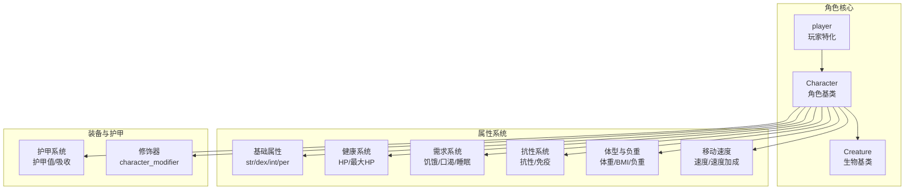
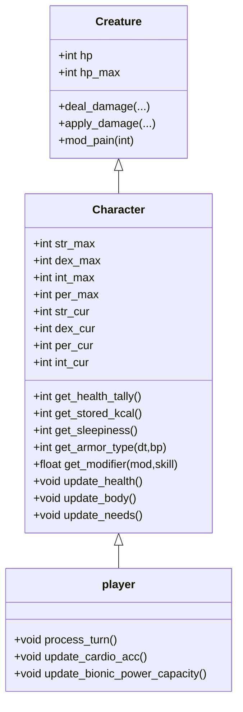
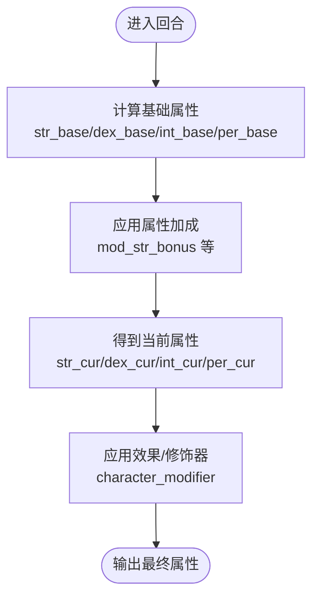
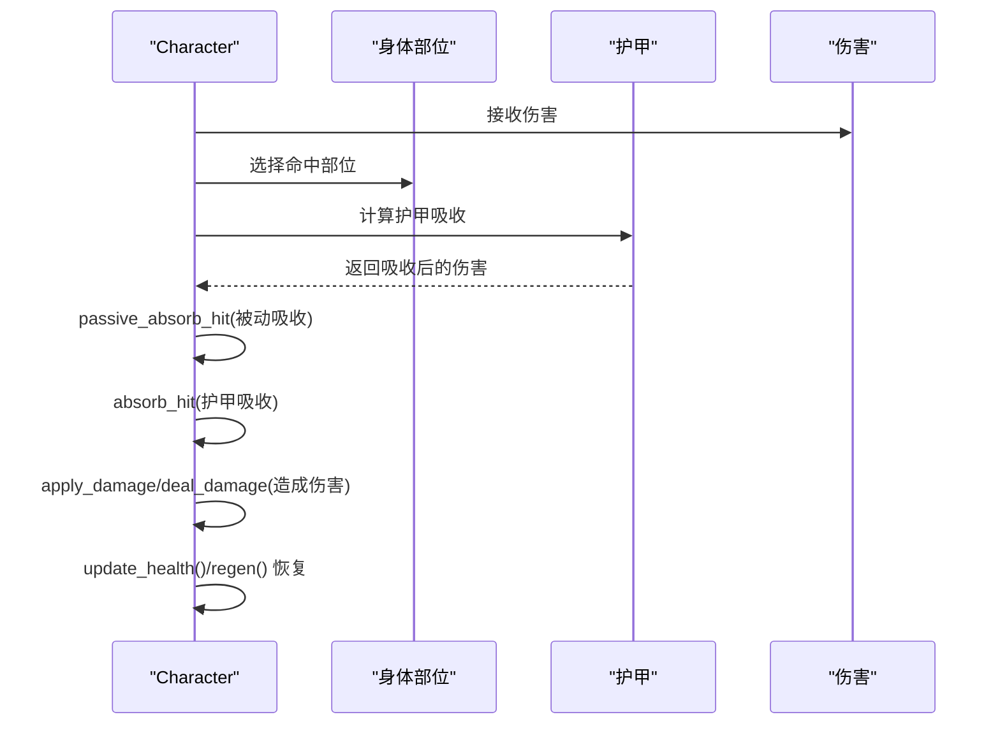
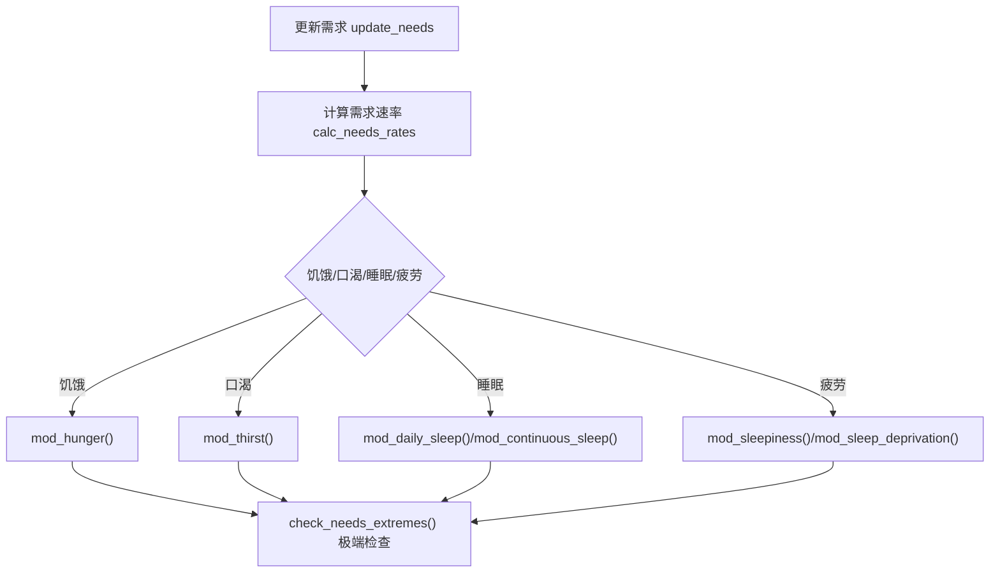
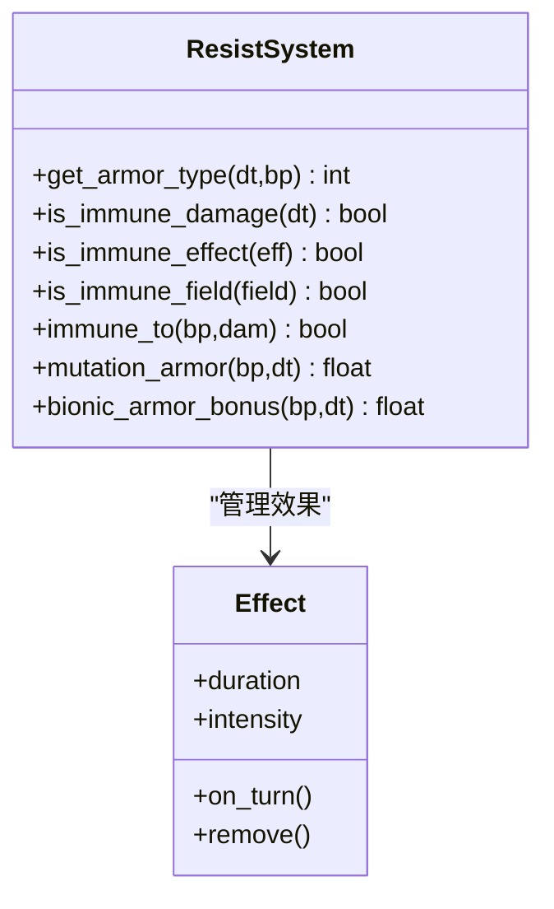
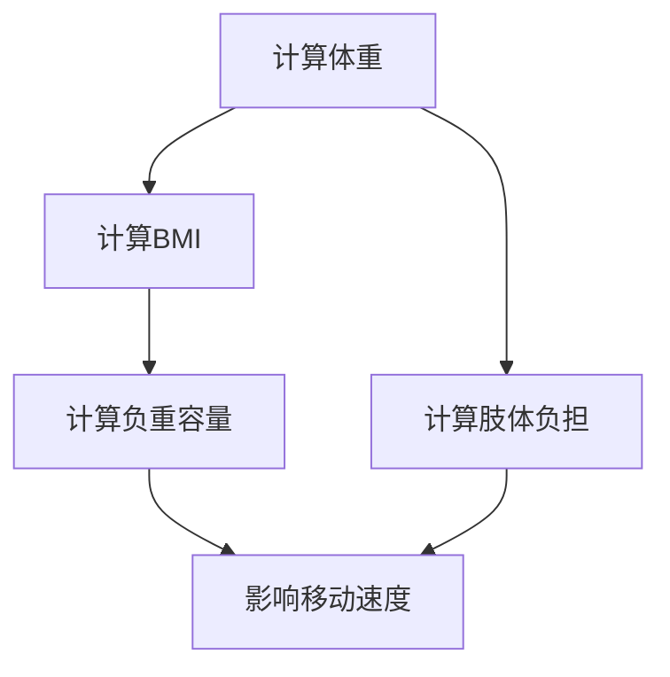
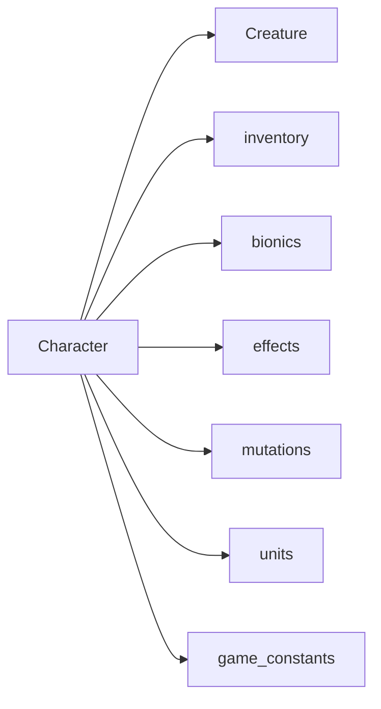

# 角色属性系统

<cite>
**本文档引用的文件**
- character.h
- character.cpp
- player.h
- player.cpp
- creature.h
- game_constants.h
- bodypart.h
- character_armor.cpp
- character_body.cpp
- character_modifier.cpp
- character_morale.cpp
- sleep.h
- sleep.cpp
- stomach.h
- stomach.cpp
- morale.h
- morale.cpp
- effect.h
- effect.cpp
- damage.h
- damage.cpp
- units.h
- units.cpp
</cite>

## 目录
1. [简介](#简介)
2. [项目结构](#项目结构)
3. [核心组件](#核心组件)
4. [架构总览](#架构总览)
5. [详细组件分析](#详细组件分析)
6. [依赖关系分析](#依赖关系分析)
7. [性能考虑](#性能考虑)
8. [故障排除指南](#故障排除指南)
9. [结论](#结论)

## 简介
本文件系统化梳理 Cataclysm-DDA 中的角色属性体系，覆盖基础属性（力量、敏捷、智力、感知）、健康与生命值、疲劳度与饥饿口渴睡眠、抗性与免疫、体型与负重、以及移动速度等关键机制。文档以代码为依据，结合类图与流程图，帮助开发者与模组制作者准确理解属性计算、成长与上限、以及各子系统的交互关系。

## 项目结构
角色属性系统主要由以下模块构成：
- 角色基类与接口：Character、Creature
- 属性与统计：基础属性、当前属性、属性加成、属性上限
- 健康与生命值：最大生命值、当前生命值、恢复与伤害吸收
- 需求与生理：饥饿、口渴、睡眠、疲劳、代谢
- 抗性与免疫：对伤害类型的抗性、免疫、环境抗性
- 体型与负重：体重、BMI、负重容量、移动速度
- 摩擦与装备：护甲、护甲吸收、被动护甲、生物义体护甲

图表来源
- character.h
- creature.h
- player.h

章节来源
- character.h
- creature.h

## 核心组件
- 角色基类 Character：集中管理属性、健康、需求、抗性、移动、战斗与技能等。提供大量 getter/setter 与计算函数，如 get_str/get_dex/get_int/get_per、get_health_tally、get_stored_kcal、get_sleepiness、get_armor_type 等。
- 生物基类 Creature：提供基础生命值、伤害处理、效果管理等通用能力，Character 继承自 Creature 并扩展角色专属逻辑。
- 玩家特化 player：在 Character 基础上实现玩家行为，包括活动、物品交互、学习与熟练度等。

章节来源
- character.h
- creature.h

## 架构总览
角色属性系统采用“继承 + 装饰器”模式：
- 继承：Player 继承 Character，Character 继承 Creature，形成统一的生物-角色层次。
- 装饰器：通过 character_modifier、effect、bionics、mutations、items 等对角色进行动态修饰，影响属性、抗性、速度等。

图表来源
- creature.h
- character.h
- player.h

## 详细组件分析

### 基础属性系统（力量、敏捷、智力、感知）
- 定义与范围
  - 四项基础属性枚举 character_stat，初始默认值与最小/最大范围在头文件中定义。
  - 当前属性与基础属性分离，分别对应 str_cur/str_base、dex_cur/dex_base 等。
- 计算与加成
  - 提供 get_str/get_dex/get_int/get_per 及其基础与加成版本。
  - 属性加成通过 mod_str_bonus/mod_dex_bonus 等方法累积，最终影响命中、闪避、伤害、挖掘、游泳等。
- 成长与上限
  - 属性上限受基础值与加成共同决定；存在上限保护，避免无节制增长。
  - 通过 practice 技能与某些机制可间接提升属性点数分配。

图表来源
- character.h
- character_modifier.cpp

章节来源
- character.h
- character.h

### 健康与生命值系统
- 最大生命值与当前生命值
  - recalc_hp 重新计算最大生命值，受力量、体质、健康状态、脂肪转换等因素影响。
  - get_fat_to_hp 将多余体脂转化为额外最大生命值。
- 伤害吸收与护甲
  - absorb_hit 与 armor_absorb 处理护甲吸收与耐久损耗。
  - passive_absorb_hit 处理被动吸收（不乘法修正）。
  - get_armor_type 返回某部位对特定伤害类型的护甲值。
- 治疗与恢复
  - healing_rate/healing_rate_medicine 计算静息与药物辅助下的恢复速率。
  - regen 主动恢复与疼痛衰减。

图表来源
- character.h
- character_armor.cpp

章节来源
- character.h
- character.h
- character_armor.cpp

### 疲劳度、饥饿、口渴与睡眠系统
- 存储能量与饥饿
  - get_stored_kcal/get_healthy_kcal 记录卡路里存储与健康阈值。
  - mod_stored_kcal 与 mod_hunger 控制能量摄入与消耗。
- 口渴与即时口渴
  - get_thirst/get_instant_thirst 提供口渴与即时口渴等级。
  - mod_thirst 控制口渴变化。
- 睡眠与疲劳
  - get_sleepiness/get_sleep_deprivation 提供清醒度与剥夺度。
  - get_daily_sleep/get_continuous_sleep 管理日均与连续睡眠。
  - mod_daily_sleep/mod_continuous_sleep 管理睡眠统计。
- 代谢与活动水平
  - metabolic_rate_base/metabolic_rate 计算稳定与实时代谢率。
  - activity_level_str/set_activity_level 影响代谢与体重。

图表来源
- character.h
- character.h
- sleep.h
- sleep.cpp
- stomach.h
- stomach.cpp

章节来源
- character.h
- character.h
- sleep.h
- sleep.cpp
- stomach.h
- stomach.cpp

### 抗性系统、免疫机制与负面效果
- 抗性与免疫
  - get_armor_type 返回对伤害类型的护甲值。
  - is_immune_damage/is_immune_effect/is_immune_field 提供伤害/效果/场特效免疫判定。
  - immune_to 判断特定部位对特定伤害是否免疫。
- 被动护甲与生物义体护甲
  - mutation_armor 提供基于突变的护甲加成。
  - bionic_armor_bonus 提供生物义体护甲加成。
- 负面效果与治疗
  - effect 系统管理持续效果，支持叠加、衰减与移除。
  - reduce_healing_effect 减弱治疗强度。

图表来源
- character.h
- character.h
- effect.h
- effect.cpp

章节来源
- character.h
- character.h
- effect.h

### 体型分类、体重与负重
- 体型与尺寸
  - get_size/recalculate_size 基于体重与身高计算体型类别。
- 体重与 BMI
  - bodyweight/bodyweight_lean/bodyweight_fat 分别返回总体重、瘦体重、脂肪体重。
  - get_bmi/get_bmi_fat/get_bmi_lean 计算 BMI 及其分量。
- 负重与容量
  - weight_carried/volume_carried 计算携带重量与体积。
  - weight_capacity/volume_capacity 计算负重与容量上限。
  - encumb(avg_encumb_of_limb_type) 计算肢体负担。

图表来源
- character.h
- character.h
- character.h
- character.h

章节来源
- character.h
- character.h
- character.h

### 移动速度与速度加成
- 速度计算
  - get_speed 返回当前速度，受属性、负重、状态、修饰器等影响。
  - recalc_speed_bonus 重新计算速度加成。
- 速度修饰器
  - mod_speed_bonus 与 speed_bonus_effects 提供速度加成/惩罚的描述性记录。
- 运动模式
  - is_running/is_walking/is_crouching/is_prone 控制运动模式，影响速度与消耗。

章节来源
- character.h
- character.h
- character.h

## 依赖关系分析
- 组件耦合
  - Character 对 Creature 的继承提供了统一的生物接口；对 inventory、bionics、effects、mutations 的组合使用实现了高可扩展性。
- 外部依赖
  - units.h/units.cpp 提供质量、体积、能量等单位换算。
  - game_constants.h 定义游戏常量（如最大/最小属性值、代谢常数等）。
- 循环依赖
  - 通过前置声明与 pimpl 模式降低循环依赖风险。

图表来源
- character.h
- units.h
- game_constants.h

章节来源
- character.h
- units.h
- game_constants.h

## 性能考虑
- 缓存与惰性计算
  - vision_mode_cache、cached_organic_size、cached_dead_state 等缓存减少重复计算。
- 批量更新
  - update_body/update_needs 以回合为单位批量处理，避免逐帧高频计算。
- 修饰器与效果
  - 通过 character_modifier 与 effect 系统按需计算，避免全局扫描。

## 故障排除指南
- 属性异常
  - 检查属性加成链：mod_str_bonus/mod_dex_bonus 是否被正确调用与清零。
  - 使用 reset_bonuses/reset_stats 清理异常状态。
- 健康异常
  - 确认 recalc_hp 是否被调用；检查 fat_to_hp 与健康阈值。
  - 使用 heal/apply_damage 的调用顺序是否正确。
- 需求异常
  - 检查 update_needs 的调用频率与参数；确认 calc_needs_rates 的结果。
- 护甲异常
  - 确认 armor_absorb 与 passive_absorb_hit 的调用顺序；检查装备耐久与替换逻辑。

章节来源
- character.h
- character.h
- character.h

## 结论
Cataclysm-DDA 的角色属性系统以 Character 为核心，通过继承 Creature 实现通用生物能力，再以修饰器、效果、装备、突变与生物义体实现高度可塑的属性与能力扩展。系统在计算上强调缓存与批量更新，在交互上提供丰富的 getter/setter 与事件回调，便于模组扩展与平衡调整。建议在扩展新属性或机制时遵循现有缓存与批量更新模式，确保性能与一致性。