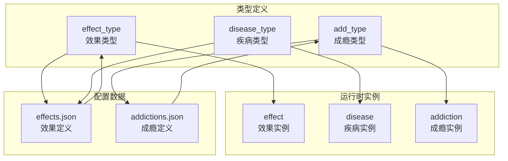
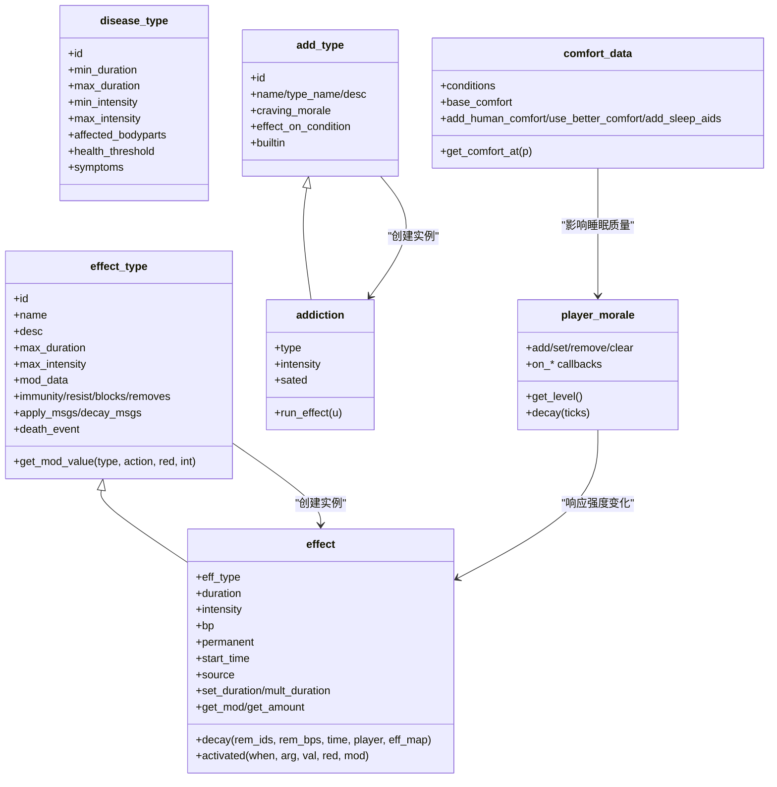
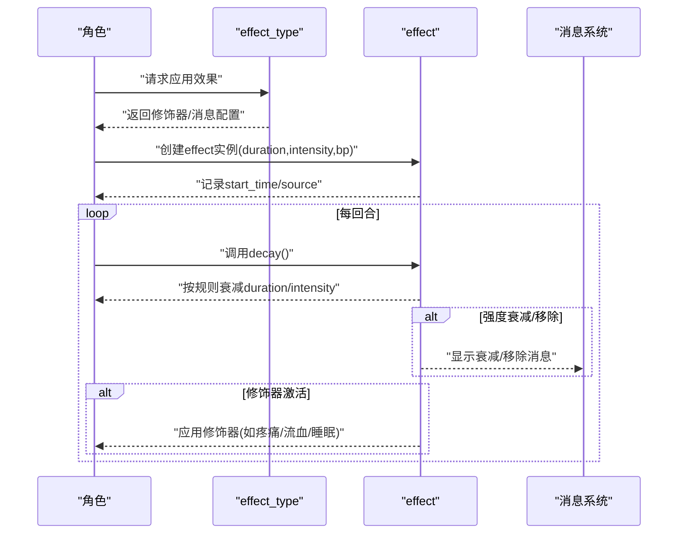
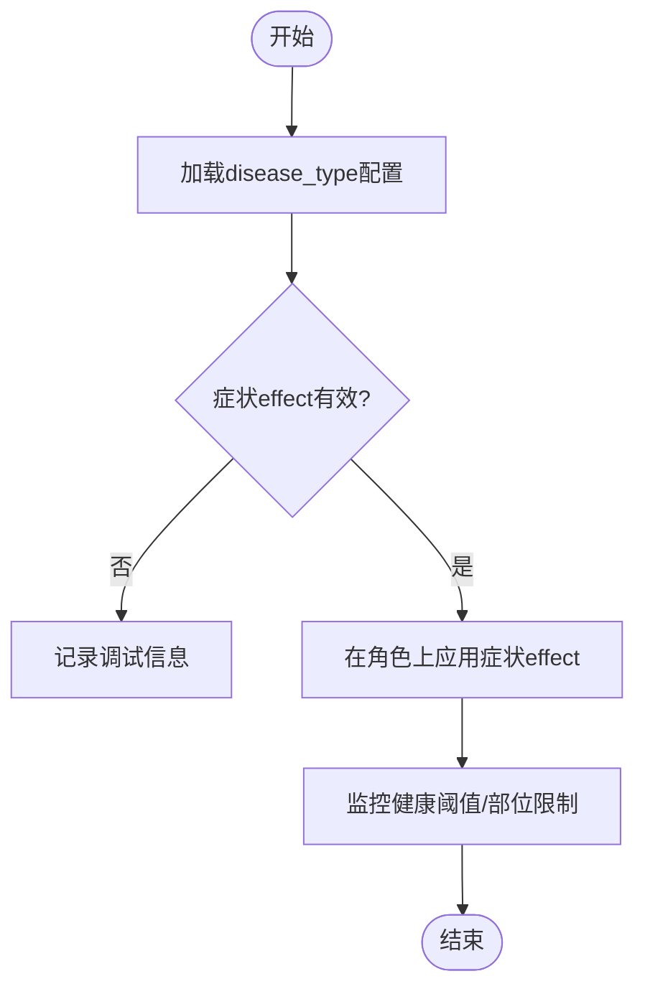
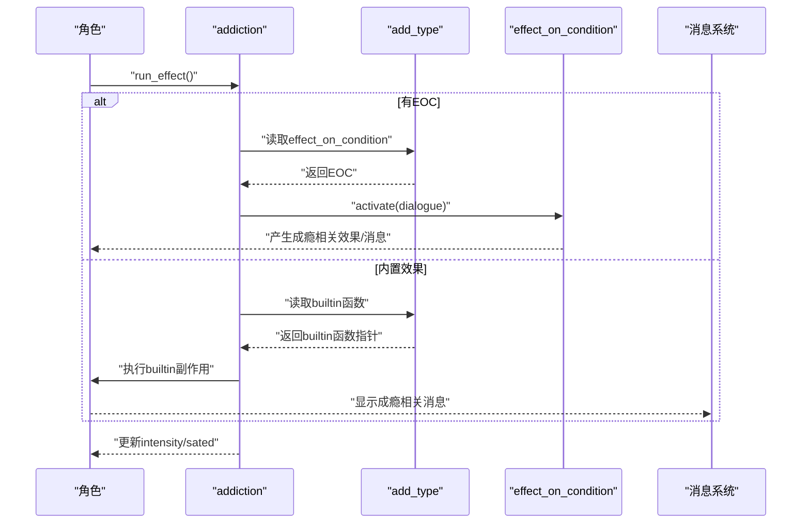
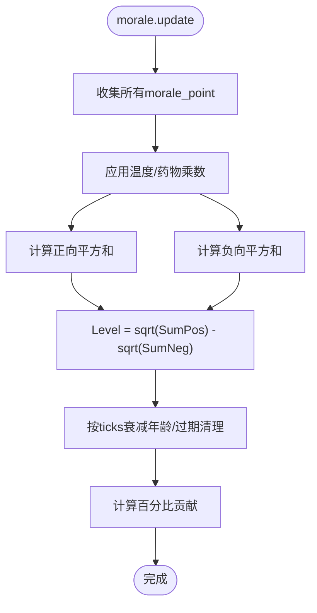
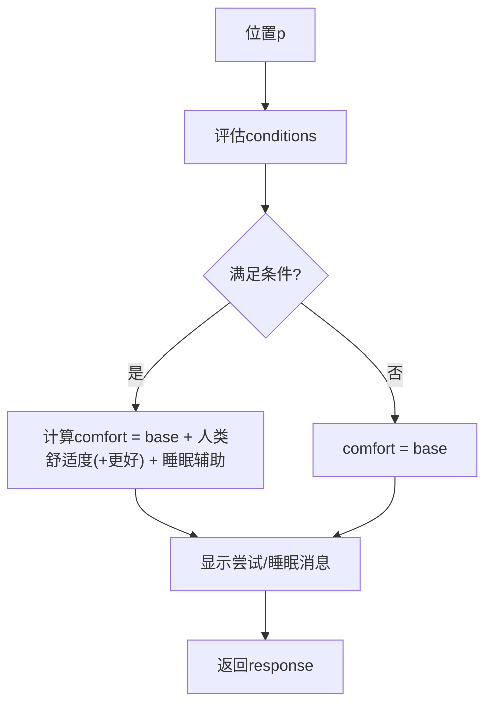
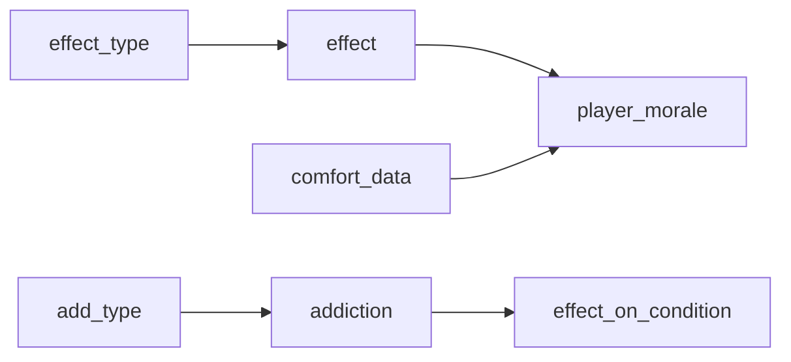

# 角色状态与效果

<cite>
**本文引用的文件**
- effect.h
- effect.cpp
- disease.h
- disease.cpp
- addiction.h
- addiction.cpp
- morale.h
- morale.cpp
- sleep.h
- sleep.cpp
- effects.json
- addictions.json
</cite>

## 目录
1. [简介](#简介)
2. [项目结构](#项目结构)
3. [核心组件](#核心组件)
4. [架构总览](#架构总览)
5. [详细组件分析](#详细组件分析)
6. [依赖关系分析](#依赖关系分析)
7. [性能考量](#性能考量)
8. [故障排查指南](#故障排查指南)
9. [结论](#结论)

## 简介
本文件系统性梳理Cataclysm-DDA中“角色状态与效果”体系，覆盖以下主题：
- 正面与负面状态效果的统一建模与管理
- 中毒、疾病、药物与魔法效果的实现原理
- 成瘾系统、耐受性与戒断症状
- 情绪系统（morale）与心情变化、社交影响
- 疲劳恢复、睡眠质量与休息效果的计算
- 特殊状态（昏迷、眩晕、麻痹等）的触发与持续

目标是帮助开发者与模组制作者准确把握状态效果的数据结构、生命周期、触发条件与交互关系。

## 项目结构
围绕“角色状态与效果”的核心代码位于src目录下，数据定义位于data/json目录下的effects.json与addictions.json。整体采用“类型定义 + 运行时实例 + JSON配置”的分层设计：
- 类型层：effect_type、disease_type、add_type等，负责描述效果/疾病/成瘾的属性与行为
- 实例层：effect、disease、addiction等，负责在角色身上存续与更新
- 配置层：effects.json、addictions.json等，定义具体效果与成瘾条目

图表来源
- effect.h
- disease.h
- addiction.h
- effects.json
- addictions.json

章节来源
- effect.h
- effect.cpp
- disease.h
- disease.cpp
- addiction.h
- addiction.cpp
- morale.h
- morale.cpp
- sleep.h
- sleep.cpp
- effects.json
- addictions.json

## 核心组件
- 效果类型与实例
  - effect_type：描述效果的名称、描述、强度、持续时间、修饰器、免疫/移除/阻断列表、消息与死亡事件等
  - effect：在角色身上的具体实例，包含持续时间、强度、部位、永久性标记、起始时间、来源等
- 疾病类型与实例
  - disease_type：描述疾病的最小/最大持续时间、强度、受影响部位、健康阈值、症状效果等
  - disease：运行时的疾病实例（当前源码中未见独立disease类，通常以effect承载症状）
- 成瘾类型与实例
  - add_type：描述成瘾的名称、类型名、描述、渴求情绪、内置效果或条件触发效果
  - addiction：运行时的成瘾实例，包含强度、饱腹时间、每次更新的效果
- 情绪系统（morale）
  - player_morale：情绪点集合，支持正负叠加、衰减、百分比贡献、永久情绪等
- 睡眠与舒适度
  - comfort_data：睡眠舒适度评估，结合地形/家具/陷阱/场/载具/角色特征/特性等条件

章节来源
- effect.h
- effect.cpp
- disease.h
- disease.cpp
- addiction.h
- addiction.cpp
- morale.h
- morale.cpp
- sleep.h
- sleep.cpp

## 架构总览
角色状态与效果系统由“类型工厂 + 实例容器 + 生命周期管理 + 事件/消息系统”构成。类型通过JSON加载到全局工厂，运行时以effect/disease/addiction等实例形式附着于角色；每回合进行衰减、触发与消息输出；同时与情绪、睡眠、伤害等子系统交互。

图表来源
- effect.h
- effect.cpp
- disease.h
- addiction.h
- morale.h
- sleep.h

## 详细组件分析

### 效果系统：effect_type 与 effect
- 类型定义
  - 名称/描述、强度与持续时间上限、强度衰减策略、修饰器（stats/pain/hurt/sleep/pkill/stim/health/rad/hunger/thirst/perspiration/sleepiness/stamina/blood_pressure/heart_rate/respiratory_rate/cough/vomit/healing等）
  - 免疫/抗性/移除/阻断其他效果
  - 应用/衰减/缺失消息、血液检查描述、死亡事件
- 实例管理
  - 持续时间衰减、强度变化、永久性暂停/恢复
  - 修饰器查询、触发概率估算、按部位生效
  - 维生素吸收/速率相关修饰
- JSON映射
  - effects.json中大量条目定义了效果类型，包括中毒、疾病症状、药物/魔法效果等

图表来源
- effect.h
- effect.cpp
- effects.json

章节来源
- effect.h
- effect.cpp
- effects.json

### 疾病系统：disease_type
- 定义要点
  - 最小/最大持续时间、强度范围
  - 受影响身体部位集合、健康阈值（高于阈值免疫）
  - 症状效果（以effect_type id表示）
- 加载与校验
  - 通过工厂加载，校验症状effect是否有效

图表来源
- disease.cpp

章节来源
- disease.h
- disease.cpp

### 成瘾系统：add_type 与 addiction
- 成瘾类型
  - name/type_name/description、渴求情绪、effect_on_condition或builtin函数
- 成瘾实例
  - intensity、sated（饱腹时间）、run_effect(u)驱动每回合效果
- 内置效果
  - 针对不同成瘾类型的内置副作用：如酒精/地西泮、可卡因/古柯碱、安非他明、阿片类、尼古丁等
  - 常见表现：认知/感知/敏捷下降、睡眠困难、震颤、幻觉、呕吐、耐受上升、戒断症状

图表来源
- addiction.h
- addiction.cpp
- addictions.json

章节来源
- addiction.h
- addiction.cpp
- addictions.json

### 情绪系统：player_morale
- 结构
  - 多个morale_point，每个含类型、物品绑定、基础奖励、持续时间、衰减起点、年龄
  - 支持永久情绪与临时情绪，按温度（乐观/脾气暴躁/麻木）与药物（Prozac）进行乘数修正
- 计算
  - 总正/负平方和开方得到总体情绪等级
  - 百分比贡献用于UI展示
- 回调
  - 对状态变化（如获得/失去特性、穿戴脱下物品、效果强度变化）进行响应

图表来源
- morale.cpp

章节来源
- morale.h
- morale.cpp

### 睡眠与舒适度：comfort_data
- 条件组合
  - terrain/furniture/trap/field/vehicle/character/trait等类别，支持flag/id/active/invert等判定
  - conditions_or控制AND/OR逻辑
- 舒适度计算
  - base_comfort为基础值，可叠加人类舒适度、更好舒适度选择、睡眠辅助物品
- 行为反馈
  - 尝试睡眠/实际睡眠的消息提示

图表来源
- sleep.cpp

章节来源
- sleep.h
- sleep.cpp

## 依赖关系分析
- effect_type与effect：类型决定实例行为，实例持有运行时状态
- add_type与addiction：类型决定副作用来源（EOC或builtin），实例驱动每回合更新
- player_morale与effect：当effect强度变化时触发回调，影响情绪点
- comfort_data与player_morale：舒适度影响睡眠质量，间接影响疲劳恢复

图表来源
- effect.h
- addiction.h
- morale.h
- sleep.h

章节来源
- effect.h
- addiction.h
- morale.h
- sleep.h

## 性能考量
- effect修饰器查询使用哈希表映射，按类型/动作/抗性级别快速定位数值
- effect衰减与强度变化在每回合遍历，建议避免在同一帧内频繁创建/销毁大量effect
- morale计算采用平方和开方，注意在高频UI刷新场景下的缓存与无效化标记
- comfort_data条件评估涉及地图/载具/陷阱/特性查询，应避免在热路径重复计算

## 故障排查指南
- 效果类型一致性校验
  - effect_type::check_consistency会验证死亡事件字段
- 成瘾类型校验
  - add_type::check_add_types确保effect_on_condition与builtin二选一且合法
- 疾病类型校验
  - disease_type::check_disease_consistency确保症状effect有效
- 常见问题
  - effect::activated触发失败：检查修饰器动作键与抗性级别
  - 成瘾副作用未出现：确认builtin函数存在或EOC已正确加载
  - morale异常：检查温度/药物乘数与永久情绪设置

章节来源
- effect.cpp
- addiction.cpp
- disease.cpp

## 结论
Cataclysm-DDA的角色状态与效果系统以类型-实例分离为核心，配合JSON配置实现高度模块化与可扩展性。效果、疾病、成瘾、情绪与睡眠相互交织，共同塑造角色的生存体验。通过合理利用修饰器、强度/持续时间规则、成瘾耐受与戒断机制，以及舒适度评估，可以构建丰富而平衡的游戏内容。