# 角色系统

<cite>
**本文引用的文件**
- character.h
- character.cpp
- avatar.h
- avatar.cpp
- npc.h
- npc.cpp
- player_difficulty.cpp
- newcharacter.cpp
- profession.h
- profession.cpp
- skill.h
- morale.h
- morale.cpp
- mutation.h
- bionics.h
- inventory.h
- stomach.h
- effect.h
- effect.cpp
- bodypart.h
- bodypart.cpp
- addiction.h
- addiction.cpp
- vitamin.h
- vitamin.cpp
- proficiency.h
- proficiency.cpp
- martialarts.h
- martialarts.cpp
- behavior.h
- behavior.cpp
- npctalk.h
- npctalk.cpp
- trait_group.h
- trait_group.cpp
- scenario.h
- scenario.cpp
- start_location.h
- start_location.cpp
- calendar.h
- calendar.cpp
- game_constants.h
- game.h
- game.cpp
- worldfactory.h
- worldfactory.cpp
- overmap.h
- overmap.cpp
- map.h
- map.cpp
- item.h
- item.cpp
- itype.h
- itype.cpp
- recipe.h
- recipe.cpp
- recipe_dictionary.h
- recipe_dictionary.cpp
- player_activity.h
- player_activity.cpp
- activity_tracker.h
- activity_tracker.cpp
- effect_on_condition.h
- effect_on_condition.cpp
- effect_source.h
- effect_source.cpp
- character_modifier.h
- character_modifier.cpp
- character_attire.h
- character_attire.cpp
- character_armor.h
- character_armor.cpp
- character_body.h
- character_body.cpp
- character_crafting.h
- character_crafting.cpp
- character_guns.h
- character_guns.cpp
- character_martial_arts.h
- character_martial_arts.cpp
- character_modifier.h
- character_modifier.cpp
- character_oracle.h
- character_oracle.cpp
- character_proficiency.h
- character_proficiency.cpp
- character_morale.h
- character_morale.cpp
- character_id.h
- character_id.cpp
- character_inventory.h
- character_inventory.cpp
- character_modifier.h
- character_modifier.cpp
- character_proficiency.h
- character_proficiency.cpp
- character_morale.h
- character_morale.cpp
- character_body.h
- character_body.cpp
- character_armor.h
- character_armor.cpp
- character_attire.h
- character_attire.cpp
- character_crafting.h
- character_crafting.cpp
- character_guns.h
- character_guns.cpp
- character_martial_arts.h
- character_martial_arts.cpp
- character_modifier.h
- character_modifier.cpp
- character_proficiency.h
- character_proficiency.cpp
- character_morale.h
- character_morale.cpp
- character_body.h
- character_body.cpp
- character_armor.h
- character_armor.cpp
- character_attire.h
- character_attire.cpp
- character_crafting.h
- character_crafting.cpp
- character_guns.h
- character_guns.cpp
- character_martial_arts.h
- character_martial_arts.cpp
- character_modifier.h
- character_modifier.cpp
- character_proficiency.h
- character_proficiency.cpp
- character_morale.h
- character_morale.cpp
- character_body.h
- character_body.cpp
- character_armor.h
- character_armor.cpp
- character_attire.h
- character_attire.cpp
- character_crafting.h
- character_crafting.cpp
- character_guns.h
- character_guns.cpp
- character_martial_arts.h
- character_martial_arts.cpp
- character_modifier.h
- character_modifier.cpp
- character_proficiency.h
- character_proficiency.cpp
- character_morale.h
- character_morale.cpp
- character_body.h
- character_body.cpp
- character_armor.h
- character_armor.cpp
- character_attire.h
- character_attire.cpp
- character_crafting.h
- character_crafting.cpp
- character_guns.h
- character_guns.cpp
- character_martial_arts.h
- character_martial_arts.cpp
- character_modifier.h
- character_modifier.cpp
- character_proficiency.h
- character_proficiency.cpp
- character_morale.h
- character_morale.cpp
- character_body.h
- character_body.cpp
- character_armor.h
- character_armor.cpp
- character_attire.h
- character_attire.cpp
- character_crafting.h
- character_crafting.cpp
- character_guns.h
- character_guns.cpp
- character_martial_arts.h
- character_martial_arts.cpp
- character_modifier.h
- character_modifier.cpp
- character_proficiency.h
- character_proficiency.cpp
- character_morale.h
- character_morale.cpp
- character_body.h
- character_body.cpp
- character_armor.h
- character_armor.cpp
- character_attire.h
- character_attire.cpp
- character_crafting.h
- character_crafting.cpp
- character_guns.h
- character_guns.cpp
- character_martial_arts.h
- character_martial_arts.cpp
- character_modifier.h
- character_modifier.cpp
- character_proficiency.h
- character_proficiency.cpp
- character_morale.h
- character_morale.cpp
- character_body.h
</cite>

## 目录
1. [简介](#简介)
2. [项目结构](#项目结构)
3. [核心组件](#核心组件)
4. [架构总览](#架构总览)
5. [详细组件分析](#详细组件分析)
6. [依赖关系分析](#依赖关系分析)
7. [性能考量](#性能考量)
8. [故障排查指南](#故障排查指南)
9. [结论](#结论)
10. [附录](#附录)

## 简介
本文件系统化梳理 Cataclysm-DDA 的角色系统，覆盖玩家角色与 NPC 的统一建模、属性与技能体系、职业与背景、初始装备与习惯、健康与消化系统、疲劳与睡眠、负面效果与成瘾、情绪与社交、变异与义体、以及 AI 行为与交互等模块。文档以代码级事实为基础，配合图示帮助读者快速建立对系统整体与局部实现的理解。

## 项目结构
角色系统由“角色基类 + 玩家特化 + NPC 实现 + 职业/技能/情绪/变异/义体/库存/消化/活动/效果”等子系统构成，并通过统一的时间推进与事件总线进行耦合。

```mermaid
graph TB
subgraph "角色与玩家/NPC"
Char["Character 基类<br/>角色抽象与通用能力"]
Avatar["Avatar 玩家特化<br/>玩家视角与输入"]
NPC["NPC 非玩家角色<br/>AI 与行为"]
end
subgraph "角色数据"
Prof["职业/背景<br/>profession.h/.cpp"]
Sk["技能系统<br/>skill.h"]
Mor["情绪系统<br/>morale.h/.cpp"]
Mut["变异系统<br/>mutation.h"]
Bio["义体系统<br/>bionics.h"]
Inv["库存系统<br/>inventory.h"]
Stomach["消化与营养<br/>stomach.h"]
Eff["效果系统<br/>effect.h/.cpp"]
Add["成瘾系统<br/>addiction.h/.cpp"]
Vit["维生素系统<br/>vitamin.h/.cpp"]
Profic["熟练度系统<br/>proficiency.h/.cpp"]
MA["格斗术系统<br/>martialarts.h/.cpp"]
end
subgraph "世界与时间"
Cal["日历/时间<br/>calendar.h/.cpp"]
Game["游戏主循环<br/>game.h/.cpp"]
World["世界工厂/地图<br/>worldfactory.h/.cpp<br/>overmap.h/.cpp<br/>map.h/.cpp"]
end
subgraph "交互与行为"
Beh["行为策略<br/>behavior.h/.cpp"]
Talk["对话系统<br/>npctalk.h/.cpp"]
Act["活动与挂载<br/>player_activity.h/.cpp<br/>activity_tracker.h/.cpp"]
EO["触发条件<br/>effect_on_condition.h/.cpp"]
Mod["角色修饰器<br/>character_modifier.h/.cpp"]
Body["身体部位/护甲<br/>bodypart.h/.cpp<br/>character_armor.h/.cpp"]
end
Char --> Prof
Char --> Sk
Char --> Mor
Char --> Mut
Char --> Bio
Char --> Inv
Char --> Stomach
Char --> Eff
Char --> Add
Char --> Vit
Char --> Profic
Char --> MA
Avatar --> Beh
Avatar --> Talk
Avatar --> Act
NPC --> Beh
NPC --> Talk
NPC --> Act
Char --> Cal
Avatar --> Game
NPC --> Game
Game --> World
Char --> EO
Char --> Mod
Char --> Body
```

**图表来源**
- character.h
- avatar.h
- npc.h
- profession.h
- skill.h
- morale.h
- mutation.h
- bionics.h
- inventory.h
- stomach.h
- effect.h
- addiction.h
- vitamin.h
- proficiency.h
- martialarts.h
- behavior.h
- npctalk.h
- player_activity.h
- activity_tracker.h
- effect_on_condition.h
- character_modifier.h
- bodypart.h
- calendar.h
- game.h
- worldfactory.h
- overmap.h
- map.h

**章节来源**
- character.h
- avatar.h
- npc.h

## 核心组件
- 角色基类 Character：统一抽象玩家与 NPC 的通用能力（属性、需求、效果、活动、修饰器等），并提供初始化、重置、状态更新等接口。
- 玩家 Avatar：继承自 Character，承载玩家视角、输入处理、难度与社交计算、活动挂载等。
- NPC：继承自 Character，包含 AI 行为、任务优先级、战斗规则、对话与交易、随时间的状态推进等。
- 职业/背景：profession 提供初始技能、物品、CBM、配方、背景 trait 等，支持随机化与 Hobby 兴趣。
- 技能系统：Skill/SkillLevel/SkillLevelMap 管理技能等级、练习、知识、生锈与训练消耗。
- 情绪系统：player_morale 统一正负情绪点、衰减、持久化与可视化。
- 变异系统：mutation.h 定义变异分支、类别、触发、替代、外观与数值影响。
- 义体系统：bionics.h 描述义体数据、安装/激活/升级、兼容与冲突、附带技能与效果。
- 库存系统：inventory.h 提供物品分组、分配/回收库存字母、重量/体积统计、伪工具提供等。
- 消化与营养：stomach.h 定义胃/肠容量、消化速率、卡路里与维生素吸收、口渴/饱腹反馈。
- 效果系统：effect.h/.cpp 管理持续效果、强度、持续时间、衰减与触发条件。
- 成瘾与维生素：addiction.h/.cpp、vitamin.h/.cpp 支持成瘾状态、耐受与戒断、维生素吸收与需求。
- 熟练度与格斗术：proficiency.h/.cpp、martialarts.h/.cpp 管理工具/武器熟练度与格斗流派。
- 行为与对话：behavior.h/.cpp、npctalk.h/.cpp 控制 NPC 行为模式与社交互动。
- 活动与挂载：player_activity.h/.cpp、activity_tracker.h/.cpp 管理玩家/非玩家活动与进度。
- 触发条件：effect_on_condition.h/.cpp 将事件与效果绑定，支持按上下文触发。
- 角色修饰器：character_modifier.h/.cpp 提供移动成本、命中速度、抗性等修饰项。

**章节来源**
- character.h
- character.cpp
- avatar.h
- npc.h
- npc.cpp
- profession.h
- skill.h
- morale.h
- morale.cpp
- mutation.h
- bionics.h
- inventory.h
- stomach.h
- effect.h
- effect.cpp
- addiction.h
- vitamin.h
- proficiency.h
- martialarts.h
- behavior.h
- npctalk.h
- player_activity.h
- activity_tracker.h
- effect_on_condition.h
- character_modifier.h

## 架构总览
角色系统采用“统一基类 + 多态特化 + 数据驱动 + 事件驱动”的架构：
- 统一基类 Character 提供属性、需求、效果、活动、修饰器等通用能力。
- Avatar/NPC 通过多态扩展玩家视角与 AI 行为。
- 职业/技能/情绪/变异/义体/库存/消化/活动/效果等子系统以数据结构与工厂加载，实现可配置与可扩展。
- 时间推进与事件总线贯穿系统，确保状态一致性与时序正确性。

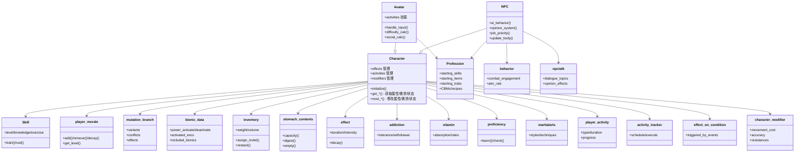

**图表来源**
- character.h
- avatar.h
- npc.h
- profession.h
- skill.h
- morale.h
- mutation.h
- bionics.h
- inventory.h
- stomach.h
- effect.h
- addiction.h
- vitamin.h
- proficiency.h
- martialarts.h
- behavior.h
- npctalk.h
- player_activity.h
- activity_tracker.h
- effect_on_condition.h
- character_modifier.h

## 详细组件分析

### 角色创建与职业/背景/初始装备
- 创建入口与流程：newcharacter.cpp 提供角色创建界面与逻辑，包括性别、姓名、外观、基础属性点分配、职业选择、背景 trait、初始物品与现金、Hobby 兴趣等。
- 职业数据：profession.h/.cpp 定义职业的起始技能、物品组、CBM、配方、格斗术、背景 trait 组、任务列表等；profession_group.json 提供默认背景组。
- 初始装备：profession.json 中的 items 字段支持“both/男性/女性”三档，使用 item_group 进行随机生成；同时支持从 Hobby 中学习配方与获得熟练度。
- 初始化：Character::initialize() 调整嗅觉、武器设置、技能与等级、生物能等；Avatar/NPC 在各自生命周期中完成最终初始化。

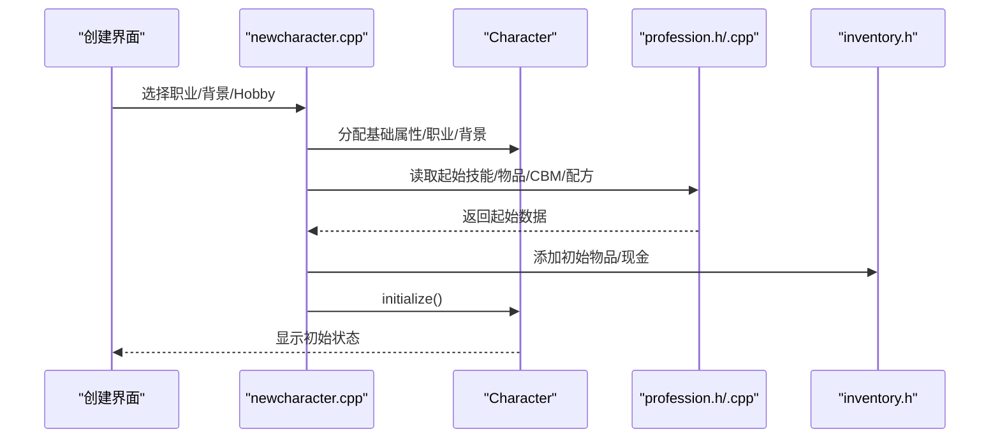

**图表来源**
- newcharacter.cpp
- character.h
- character.cpp
- profession.h
- profession.cpp
- inventory.h

**章节来源**
- newcharacter.cpp
- character.cpp
- profession.h
- profession.cpp
- data/json/professions.json
- data/json/profession_groups.json

### 属性系统与需求管理
- 属性与基础值：Character 提供 str/dex/int/per 的当前值与最大值、bonus、速度、命中修正等；提供 get/set/mod 方法族。
- 需求与状态：存储卡路里、饥饿、口渴、睡眠、疲劳度、睡眠剥夺等；提供 mod_* 与 set_* 接口；与体重/身高/体型相关联。
- 体重与 BMI：通过卡路里与身高/有机尺寸计算，影响力量与上限。
- 体力与恢复：基于日常健康、生活习惯、医学效果、休息质量等综合计算恢复速率。

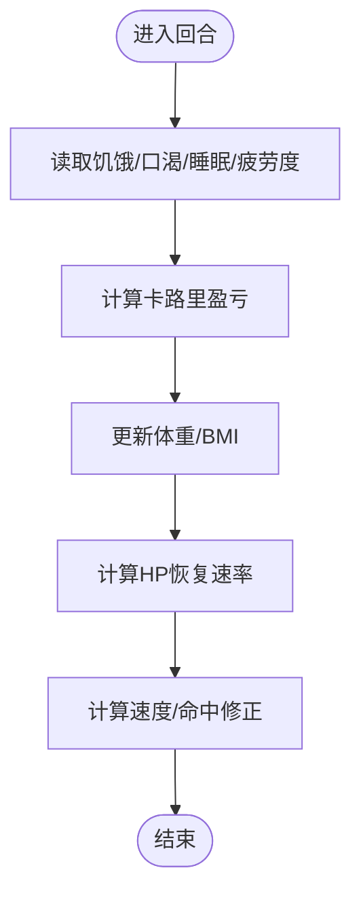

**图表来源**
- character.h
- character.cpp
- character.cpp

**章节来源**
- character.h
- character.cpp

### 技能树与训练机制
- 技能定义：Skill 提供名称、描述、显示类型、攻击时间参数、同伴加成因子等；SkillLevel 管理等级、练习量、知识经验、生锈与训练消耗。
- 训练与生锈：SkillLevel::train()/rust() 控制技能增长与退化；SkillLevelMap 提供需求对比与理论要求评估。
- 练习消耗：消耗专注力（可配置）；不同情境下（如阅读、制作）有额外加成或惩罚。

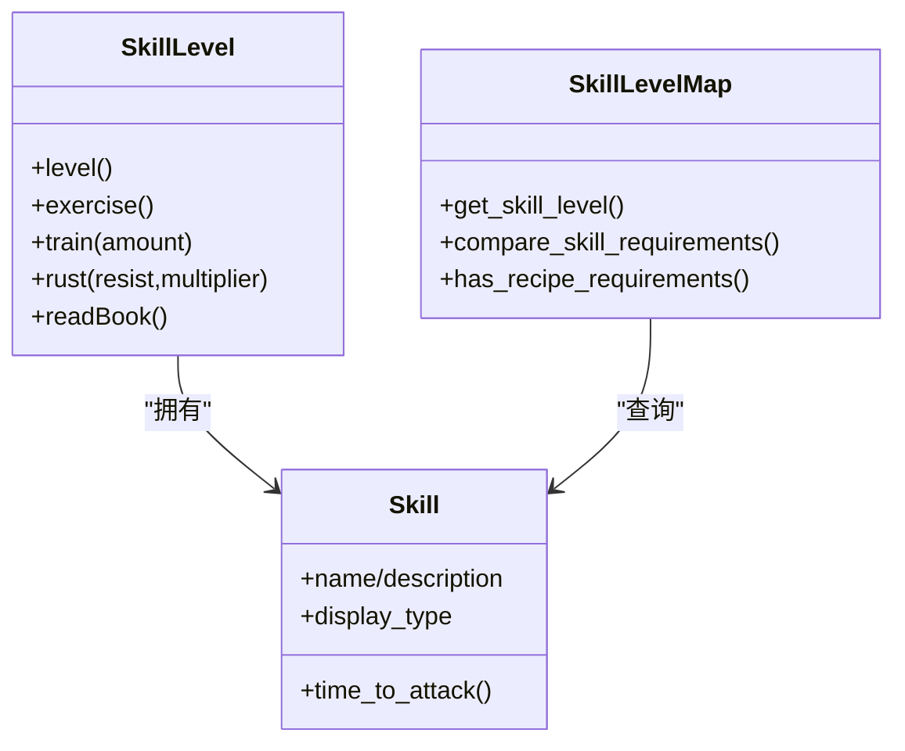

**图表来源**
- skill.h
- skill.h
- skill.h

**章节来源**
- skill.h
- skill.h
- skill.h

### 情绪系统与社交
- 正负情绪点：player_morale::add()/remove()/decay() 管理情绪点的增删与衰减；get_level() 基于正负平方和合成总体情绪。
- 持久化与可视化：支持永久情绪、百分比贡献计算、可视化显示；与状态变化、穿戴物品、变异、效果等联动。
- 社交与难度：player_difficulty.cpp 提供社交价值计算（说服/恐吓/谎言/信任/恐惧/价值），用于难度与互动平衡。

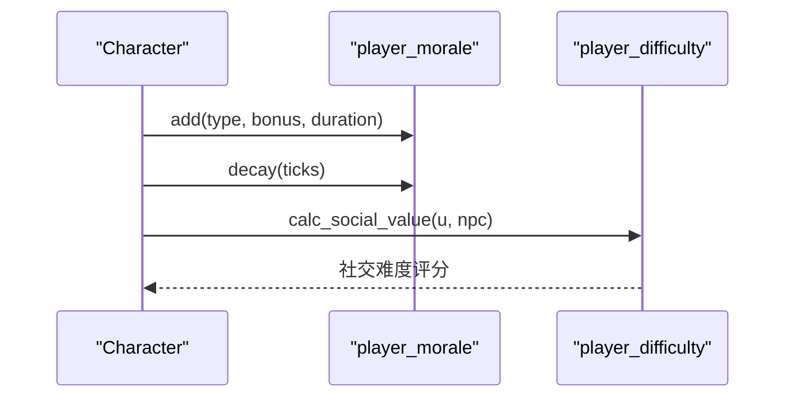

**图表来源**
- morale.h
- morale.cpp
- player_difficulty.cpp

**章节来源**
- morale.h
- morale.cpp
- player_difficulty.cpp

### 健康系统与消化/营养
- 胃/肠内容物：stomach_contents::ingest()/digest() 处理摄入、消化、吸收与剩余；capacity() 考虑变异与体质影响。
- 营养与维生素：nutrients 结构管理卡路里与维生素，vitamin.h/.cpp 控制吸收率、需求与缺乏/过量。
- 饥饿/口渴/饱腹反馈：根据水/固形物/卡路里变化影响口渴与饱腹感，进而影响行动与恢复。

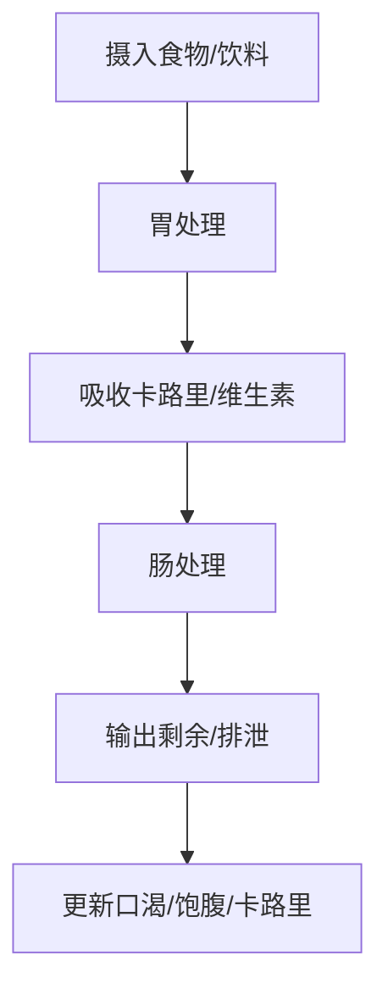

**图表来源**
- stomach.h
- vitamin.h

**章节来源**
- stomach.h
- vitamin.h

### 负面效果与成瘾
- 效果系统：effect.h/.cpp 管理持续效果（如中毒、感染、止痛、睡眠等），支持强度、持续时间、衰减与触发条件。
- 成瘾系统：addiction.h/.cpp 管理耐受、戒断、每日摄入与症状；与药物/毒品/镇静剂等交互。
- 变异触发：部分 mutation_branch 会带来负面效果或代价，需权衡利弊。

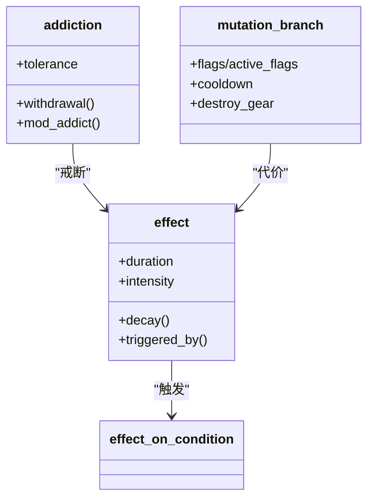

**图表来源**
- effect.h
- effect.cpp
- addiction.h
- addiction.cpp
- mutation.h

**章节来源**
- effect.h
- effect.cpp
- addiction.h
- addiction.cpp
- mutation.h

### 变异与义体
- 变异：mutation.h 定义变异分支、类别、变体、触发、替代、外观与数值影响；trait_group 支持随机生成与组合。
- 义体：bionics.h 描述义体数据、安装/激活/升级、兼容与冲突、附带技能与效果；支持伪武器与包含式义体。

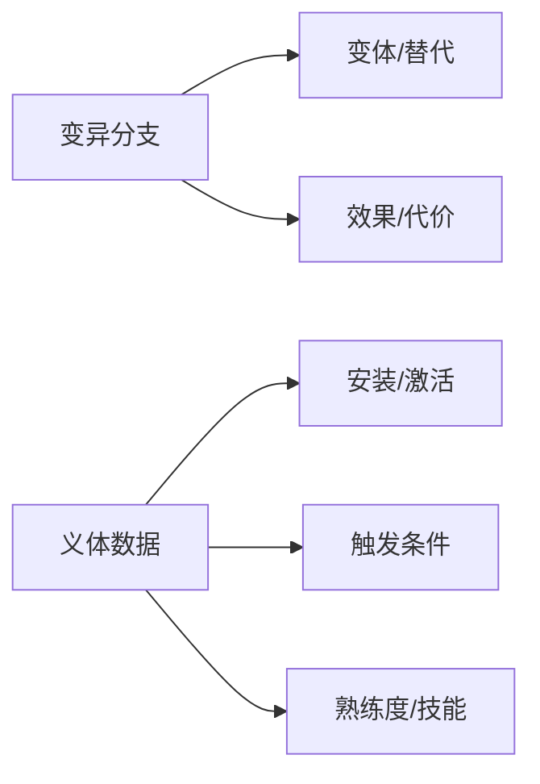

**图表来源**
- mutation.h
- bionics.h

**章节来源**
- mutation.h
- bionics.h

### 库存与装备
- 库存：inventory.h 提供物品分组、分配/回收库存字母、重量/体积统计、伪工具提供、随机移除等。
- 装备：character_attire.h/.cpp、character_armor.h/.cpp 管理外层/内层/护甲覆盖与保护；与身体部位/遮挡/污染/温度相关。

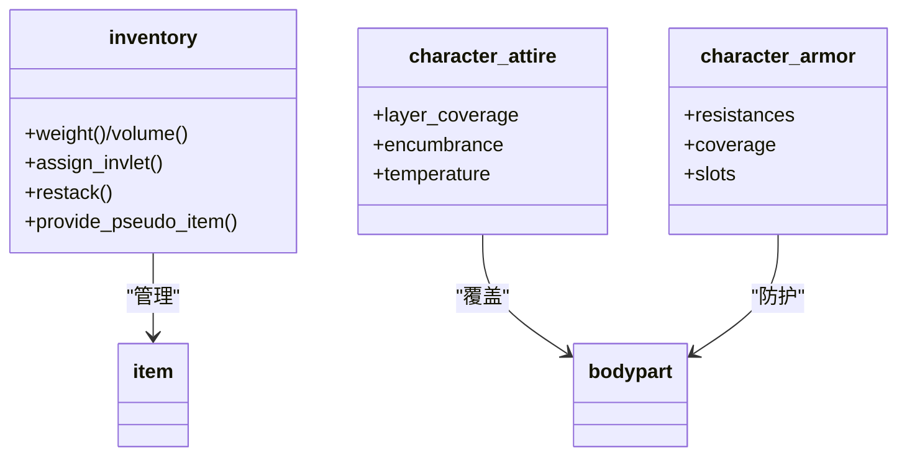

**图表来源**
- inventory.h
- character_attire.h
- character_attire.cpp
- character_armor.h
- character_armor.cpp

**章节来源**
- inventory.h
- character_attire.h
- character_attire.cpp
- character_armor.h
- character_armor.cpp

### AI 行为与社交互动
- NPC 行为：behavior.h/.cpp 定义战斗参与度、瞄准规则、CBM 充电/保留策略、盟友规则等；npc.cpp 提供随时间推进的 update_body 与 focus 状态演进。
- 对话系统：npctalk.h/.cpp 管理话题、条件与效果，影响信任/恐惧/愤怒/价值等意见值；与情绪系统联动。
- 随机化与模板：npc.h/.cpp 支持从 NPC 类型/模板生成随机角色，应用个性、职业、背景与物品。

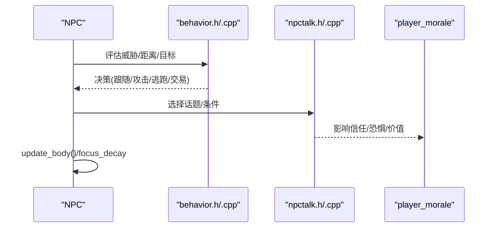

**图表来源**
- behavior.h
- behavior.cpp
- npc.cpp
- npctalk.h
- npctalk.cpp
- morale.h

**章节来源**
- behavior.h
- behavior.cpp
- npc.cpp
- npctalk.h
- npctalk.cpp
- morale.h

### 活动与挂载
- 活动系统：player_activity.h/.cpp 定义活动类型、持续时间、进度与中断；activity_tracker.h/.cpp 调度与执行。
- 与角色：Character 通过活动挂载参与制作、阅读、睡眠、冥想等；活动完成后产生结果（如技能提升、物品产出）。

**章节来源**
- player_activity.h
- player_activity.cpp
- activity_tracker.h
- activity_tracker.cpp

## 依赖关系分析
- 组件耦合：Avatar/NPC 强依赖 Character；Profession 与 Skill/Morale/Mutation/Bio/Inv/Stomach/Eff 等松耦合通过数据结构与工厂加载。
- 时间与事件：calendar.h/.cpp 作为全局时间源；effect_on_condition.h/.cpp 将事件与效果解耦；activity_tracker.h/.cpp 统一调度。
- 地图与世界：worldfactory.h/.cpp、overmap.h/.cpp、map.h/.cpp 为角色提供位置、环境与交互场景。

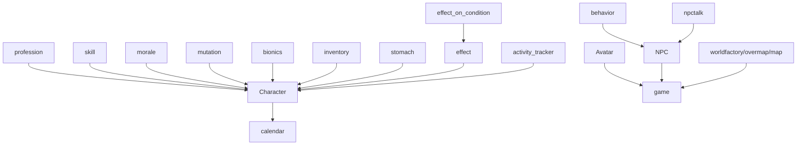

**图表来源**
- character.h
- avatar.h
- npc.h
- profession.h
- skill.h
- morale.h
- mutation.h
- bionics.h
- inventory.h
- stomach.h
- effect.h
- effect_on_condition.h
- activity_tracker.h
- behavior.h
- npctalk.h
- calendar.h
- game.h
- worldfactory.h
- overmap.h
- map.h

**章节来源**
- character.h
- avatar.h
- npc.h
- calendar.h
- game.h
- worldfactory.h
- overmap.h
- map.h

## 性能考量
- 状态缓存：Character 使用缓存字段减少重复计算（如速度、命中修正、体型）。
- 事件批处理：effect_on_condition 与 activity_tracker 采用队列/优先级结构，避免每帧全量扫描。
- 随机化与生成：profession/trait_group 的随机生成在初始化阶段完成，运行时仅做查询。
- I/O 优化：inventory 的 bin 缓存与 invlet favorites 减少查找与排序开销。
- 时间推进：NPC 的 update_body 采用节流（每固定回合推进一次），降低 CPU 占用。

[本节为通用指导，不直接分析具体文件]

## 故障排查指南
- 情绪异常：检查 player_morale 的 add/remove/decay 调用是否匹配；确认持久化与可视化路径一致。
- 技能不增长：核对训练消耗、专注度、rust 与 multilevel 参数；检查上下文技能与需求对比。
- 职业/背景冲突：确认 profession 的 forbidden_traits/locked_traits 与 trait_group 的生成规则。
- 义体安装失败：检查 required_bionic、mutation_conflicts、occupied_bodyparts 与安装要求。
- NPC 不响应：检查 opinion 值、对话规则、行为策略与活动优先级；确认 update_body 是否正常推进。
- 消化异常：核对 stomach_contents.capacity()/digest() 的 owner 参数与 needs_rates；检查维生素吸收与缺乏。

**章节来源**
- morale.h
- skill.h
- profession.h
- bionics.h
- npc.cpp
- stomach.h

## 结论
Cataclysm-DDA 的角色系统以 Character 为核心，通过职业/技能/情绪/变异/义体/库存/消化/活动/效果等子系统实现高度可配置与可扩展的角色体验。系统在数据驱动与事件驱动之间取得平衡，既保证了玩法深度，也兼顾了运行效率。建议在平衡性调整时关注技能/变异/义体/情绪与 NPC 行为之间的相互作用，确保玩家体验的一致性与可预期性。

[本节为总结性内容，不直接分析具体文件]

## 附录
- 关键常量与阈值：睡眠剥夺层级、BMI 计算、卡路里换算等在头文件中集中定义，便于统一维护与调试。
- JSON 数据：profession、trait_group、mutation、bionic、recipe、item 等大量数据通过 JSON 加载，支持模组扩展。

**章节来源**
- game_constants.h
- character.h
- character.h