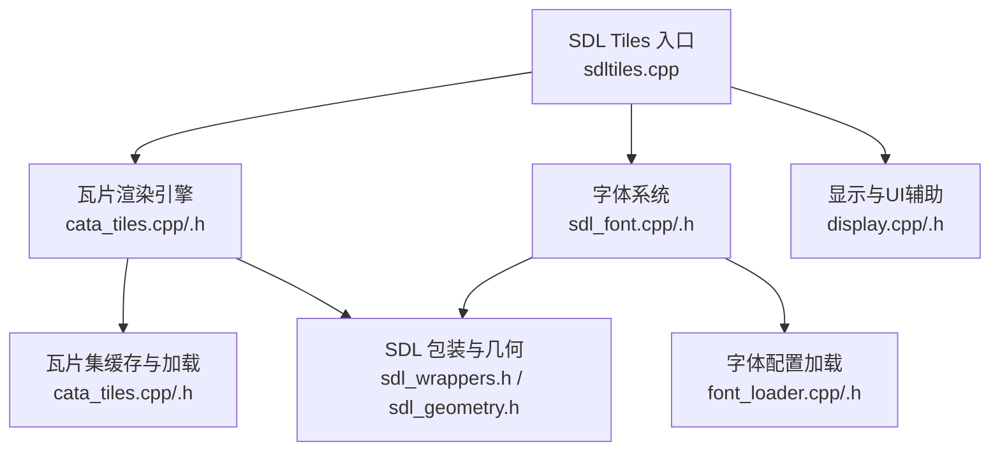
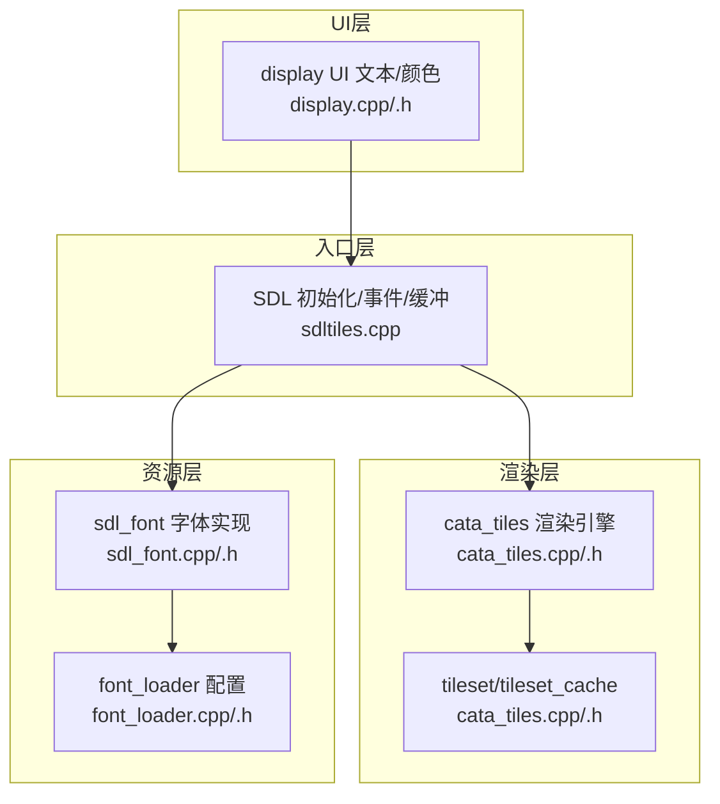
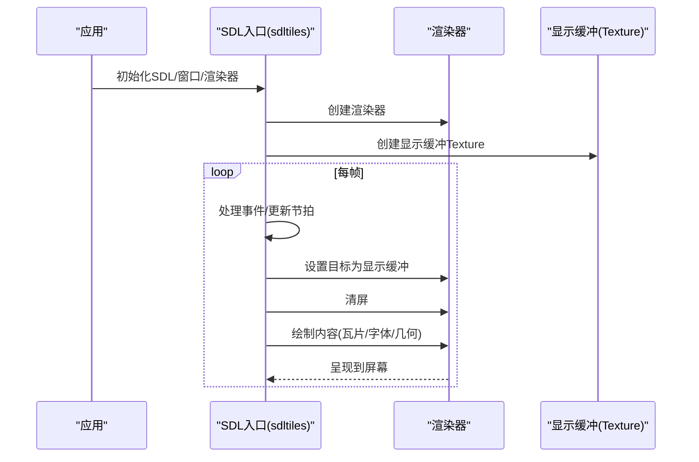
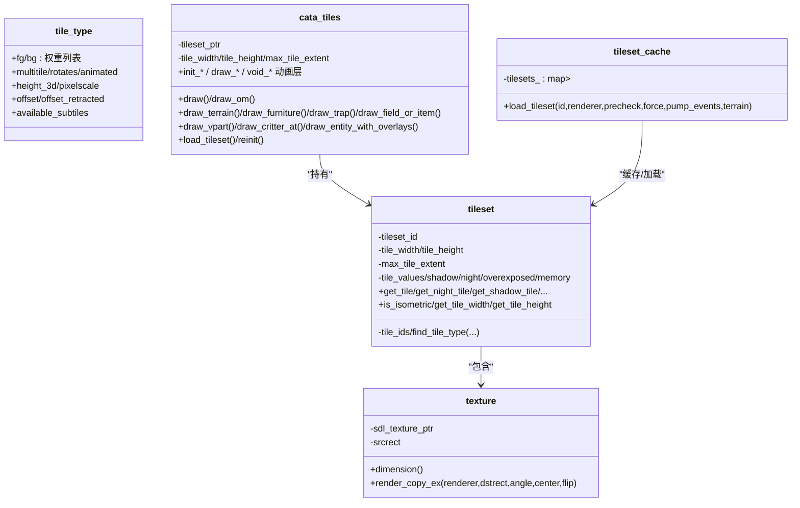
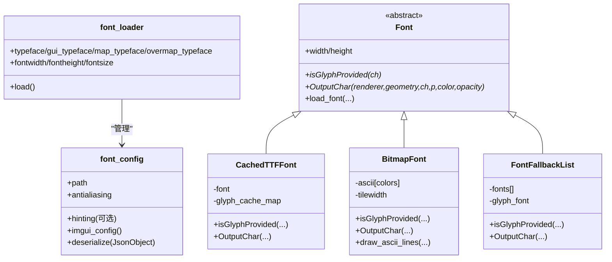
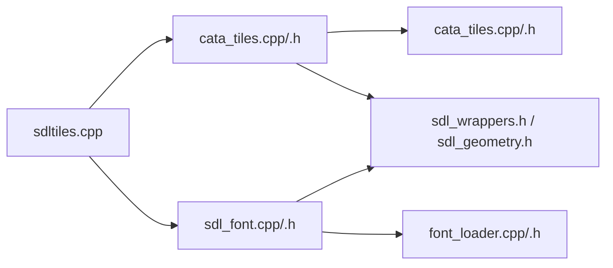

# 图形渲染系统

<cite>
**本文档引用的文件**
- cata_tiles.h
- cata_tiles.cpp
- sdltiles.h
- sdltiles.cpp
- sdl_font.h
- sdl_font.cpp
- font_loader.h
- font_loader.cpp
- display.h
- display.cpp
</cite>

## 目录
1. [简介](#简介)
2. [项目结构](#项目结构)
3. [核心组件](#核心组件)
4. [架构总览](#架构总览)
5. [详细组件分析](#详细组件分析)
6. [依赖关系分析](#依赖关系分析)
7. [性能考量](#性能考量)
8. [故障排查指南](#故障排查指南)
9. [结论](#结论)
10. [附录](#附录)

## 简介
本文件面向Cataclysm-DDA的图形渲染系统，聚焦SDL2图形渲染引擎的集成实现，系统性阐述瓦片渲染体系（cata_tiles）、纹理管理与帧缓冲机制、字体加载与多语言文本渲染、动态资源加载与缓存策略，并提供自定义瓦片集开发指南、图形效果实现与跨平台适配方案，以及渲染管道与调试工具的使用方法。

## 项目结构
渲染子系统主要由以下模块构成：
- SDL2封装与窗口/渲染器管理：负责初始化、事件泵、帧缓冲与几何绘制接口
- 瓦片渲染引擎：cata_tiles为核心，管理瓦片集、层级绘制、动画层与遮挡控制
- 字体系统：sdl_font提供位图字体与TrueType字体的统一抽象，font_loader负责配置与回退链
- 显示与UI：display模块提供UI字符串输出与颜色化逻辑，配合渲染系统进行文本绘制
- 资源与配置：瓦片集JSON、字体配置JSON等

图表来源
- sdltiles.cpp
- cata_tiles.cpp
- sdl_font.cpp
- font_loader.cpp
- display.cpp

章节来源
- sdltiles.h
- sdltiles.cpp
- cata_tiles.h
- cata_tiles.cpp
- sdl_font.h
- sdl_font.cpp
- font_loader.h
- font_loader.cpp
- display.h
- display.cpp

## 核心组件
- SDL Tiles入口与全局状态
  - 管理SDL窗口、渲染器、像素格式、显示缓冲、几何绘制器与输入事件
  - 提供瓦片集加载、缩放、全屏切换、截图保存等入口函数
- cata_tiles瓦片渲染引擎
  - 维护当前tileset、绘制缩放、窗口瓦片计数与范围计算
  - 实现地形、家具、陷阱、物品、字段、怪物、实体叠加层的分层绘制
  - 支持动画层（爆炸、子弹轨迹、命中指示、天气、区域标记等）
  - 提供遮挡控制、夜间/过曝/记忆视图等视觉效果
- tileset与tileset_cache
  - 加载瓦片集图像与JSON定义，构建纹理数组与变体映射
  - 支持季节变体、ASCII子瓦片、层叠上下文、像素缩放与最大瓦片范围
- 字体系统
  - Font抽象：统一单字符输出、线框绘制
  - CachedTTFFont：TrueType字形缓存，按字符+颜色键值缓存纹理
  - BitmapFont：位图字体，从源纹理切片渲染
  - FontFallbackList：多字体回退链，按Unicode查询可用字体
  - font_loader：字体配置加载、回退链构建、Hinting与抗锯齿设置
- 文本与UI
  - display模块提供UI字符串与颜色化逻辑，配合渲染系统输出

章节来源
- sdltiles.h
- sdltiles.cpp
- cata_tiles.h
- cata_tiles.cpp
- sdl_font.h
- sdl_font.cpp
- font_loader.h
- font_loader.cpp
- display.h
- display.cpp

## 架构总览
渲染系统采用“入口管理 + 渲染引擎 + 资源加载”的分层架构：
- 入口层：sdltiles.cpp负责SDL初始化、事件泵、帧缓冲与全局渲染器
- 渲染层：cata_tiles.cpp实现瓦片绘制、动画层与视觉效果
- 资源层：tileset_cache加载瓦片集，font_loader加载字体配置，sdl_font实现字体渲染
- UI层：display模块提供UI文本与颜色化

图表来源
- sdltiles.cpp
- cata_tiles.cpp
- cata_tiles.h
- font_loader.cpp
- sdl_font.cpp
- display.cpp

## 详细组件分析

### SDL2图形渲染与帧缓冲机制
- 初始化与事件泵
  - 初始化SDL子系统、设置平台提示、创建窗口与渲染器
  - 维护输入事件队列与更新循环节拍
- 帧缓冲与双缓冲
  - 使用SDL_Texture作为显示缓冲，清屏后在渲染器上绘制，最后呈现
  - 几何绘制通过GeometryRenderer接口完成，避免频繁纹理切换
- 全局状态
  - 窗口尺寸、字体宽高、缩放因子、全屏状态、调色板等

图表来源
- sdltiles.cpp
- sdltiles.cpp
- sdltiles.h

章节来源
- sdltiles.cpp
- sdltiles.cpp
- sdltiles.h

### cata_tiles瓦片渲染系统
- 设计要点
  - tile_type描述前景/背景权重列表、是否多子瓦片/旋转/动画、3D高度与偏移、像素缩放
  - tileset维护默认与季节变体映射、纹理数组（常规/夜间/阴影/过曝/记忆）、最大瓦片范围与Z层高度
  - tileset_cache负责加载瓦片集图像与JSON，构建纹理与层叠上下文数据
- 绘制流程
  - 计算窗口内基础瓦片行列数与可见范围，按层级顺序绘制地形、家具、陷阱、字段/物品、载具部件、怪物与实体
  - 支持遮挡控制、夜间视觉、过曝、记忆视图等视觉效果
  - 动画层独立管理，如爆炸、子弹轨迹、命中指示、天气粒子、区域标记等
- 关键接口
  - draw/draw_om：主绘制与大地图绘制
  - draw_*系列：地形、家具、陷阱、字段/物品、载具部件、怪物、实体等
  - init_* / draw_* / void_*：动画层生命周期管理
  - load_tileset/reinit：瓦片集加载与重初始化

图表来源
- cata_tiles.h
- cata_tiles.h
- cata_tiles.h

章节来源
- cata_tiles.h
- cata_tiles.h
- cata_tiles.h
- cata_tiles.cpp

### 字体加载器与多语言文本渲染
- 字体配置
  - font_loader解析JSON配置，支持路径、Hinting（自动/无/轻/位图/默认）、抗锯齿
  - 自动确保unifont作为回退字体，防止缺失字符导致崩溃
- 字体实现
  - Font抽象：统一isGlyphProvided与OutputChar接口
  - CachedTTFFont：按字符代码+颜色键缓存字形纹理，减少重复渲染
  - BitmapFont：从位图源切片渲染ASCII字符与线框
  - FontFallbackList：多字体回退链，逐个尝试直到找到可用字形
- 文本绘制
  - 通过GeometryRenderer绘制线框字符，或通过字体缓存纹理直接复制到渲染器

图表来源
- font_loader.h
- font_loader.cpp
- sdl_font.h
- sdl_font.cpp

章节来源
- font_loader.h
- font_loader.cpp
- sdl_font.h
- sdl_font.cpp

### 动态加载、缓存与性能优化
- 瓦片集缓存
  - tileset_cache使用弱指针缓存已加载的tileset，避免重复加载
  - 支持预检仅加载元信息（瓦片尺寸），加速启动
- 字形缓存
  - CachedTTFFont按“字符代码+颜色”键缓存字形纹理，显著降低重复渲染开销
  - BitmapFont对每种颜色维护独立纹理切片，避免运行时颜色替换
- 层级与遮挡
  - 通过Z层高度与遮挡阈值参数，减少不可见对象绘制
  - 夜间/过曝/记忆视图通过选择不同纹理数组实现，避免额外着色
- 事件泵与刷新
  - 在加载过程中处理窗口事件并必要时刷新屏幕，保证交互性

章节来源
- cata_tiles.h
- cata_tiles.cpp
- sdl_font.h
- sdl_font.cpp

### 自定义瓦片集开发指南
- 瓦片集JSON结构
  - 定义瓦片类型、前景/背景权重列表、多子瓦片与旋转规则、3D高度与偏移、像素缩放
  - 支持季节变体与ASCII子瓦片
- 图像与图集
  - 使用tile_atlas_width与切片参数，将多张小图整合为单一纹理以提升批处理效率
- 层叠上下文
  - 通过layer_context_sprites定义物品/字段在特定上下文下的叠加顺序与偏移
- 加载流程
  - 通过tileset_cache::load_tileset加载，支持预检、强制加载、地形专用模式与事件泵处理

章节来源
- cata_tiles.h
- cata_tiles.cpp

### 图形效果与渲染管道
- 视觉效果
  - 夜视、过曝、阴影、记忆视图：通过选择不同纹理数组实现
  - 遮挡控制：prevent_occlusion_min_dist/max_dist参数决定绘制优先级
- 动画层
  - 爆炸、子弹轨迹、命中指示、天气粒子、区域标记、异步动画等
  - 生命周期：init_* -> draw_* -> void_*，按帧推进
- 渲染顺序
  - 地面层 -> 家具/陷阱 -> 物品/字段 -> 载具部件 -> 怪物 -> 实体 -> 上方特效 -> UI

章节来源
- cata_tiles.h
- cata_tiles.cpp

### 跨平台渲染适配
- 平台提示
  - Windows：启用IME UI、长IME组合文本、DPI感知、禁用线程命名以改善调试
  - Linux：设置APP_NAME提示
- 输入法与IME
  - 通过SDL_HINT_IME_*配置，确保输入法UI正确显示
- Android/Emscripten
  - 条件编译适配触摸输入与Web环境

章节来源
- sdltiles.cpp
- sdltiles.cpp

## 依赖关系分析
- 组件耦合
  - sdltiles.cpp强依赖cata_tiles与sdl_font；cata_tiles依赖tileset_cache与SDL包装
  - font_loader与sdl_font相互协作，font_loader提供配置，sdl_font实现渲染
- 外部依赖
  - SDL2/SDL_image/SDL_ttf/SDL_geometry（通过包装头）
  - FreeType（通过ImGuiFreeType）
- 可能的循环依赖
  - 通过前置声明与分离头文件避免直接循环包含

图表来源
- sdltiles.cpp
- cata_tiles.cpp
- sdl_font.cpp
- font_loader.cpp

章节来源
- sdltiles.cpp
- cata_tiles.cpp
- sdl_font.cpp
- font_loader.cpp

## 性能考量
- 批量纹理复制
  - 将多张小图合并为图集，减少纹理切换次数
- 字形缓存
  - CachedTTFFont按字符+颜色键缓存，避免重复光栅化
- 层级裁剪
  - 通过窗口瓦片范围与遮挡阈值减少无效绘制
- 异步与事件泵
  - 加载过程处理事件，避免界面冻结

## 故障排查指南
- 瓦片集加载失败
  - 检查tileset JSON与图像路径；确认tile_atlas_width与切片参数正确
  - 使用预检模式先获取元信息，再完整加载
- 字符缺失
  - 确认font_loader配置中包含unifont作为回退；检查hinting与抗锯齿设置
  - 对于BitmapFont，确认ASCII切片与颜色索引正确
- 性能问题
  - 启用图集与字形缓存；减少不必要的动画层；调整遮挡阈值
- 跨平台问题
  - 检查平台提示设置；Windows下确保IME UI启用；Linux下设置APP_NAME

章节来源
- cata_tiles.cpp
- font_loader.cpp
- sdl_font.cpp
- sdltiles.cpp

## 结论
Cataclysm-DDA的图形渲染系统以SDL2为基础，结合cata_tiles的瓦片渲染引擎、tileset_cache的资源管理与sdl_font的多语言文本支持，形成了高效、可扩展且跨平台的渲染管线。通过图集、字形缓存与层级遮挡等优化手段，系统在保证表现力的同时兼顾了性能与可维护性。开发者可基于现有框架快速扩展自定义瓦片集与图形效果。

## 附录
- 调试工具
  - 截图：save_screenshot用于导出当前帧
  - 加载报告：do_tile_loading_report统计瓦片集加载情况
  - 选项变更：on_options_changed响应渲染器/显示设备切换
- 常用接口路径
  - 瓦片集加载：tileset_cache::load_tileset
  - 主绘制：cata_tiles::draw
  - 字体加载：Font::load_font
  - 字体配置：font_loader::load

章节来源
- sdltiles.h
- cata_tiles.h
- sdl_font.h
- font_loader.h