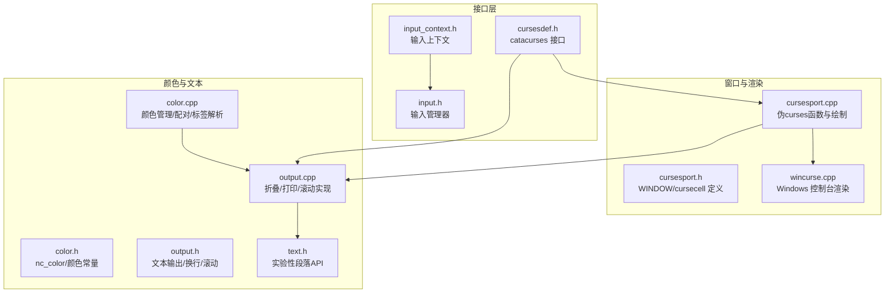
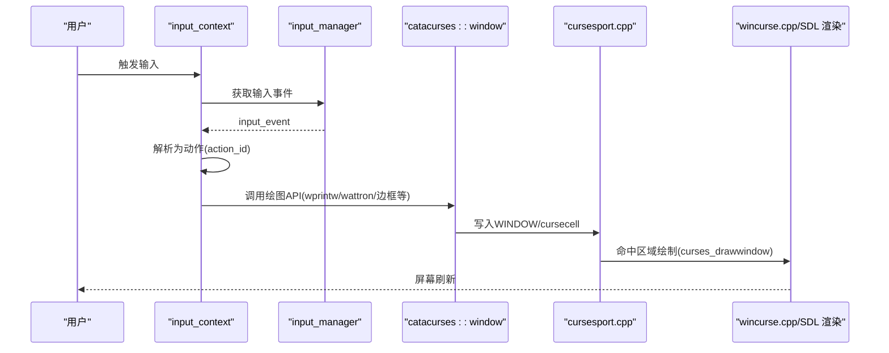
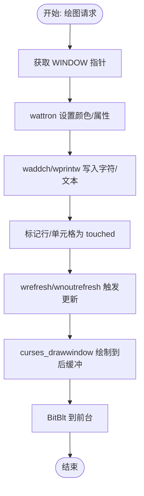
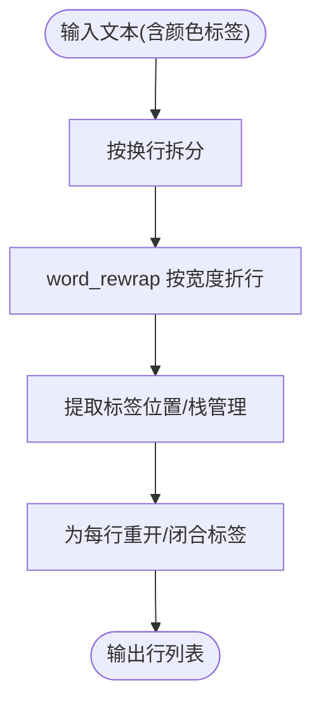
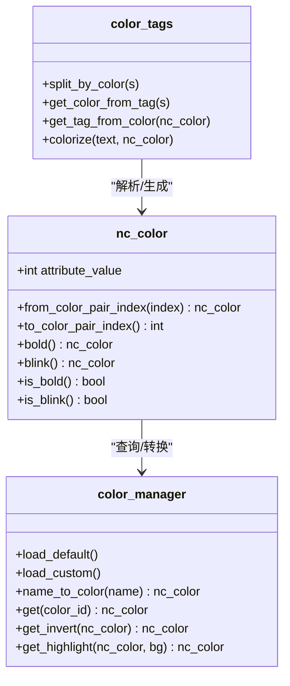
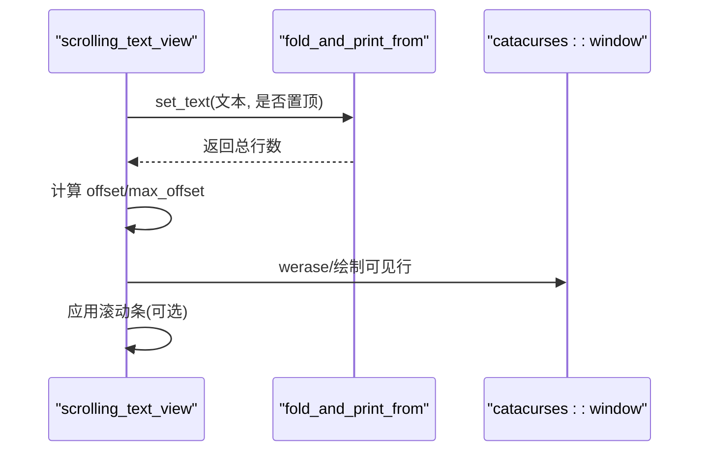
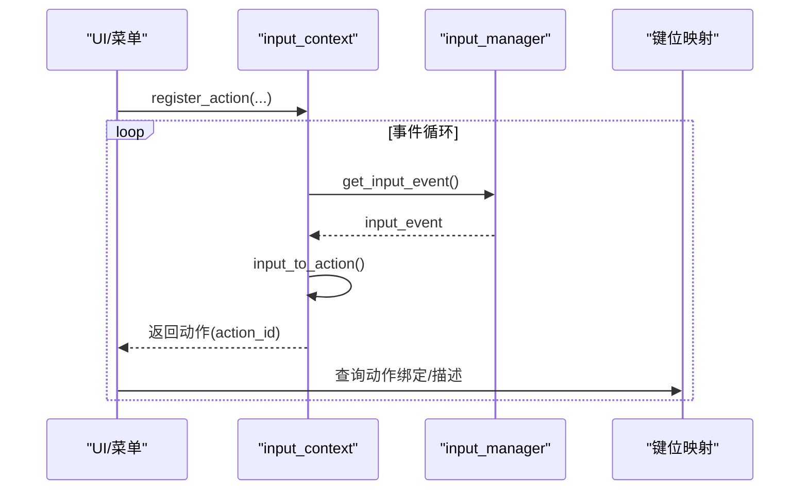
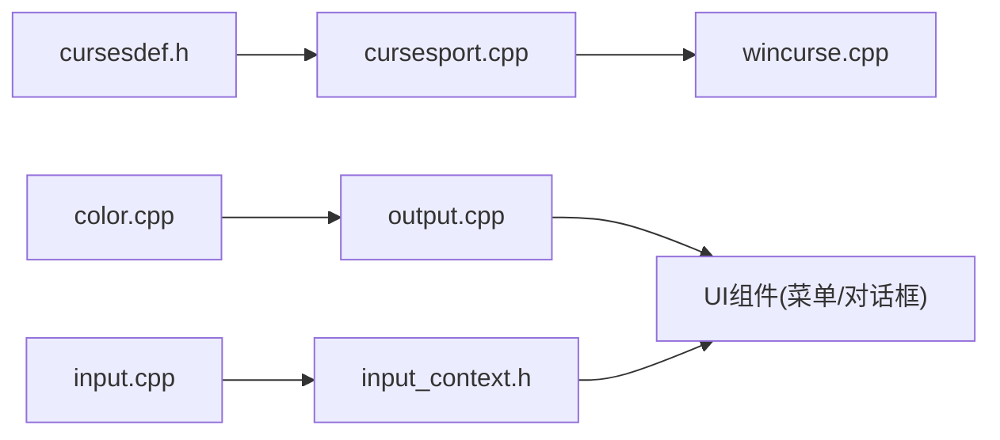

# 文本界面系统

<cite>
**本文引用的文件**
- cursesport.h
- cursesport.cpp
- cursesdef.h
- color.h
- color.cpp
- output.h
- output.cpp
- input.h
- input.cpp
- input_context.h
- wincurse.cpp
- text.h
</cite>

## 目录
1. [简介](#简介)
2. [项目结构](#项目结构)
3. [核心组件](#核心组件)
4. [架构总览](#架构总览)
5. [组件详解](#组件详解)
6. [依赖关系分析](#依赖关系分析)
7. [性能考量](#性能考量)
8. [故障排查指南](#故障排查指南)
9. [结论](#结论)
10. [附录](#附录)

## 简介
本文件面向Cataclysm-DDA的文本界面系统（TUI），系统性梳理其ncurses风格接口、窗口管理、字符渲染、颜色体系、文本输出与换行、输入处理与事件循环等关键机制。文档同时覆盖ANSI颜色支持、终端兼容性、高对比度模式、滚动机制、跨平台适配（Windows控制台、SDL/Tiles）以及可扩展的自定义开发建议。

## 项目结构
文本界面相关代码主要分布在以下模块：
- 窗口与渲染：cursesport.*（伪curses窗口数据结构与绘制）、cursesdef.h（catacurses命名空间接口声明）
- 颜色系统：color.*（颜色常量、配对、反转、高亮、标签解析）
- 文本输出：output.*（折叠换行、颜色标签、滚动文本视图、边框绘制）
- 输入与事件：input.*、input_context.*（输入管理器、上下文、按键映射、命令解析）
- 平台适配：wincurse.cpp（Windows控制台渲染与消息循环）

图表来源
- cursesdef.h
- cursesport.h
- cursesport.cpp
- wincurse.cpp
- color.h
- color.cpp
- output.h
- output.cpp
- input.h
- input_context.h
- text.h

章节来源
- cursesdef.h
- cursesport.h
- cursesport.cpp
- wincurse.cpp
- color.h
- color.cpp
- output.h
- output.cpp
- input.h
- input_context.h
- text.h

## 核心组件
- 窗口与渲染
  - 伪curses窗口数据结构：WINDOW、cursecell、curseline，用于在无原生ncurses环境下缓存字符与颜色，按需绘制。
  - 渲染管线：curses_drawwindow将WINDOW内容绘制到后缓冲，再Blit到前台，减少闪烁。
- 颜色系统
  - nc_color封装属性与颜色对；init_pair建立前景/背景配对；invert/hilite/高亮背景函数提供对比增强。
  - 颜色标签：<color_xxx>嵌入式彩色文本，支持折叠时自动重闭合标签。
- 文本输出
  - 折叠换行：foldstring按终端字符宽度分割，保留颜色标签；print_scrollable/fold_and_print支持滚动显示。
  - 边框与装饰：draw_border/mvwhline/mvwvline等。
- 输入与事件
  - input_manager统一管理动作到输入事件的映射，支持超时、等待任意键、键盘/游戏手柄/鼠标。
  - input_context注册动作、描述绑定、坐标输入、过滤器与超时设置。

章节来源
- cursesport.h
- cursesport.cpp
- color.cpp
- output.h
- output.cpp
- input.h
- input_context.h

## 架构总览
下图展示从输入到渲染的端到端流程，以及颜色与文本输出在其中的位置。

图表来源
- input_context.h
- input.h
- cursesport.cpp
- wincurse.cpp

## 组件详解

### 窗口管理系统
- 数据结构
  - WINDOW：记录位置、尺寸、光标、当前前景/背景、行缓冲（curseline(chars[cursecell])）。
  - cursecell：单个单元格，含UTF-8字符串、前景/背景色。
- 关键函数
  - newwin/wprintw/waddch/wattron/wattroff/wnoutrefresh/wrefresh/doupdate/erase/wclear等。
  - wborder/mvwhline/mvwvline用于绘制边框与线条。
- 渲染流程
  - wnoutrefresh标记脏行，wrefresh触发doupdate，最终调用curses_drawwindow将WINDOW内容绘制至后缓冲并Blit。

图表来源
- cursesport.cpp
- cursesport.cpp
- cursesdef.h

章节来源
- cursesport.h
- cursesport.cpp
- cursesdef.h

### 字符渲染引擎与换行算法
- 字符编码与宽度
  - 使用UTF8_getch与mk_wcwidth处理宽字符，确保双宽字符占两单元且相邻单元清空。
- 换行与折叠
  - foldstring按终端字符宽度分割，保留颜色标签并在行间正确闭合/重开标签。
  - print_scrollable/fold_and_print_from支持滚动偏移与分页。
- 线条与边框
  - 提供LINE_*常量与字符串形式，支持ASCII/Unicode/盒线绘制。

图表来源
- output.cpp
- output.h

章节来源
- output.h
- output.cpp

### 颜色系统设计与ANSI兼容
- nc_color与颜色对
  - nc_color封装颜色属性（粗体/闪烁）与颜色对索引；init_pair建立FG/BG配对。
  - invert_color/hilite/red_background等提供反转/高亮/背景切换。
- 颜色标签与名称映射
  - 支持<c_color_name>嵌入式彩色；color_from_string/bgcolor_from_string解析颜色名。
  - color_manager维护默认/自定义颜色、反转/高亮映射。
- 终端兼容与高对比度
  - supports_256_colors检测能力；在256色终端启用深灰等额外颜色。
  - invert/hilite提供高对比度替代；i_系列背景色用于强调。

图表来源
- color.h
- color.cpp
- output.h

章节来源
- color.h
- color.cpp
- output.h

### 文本输出系统与滚动机制
- 打印族函数
  - wprintz/mvwprintz/wprintw/mvwprintw等支持颜色参数与格式化。
  - mvwputch/mvwputch_inv/mvwputch_hi等绘制单字符与高亮/反显。
- 滚动文本视图
  - scrolling_text_view维护offset/max_offset/page_up/page_down/scroll_up/scroll_down。
  - 结合fold_and_print_from实现可视区域滚动。
- 边框与表格
  - draw_border/mvwrectf/insert_table等辅助布局。

图表来源
- output.cpp
- output.h

章节来源
- output.h
- output.cpp

### 输入处理：事件循环、按键映射与命令解析
- input_manager
  - 统一加载/保存键位映射；get_input_event/pump_events/wait_for_any_key；超时与键盘模式。
- input_context
  - 注册动作、描述绑定、坐标输入、过滤器、超时；handle_input返回动作标识。
- 键值与平台
  - 定义KEY_*与keycode::*常量；Windows消息映射方向键/F键/回车/退格等。

图表来源
- input_context.h
- input.h
- input.cpp

章节来源
- input.h
- input_context.h
- input.cpp

### 平台适配与跨平台要点
- Windows 控制台（wincurse.cpp）
  - 自绘窗口、后缓冲、消息循环（WM_CHAR/WM_KEYDOWN/WM_SIZE等）、Alt数字码输入、光标隐藏策略。
  - handle_resize根据客户端尺寸计算终端行列数并重建stdscr。
- SDL/Tiles（与cursesport配合）
  - 通过curses_drawwindow将WINDOW内容交给渲染层绘制；支持resizeterm与刷新。
- 终端能力检测
  - catacurses::supports_256_colors用于启用更丰富的颜色与高对比度模式。

章节来源
- wincurse.cpp
- wincurse.cpp
- wincurse.cpp
- cursesdef.h

## 依赖关系分析
- 接口耦合
  - catacurses接口（cursesdef.h）是所有平台/渲染实现的统一入口，避免上层直接依赖平台差异。
  - cursesport.cpp实现catacurses函数，负责数据存储与绘制；wincurse.cpp实现平台特定输入与渲染。
- 颜色与文本
  - color.*被output.*广泛使用；output.*又为UI组件提供文本渲染能力。
- 输入
  - input_context依赖input_manager进行动作解析；二者共同决定UI交互行为。

图表来源
- cursesdef.h
- cursesport.cpp
- wincurse.cpp
- color.cpp
- output.cpp
- input.cpp
- input_context.h

章节来源
- cursesdef.h
- cursesport.cpp
- wincurse.cpp
- color.cpp
- output.cpp
- input.cpp
- input_context.h

## 性能考量
- 绘制优化
  - 后缓冲与BitBlt减少闪烁；仅对touched行绘制；curses_drawwindow按行扫描并跳过空白单元。
- 文本处理
  - 折叠前预处理颜色标签，避免重复解析；mk_wcwidth用于准确宽度计算，避免误判导致的重排。
- 输入轮询
  - pump_events仅处理消息队列不忽略按键；超时与Sleep结合降低CPU占用。
- 终端尺寸
  - handle_resize仅在需要时重建窗口与颜色表，避免频繁初始化。

章节来源
- cursesport.cpp
- wincurse.cpp
- output.cpp

## 故障排查指南
- 文本未显示或错位
  - 检查颜色属性是否正确关闭；确认颜色标签成对出现；验证foldstring后的行是否仍带未闭合标签。
- 滚动异常
  - 确认offset与max_offset边界；检查begin_line与窗口高度关系；确保scrollbar.apply正确应用。
- 输入无响应
  - 检查input_manager::set_timeout与input_context::set_timeout；确认pump_events被调用；Windows平台检查消息循环与WM_CHAR/WM_KEYDOWN分支。
- 高对比度无效
  - 检查supports_256_colors；确认invert/hilite路径；核对颜色对数量与分配。

章节来源
- output.cpp
- input.h
- input_context.h
- wincurse.cpp

## 结论
该文本界面系统以catacurses为统一接口，结合cursesport的数据缓存与wincurse/SDL渲染，形成稳定的TUI框架。颜色系统与文本输出具备良好的可读性与可维护性，输入子系统提供灵活的动作映射与上下文管理。通过后缓冲与按需绘制，系统在多平台下保持一致的视觉与交互体验。

## 附录

### 自定义开发指南
- 新增UI窗口
  - 使用catacurses::newwin创建窗口；通过wprintw/wattron等进行绘制；必要时调用wborder绘制边框。
- 添加颜色
  - 在color.cpp中添加新颜色对与反转/高亮映射；使用colorize包装文本；在UI中通过nc_color传参。
- 扩展输入动作
  - 在input_context中注册动作；通过input_manager配置键位映射；在handle_input中解析并返回动作标识。
- 跨平台适配
  - 若新增平台，实现curses_drawwindow与输入事件泵；确保supports_256_colors与颜色表加载逻辑。

章节来源
- cursesdef.h
- color.cpp
- input_context.h
- output.h