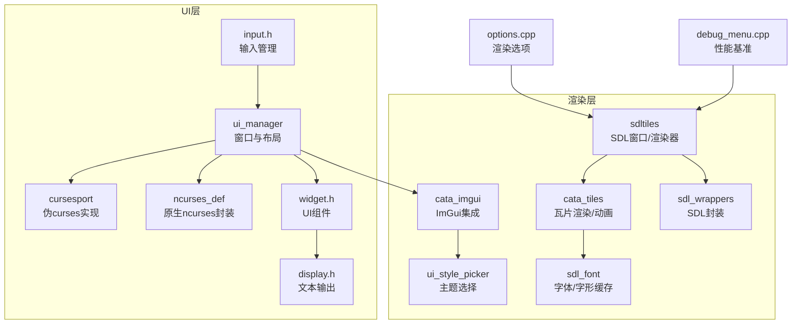
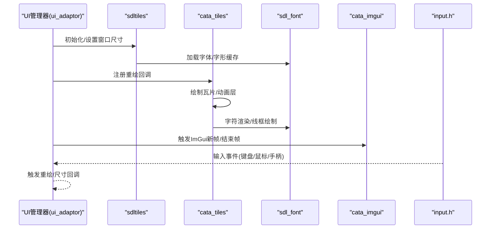
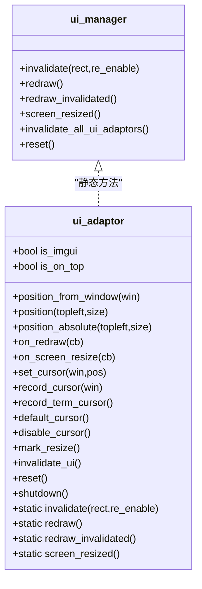
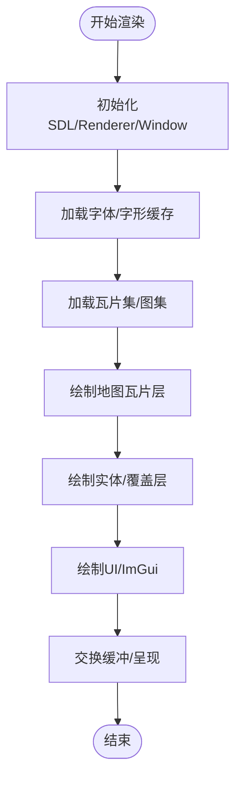
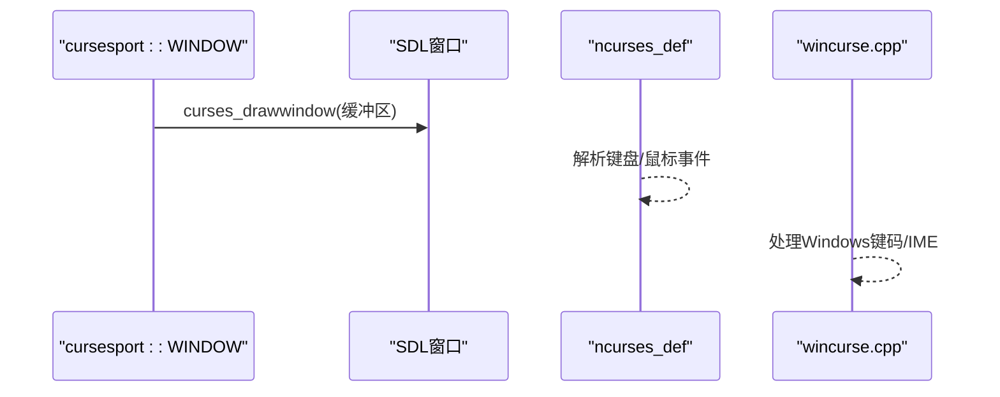
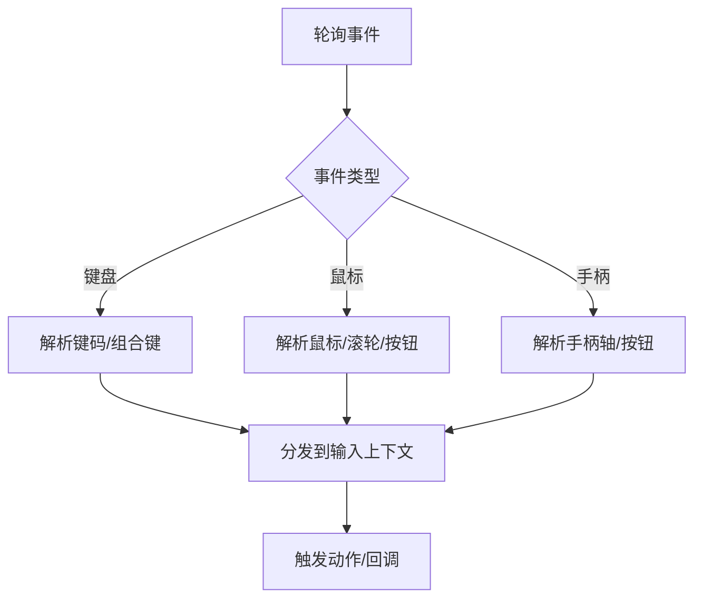
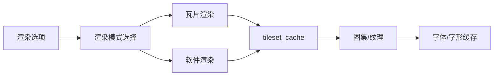
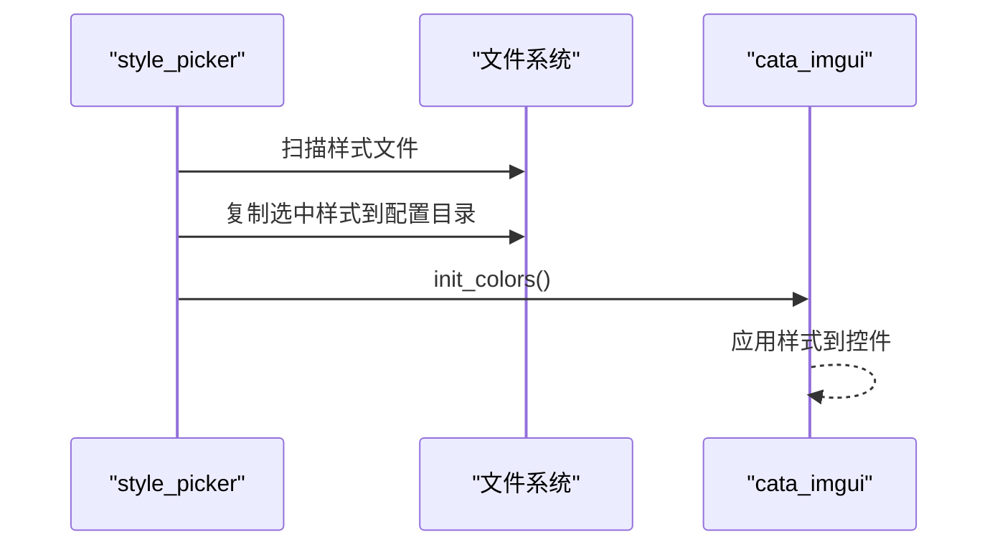
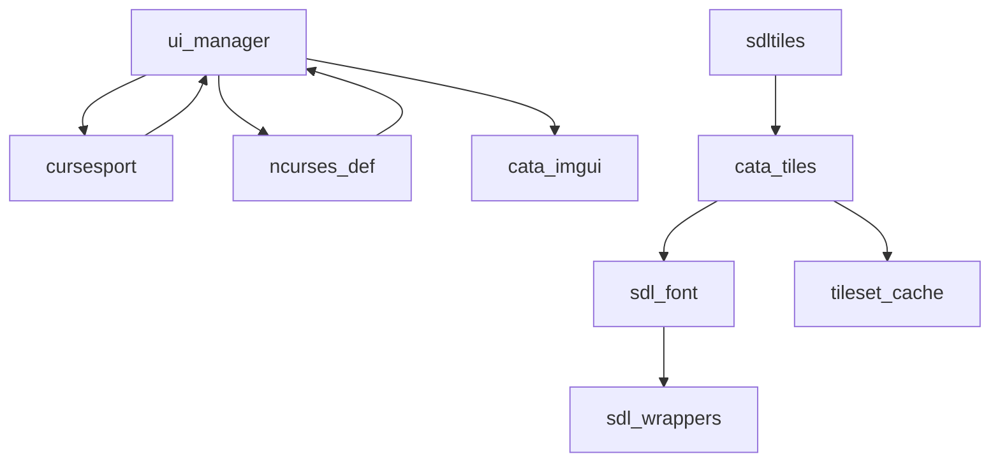

# 用户界面与渲染

<cite>
**本文引用的文件**
- ui_manager.h
- ui_manager.cpp
- sdltiles.h
- sdltiles.cpp
- cata_tiles.h
- cata_tiles.cpp
- sdl_font.h
- sdl_font.cpp
- cursesport.h
- cursesport.cpp
- ncurses_def.cpp
- cata_imgui.h
- cata_imgui.cpp
- input.h
- wincurse.cpp
- options.cpp
- sdl_wrappers.cpp
- debug_menu.cpp
- ui_style_picker.cpp
- ui_style_picker.h
- widget.h
- display.h
</cite>

## 目录
1. [简介](#简介)
2. [项目结构](#项目结构)
3. [核心组件](#核心组件)
4. [架构总览](#架构总览)
5. [详细组件分析](#详细组件分析)
6. [依赖关系分析](#依赖关系分析)
7. [性能考量](#性能考量)
8. [故障排查指南](#故障排查指南)
9. [结论](#结论)
10. [附录](#附录)

## 简介
本文件面向Cataclysm-DDA的用户界面与图形渲染系统，系统性梳理UI管理器、窗口与布局、响应式设计、SDL2图形管线、瓦片渲染与动画、ncurses文本界面集成、输入处理、渲染模式切换与资源管理、性能优化策略，并提供UI组件扩展与自定义主题开发指南及跨平台适配方案。

## 项目结构
围绕UI与渲染的关键目录与文件：
- UI管理与窗口：ui_manager.*、cursesport.*、ncurses_def.cpp、input.h
- SDL2图形与瓦片：sdltiles.*、cata_tiles.*、sdl_font.*、sdl_wrappers.cpp
- 文本界面与字体：sdl_font.*、cursesport.*、ncurses_def.cpp
- ImGui集成与主题：cata_imgui.*、ui_style_picker.*
- 渲染选项与调试：options.cpp、debug_menu.cpp
- UI组件与显示：widget.h、display.h

**图表来源**
- ui_manager.h
- cursesport.h
- ncurses_def.cpp
- input.h
- sdltiles.cpp
- cata_tiles.h
- sdl_font.h
- sdl_wrappers.cpp
- cata_imgui.h
- ui_style_picker.cpp
- options.cpp
- debug_menu.cpp

**章节来源**
- ui_manager.h
- sdltiles.cpp
- cata_tiles.h
- sdl_font.h
- cursesport.h
- ncurses_def.cpp
- cata_imgui.h
- ui_style_picker.cpp
- options.cpp
- debug_menu.cpp

## 核心组件
- UI管理器（ui_adaptor）：统一管理窗口位置、尺寸、重绘回调、屏幕尺寸变化、光标记录与恢复、禁用下层UI等；提供静态接口触发全量或增量重绘。
- 窗口与布局：在SDL构建中使用像素坐标与窗口维度；在ncurses构建中使用字符单元坐标与伪curses数据结构，二者通过统一接口衔接。
- 文本界面：SDL路径采用字体渲染与几何绘制；ncurses路径采用伪curses缓冲区与刷新机制。
- 图形渲染：SDL路径以纹理/图集为主，结合瓦片系统与动画层；提供帧缓冲、着色与混合模式控制。
- 输入系统：统一抽象键盘/鼠标/手柄事件，提供超时、轮询与上下文切换；在SDL路径中桥接ImGui输入。
- 主题与样式：基于ImGui配置文件加载自定义风格，支持运行时切换。

**章节来源**
- ui_manager.h
- ui_manager.cpp
- cursesport.h
- ncurses_def.cpp
- sdl_font.h
- cata_tiles.h
- input.h
- cata_imgui.h

## 架构总览
UI与渲染的整体流程：
- UI层通过ui_adaptor注册重绘与尺寸回调，记录窗口维度与光标状态。
- 在SDL路径中，sdltiles负责初始化SDL/Renderer/Window、字体与瓦片上下文；cata_tiles进行瓦片绘制与动画层管理；sdl_font提供字形缓存与多字体回退。
- 在ncurses路径中，cursesport维护伪curses缓冲区，ncurses_def封装原生ncurses调用，两者共同完成文本渲染与刷新。
- 输入层统一抽象，SDL路径中cata_imgui桥接输入到ImGui，同时保留传统输入处理；ncurses路径直接解析按键与鼠标事件。
- 主题层通过ui_style_picker读取配置目录下的样式文件，动态应用到ImGui。

**图表来源**
- ui_manager.h
- sdltiles.cpp
- cata_tiles.h
- sdl_font.cpp
- cata_imgui.cpp
- input.h

## 详细组件分析

### UI管理器与窗口系统
- 设计要点
  - ui_adaptor自动入栈/出栈，确保重绘与尺寸回调正确绑定与解绑。
  - 支持两种定位方式：基于catacurses::window的相对定位与绝对像素/字符定位。
  - 提供禁用下层UI、调试消息UI特殊处理、延迟resize标记等能力。
  - 静态接口触发全量重绘与增量重绘，内部协调无效化区域与重绘顺序。
- 关键行为
  - 重绘回调仅允许在指定区域内绘制，避免越界导致的闪烁或错位。
  - 尺寸回调需同步更新窗口尺寸并调用position系列函数，确保后续刷新正确。
  - 光标记录与恢复保证屏幕阅读器与输入法预览在不同渲染后保持一致。

**图表来源**
- ui_manager.h
- ui_manager.h

**章节来源**
- ui_manager.h
- ui_manager.h
- ui_manager.cpp

### SDL2图形渲染系统与瓦片渲染
- 初始化与环境
  - sdltiles负责SDL/Renderer/Window创建、DPI提示、IME支持、线程命名抑制等。
  - 管理全局字体、渲染器、显示缓冲、几何绘制器与触摸摇杆等资源。
- 瓦片渲染与动画
  - cata_tiles提供绘制入口、窗口内瓦片数量估算、坐标转换、遮挡规避、记忆化瓦片等。
  - 支持地形/家具/陷阱/物品/怪物/子弹/命中特效/天气/高亮/脚印/区域标记/异步动画等多层叠加。
  - tileset_cache负责瓦片集加载、图集复制、变体查找与重复ID检测。
- 字体与文本
  - sdl_font提供三类字体：位图字体、TrueType缓存字体、多字体回退列表。
  - 支持字形缓存、颜色调色板映射、ASCII线框绘制与多字体回退。

**图表来源**
- sdltiles.cpp
- cata_tiles.h
- cata_tiles.h
- sdl_font.h

**章节来源**
- sdltiles.cpp
- cata_tiles.h
- cata_tiles.cpp
- sdl_font.h
- sdl_font.cpp

### 文本界面与ncurses集成
- 伪curses实现（SDL路径）
  - cursesport维护WINDOW结构、颜色对、行与单元格跟踪，支持边框、水平/垂直线绘制与刷新。
  - 通过curses_drawwindow将缓冲区内容绘制到SDL窗口。
- 原生ncurses封装（非SDL路径）
  - ncurses_def封装newwin/wrefresh/wrefresh等，屏蔽底层差异。
- 输入处理
  - wincurse.cpp提供Windows平台的输入处理细节（含IME与键码兼容）。
  - ncurses_def.cpp解析按键序列、鼠标事件、UTF-8编码与超时。

**图表来源**
- cursesport.cpp
- ncurses_def.cpp
- wincurse.cpp

**章节来源**
- cursesport.h
- cursesport.cpp
- ncurses_def.cpp
- wincurse.cpp

### 输入处理与交互
- 统一抽象
  - input.h定义键盘码、鼠标枚举、动作属性与input_manager，支持多键组合、游戏手柄与超时。
- SDL路径
  - cata_imgui桥接输入到ImGui，同时保留传统输入处理逻辑。
- 非SDL路径
  - ncurses_def.cpp解析按键序列、鼠标事件、UTF-8多字节字符与超时。

**图表来源**
- input.h
- cata_imgui.cpp
- ncurses_def.cpp

**章节来源**
- input.h
- cata_imgui.cpp
- ncurses_def.cpp

### 渲染模式切换与图形资源管理
- 渲染模式
  - 通过选项控制是否启用瓦片渲染、软件渲染、渲染批次、帧缓冲加速、颜色调制纹理等。
- 资源管理
  - tileset_cache按需加载瓦片集，支持预检元数据、强制重载与泵事件刷新。
  - 字体加载失败时尝试回退至位图字体或报错。
  - SDL封装提供纹理/混合/颜色调制等安全包装。

**图表来源**
- options.cpp
- cata_tiles.h
- sdl_wrappers.cpp

**章节来源**
- options.cpp
- cata_tiles.h
- sdl_wrappers.cpp

### 性能基准与优化策略
- 基准测试
  - debug_menu提供绘制循环基准，统计不同渲染组合下的FPS。
- 优化建议
  - 合理使用渲染批次与混合模式，减少状态切换。
  - 利用字形缓存与纹理复用，避免频繁创建/销毁资源。
  - 控制无效化区域大小，优先局部重绘。
  - 在高DPI/缩放场景下，合理设置缩放因子与字体尺寸。

**章节来源**
- debug_menu.cpp

### UI组件扩展与自定义主题
- UI组件
  - widget系统提供标签/数值/文本/图形等多种展示风格，支持条件分支、颜色断点与布局排列。
  - display模块提供时间、温度、健康、体感等常用文本输出与颜色化。
- 自定义主题
  - ui_style_picker从数据目录与配置目录加载JSON风格文件，运行时应用到ImGui。
  - cata_imgui提供init_colors加载配置并继承基础颜色。

**图表来源**
- ui_style_picker.cpp
- cata_imgui.h

**章节来源**
- widget.h
- display.h
- ui_style_picker.cpp
- cata_imgui.h

## 依赖关系分析
- UI层依赖输入层与渲染层；在SDL路径中还依赖ImGui。
- 渲染层内部：sdltiles依赖cata_tiles与sdl_font；cata_tiles依赖tileset_cache与动画/覆盖层；sdl_font依赖颜色调色板与SDL封装。
- 文本层：cursesport与ncurses_def分别在SDL与非SDL路径提供文本渲染与刷新。

**图表来源**
- ui_manager.h
- cursesport.h
- ncurses_def.cpp
- sdltiles.cpp
- cata_tiles.h
- sdl_font.h
- sdl_wrappers.cpp

**章节来源**
- ui_manager.h
- cata_tiles.h

## 性能考量
- 渲染批处理与混合模式：根据平台与设备特性开启/关闭渲染批次与混合，降低状态切换开销。
- 字形缓存与纹理复用：优先使用已缓存字形与共享纹理，避免重复创建。
- 局部无效化：仅重绘受影响区域，减少全屏刷新。
- 缩放与DPI：在高DPI环境下合理设置缩放因子，避免过度放大导致的额外计算。
- 动画与覆盖层：限制同时渲染的动画层数，按需启用/禁用覆盖层。

[本节为通用指导，无需特定文件引用]

## 故障排查指南
- 显示异常/闪烁
  - 检查重绘回调是否仅在position指定区域内绘制。
  - 确认尺寸回调中已调用position系列函数更新窗口维度。
- 光标错位
  - 使用record_cursor/record_term_cursor/set_cursor确保光标状态一致。
- 字体缺失/乱码
  - 确认字体回退链配置与可用字体；检查颜色调色板索引。
- 输入无响应
  - 核对输入上下文与超时设置；在SDL路径确认ImGui输入桥接正常。
- 性能骤降
  - 使用debug_menu基准测试定位瓶颈；调整渲染选项与批处理设置。

**章节来源**
- ui_manager.h
- sdl_font.cpp
- cata_imgui.cpp
- debug_menu.cpp

## 结论
该系统通过统一的UI管理器与双路径渲染架构，在SDL与ncurses之间实现了良好的一致性与可移植性。SDL路径以瓦片与字体为核心，配合ImGui提供现代UI体验；ncurses路径则通过伪curses与原生封装维持经典文本界面。通过合理的资源管理、局部重绘与渲染选项控制，系统在多平台与多设备上具备较好的性能与稳定性。扩展方面，widget系统与主题选择为二次开发提供了清晰的切入点。

[本节为总结，无需特定文件引用]

## 附录
- 扩展开发建议
  - 新UI组件：参考widget系统结构，定义变量绑定、条件分支与布局参数。
  - 新瓦片类型：在tileset配置中添加对应条目，必要时扩展tile_type字段。
  - 新字体：提供TrueType或位图字体文件，确保颜色调色板映射正确。
  - 新渲染模式：在options中新增选项并在初始化流程中接入。

[本节为通用指导，无需特定文件引用]