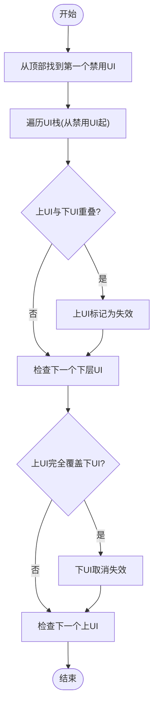

# 界面管理系统

<cite>
**本文引用的文件**
- ui_manager.h
- ui_manager.cpp
- cata_imgui.h
- cata_imgui.cpp
- debug.cpp
- sdltiles.cpp
- proficiency_ui.cpp
- iuse.cpp
- debug_menu.cpp
</cite>

## 目录
1. [简介](#简介)
2. [项目结构](#项目结构)
3. [核心组件](#核心组件)
4. [架构总览](#架构总览)
5. [详细组件分析](#详细组件分析)
6. [依赖关系分析](#依赖关系分析)
7. [性能考量](#性能考量)
8. [故障排查指南](#故障排查指南)
9. [结论](#结论)
10. [附录：扩展与最佳实践](#附录扩展与最佳实践)

## 简介
本文件面向Cataclysm-DDA的界面管理系统，聚焦于ui_adaptor类的设计与实现，系统性阐述UI适配器模式、回调机制、生命周期管理、UI堆栈与窗口层级控制、响应式布局、屏幕尺寸变化处理、重绘优化、光标管理、ImGui与ncurses双渲染模式切换、UI禁用机制以及调试消息界面实现。同时提供扩展开发指南、性能优化技巧与常见问题解决方案。

## 项目结构
界面管理的核心位于src/ui_manager.h与src/ui_manager.cpp，ImGui桥接层在src/cata_imgui.h与src/cata_imgui.cpp中，调试消息界面在src/debug.cpp中使用ui_adaptor::debug_message_ui构造；窗口尺寸变化由SDL路径触发并调用ui_manager::screen_resized；具体UI示例可见proficiency_ui.cpp与iuse.cpp中的ui_adaptor使用方式；性能测试与基准可见debug_menu.cpp。

**图表来源**
- ui_manager.h
- ui_manager.cpp
- cata_imgui.h
- cata_imgui.cpp
- sdltiles.cpp
- debug.cpp
- proficiency_ui.cpp
- iuse.cpp
- debug_menu.cpp

**章节来源**
- ui_manager.h
- ui_manager.cpp

## 核心组件
- ui_adaptor：UI适配器，封装回调、尺寸位置、光标管理、失效标记与重绘调度，负责与ui_manager交互。
- ui_manager命名空间：提供全局重绘、失效、尺寸变更等接口，协调整个UI栈。
- cata_imgui::client：ImGui渲染客户端，支持TUI与非TUI两种模式，负责帧开始/结束、输入处理、颜色对齐等。
- cata_imgui::window：基于ImGui的窗口抽象，内部持有ui_adaptor以实现响应式布局与尺寸变更。
- 调试消息UI：通过ui_adaptor::debug_message_ui构造，确保在重绘回调期间显示不会破坏图形状态。

**章节来源**
- ui_manager.h
- ui_manager.cpp
- cata_imgui.h
- cata_imgui.cpp

## 架构总览
ui_adaptor作为适配器，将具体UI绘制与尺寸计算委托给回调，并通过ui_manager维护的全局UI栈进行统一调度。当发生屏幕尺寸变化或需要重绘时，ui_manager根据失效标记与层级关系决定重绘顺序与范围，ImGui与ncurses渲染路径分别由cata_imgui::client在不同构建配置下接管。

**图表来源**
- ui_manager.cpp
- cata_imgui.cpp

## 详细组件分析

### ui_adaptor设计与生命周期
- 构造与析构：自动加入/移除UI栈；debug_message_ui构造时若处于重绘回调中会设置重启标志，析构时恢复clip区域（TILES）。
- 回调机制：on_redraw与on_screen_resize分别在重绘与尺寸变化时被调用；禁止在回调内构造/销毁其他ui_adaptor或直接调用redraw/screen_resized。
- 尺寸与位置：position/position_from_window/position_absolute三者用于设置UI矩形区域；前者从catacurses::window推导像素/单元格坐标。
- 失效与重绘：invalidate_ui仅标记当前UI；invalidate(rect, reenable_uis_below)可广播失效；redraw/redraw_invalidated驱动重绘循环。
- 光标管理：set_cursor/record_cursor/record_term_cursor/default_cursor/disable_cursor用于记录与恢复光标位置，仅ncurses/TUI有效。

**图表来源**
- ui_manager.h
- ui_manager.cpp
- cata_imgui.h

**章节来源**
- ui_manager.h
- ui_manager.cpp

### UI堆栈管理与窗口层级控制
- UI栈：ui_stack_t为std::vector<std::reference_wrapper<ui_adaptor>>，按后进先出顺序管理。
- 层级禁用：disabling_uis_below为“禁用其下方UI”的开关，影响失效一致性与重绘范围。
- 一致性优化：invalidation_consistency_and_optimization确保被上层遮挡的UI不重绘，避免完全覆盖的下层UI被标记为无效。

**图表来源**
- ui_manager.cpp

**章节来源**
- ui_manager.cpp

### 响应式布局系统
- 尺寸回调：on_screen_resize中创建/更新catacurses::window并调用position_from_window，确保绘制区域与尺寸一致。
- ImGui窗口：cata_imgui::window在draw阶段根据ImGui窗口位置/大小转换为ui_adaptor的绝对像素位置，实现响应式布局。
- 标记重绘：cata_imgui::window::mark_resized会触发关联ui_adaptor::mark_resize，确保下一帧重新计算布局。

**图表来源**
- ui_manager.cpp
- cata_imgui.cpp

**章节来源**
- ui_manager.cpp
- cata_imgui.cpp

### 屏幕尺寸变化处理
- 触发路径：SDL侧窗口尺寸变化后调用ui_manager::screen_resized，该函数将所有UI标记deferred_resize=true并立即触发重绘。
- 回调执行：redraw_invalidated遍历UI栈，遇到deferred_resize且存在resize回调的UI即调用回调完成尺寸初始化。
- 注意事项：回调中禁止构造/销毁ui_adaptor或直接调用redraw/screen_resized，否则可能导致崩溃或闪烁。

**章节来源**
- ui_manager.cpp
- sdltiles.cpp

### 重绘优化策略
- 失效传播：仅当上层UI未失效且与下层UI重叠时才将上层标记为失效，避免不必要的重绘。
- 完全覆盖优化：若上层UI完全覆盖下层UI，则下层UI直接取消失效，减少重绘开销。
- 框架帧：ImGui端通过new_frame/end_frame包裹一帧绘制，避免重复创建/销毁上下文。

**章节来源**
- ui_manager.cpp
- cata_imgui.cpp

### 光标管理机制
- 记录与恢复：record_cursor记录当前窗口内的光标位置，default_cursor在回调返回时恢复到记录位置；仅ncurses/TUI有效。
- 自定义设置：set_cursor允许在回调中显式设置光标位置，便于屏幕阅读器与IME预览。
- 终端光标：record_term_cursor记录刷新时的终端光标位置，避免后续绘制移动导致的光标错位。

**章节来源**
- ui_manager.h
- ui_manager.cpp

### ImGui与ncurses双渲染模式切换逻辑
- TUI模式：cata_imgui::client在TUI宏下使用ImTui实现ncurses渲染，支持颜色对齐与输入事件注入。
- 非TUI模式：使用SDL2/SDLRenderer2实现ImGui渲染，支持字体加载、回退字符绘制与多语言字形范围。
- 模式选择：通过编译宏与构建配置切换，运行时由cata_imgui::client根据环境初始化不同后端。

**章节来源**
- cata_imgui.h
- cata_imgui.cpp
- cata_imgui.cpp

### UI禁用机制
- 禁用语义：disabling_uis_below为true时，该UI之下的所有UI被“禁用”，不会参与重绘/尺寸回调，直到该UI析构。
- 实现细节：在计算失效一致性时，从栈顶找到首个禁用UI，仅对该UI之上的UI进行一致性校验与优化。
- 使用场景：模态对话框、调试消息弹窗等需要阻断底层交互的UI。

**章节来源**
- ui_manager.cpp
- ui_manager.cpp

### 调试消息界面实现
- 构造方式：使用ui_adaptor::debug_message_ui构造特殊UI，确保在重绘回调中显示不会破坏图形状态。
- 重绘重启：若在重绘回调中创建调试UI，会设置restart_redrawing标志，回调返回后重新执行重绘流程。
- 清理与恢复：析构时恢复先前的clip区域（TILES），并清除显示标志。

**章节来源**
- ui_manager.cpp
- debug.cpp

### UI组件扩展开发指南
- 基本步骤
  - 创建ui_adaptor实例，注册on_screen_resize与on_redraw回调。
  - 在resize回调中创建/调整catacurses::window并调用position_from_window。
  - 在redraw回调中仅绘制position指定区域，必要时调用record_cursor/set_cursor。
  - 需要重绘时调用invalidate_ui/mark_resize，避免在回调中直接调用redraw/screen_resized。
- 示例参考
  - proficiency_ui：演示了窗口创建、尺寸回调与位置同步。
  - iuse：展示了在交互循环中持续调用ui_manager::redraw与输入处理。

**章节来源**
- ui_manager.h
- proficiency_ui.cpp
- iuse.cpp

## 依赖关系分析
- ui_manager.h/cpp依赖cata_imgui.h/cpp以驱动ImGui帧；在TILES构建下还依赖SDL相关头文件。
- debug.cpp通过ui_adaptor::debug_message_ui与ui_manager协作，确保调试消息显示安全。
- sdltiles.cpp在窗口尺寸变化时调用ui_manager::screen_resized，形成平台层到UI管理层的依赖链。

**图表来源**
- ui_manager.h
- ui_manager.cpp
- cata_imgui.h
- cata_imgui.cpp
- debug.cpp
- sdltiles.cpp

**章节来源**
- ui_manager.h
- ui_manager.cpp

## 性能考量
- 减少重绘：利用invalidation_consistency_and_optimization避免完全覆盖的下层UI重绘。
- 延迟尺寸：使用deferred_resize与mark_resize，仅在必要时触发resize回调。
- ImGui帧：复用ImGui帧生命周期，避免频繁创建/销毁上下文。
- 文本回退：在非TUI模式下通过回退字符绘制与字体加载策略提升渲染效率。

[本节为通用指导，无需特定文件引用]

## 故障排查指南
- 显示闪烁或错位
  - 检查是否在回调中调用redraw/screen_resized或构造/销毁ui_adaptor。
  - 确认position/position_from_window是否覆盖完整绘制区域。
- 光标异常
  - 在ncurses/TUI下使用record_cursor/set_cursor正确记录与恢复光标。
- 调试消息显示异常
  - 确保使用ui_adaptor::debug_message_ui构造并在回调返回后等待重启重绘。
- 尺寸变化后布局错误
  - 确保on_screen_resize中调用position_from_window并随后mark_resize。

**章节来源**
- ui_manager.h
- ui_manager.cpp
- ui_manager.cpp

## 结论
ui_adaptor通过清晰的回调契约与严格的生命周期管理，将UI绘制与尺寸变化解耦，并借助ui_manager实现高效的堆栈调度与重绘优化。ImGui与ncurses双渲染模式通过cata_imgui::client无缝衔接，满足多平台需求。调试消息UI与禁用机制进一步增强了系统的稳定性与可用性。遵循本文的最佳实践与扩展指南，可高效构建高质量的UI组件。

## 附录：扩展与最佳实践
- 扩展新UI组件
  - 使用ui_adaptor::on_screen_resize创建/调整窗口并调用position_from_window。
  - 在on_redraw中仅绘制指定区域，避免透明度与跨UI绘制。
  - 使用invalidate_ui或invalidate(rect, reenable_uis_below)精确控制重绘范围。
- 性能优化
  - 合理使用deferred_resize与mark_resize，避免频繁重算布局。
  - 利用层级遮挡优化，减少无效重绘。
  - 在非TUI模式下合理配置字体与回退字符绘制。
- 常见问题
  - 不要在回调中构造/销毁ui_adaptor或直接调用redraw/screen_resized。
  - 在ncurses/TUI下正确使用光标记录与恢复API。
  - 调试消息UI需使用debug_message_ui构造并等待重启重绘。

**章节来源**
- ui_manager.h
- ui_manager.cpp
- cata_imgui.cpp