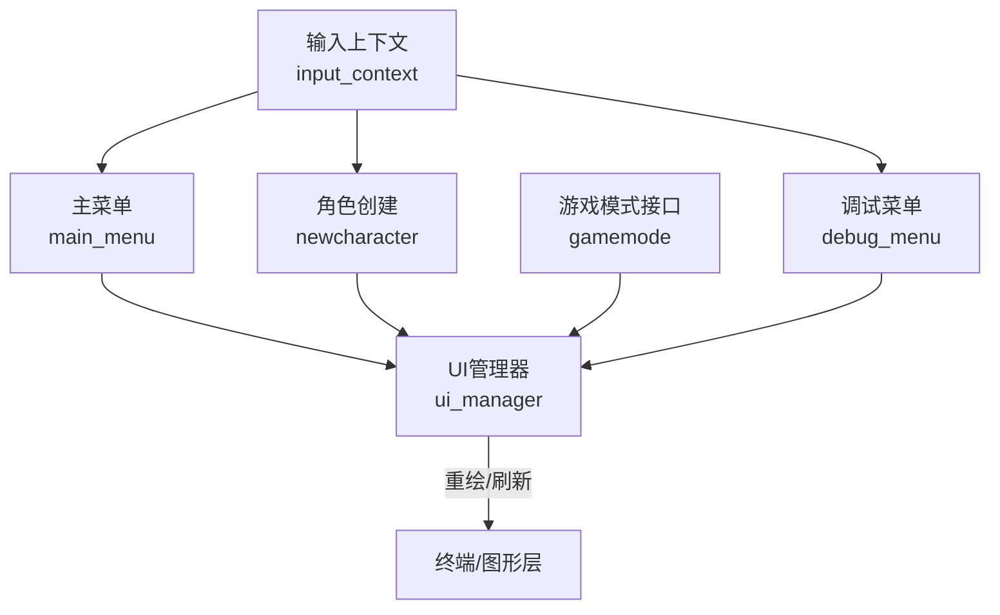
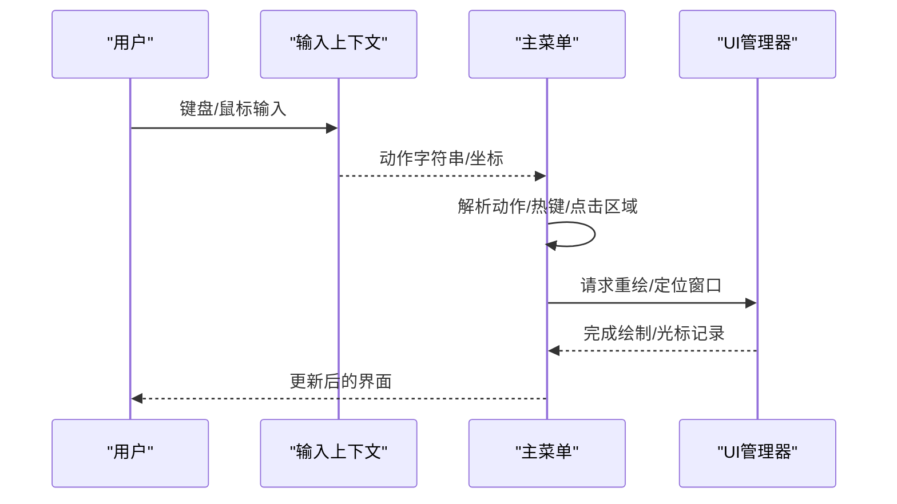
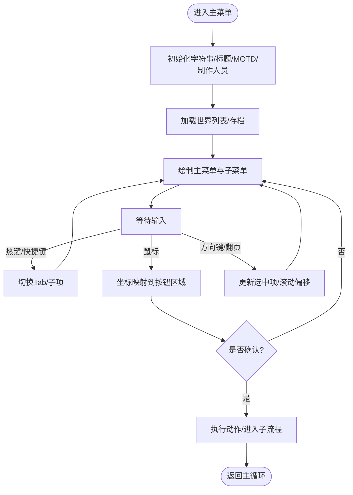
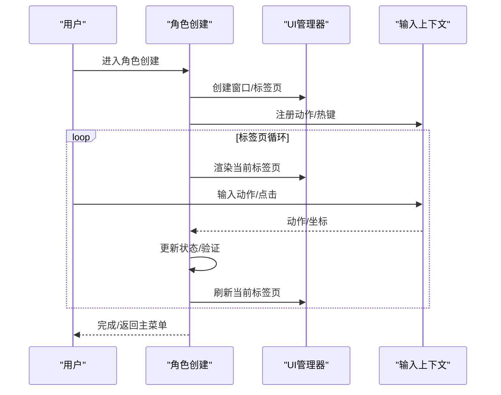
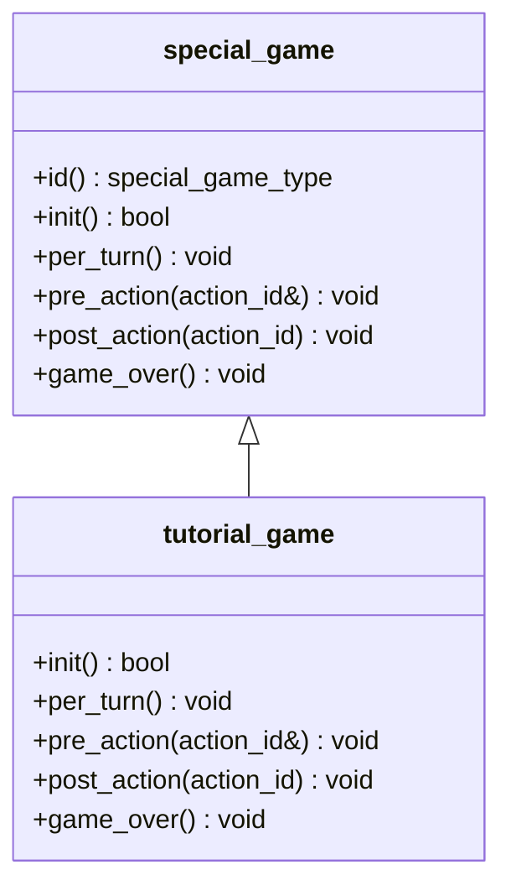
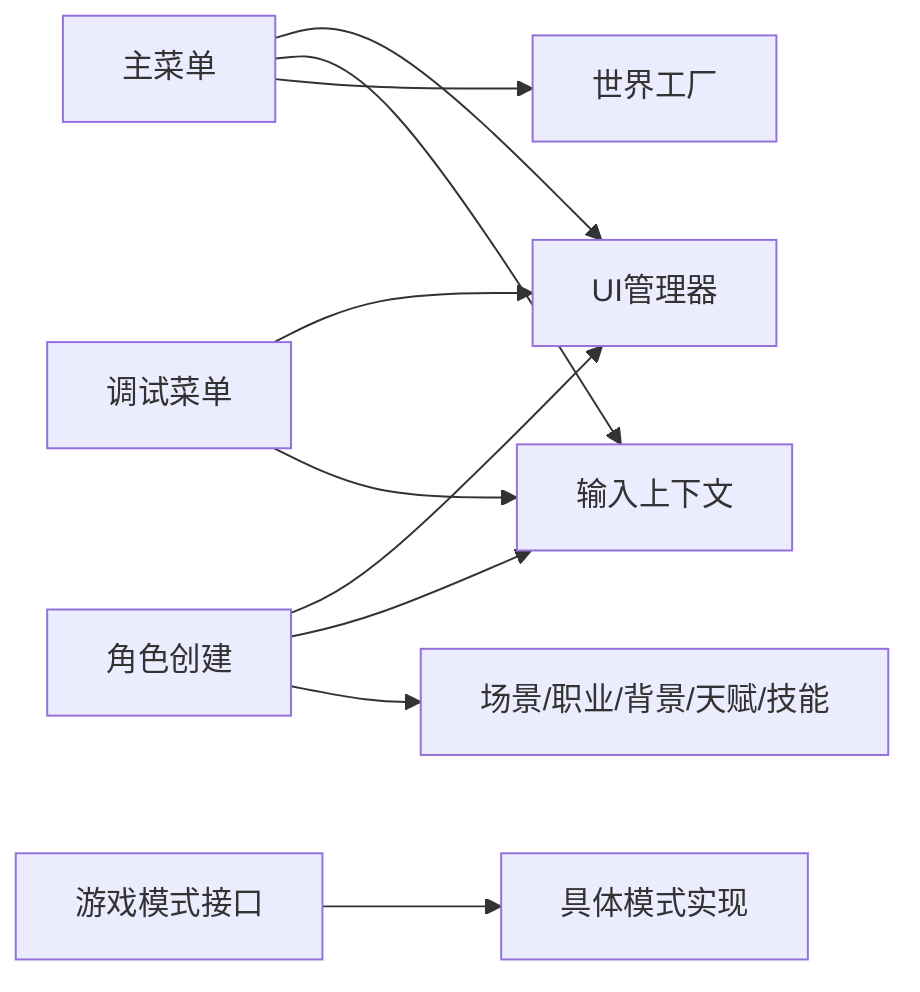

# 菜单系统

<cite>
**本文引用的文件**
- src/main_menu.h
- src/main_menu.cpp
- src/newcharacter.cpp
- src/gamemode.h
- src/gamemode.cpp
- src/ui_manager.h
- src/ui_manager.cpp
- src/input_context.cpp
- src/debug_menu.h
- src/debug_menu.cpp
</cite>

## 目录
1. [简介](#简介)
2. [项目结构](#项目结构)
3. [核心组件](#核心组件)
4. [架构总览](#架构总览)
5. [详细组件分析](#详细组件分析)
6. [依赖关系分析](#依赖关系分析)
7. [性能考量](#性能考量)
8. [故障排查指南](#故障排查指南)
9. [结论](#结论)
10. [附录](#附录)

## 简介
本文件面向Cataclysm-DDA的菜单系统，提供从架构到实现细节的全面技术文档。内容覆盖：
- 主菜单设计：菜单项管理、导航逻辑、视觉呈现与响应式布局
- 角色创建菜单：属性分配、职业与背景、技能与天赋、场景与模板
- 特殊游戏模式菜单：模式选择、参数配置与启动流程
- 菜单状态管理、用户交互处理（键盘/鼠标/触摸）与可访问性支持
- 扩展开发指南：自定义菜单创建、事件处理与样式定制

## 项目结构
菜单系统主要由以下模块构成：
- 主菜单：负责入口界面、Tab切换、子菜单渲染与世界/存档选择
- 角色创建：多标签页的交互式角色构建流程
- 游戏模式：教程等特殊模式的抽象接口
- UI管理：统一的UI栈、重绘与窗口适配机制
- 输入上下文：动作注册、快捷键解析与坐标映射
- 调试菜单：开发者工具菜单（与主菜单并列存在）

图示来源
- src/main_menu.cpp
- src/newcharacter.cpp
- src/gamemode.h
- src/ui_manager.h
- src/input_context.cpp
- src/debug_menu.cpp

章节来源
- src/main_menu.h
- src/main_menu.cpp
- src/newcharacter.cpp
- src/gamemode.h
- src/ui_manager.h
- src/input_context.cpp
- src/debug_menu.cpp

## 核心组件
- 主菜单类：维护标题、MOTD、世界列表、子菜单项与热键；负责绘制、输入处理与子菜单渲染
- 角色创建类：以标签页驱动的角色构建流程，包含点池、场景、职业、背景、属性、天赋、技能、描述等
- 游戏模式接口：抽象特殊模式生命周期（初始化、每回合、前后动作钩子、结束）
- UI管理器：UI栈、重绘调度、屏幕尺寸变化处理、光标记录与恢复
- 输入上下文：动作注册、快捷键匹配、鼠标坐标映射、帮助菜单
- 调试菜单：大量开发者工具入口，与主菜单并列存在

章节来源
- src/main_menu.h
- src/newcharacter.cpp
- src/gamemode.h
- src/ui_manager.h
- src/input_context.cpp
- src/debug_menu.h

## 架构总览
主菜单采用“主界面 + 子菜单”的双层结构，通过输入上下文解析动作与热键，使用UI管理器进行统一重绘与窗口适配。角色创建采用标签页驱动，每个标签页独立处理自身逻辑并通过公共状态推进流程。

图示来源
- src/main_menu.cpp
- src/input_context.cpp
- src/ui_manager.cpp

章节来源
- src/main_menu.cpp
- src/ui_manager.cpp

## 详细组件分析

### 主菜单：设计与实现
- 菜单项与子菜单
  - 主菜单包含若干Tab（如MOTD、新游戏、载入、世界、教程、设置、帮助、制作人员、退出），每个Tab对应一组子选项与热键
  - 子菜单按需渲染，支持滚动与高亮
- 导航与交互
  - 支持左右切换Tab、上下在子菜单中移动、翻页、滚轮/滚轮键滚动
  - 支持热键自动跳转与鼠标点击/悬停
  - 鼠标点击时根据坐标映射到按钮区域，触发确认或移动音效
- 视觉呈现与响应式布局
  - 标题、版本信息、提示语、节日装饰（如万圣节蜘蛛与墓碑）
  - 屏幕尺寸变化时重新计算窗口大小与偏移，确保内容居中与完整显示
  - 文本换行与宽度计算考虑彩色标签与宽字符
- 状态管理
  - 维护当前选中Tab与子项索引、滚动偏移、上次世界位置等状态
  - 语言切换时优雅刷新文本资源

图示来源
- src/main_menu.cpp
- src/main_menu.cpp

章节来源
- src/main_menu.h
- src/main_menu.cpp

### 角色创建菜单：实现原理
- 标签页驱动
  - 标签顺序：点池/模式 → 场景 → 职业 → 背景 → 属性 → 天赋 → 技能 → 描述
  - 每个标签页独立处理输入与渲染，并通过公共状态推进流程
- 点池与规则
  - 支持多种点池模式（生存者、多重池、单池），不同模式下属性、天赋、技能消耗规则不同
  - 实时计算剩余点数与成本变化，提供可视化提示
- 场景与职业
  - 场景影响初始条件与限制；职业决定起始技能、物品、CBM、熟练度与法术
  - 背景（爱好）可叠加额外技能、配方、熟练度与CBM
- 属性与天赋
  - 属性范围受模式限制；高属性以上可能产生额外成本
  - 天赋树遵循依赖关系，启用/禁用会联动增减其他特性
- 技能
  - 基于点池与场景/职业/背景计算初始技能等级与经验
  - 提供快速随机化与重投功能（随机模式）
- 描述与保存
  - 最终生成角色描述，允许命名与保存为模板
  - 初始化阶段应用职业/背景/天赋效果，计算基础属性与抗性

图示来源
- src/newcharacter.cpp
- src/newcharacter.cpp

章节来源
- src/newcharacter.cpp
- src/newcharacter.cpp

### 特殊游戏模式菜单：设计与实现
- 接口抽象
  - 定义特殊模式生命周期回调：初始化、每回合、前后动作钩子、结束
  - 提供名称与工厂函数，便于扩展新增模式
- 教程模式
  - 当前提供教程模式的名称与实例化入口
- 启动流程
  - 在游戏开始时根据选择初始化模式实例，随后在游戏主循环中调用相应回调

图示来源
- src/gamemode.h
- src/gamemode.cpp

章节来源
- src/gamemode.h
- src/gamemode.cpp

### 菜单状态管理与用户交互
- 状态字段
  - 主菜单：当前Tab索引、子项索引、滚动偏移、上次世界位置、窗口句柄、按钮区域映射表
  - 角色创建：标签页位置、点池类型、场景/职业/背景/属性/天赋/技能状态
- 交互处理
  - 输入上下文注册动作与热键，解析快捷键与鼠标坐标
  - 主菜单对Tab切换、子项滚动、确认与退出进行处理
  - 角色创建各标签页独立处理输入并推进流程
- 可访问性与可读性
  - 屏幕阅读模式下提供更简洁的描述
  - 光标记录与恢复，确保屏幕阅读器与输入法预览正常工作

章节来源
- src/main_menu.h
- src/main_menu.cpp
- src/newcharacter.cpp
- src/ui_manager.cpp

### 调试菜单：开发者工具入口
- 调试菜单提供大量开发者工具入口，如愿望物品、刷怪、天气控制、地图编辑、配方解锁、导出导入等
- 与主菜单并列存在，可通过特定方式进入，用于测试与排错

章节来源
- src/debug_menu.h
- src/debug_menu.cpp

## 依赖关系分析
- 主菜单依赖UI管理器进行窗口与重绘管理，依赖输入上下文解析动作与热键，依赖世界工厂获取世界与存档列表
- 角色创建依赖UI管理器与输入上下文，依赖场景、职业、背景、天赋、技能等系统数据
- 游戏模式接口被具体模式实现继承，通过工厂函数注入游戏生命周期
- 调试菜单独立存在，但与主菜单共享输入上下文与UI管理器

图示来源
- src/main_menu.cpp
- src/newcharacter.cpp
- src/gamemode.h
- src/debug_menu.cpp

章节来源
- src/main_menu.cpp
- src/newcharacter.cpp
- src/gamemode.h
- src/debug_menu.cpp

## 性能考量
- 绘制优化
  - UI管理器在重绘时仅重绘被遮挡或失效的区域，避免全屏刷新
  - 标签页与子菜单渲染按需进行，减少无效绘制
- 输入处理
  - 输入上下文集中注册动作，避免重复解析
  - 鼠标坐标映射使用矩形区域快速判断命中
- 字符宽度与文本换行
  - 宽字符与彩色标签宽度计算避免误判导致的换行问题
- 屏幕尺寸变化
  - 通过回调统一处理窗口大小变化，避免频繁重建窗口

## 故障排查指南
- 主菜单无法响应按键或鼠标
  - 检查输入上下文是否正确注册动作与热键
  - 确认UI管理器处于重绘循环中
- 子菜单不显示或显示异常
  - 检查按钮区域映射表是否正确生成
  - 确认窗口尺寸与偏移计算是否正确
- 角色创建卡在某标签页
  - 检查该标签页的状态更新逻辑与输入处理
  - 确认点池与规则计算是否满足当前模式要求
- 调试菜单不可用
  - 确认调试入口是否正确注册，且未被其他UI禁用

章节来源
- src/input_context.cpp
- src/ui_manager.cpp
- src/main_menu.cpp
- src/newcharacter.cpp

## 结论
Cataclysm-DDA的菜单系统通过清晰的模块划分与统一的UI管理机制，实现了主菜单、角色创建、特殊模式与调试菜单的协同工作。其设计强调：
- 可扩展性：通过接口与工厂模式支持新增模式与菜单
- 用户体验：热键、鼠标、滚动与响应式布局提升易用性
- 可维护性：标签页驱动的角色创建流程与集中式输入处理降低复杂度

## 附录
- 自定义菜单创建建议
  - 使用UI管理器的ui_adaptor封装绘制与重绘逻辑
  - 通过输入上下文注册动作与热键，支持鼠标坐标映射
  - 将菜单状态与渲染分离，按需刷新
- 样式与布局
  - 使用统一的颜色与边框绘制函数
  - 注意宽字符与彩色标签的宽度计算
  - 在屏幕尺寸变化时重新计算布局与滚动偏移