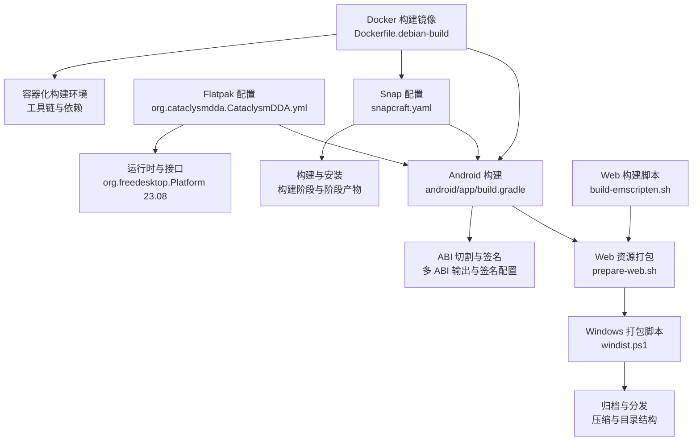
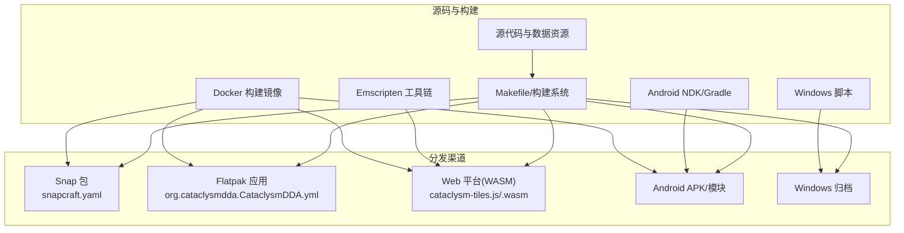
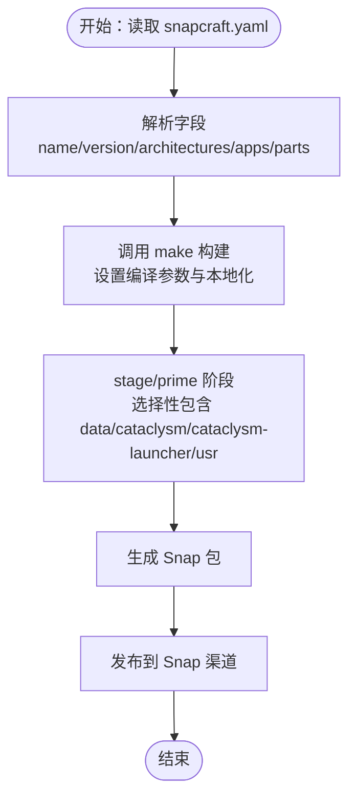
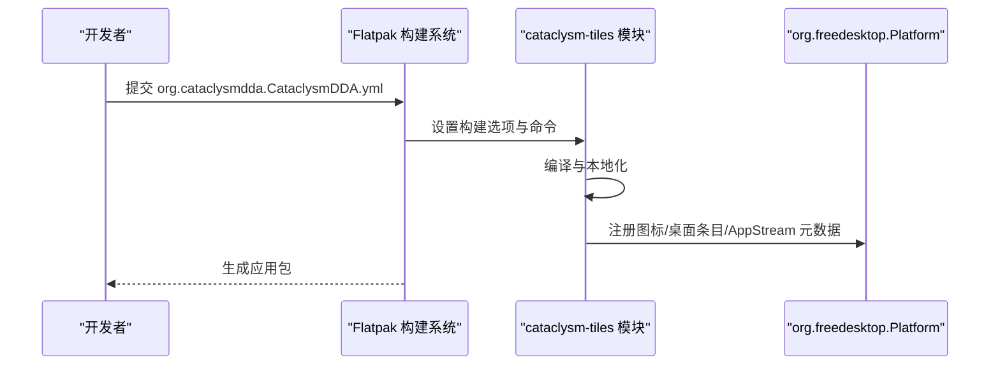
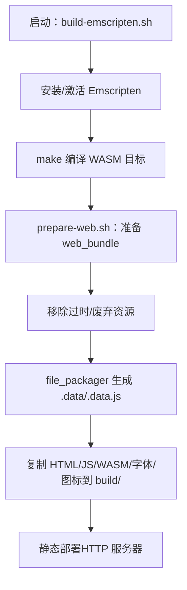
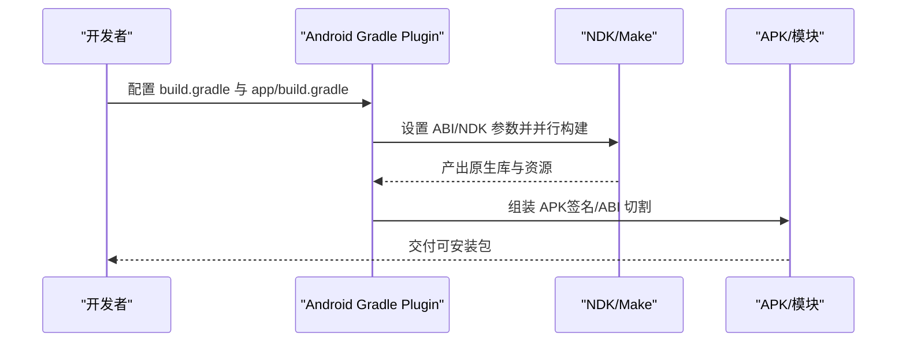
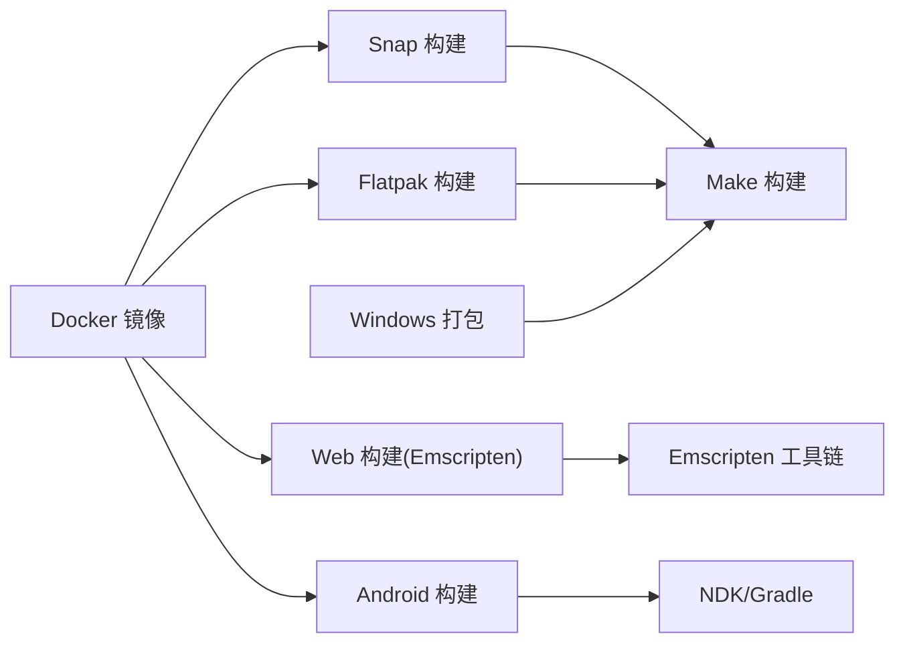

# 分发渠道

<cite>
**本文引用的文件**
- snapcraft.yaml
- org.cataclysmdda.CataclysmDDA.yml
- org.cataclysmdda.CataclysmDDA.desktop
- org.cataclysmdda.CataclysmDDA.appdata.xml
- android/build.gradle
- android/app/build.gradle
- build-scripts/build-emscripten.sh
- build-scripts/prepare-web.sh
- build-scripts/windist.ps1
- build-scripts/Dockerfile.debian-build
</cite>

## 目录
1. [简介](#简介)
2. [项目结构](#项目结构)
3. [核心组件](#核心组件)
4. [架构总览](#架构总览)
5. [详细组件分析](#详细组件分析)
6. [依赖关系分析](#依赖关系分析)
7. [性能考量](#性能考量)
8. [故障排查指南](#故障排查指南)
9. [结论](#结论)
10. [附录](#附录)

## 简介
本文件面向Cataclysm: Dark Days Ahead（简称CDDA）在多平台的分发与发布，系统梳理并解释以下分发方式的技术实现与流程：
- Snap 包：基于 Snapcraft 的打包与发布配置，解释 snapcraft.yaml 中的关键字段与构建策略。
- WebAssembly（Web 平台）：Emscripten 构建脚本与浏览器部署流程，含资源预加载与打包准备。
- Android（APK/模块）：Gradle 构建配置、ABI 切割、签名与性能优化要点。
- Steam 集成：当前仓库未包含 Steamworks 或 Steam 客户端集成相关文件，因此不提供具体接入步骤；可结合通用数字发行流程进行规划。
- Flatpak：基于 org.cataclysmdda.CataclysmDDA.yml 的 Flatpak 模块定义与运行时配置。
- 其他分发：Windows 打包脚本、容器化构建镜像等。

本文件同时给出各平台的测试策略与质量保障建议，帮助团队在不同平台上稳定交付。

## 项目结构
围绕分发渠道的相关文件主要分布在如下位置：
- snapcraft.yaml：Snap 包定义与构建规则
- org.cataclysmdda.CataclysmDDA.yml：Flatpak 模块定义
- data/xdg/*.desktop、*.appdata.xml：桌面入口与应用元数据
- android/：Android 应用与模块构建配置
- build-scripts/：跨平台构建脚本（Emscripten、Web 资源打包、Windows 打包、Docker 构建镜像）
- 其他：Windows 打包脚本 windist.ps1、Dockerfile.debian-build

图表来源
- snapcraft.yaml
- org.cataclysmdda.CataclysmDDA.yml
- android/app/build.gradle
- build-scripts/build-emscripten.sh
- build-scripts/prepare-web.sh
- build-scripts/windist.ps1
- build-scripts/Dockerfile.debian-build

章节来源
- snapcraft.yaml
- org.cataclysmdda.CataclysmDDA.yml
- android/app/build.gradle
- build-scripts/build-emscripten.sh
- build-scripts/prepare-web.sh
- build-scripts/windist.ps1
- build-scripts/Dockerfile.debian-build

## 核心组件
- Snapcraft 配置（snapcraft.yaml）
  - 名称、版本、摘要、图标、描述、等级与封装策略
  - 应用入口命令与运行时环境变量
  - 构建部件（parts）与阶段（stage/prime）策略
- Flatpak 配置（org.cataclysmdda.CataclysmDDA.yml）
  - 运行时与 SDK 版本、命令入口
  - finish-args 接口与权限声明
  - 模块构建系统与安装步骤
- Android 构建（android/app/build.gradle）
  - 多 ABI 切割、产品风味（stable/experimental）、签名配置
  - NDK 构建参数与资源处理
- WebAssembly 构建（build-emscripten.sh、prepare-web.sh）
  - Emscripten 工具链安装与编译参数
  - 数据文件打包与静态资源输出
- Windows 打包（windist.ps1）
  - 可执行文件、调试符号、语言资源与额外文件归档
- 容器化构建（Dockerfile.debian-build）
  - Debian 基础镜像、工具链与依赖安装
  - 用户与工作目录、构建目录与示例构建命令

章节来源
- snapcraft.yaml
- org.cataclysmdda.CataclysmDDA.yml
- android/app/build.gradle
- build-scripts/build-emscripten.sh
- build-scripts/prepare-web.sh
- build-scripts/windist.ps1
- build-scripts/Dockerfile.debian-build

## 架构总览
下图展示从源码到多平台分发产物的整体流程，以及各分发渠道的入口与依赖关系。

图表来源
- snapcraft.yaml
- org.cataclysmdda.CataclysmDDA.yml
- build-scripts/build-emscripten.sh
- android/app/build.gradle
- build-scripts/windist.ps1
- build-scripts/Dockerfile.debian-build

## 详细组件分析

### Snap 包配置与发布流程
- 关键字段说明
  - name、version、summary、icon、description：定义包标识、简述、图标与描述
  - architectures：指定构建与运行架构（当前仅 amd64）
  - grade、confinement：开发级封装与严格沙箱
  - apps.cataclysm：应用入口命令与运行时环境变量（如 LD_LIBRARY_PATH）
  - parts.cataclysm.plugin/make：使用 make 插件，设置构建包与编译参数
  - stage/prime：控制哪些文件进入最终包
- 发布流程要点
  - 使用 snapcraft 构建，遵循 parts 阶段与阶段产物
  - 运行时需满足 ncurses 依赖，入口命令为 cataclysm
  - 严格封装限制了对系统资源的访问，需通过接口或权限声明开放必要能力

图表来源
- snapcraft.yaml

章节来源
- snapcraft.yaml

### Flatpak 配置与运行时接口
- 运行时与 SDK
  - runtime: org.freedesktop.Platform 23.08
  - sdk: org.freedesktop.Sdk
  - 命令入口：cataclysm-tiles
- 权限与接口
  - finish-args 声明音频、Wayland/X11、IPC、GPU 设备等接口
- 模块构建
  - simple 构建系统，设置 MAKE_ARGS（如 PREFIX/LANGUAGES/TILES/SOUND/RELEASE 等）
  - 构建命令：sed 修改 Makefile、执行 make 与 localization、安装图标/桌面条目/AppStream 元数据
  - 源码来源：主仓库与 AppStream 元数据文件

图表来源
- org.cataclysmdda.CataclysmDDA.yml

章节来源
- org.cataclysmdda.CataclysmDDA.yml
- org.cataclysmdda.CataclysmDDA.desktop
- org.cataclysmdda.CataclysmDDA.appdata.xml

### WebAssembly（浏览器）构建与部署
- 构建脚本（build-emscripten.sh）
  - 安装并激活 Emscripten 版本，可选启用 ccache
  - 调用 make 以 emscripten 目标进行编译，设置 RELEASE、TILES、LINTJSON 等参数
- 资源打包（prepare-web.sh）
  - 准备 web_bundle 目录，复制核心数据与 gfx 资源
  - 移除无用/过时资源（如废弃模组、特定 tileset）
  - 使用 Emscripten 的 file_packager 生成 .data 与 .data.js，并预加载至 / 目录
  - 将 HTML、JS/WASM、字体与图标复制到 build 目录，供静态服务器托管

图表来源
- build-scripts/build-emscripten.sh
- build-scripts/prepare-web.sh

章节来源
- build-scripts/build-emscripten.sh
- build-scripts/prepare-web.sh

### Android（APK/模块）构建流程、权限与性能
- Gradle 顶层配置（android/build.gradle）
  - 指定 Android Gradle Plugin 版本与仓库
- 应用模块配置（android/app/build.gradle）
  - 多 ABI 切割：armeabi-v7a/arm64-v8a/x86/x86_64，禁用通用 APK
  - 产品风味：stable/experimental，支持应用 ID 后缀
  - NDK 构建参数与并行任务数，构建类型（release/debug）与调试符号级别
  - 签名配置：支持独立 keystore 文件与别名，错误处理与校验
  - 资源与资产：本地化任务、版本头生成、Windows 符号链接创建
  - 外部原生库：JNI/NDK 集成与 libs 目录
- 权限与接口
  - 当前未在构建脚本中显式声明 Android 权限；若需要网络、存储等权限，请在 AndroidManifest 中补充
- 性能优化建议
  - 启用 ABI 切割减少包体
  - Release 构建关闭调试符号，开启最小混淆与 ProGuard 规则
  - 使用 NDK 并行编译与 ccache 加速
  - 控制资源体积，按需保留 gfx 与数据集

图表来源
- android/build.gradle
- android/app/build.gradle

章节来源
- android/build.gradle
- android/app/build.gradle

### Steam 平台集成与数字发行
- 当前仓库未包含 Steamworks SDK 或 Steam 客户端集成相关文件，无法直接提供具体接入步骤
- 建议流程（概念性）
  - 在 Steamworks 开发者门户注册应用与制品集
  - 集成 Steamworks SDK，实现用户认证、成就、云存档等接口
  - 为各平台准备独立的启动器与运行时（Windows/Linux/macOS）
  - 使用 Steam 自动更新与分发机制，配合 CI/CD 实现自动化发布

[本节为概念性说明，不直接分析具体文件，故不附加章节来源]

### 其他分发方式配置指南
- Windows 打包（windist.ps1）
  - 复制可执行文件与调试符号、语言资源与额外文件
  - 压缩为 ZIP 归档，便于分发
- 容器化构建（Dockerfile.debian-build）
  - 基于 Debian testing，安装 clang、ccache、SDL2 等工具链与依赖
  - 提供构建目录与示例构建命令，便于在容器内复现实验室环境

章节来源
- build-scripts/windist.ps1
- build-scripts/Dockerfile.debian-build

## 依赖关系分析
- Snap 与 Flatpak 共享同一构建目标（tiles 模式），但运行时与封装策略不同
- Android 与 Web 构建分别依赖 NDK/NDKBuild 与 Emscripten 工具链
- Windows 打包脚本依赖已构建的可执行文件与资源树
- 容器化镜像为多平台构建提供一致的工具链与依赖环境

图表来源
- snapcraft.yaml
- org.cataclysmdda.CataclysmDDA.yml
- build-scripts/build-emscripten.sh
- android/app/build.gradle
- build-scripts/windist.ps1
- build-scripts/Dockerfile.debian-build

章节来源
- snapcraft.yaml
- org.cataclysmdda.CataclysmDDA.yml
- android/app/build.gradle
- build-scripts/build-emscripten.sh
- build-scripts/windist.ps1
- build-scripts/Dockerfile.debian-build

## 性能考量
- Snap/Flatpak
  - 严格封装可能带来 I/O 与图形性能开销，建议在 Flatpak 的 finish-args 中按需开放 GPU 与 IPC 接口
- Android
  - 启用 ABI 切割与并行构建，Release 构建关闭调试符号，减少包体与运行时开销
- Web
  - 使用 LZ4 压缩与预加载策略，减少首屏加载时间；控制 gfx 与数据体积
- Windows
  - 保持精简资源，避免不必要的字体与声音资源参与打包
- 容器化构建
  - 使用 ccache 与并行编译提升构建效率；在 CI 中缓存依赖层

[本节为通用指导，不直接分析具体文件，故不附加章节来源]

## 故障排查指南
- Snap
  - 若运行时缺少库，检查 LD_LIBRARY_PATH 是否正确设置
  - 若构建失败，确认 build-packages 与 override-build 参数
- Flatpak
  - 若音频/显示异常，检查 finish-args 中的 socket 与设备权限
  - 若图标/菜单项缺失，核对安装步骤是否成功写入图标/桌面条目/AppStream 元数据
- Android
  - 若签名失败，检查 keystore 文件路径与权限
  - 若 ABI 不匹配，确认 ABI 切割配置与设备架构
- Web
  - 若页面空白，检查 .data.js 与 /data 预加载路径
  - 若字体/资源加载失败，确认 build/ 目录结构与静态服务器配置
- Windows
  - 若归档缺失文件，检查 windist.ps1 中的复制与压缩逻辑
- 容器化构建
  - 若依赖缺失，检查 Dockerfile 中的 apt 安装与用户权限

章节来源
- snapcraft.yaml
- org.cataclysmdda.CataclysmDDA.yml
- android/app/build.gradle
- build-scripts/prepare-web.sh
- build-scripts/windist.ps1
- build-scripts/Dockerfile.debian-build

## 结论
本文件系统梳理了 CDDA 在 Snap、Flatpak、WebAssembly、Android、Windows 与容器化构建等方面的配置与流程。通过明确各分发渠道的入口、权限与构建参数，团队可在多平台上稳定交付高质量版本。对于 Steam 平台，建议结合通用数字发行流程进行规划与实施。

[本节为总结性内容，不直接分析具体文件，故不附加章节来源]

## 附录
- 桌面入口与应用元数据
  - desktop 文件用于桌面环境识别与启动
  - AppStream 元数据用于商店与软件中心展示

章节来源
- org.cataclysmdda.CataclysmDDA.desktop
- org.cataclysmdda.CataclysmDDA.appdata.xml