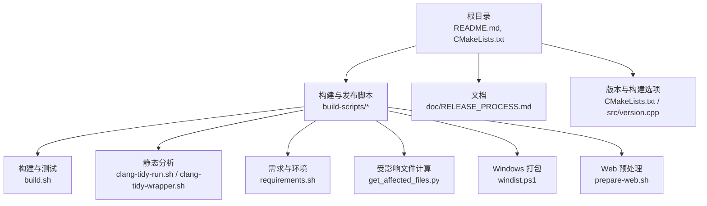
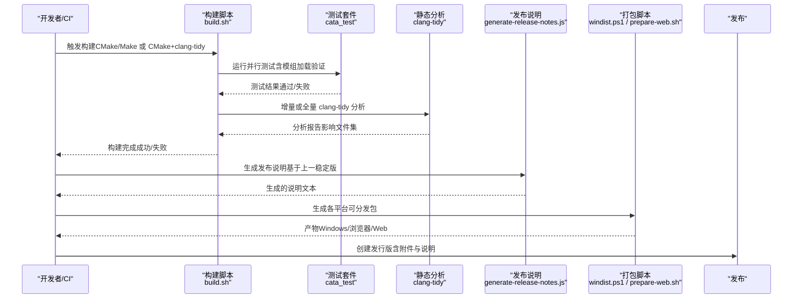
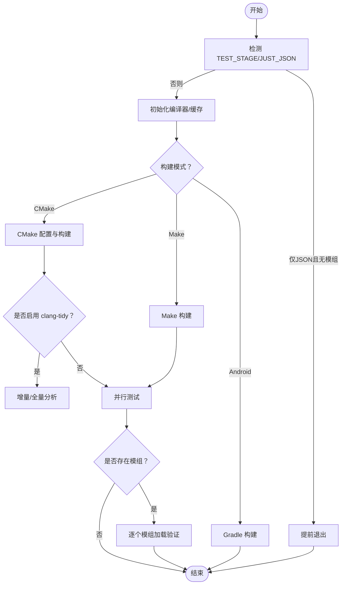
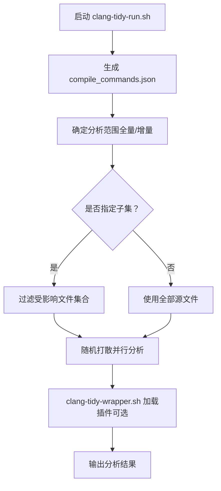
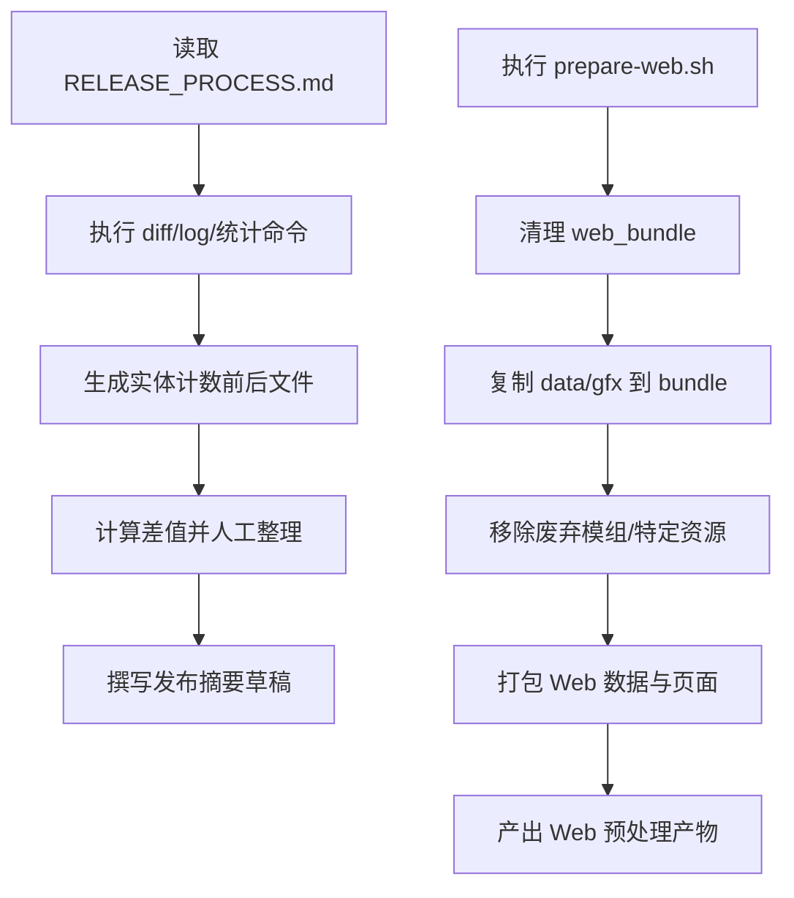
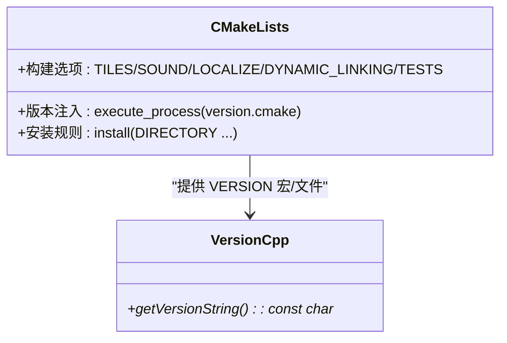
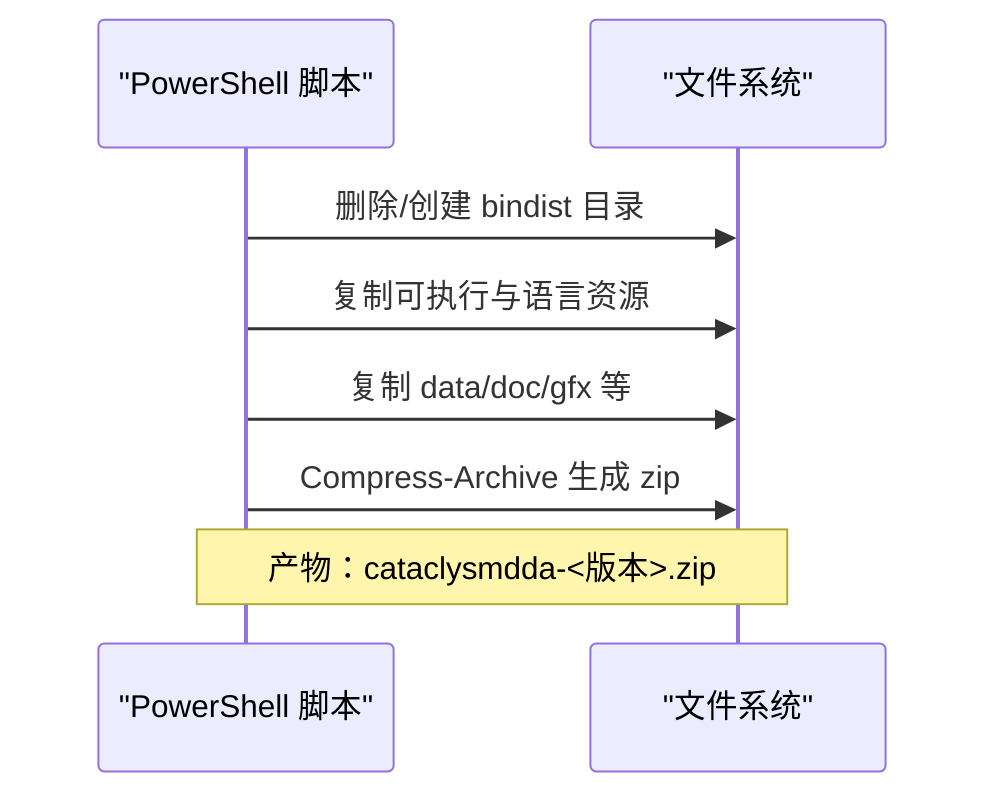
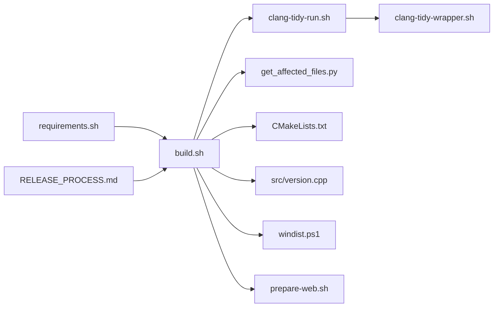

# 发布工作流

<cite>
**本文引用的文件**
- README.md
- RELEASE_PROCESS.md
- generate-release-notes.js
- build.sh
- windist.ps1
- CMakeLists.txt
- version.cpp
- prepare-web.sh
- clang-tidy-run.sh
- clang-tidy-wrapper.sh
- requirements.sh
- get_affected_files.py
</cite>

## 目录
1. [简介](#简介)
2. [项目结构](#项目结构)
3. [核心组件](#核心组件)
4. [架构总览](#架构总览)
5. [详细组件分析](#详细组件分析)
6. [依赖关系分析](#依赖关系分析)
7. [性能考量](#性能考量)
8. [故障排查指南](#故障排查指南)
9. [结论](#结论)
10. [附录](#附录)

## 简介
本文件面向Cataclysm: Dark Days Ahead（简称CDDA）项目的发布工程团队与贡献者，系统化梳理从代码提交到最终发布的完整工作流，覆盖自动化测试集成、持续集成配置、质量门禁设置、发布前准备、自动化脚本使用、发布后监控与反馈处理，以及标准化模板与最佳实践。文档以仓库内现有脚本与配置为依据，结合CMake构建体系与多平台打包脚本，形成可落地的发布操作指南。

## 项目结构
围绕发布相关的目录与文件主要分布在以下位置：
- 根级与顶层：README、CMakeLists.txt、VERSION信息入口等
- 构建与发布脚本：build-scripts 下的各类脚本（构建、测试、静态分析、打包、Web预处理等）
- 文档：doc/RELEASE_PROCESS.md 提供发布流程与变更统计要点
- 平台打包：Windows 打包脚本 windist.ps1；Web 预处理 prepare-web.sh
- 版本与构建选项：CMakeLists.txt 中的构建选项与版本注入逻辑；src/version.cpp 提供运行时版本字符串接口

图表来源
- CMakeLists.txt
- build.sh
- requirements.sh
- get_affected_files.py
- windist.ps1
- prepare-web.sh
- RELEASE_PROCESS.md
- version.cpp

章节来源
- README.md
- CMakeLists.txt
- RELEASE_PROCESS.md

## 核心组件
- 构建与测试流水线：通过 build.sh 统一入口，支持 CMake/Make 双模式、并行测试、跨平台编译、clang-tidy 分析与增量检测。
- 质量门禁与静态分析：clang-tidy-run.sh 与 clang-tidy-wrapper.sh 提供插件/可执行两种模式的检查，并基于受影响文件集合进行增量分析。
- 发布前准备：RELEASE_PROCESS.md 提供变更统计与实体计数差异的生成步骤；prepare-web.sh 用于 Web 平台的数据打包与裁剪。
- 版本与构建选项：CMakeLists.txt 定义构建选项与安装规则；src/version.cpp 暴露版本字符串接口。
- 平台打包：windist.ps1 生成 Windows 可分发包；prepare-web.sh 生成 Web 平台资源包。
- 环境与依赖：requirements.sh 处理问题匹配器、覆盖率、MXE交叉编译、NDK/Android、Wine 初始化等。

章节来源
- build.sh
- clang-tidy-run.sh
- clang-tidy-wrapper.sh
- RELEASE_PROCESS.md
- prepare-web.sh
- CMakeLists.txt
- version.cpp
- requirements.sh

## 架构总览
下图展示从代码提交到发布的关键路径：CI/本地触发构建 → 测试与静态分析 → 质量门禁 → 产物打包 → 发布说明生成 → 发布。

图表来源
- build.sh
- clang-tidy-run.sh
- generate-release-notes.js
- windist.ps1
- prepare-web.sh

## 详细组件分析

### 构建与测试流水线（build.sh）
- 支持多种模式：CMake/Make、CMake+clang-tidy、Android Gradle、Windows（Wine）测试。
- 关键能力：
  - JSON校验与样式检查（仅JSON变更时快速通道）。
  - 并行测试执行，支持模组加载验证与“仅JSON”跳过。
  - clang-tidy 插件/可执行两种模式，自动解析受影响文件集合，按需全量或增量分析。
  - ccache 缓存统计与容量设置，提升重复构建效率。
- 入口与控制流参见源码路径与行号。

图表来源
- build.sh

章节来源
- build.sh

### 静态分析与质量门禁（clang-tidy-run.sh 与 clang-tidy-wrapper.sh）
- clang-tidy-run.sh：
  - 生成 compile_commands.json，解析受影响文件集合（基于 git diff 与 includes 文件）。
  - 支持按子集（直接变更/间接变更）拆分分析任务，提高 CI 效率。
  - 自动识别全局变更（如配置/脚本）触发全量分析。
- clang-tidy-wrapper.sh：
  - 若存在插件库则前置加载，支持检查性能追踪与存储。
- 两者配合实现“按需分析”的质量门禁策略。

图表来源
- clang-tidy-run.sh
- clang-tidy-wrapper.sh

章节来源
- clang-tidy-run.sh
- clang-tidy-wrapper.sh
- get_affected_files.py

### 发布前准备与变更统计（RELEASE_PROCESS.md 与 prepare-web.sh）
- RELEASE_PROCESS.md：
  - 提供变更统计命令（diffstat、提交数、作者数、新增作者）。
  - 实体计数差异生成步骤（JSON 实体前后对比、合并整理）。
- prepare-web.sh：
  - 清理 web_bundle，复制必要数据与 gfx。
  - 移除过时/废弃模组与特定资源，生成 Web 预加载数据包与页面。

图表来源
- RELEASE_PROCESS.md
- prepare-web.sh

章节来源
- RELEASE_PROCESS.md
- prepare-web.sh

### 版本与构建选项（CMakeLists.txt 与 version.cpp）
- CMakeLists.txt：
  - 定义构建选项（图形界面、声音、本地化、动态/静态链接、测试、clang-tidy 插件等）。
  - 通过 version.cmake 注入版本信息至 VERSION.txt 与编译宏。
  - 安装规则与平台差异化处理（Unix 前缀数据目录、Mac 特定定义等）。
- version.cpp：
  - 提供运行时版本字符串接口，兼容 Windows/非 Git 环境下的默认版本。

图表来源
- CMakeLists.txt
- version.cpp

章节来源
- CMakeLists.txt
- version.cpp

### 平台打包（windist.ps1 与 prepare-web.sh）
- windist.ps1：
  - 清理旧目录，复制核心可执行与语言资源。
  - 复制 data、doc、gfx、许可证与 README 等。
  - 使用压缩归档生成 zip 包。
- prepare-web.sh：
  - 生成 web_bundle，裁剪废弃模组与特定 gfx。
  - 使用 Emscripten 的 file_packager 生成预加载数据与页面。

图表来源
- windist.ps1

章节来源
- windist.ps1
- prepare-web.sh

### 环境与依赖（requirements.sh）
- 问题匹配器：在 CI 中启用 Catch2 与调试消息的问题匹配器，便于定位错误。
- 条件构建：根据事件类型（PR）判断是否仅 JSON 变更，决定是否跳过全量构建。
- 依赖安装：macOS 安装 SDL2/ncurses/ccache 等；MXE 交叉编译环境准备；Wine 初始化。
- 环境变量持久化：在 GitHub Actions 中将关键变量写入 GITHUB_ENV。

章节来源
- requirements.sh

## 依赖关系分析
- 构建脚本依赖：
  - build.sh 依赖 CMakeLists.txt 的构建选项与安装规则，依赖 clang-tidy-run.sh 的增量分析能力。
  - clang-tidy-run.sh 依赖 get_affected_files.py 计算受影响文件，依赖 clang-tidy-wrapper.sh 的插件加载。
  - requirements.sh 在 CI 中为后续步骤提供环境与工具。
- 打包脚本依赖：
  - windist.ps1 依赖已构建产物与语言资源；prepare-web.sh 依赖 Emscripten 工具链与数据目录。
- 文档与流程：
  - RELEASE_PROCESS.md 为发布摘要与实体统计提供步骤指引。

图表来源
- requirements.sh
- build.sh
- clang-tidy-run.sh
- clang-tidy-wrapper.sh
- get_affected_files.py
- CMakeLists.txt
- version.cpp
- windist.ps1
- prepare-web.sh
- RELEASE_PROCESS.md

章节来源
- build.sh
- clang-tidy-run.sh
- get_affected_files.py
- requirements.sh
- CMakeLists.txt
- version.cpp
- windist.ps1
- prepare-web.sh
- RELEASE_PROCESS.md

## 性能考量
- 并行与缓存：
  - build.sh 使用并行测试与 ccache，提升重复构建速度。
  - clang-tidy-run.sh 对受影响文件集合进行随机打散并行分析，缩短 CI 时间。
- 增量分析：
  - 通过 get_affected_files.py 基于 includes 与 git diff 计算受影响文件，避免全量分析。
- 资源裁剪：
  - prepare-web.sh 移除废弃模组与特定 gfx，减少 Web 包体积与加载时间。

章节来源
- build.sh
- clang-tidy-run.sh
- get_affected_files.py
- prepare-web.sh

## 故障排查指南
- 构建失败（缺少依赖）：
  - 检查 CMakeLists.txt 中的依赖查找与错误提示，确保 SDL2/ncurses/SDL_ttf 等库正确安装。
- 测试失败（并行/模组加载）：
  - 查看 build.sh 中的测试调用与并行参数，确认模组列表与加载开关。
- 静态分析异常：
  - 若插件未生成，clang-tidy-run.sh 将直接退出；检查插件构建与路径。
  - 若受影响文件集合为空，确认 includes 生成与 git diff 结果。
- Windows 打包失败：
  - 检查 windist.ps1 中的复制路径与压缩命令，确认可执行与资源齐全。
- 发布说明生成失败：
  - 检查 generate-release-notes.js 的 GitHub Token、仓库名与标签名参数，确认 API 返回状态。

章节来源
- CMakeLists.txt
- build.sh
- clang-tidy-run.sh
- windist.ps1
- generate-release-notes.js

## 结论
本发布工作流以脚本化与模块化为核心，结合 CMake 构建体系与多平台打包脚本，实现了从代码提交到发布产物的自动化闭环。通过质量门禁（测试与 clang-tidy）、增量分析与资源裁剪，显著提升了发布效率与稳定性。建议在实际发布中严格遵循本文模板与最佳实践，确保每次发布均可追溯、可验证、可回滚。

## 附录

### 发布流程标准化模板（步骤清单）
- 准备阶段
  - 确认版本标签与分支状态，更新版本信息（CMakeLists.txt 注入）。
  - 运行 RELEASE_PROCESS.md 中的统计命令，生成变更摘要与实体计数差异。
- 构建与测试
  - 执行 requirements.sh 初始化环境与依赖。
  - 运行 build.sh 完成构建与并行测试，必要时启用 clang-tidy 增量分析。
- 质量门禁
  - 检查测试通过与 clang-tidy 报告，修复阻塞性问题。
- 打包
  - Windows：执行 windist.ps1 生成 zip 包。
  - Web：执行 prepare-web.sh 生成预处理包。
- 发布说明
  - 使用 generate-release-notes.js 基于上一稳定版自动生成说明草稿。
- 发布与验证
  - 在发布平台上传产物与说明，验证下载与运行。
- 发布后监控
  - 收集用户反馈与日志，建立紧急修复流程与热修复版本发布计划。

章节来源
- RELEASE_PROCESS.md
- CMakeLists.txt
- build.sh
- requirements.sh
- windist.ps1
- prepare-web.sh
- generate-release-notes.js