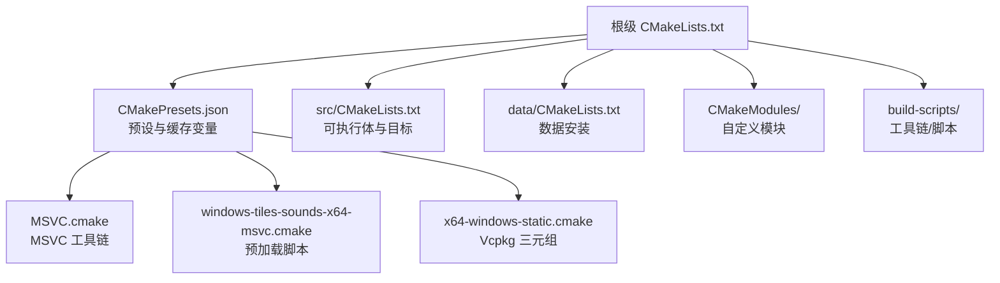
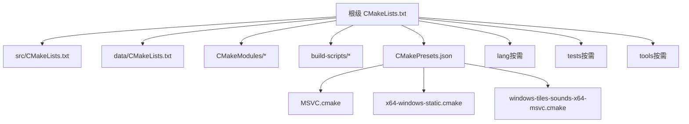
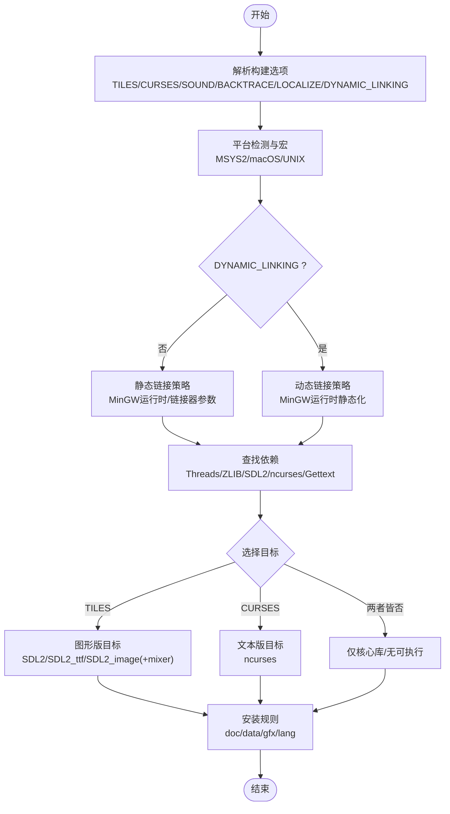
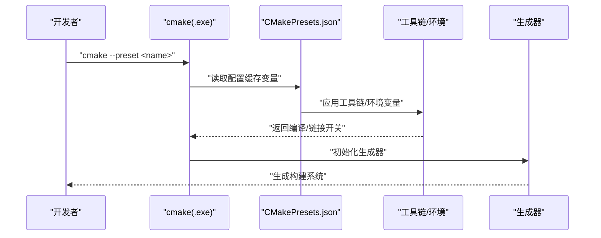
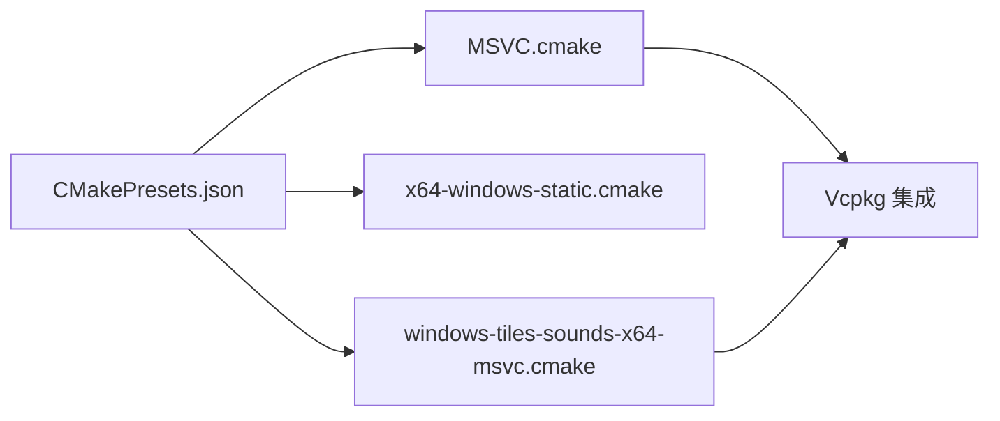
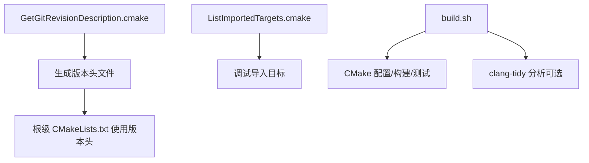
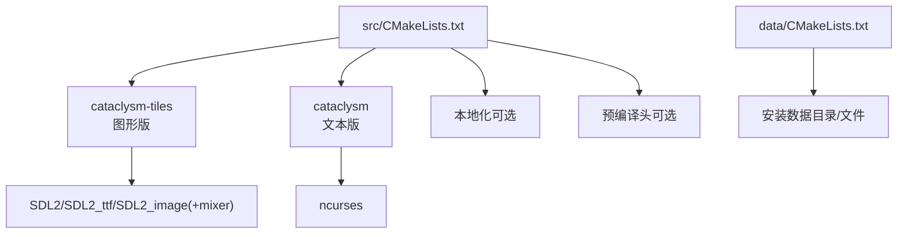
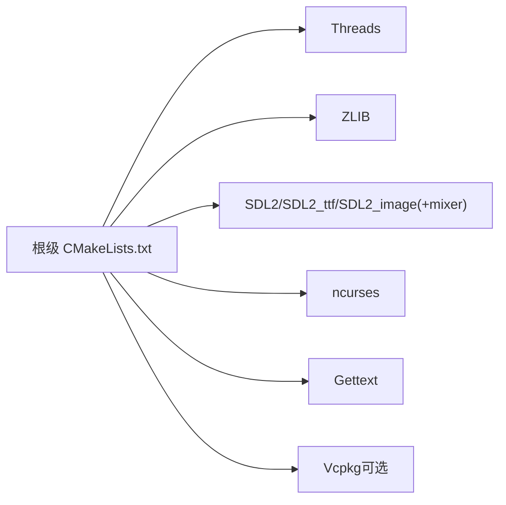

# 构建系统

<cite>
**本文引用的文件**   
- CMakeLists.txt
- CMakePresets.json
- CMakeUserPresets.json.in
- ListImportedTargets.cmake
- GetGitRevisionDescription.cmake
- build.sh
- MSVC.cmake
- x64-windows-static.cmake
- windows-tiles-sounds-x64-msvc.cmake
- src/CMakeLists.txt
- data/CMakeLists.txt
</cite>

## 目录
1. [简介](#简介)
2. [项目结构](#项目结构)
3. [核心组件](#核心组件)
4. [架构总览](#架构总览)
5. [详细组件分析](#详细组件分析)
6. [依赖关系分析](#依赖关系分析)
7. [性能考虑](#性能考虑)
8. [故障排除指南](#故障排除指南)
9. [结论](#结论)
10. [附录](#附录)

## 简介
本文件面向Cataclysm-DDA的CMake构建系统，系统性梳理主构建配置、CMake预设与平台特定工具链、构建脚本、模块化组织与依赖管理、编译选项与跨平台配置，并提供性能优化与最佳实践建议。目标是帮助开发者在Windows（MSVC/MinGW）、Linux等平台上快速、稳定地完成图形版（TILES/SOUND）与文本版（CURSES）的构建。

## 项目结构
仓库中与构建系统直接相关的顶层文件与目录如下：
- 根级主CMakeLists.txt：定义全局构建选项、平台检测、依赖查找、子目录添加与安装规则
- CMakePresets.json：集中定义多平台、多生成器的“预设”（configure/build/test），覆盖Windows（MinGW/MSVC/ClangCL）与Linux
- build-scripts/：包含工具链文件、用户预设模板、CI/本地构建脚本与若干辅助CMake片段
- CMakeModules/：自定义模块（如Git版本提取、导入目标调试）
- src/data：分别作为可安装的数据资源与可执行体的源代码树，通过各自CMakeLists进行组织

图表来源
- CMakeLists.txt
- CMakePresets.json
- MSVC.cmake
- x64-windows-static.cmake
- windows-tiles-sounds-x64-msvc.cmake
- src/CMakeLists.txt
- data/CMakeLists.txt

章节来源
- CMakeLists.txt
- CMakePresets.json

## 核心组件
- 主构建入口与全局选项
  - 全局构建选项：TILES、CURSES、SOUND、BACKTRACE、LIBBACKTRACE、USE_XDG_DIR、USE_HOME_DIR、USE_PREFIX_DATA_DIR、LOCALIZE、LANGUAGES、DYNAMIC_LINKING、JSON_FORMAT、CATA_CCACHE、CATA_CLANG_TIDY_*、TESTS、CATA_CLANG_TIDY_INCLUDE_DIR、CATA_CHECK_CLANG_TIDY、GIT_BINARY、GETTEXT_MSGFMT_BINARY
  - 平台检测与宏：根据系统名设置OS相关宏；MSYS2环境识别
  - 静态/动态链接策略：依据DYNAMIC_LINKING切换链接模式，Windows下对MinGW运行时进行静态链接处理
  - 版本注入：通过自定义脚本从Git获取版本并生成头文件
  - 编译器警告与标准：设置C++17、警告集合、调试/发布标志
  - 子目录：lang、src、data、tests、tools等按需启用
- 预设系统
  - Windows（MinGW）：Ninja Multi-Config，支持TILES/CURSES/SOUND组合
  - Windows（MSVC）：Visual Studio 17 2022，集成Vcpkg，静态链接，支持tiles/sounds
  - Linux：Ninja Multi-Config，支持动态/静态链接与tiles/sounds
  - 预设间继承与环境变量传递，便于CI复用
- 工具链与平台适配
  - MSVC.cmake：统一编译/链接开关、编译定义、Vcpkg集成
  - x64-windows-static.cmake：Vcpkg三元组静态化
  - windows-tiles-sounds-x64-msvc.cmake：预加载脚本，确保Vcpkg根路径可用
- 模块与脚本
  - GetGitRevisionDescription.cmake：从Git提取版本描述，保证每次提交触发重配置
  - ListImportedTargets.cmake：调试导入目标定位
  - build.sh：CI/本地构建脚本，支持clang-tidy插件/可执行模式、测试并行化、Android构建等

章节来源
- CMakeLists.txt
- CMakePresets.json
- MSVC.cmake
- x64-windows-static.cmake
- windows-tiles-sounds-x64-msvc.cmake
- GetGitRevisionDescription.cmake
- ListImportedTargets.cmake
- build.sh

## 架构总览
下图展示从根CMakeLists到各子模块、预设与工具链的交互关系：

图表来源
- CMakeLists.txt
- src/CMakeLists.txt
- data/CMakeLists.txt
- CMakePresets.json
- MSVC.cmake
- x64-windows-static.cmake
- windows-tiles-sounds-x64-msvc.cmake

## 详细组件分析

### 主构建配置（根级 CMakeLists.txt）
- 构建选项与默认值
  - TILES/CURSES互斥：图形版禁用文本版
  - USE_XDG_DIR与USE_HOME_DIR互斥：优先XDG
  - USE_PREFIX_DATA_DIR仅在UNIX且release时生效
  - DYNAMIC_LINKING影响链接策略与MinGW运行时静态化
  - BACKTRACE/LIBBACKTRACE控制崩溃回溯能力与平台链接
  - LOCALIZE与LANGUAGES控制语言资源编译范围
  - TESTS/JSON_FORMAT/CATA_CCACHE/CATA_CLANG_TIDY_*用于开发与质量流程
- 平台与编译器
  - macOS/Darwin宏与SDL2库条件编译
  - MSYS2宏与兼容处理
  - 警告集合与调试/发布标志
- 依赖与目标
  - Threads、ZLIB必需
  - TILES模式：SDL2/SDL2_ttf/SDL2_image（可选SDL2_mixer）
  - CURSES模式：ncurses（Windows下支持Vcpkg pdcurses或MSYS2）
  - 安装规则：doc、README/License、gfx（按策略）、lang（按需）

图表来源
- CMakeLists.txt

章节来源
- CMakeLists.txt

### CMake 预设系统（CMakePresets.json）
- 预设类型
  - Windows x64（MinGW/Ninja Multi-Config）：CURSES为主，可选TILES/SOUND
  - Windows x64（MSVC/VS2022）：静态链接，集成Vcpkg，支持tiles/sounds
  - Linux x64（GCC/Ninja Multi-Config）：动态/静态可选
  - Linux x64（Vcpkg）：通过环境变量与manifest集成
- 继承与环境
  - 预设可继承，减少重复配置
  - 通过环境变量（如VCPKG_ROOT）与工具链文件（CMAKE_TOOLCHAIN_FILE）统一依赖管理
- 用户预设模板
  - CMakeUserPresets.json.in 提供用户侧构建预设模板，便于本地复用

图表来源
- CMakePresets.json
- CMakeUserPresets.json.in

章节来源
- CMakePresets.json
- CMakeUserPresets.json.in

### 平台特定工具链与预加载脚本
- MSVC.cmake
  - 统一编译/链接开关与编译定义
  - 强制UTF-8、多进程编译、禁用部分安全检查等
  - 集成Vcpkg，设置manifest目录
- x64-windows-static.cmake
  - Vcpkg三元组：x64、CRT/库均静态
- windows-tiles-sounds-x64-msvc.cmake
  - 在MSVC预设前加载，确保Vcpkg根路径可用

图表来源
- MSVC.cmake
- x64-windows-static.cmake
- windows-tiles-sounds-x64-msvc.cmake

章节来源
- MSVC.cmake
- x64-windows-static.cmake
- windows-tiles-sounds-x64-msvc.cmake

### 模块与脚本
- GetGitRevisionDescription.cmake
  - 从Git提取版本描述，保证每次提交触发重配置
  - 支持指定git二进制路径
- ListImportedTargets.cmake
  - 调试用途：打印导入目标位置与属性
- build.sh
  - CI/本地构建脚本，支持clang-tidy插件/可执行模式、测试并行化、Android构建
  - 可通过环境变量控制编译器、是否导出compile_commands.json、是否启用clang-tidy

图表来源
- GetGitRevisionDescription.cmake
- ListImportedTargets.cmake
- build.sh

章节来源
- GetGitRevisionDescription.cmake
- ListImportedTargets.cmake
- build.sh

### 源码与数据安装（src/data）
- src/CMakeLists.txt
  - 条件构建：TILES（图形版）与CURSES（文本版）目标
  - 图形版：SDL2/SDL2_ttf/SDL2_image（可选mixer），Windows下附加系统库
  - 文本版：ncurses（Windows下支持pdcurses或MSYS2）
  - 本地化：按需包含gettext/iconv头与库
  - 预编译头（非导出编译命令时）加速编译
- data/CMakeLists.txt
  - 定义数据目录与文件列表
  - release时安装至系统前缀或相对路径

图表来源
- src/CMakeLists.txt
- data/CMakeLists.txt

章节来源
- src/CMakeLists.txt
- data/CMakeLists.txt

## 依赖关系分析
- 耦合与内聚
  - 根级CMakeLists集中管理全局选项与依赖，内聚度高；通过子目录解耦具体目标
  - 预设与工具链文件通过CMAKE_TOOLCHAIN_FILE/CMAKE_PROJECT_INCLUDE_BEFORE注入，降低重复配置
- 外部依赖
  - 必需：Threads、ZLIB
  - 可选：SDL2/SDL2_ttf/SDL2_image/SDL2_mixer（图形版）、ncurses（文本版）、Gettext（本地化）
- 循环依赖
  - 未见循环依赖迹象；依赖方向清晰（根->子->第三方）

图表来源
- CMakeLists.txt
- src/CMakeLists.txt

章节来源
- CMakeLists.txt
- src/CMakeLists.txt

## 性能考虑
- 并行与缓存
  - 启用CATA_CCACHE并在CI中增大缓存容量，显著缩短二次构建时间
  - Ninja Multi-Config与多核编译提升整体效率
- 编译优化
  - Release构建使用RelWithDebInfo，兼顾体积与调试信息
  - 静态链接可减少运行时依赖，但会增加体积与链接时间
- 预编译头
  - 图形版在非导出compile_commands.json时启用预编译头，减少编译时间
- 依赖最小化
  - 仅在需要时开启SOUND/TILES，避免不必要的库查找与链接

章节来源
- CMakeLists.txt
- src/CMakeLists.txt
- build.sh

## 故障排除指南
- Git不可用导致版本为空
  - 现象：构建版本显示为NULL并给出警告
  - 处理：安装Git或通过-DGIT_BINARY指定路径
- 依赖缺失
  - SDL2/SDL2_ttf/SDL2_image/SDL2_mixer或ncurses未找到
  - 处理：安装对应开发包；Windows下可使用Vcpkg或MSYS2包管理器
- 链接问题（Windows）
  - MinGW静态链接：确保未混用动态/静态运行时；必要时显式设置链接器参数
  - MSVC静态链接：通过Vcpkg三元组与工具链文件统一
- 预设环境变量
  - VCPKG_ROOT/VCPKG_INSTALLATION_ROOT未设置导致Vcpkg不可用
  - 处理：在环境或CMake缓存中设置，或使用预加载脚本自动推断
- 测试失败
  - 使用build.sh提供的并行测试框架，结合日志过滤与种子随机化定位问题

章节来源
- CMakeLists.txt
- CMakeLists.txt
- MSVC.cmake
- windows-tiles-sounds-x64-msvc.cmake
- build.sh

## 结论
该构建系统以根级CMakeLists为核心，结合CMakePresets.json实现跨平台、多生成器的标准化配置；通过MSVC/x64-windows-static等工具链文件与预加载脚本，统一依赖管理与平台适配；配合GetGitRevisionDescription与ListImportedTargets等模块，既保证构建稳定性又便于调试。建议在日常开发中优先使用预设，按需启用功能特性，并充分利用缓存与并行能力提升效率。

## 附录
- 常用构建命令示例（基于预设）
  - Windows（MinGW，文本版）：cmake --preset windows-x64
  - Windows（MSVC，图形版+音效）：cmake --preset windows-tiles-sounds-x64-msvc
  - Linux（GCC，图形版+音效）：cmake --preset linux-tiles-sounds-x64
  - Linux（Vcpkg）：cmake --preset linux-tiles-sounds-x64-vcpkg
- 自定义构建配置最佳实践
  - 明确目标：先确定TILES/CURSES/SOUND组合，再选择生成器与工具链
  - 依赖前置：优先使用Vcpkg统一管理第三方库，减少系统差异
  - 编译器一致性：同一预设内保持编译器与标准一致
  - 日志与诊断：启用CATA_CCACHE与详细日志，利用ListImportedTargets排查依赖问题