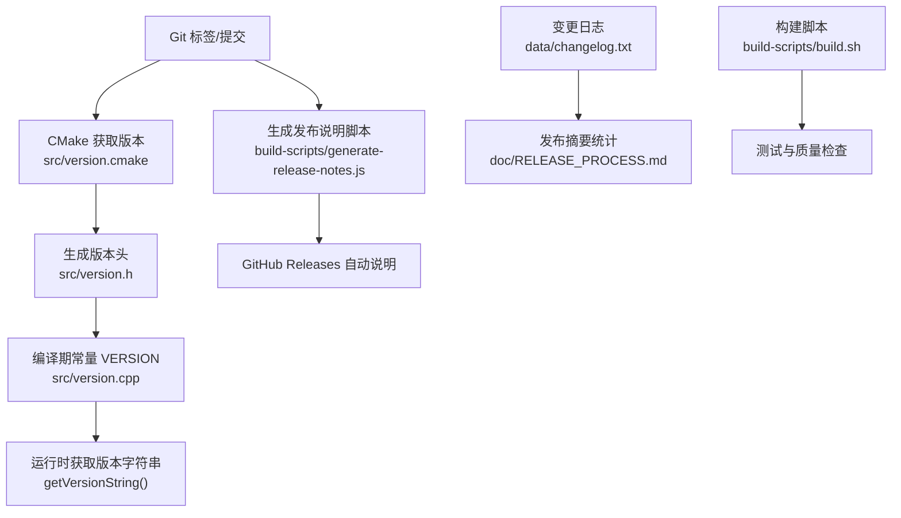
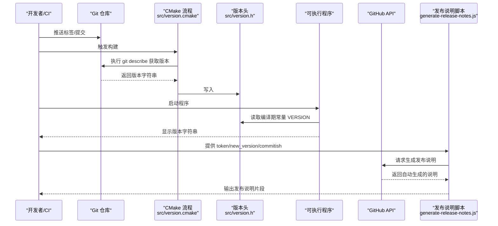
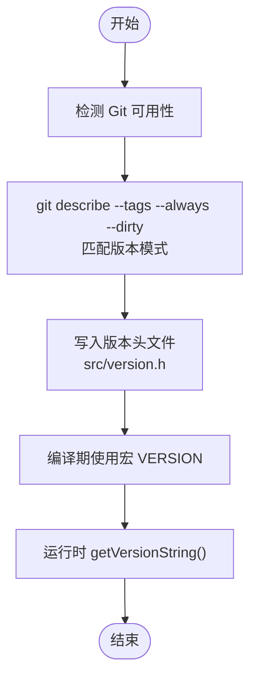
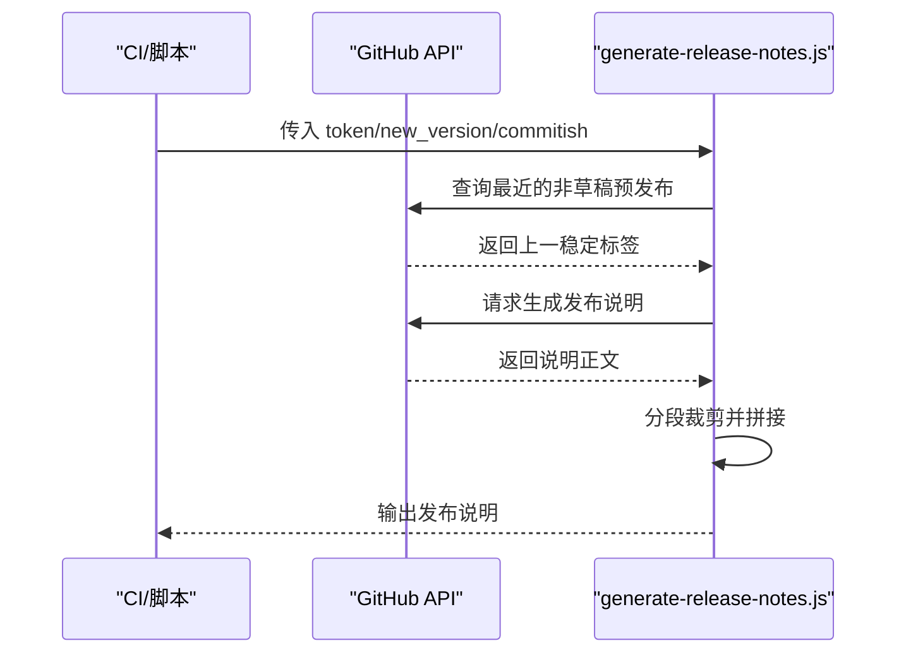
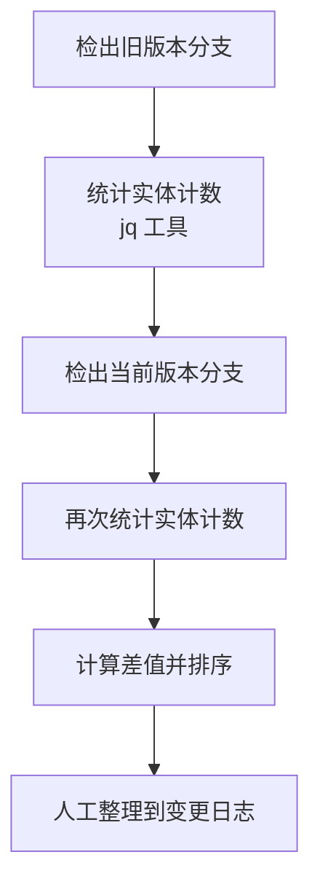
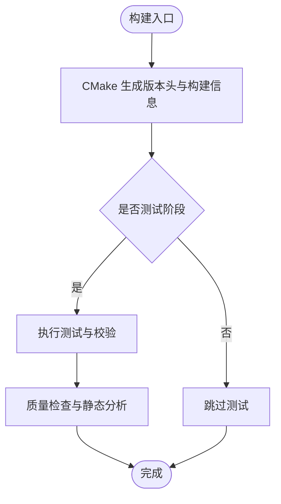
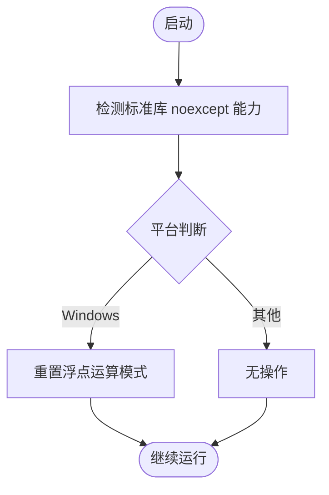
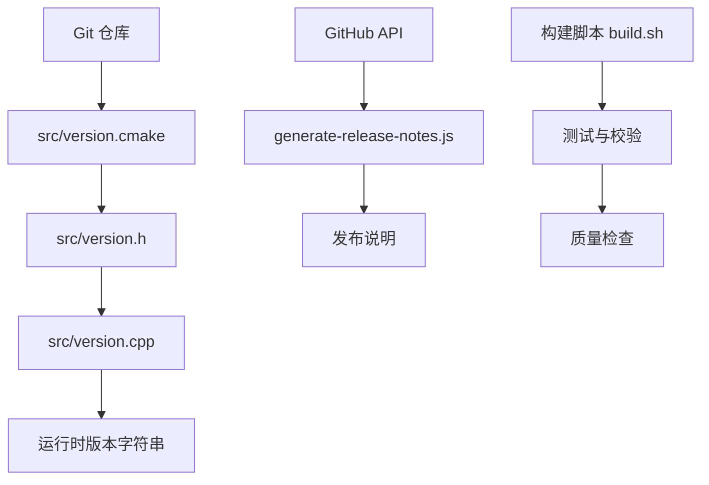

# 版本管理

<cite>
**本文引用的文件**
- README.md
- RELEASE_PROCESS.md
- CHANGELOG_GUIDELINES.md
- changelog.txt
- version.cmake
- version.cpp
- generate-release-notes.js
- build.sh
- compatibility.h
- compatibility.cpp
- build.gradle
</cite>

## 目录
1. [简介](#简介)
2. [项目结构](#项目结构)
3. [核心组件](#核心组件)
4. [架构总览](#架构总览)
5. [详细组件分析](#详细组件分析)
6. [依赖关系分析](#依赖关系分析)
7. [性能考量](#性能考量)
8. [故障排查指南](#故障排查指南)
9. [结论](#结论)
10. [附录](#附录)

## 简介
本文件面向Cataclysm: Dark Days Ahead（简称CDDA）项目的版本管理与发布流程，系统化梳理版本号管理策略、语义化版本控制应用、版本标签规范、发布说明生成脚本、变更日志结构与维护方法、版本兼容性检查与向后兼容保障、破坏性变更处理策略，以及标准化的发布流程（含测试验证、质量检查、发布准备）、版本回滚与紧急修复流程。

## 项目结构
围绕版本管理的关键目录与文件：
- 源码版本注入：CMake与平台构建脚本负责从Git描述生成版本常量，并输出构建信息文件
- 发布说明与流程：文档与脚本共同定义发布摘要统计、实体计数差异、自动化发布说明生成
- 变更日志：长期维护的文本型变更记录，按版本分节组织
- 兼容性与平台适配：跨平台兼容性检测与平台特定初始化逻辑

**图表来源**
- version.cmake
- version.cpp
- generate-release-notes.js
- RELEASE_PROCESS.md
- changelog.txt
- build.sh

**章节来源**
- README.md
- RELEASE_PROCESS.md
- CHANGELOG_GUIDELINES.md
- changelog.txt
- version.cmake
- version.cpp
- generate-release-notes.js
- build.sh

## 核心组件
- 版本号生成与注入
  - 通过CMake模块从Git描述生成版本字符串，写入版本头文件，并在编译期以宏形式暴露
  - 运行时通过函数返回版本常量，供游戏内显示与诊断使用
- 发布说明生成脚本
  - 基于GitHub Actions客户端，自动根据上一个稳定/预发布标签生成发布说明，并进行长度裁剪
- 变更日志维护
  - 长期维护的文本型变更记录，按版本分节，指导发布摘要统计与内容整理
- 发布流程与质量检查
  - 文档定义发布摘要统计命令与实体计数差异生成流程；构建脚本执行测试与静态分析
- 平台与兼容性
  - 跨平台兼容性检测与平台特定初始化，确保不同环境下的稳定性

**章节来源**
- version.cmake
- version.cpp
- generate-release-notes.js
- RELEASE_PROCESS.md
- CHANGELOG_GUIDELINES.md
- build.sh
- compatibility.h
- compatibility.cpp

## 架构总览
下图展示版本管理相关组件之间的交互关系与数据流：

**图表来源**
- version.cmake
- version.cpp
- generate-release-notes.js

## 详细组件分析

### 组件A：版本号生成与注入
- 生成策略
  - CMake在构建时调用Git描述工具，匹配版本模式并附加“dirty”标记（如有未提交更改）
  - 将结果写入版本头文件，供编译期使用
- 运行时访问
  - 通过函数返回编译期常量，便于在运行时显示版本信息
- 平台差异
  - 在某些平台或条件下，直接使用默认版本字符串作为后备

**图表来源**
- version.cmake
- version.cpp

**章节来源**
- version.cmake
- version.cpp

### 组件B：发布说明生成脚本
- 功能概述
  - 通过GitHub Actions客户端查询最新预发布版本，确定上一稳定标签
  - 调用GitHub API生成发布说明，对长段落进行长度裁剪并输出
- 自定义选项
  - 接收参数：访问令牌、新版本号、目标提交SHA
  - 支持通过环境变量指定仓库所有者与名称
- 错误处理
  - 对请求错误进行格式化输出，便于定位问题

**图表来源**
- generate-release-notes.js

**章节来源**
- generate-release-notes.js

### 组件C：变更日志与发布摘要统计
- 变更日志结构
  - 按版本分节，包含亮点、统计数据、分类条目等
  - 分类遵循指南，便于读者快速定位特性、内容、界面、平衡、修复、性能、基础设施、构建、国际化等
- 发布摘要统计
  - 使用实体计数差异文件，结合jq工具生成统计
  - 通过对比前后版本的实体数量，整理出有意义的变化摘要

**图表来源**
- RELEASE_PROCESS.md
- CHANGELOG_GUIDELINES.md
- changelog.txt

**章节来源**
- RELEASE_PROCESS.md
- CHANGELOG_GUIDELINES.md
- changelog.txt

### 组件D：构建与测试中的版本信息
- 构建阶段
  - CMake生成版本头与构建信息文件，供运行时显示
- 测试阶段
  - 构建脚本执行单元测试、JSON校验、对话验证等质量检查
  - 支持在CI中进行并行测试与静态分析

**图表来源**
- version.cmake
- build.sh

**章节来源**
- build.sh
- version.cmake

### 组件E：平台兼容性与初始化
- 兼容性检测
  - 编译期检测标准库类型移动构造/赋值的noexcept能力，避免在不满足条件的环境中使用某些类型
- 平台特定初始化
  - 在Windows平台上重置浮点运算模式，确保数值计算一致性

**图表来源**
- compatibility.h
- compatibility.cpp

**章节来源**
- compatibility.h
- compatibility.cpp

### 组件F：Android 平台版本头生成（补充）
- Gradle任务模拟“make version”，读取Git描述并生成版本头
- 支持覆盖版本号与路径配置

**章节来源**
- build.gradle

## 依赖关系分析
- 版本生成链路
  - Git → CMake → 版本头 → 编译期常量 → 运行时版本字符串
- 发布说明链路
  - GitHub API → 脚本 → 生成说明 → 发布
- 质量检查链路
  - 构建脚本 → 测试 → 静态分析 → 结果汇总

**图表来源**
- version.cmake
- version.cpp
- generate-release-notes.js
- build.sh

**章节来源**
- version.cmake
- version.cpp
- generate-release-notes.js
- build.sh

## 性能考量
- 版本生成
  - CMake在构建时仅执行一次Git描述，随后写入缓存头文件，避免重复开销
- 发布说明
  - 通过GitHub API一次性生成说明，避免本地解析复杂度
- 测试与质量检查
  - 构建脚本支持并行测试与静态分析，缩短CI时间

[本节为通用建议，无需具体文件分析]

## 故障排查指南
- 版本字符串为空或异常
  - 检查CMake是否成功执行Git描述与写入版本头
  - 确认编译期宏定义是否正确传递至运行时
- 发布说明生成失败
  - 校验访问令牌权限与网络连通性
  - 查看脚本错误输出，确认上一稳定标签识别是否正确
- 实体计数差异统计异常
  - 确保jq工具可用且版本兼容
  - 检查实体计数文件命名与路径一致性
- 平台兼容性问题
  - 在Windows平台关注浮点运算模式重置逻辑
  - 编译期兼容性检测失败时，检查标准库版本与编译器设置

**章节来源**
- version.cmake
- version.cpp
- generate-release-notes.js
- RELEASE_PROCESS.md
- compatibility.cpp

## 结论
CDDA的版本管理流程以Git描述为核心，结合CMake与平台构建脚本生成稳定的版本常量，并通过发布说明脚本与变更日志维护实现透明、可追溯的发布过程。发布摘要统计与质量检查贯穿CI流程，确保版本发布的可靠性与一致性。平台兼容性检测与初始化逻辑进一步增强了跨平台稳定性。

[本节为总结，无需具体文件分析]

## 附录

### A. 语义化版本控制与标签规范
- 版本标签
  - 使用匹配模式的Git标签作为版本标识，CMake在构建时读取并写入版本头
- 语义化版本
  - 采用主.次版本号策略，配合“dirty”后缀标识工作区状态
- 标签匹配
  - CMake脚本显式匹配版本模式，确保只识别有效版本标签

**章节来源**
- version.cmake

### B. 发布说明生成脚本自定义选项
- 参数
  - 访问令牌、新版本号、目标提交SHA
- 环境变量
  - 仓库所有者与名称由环境变量提供
- 输出
  - 自动生成的说明正文，按段落裁剪并输出

**章节来源**
- generate-release-notes.js

### C. 变更日志结构与维护方法
- 结构
  - 按版本分节，包含亮点、统计数据、分类条目
- 分类
  - 遵循指南中的类别，便于读者理解变化范围
- 维护
  - 结合实体计数差异与人工整理，形成可读摘要

**章节来源**
- CHANGELOG_GUIDELINES.md
- changelog.txt
- RELEASE_PROCESS.md

### D. 版本兼容性检查与向后兼容保障
- 兼容性检测
  - 编译期检测标准库类型noexcept能力，避免在不满足条件的环境中使用
- 平台初始化
  - Windows平台重置浮点运算模式，保证数值一致性
- 向后兼容
  - 通过严格的质量检查与测试，减少破坏性变更对存档与玩法的影响

**章节来源**
- compatibility.h
- compatibility.cpp

### E. 破坏性变更处理策略
- 识别与评估
  - 通过变更日志与实体计数差异评估影响面
- 降级与迁移
  - 在可能的情况下提供兼容层或迁移提示
- 文档与沟通
  - 在发布说明中明确标注破坏性变更及其影响

**章节来源**
- RELEASE_PROCESS.md
- CHANGELOG_GUIDELINES.md

### F. 版本发布流程标准化步骤
- 准备阶段
  - 确认版本标签、生成版本头与构建信息
- 测试验证
  - 执行单元测试、JSON校验、对话验证与静态分析
- 质量检查
  - 实体计数差异统计与变更日志整理
- 发布说明
  - 自动生成发布说明并进行人工审阅
- 发布与回滚
  - 发布后监控问题，必要时执行回滚与紧急修复

**章节来源**
- build.sh
- generate-release-notes.js
- RELEASE_PROCESS.md

### G. 版本回滚与紧急修复流程
- 回滚
  - 基于Git标签与历史发布产物进行回滚
- 紧急修复
  - 通过小版本补丁快速修复关键问题，重新生成发布说明并发布

**章节来源**
- README.md
- RELEASE_PROCESS.md