# 部署与发布

<cite>
**本文引用的文件**
- CMakeLists.txt
- README.md
- doc/RELEASE_PROCESS.md
- CMakePresets.json
- build-scripts/CMakeUserPresets.json.in
- build-scripts/build.sh
- build-scripts/requirements.sh
- build-scripts/windist.ps1
- build-scripts/generate-release-notes.js
- build-scripts/prepare-web.sh
- snapcraft.yaml
- org.cataclysmdda.CataclysmDDA.yml
- src/version.cmake
- android/build.gradle
</cite>

## 目录
1. [简介](#简介)
2. [项目结构](#项目结构)
3. [核心组件](#核心组件)
4. [架构总览](#架构总览)
5. [详细组件分析](#详细组件分析)
6. [依赖关系分析](#依赖关系分析)
7. [性能考量](#性能考量)
8. [故障排查指南](#故障排查指南)
9. [结论](#结论)
10. [附录](#附录)

## 简介
本文件面向Cataclysm: Dark Days Ahead（简称CDDA）项目的部署与发布流程，系统性梳理CMake构建体系、交叉编译与依赖管理策略，覆盖版本管理、自动化测试与发布准备、多分发渠道（Steam、Snap、Flatpak、AppImage、Web/Emscripten、Windows便携包等）的配置要点，并提供发布说明生成、变更日志管理与社区通知机制的实践建议。文档同时给出部署脚本的使用方法、可定制化参数与常见问题的解决方案。

## 项目结构
仓库采用“顶层CMake + 多子目录模块”的组织方式：顶层CMakeLists负责全局构建选项、平台检测、依赖查找与安装规则；各子目录（src、data、lang、tests、tools等）聚焦具体功能域；build-scripts提供CI/本地构建、测试、打包与发布辅助脚本；doc提供发布流程与开发指南；android与snapcraft等文件分别用于Android与Snap生态的集成。

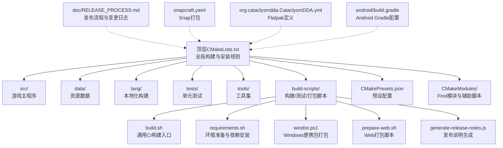

图表来源
- CMakeLists.txt
- CMakePresets.json
- build-scripts/build.sh
- build-scripts/requirements.sh
- build-scripts/windist.ps1
- build-scripts/prepare-web.sh
- build-scripts/generate-release-notes.js
- snapcraft.yaml
- org.cataclysmdda.CataclysmDDA.yml
- android/build.gradle

章节来源
- CMakeLists.txt
- CMakePresets.json

## 核心组件
- 构建系统与预设
  - 顶层CMakeLists集中定义构建选项、平台检测、依赖查找、安装规则与目标产物。
  - CMakePresets.json提供跨平台/多变体的预设（Windows/MSVC/MinGW、Linux、VCPKG、ClangCL等），统一缓存变量与生成器。
  - CMakeUserPresets.json.in用于模板化用户级预设注入。
- 版本管理
  - src/version.cmake通过Git描述生成版本常量与VERSION.txt，支持dirty标记与提交信息记录。
- 依赖与库
  - 通过find_package与CMakeModules/Find下的模块解析SDL2系列、ZLIB、Gettext、Threads等依赖。
  - 支持静态/动态链接切换与平台特定标志。
- 测试与质量
  - build.sh驱动CMake或Make构建，执行测试与clang-tidy检查；requirements.sh处理环境准备与MXE交叉编译。
- 打包与发布
  - Snap、Flatpak、Windows便携包、Web/Emscripten、Android等多渠道打包脚本与配置文件。
- 发布说明与变更日志
  - generate-release-notes.js基于GitHub API生成发布说明；doc/RELEASE_PROCESS.md提供变更日志统计与整理流程。

章节来源
- CMakeLists.txt
- src/version.cmake
- CMakePresets.json
- build-scripts/build.sh
- build-scripts/requirements.sh
- build-scripts/generate-release-notes.js
- doc/RELEASE_PROCESS.md

## 架构总览
下图展示从源码到多平台分发的整体流程：开发者在本地或CI中选择预设进行构建，运行测试与静态分析，随后根据目标平台调用相应打包脚本或配置文件，最终产出分发包并发布。

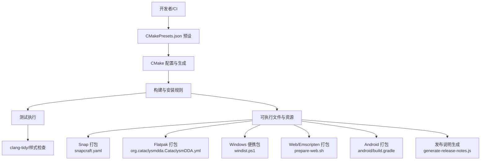

图表来源
- CMakePresets.json
- CMakeLists.txt
- build-scripts/build.sh
- build-scripts/windist.ps1
- build-scripts/prepare-web.sh
- snapcraft.yaml
- org.cataclysmdda.CataclysmDDA.yml
- build-scripts/generate-release-notes.js
- android/build.gradle

## 详细组件分析

### 组件A：CMake构建系统与预设
- 全局构建选项
  - 构建类型、警告级别、标准版本、线程库、压缩库等基础设置。
  - 平台检测（Linux、BSD、Darwin/macOS）与宏定义。
  - 动态/静态链接策略与链接器标志。
- 变体与特性开关
  - TILES、CURSES、SOUND、BACKTRACE、LOCALIZE、USE_XDG_DIR、USE_HOME_DIR、DYNAMIC_LINKING、JSON_FORMAT、TESTS等。
  - 互斥逻辑：TILES与CURSES不可同时启用；USE_XDG_DIR与USE_HOME_DIR互斥。
- 依赖查找与安装
  - SDL2系列、ncurses、Gettext、Threads、ZLIB等；未找到时给出明确错误提示。
  - 安装规则：doc、README、LICENSE、VERSION.txt、gfx等在发布模式下安装。
- 预设与用户级模板
  - CMakePresets.json覆盖Windows（MinGW/MSVC/ClangCL）、Linux（含VCPKG）等多场景。
  - CMakeUserPresets.json.in用于模板化注入环境变量与配置。

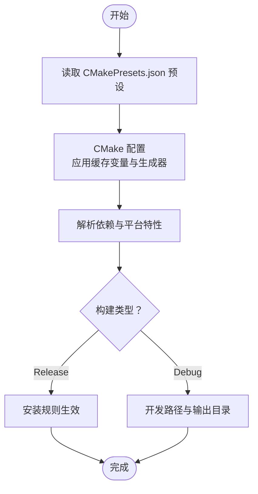

图表来源
- CMakeLists.txt
- CMakePresets.json

章节来源
- CMakeLists.txt
- CMakePresets.json
- build-scripts/CMakeUserPresets.json.in

### 组件B：版本管理与版本文件生成
- Git版本提取
  - 使用GetGitRevisionDescription.cmake与git_describe获取版本号，支持dirty标记。
- 版本头与版本文本
  - 写入src/version.h中的VERSION宏与VERSION.txt，包含构建类型、时间戳、提交SHA与提交URL。
- 用途
  - 编译期版本标识、发布包元信息、回溯定位。

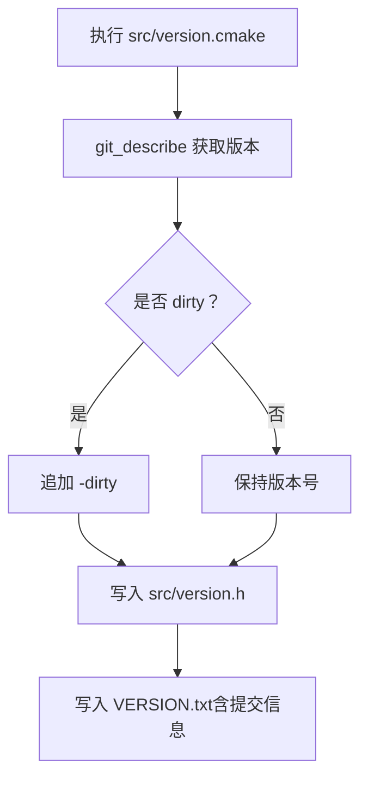

图表来源
- src/version.cmake

章节来源
- src/version.cmake

### 组件C：自动化测试与质量检查
- 构建与测试流程
  - build.sh支持CMake与Make两种路径；CMake路径下可选clang-tidy插件模式；Make路径下直接执行测试。
  - 测试并行化与过滤（如crafting_skill_gain、[slow]等），支持Mod加载验证。
- 质量工具
  - clang-tidy分析（按受影响文件或全量），compile_commands.json生成与文件变更检测。
  - ccache缓存统计与清理。
- 环境准备
  - requirements.sh处理MXE交叉编译、Wine初始化、覆盖率、libbacktrace等。

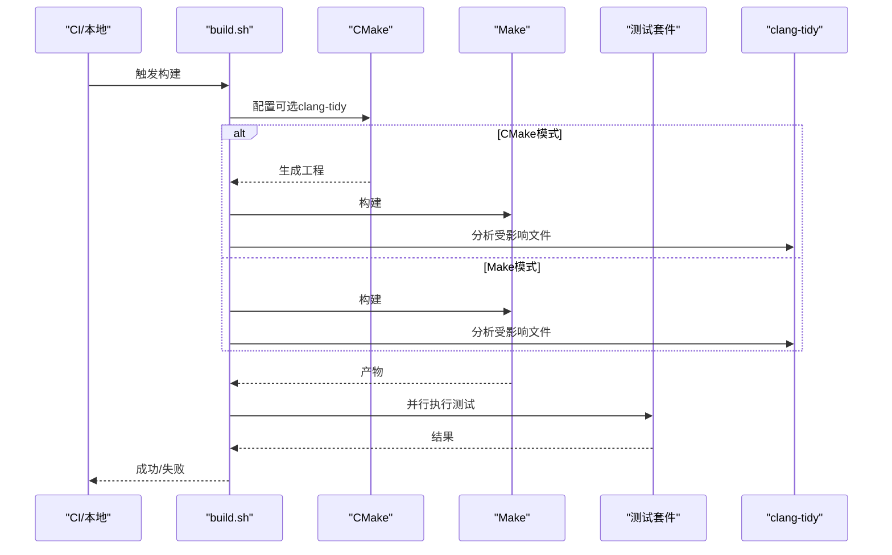

图表来源
- build-scripts/build.sh
- build-scripts/requirements.sh

章节来源
- build-scripts/build.sh
- build-scripts/requirements.sh

### 组件D：多分发渠道配置

#### Snap（Ubuntu/Debian生态）
- snapcraft.yaml定义了名称、版本、描述、权限、构建插件与安装阶段。
- 运行时为ncurses版本，命令通过cataclysm-launcher启动，stage/prime包含data、二进制与usr。

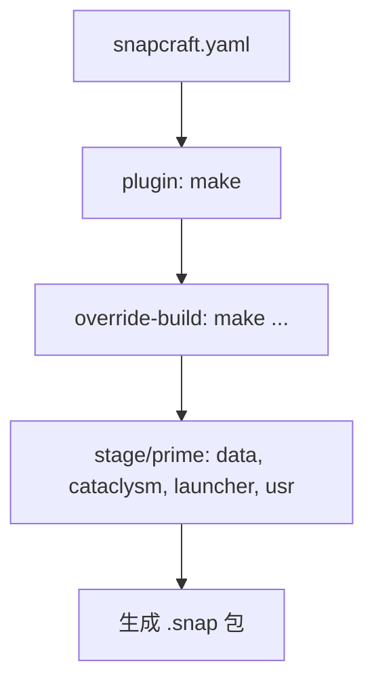

图表来源
- snapcraft.yaml

章节来源
- snapcraft.yaml

#### Flatpak（GNOME生态）
- org.cataclysmdda.CataclysmDDA.yml定义运行时、命令、沙箱权限与构建命令。
- 通过简单构建系统执行make与安装，打包图标、桌面文件与AppStream元数据。

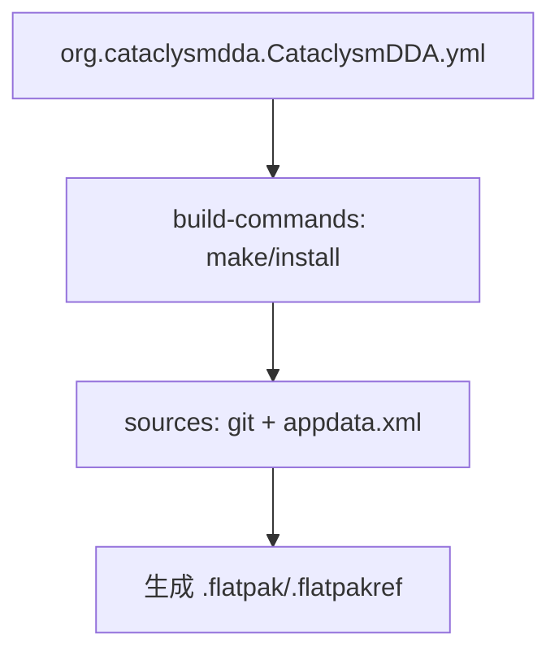

图表来源
- org.cataclysmdda.CataclysmDDA.yml

章节来源
- org.cataclysmdda.CataclysmDDA.yml

#### Windows 便携包
- windist.ps1复制可执行文件、语言包与资源，打包为zip归档，便于分发。

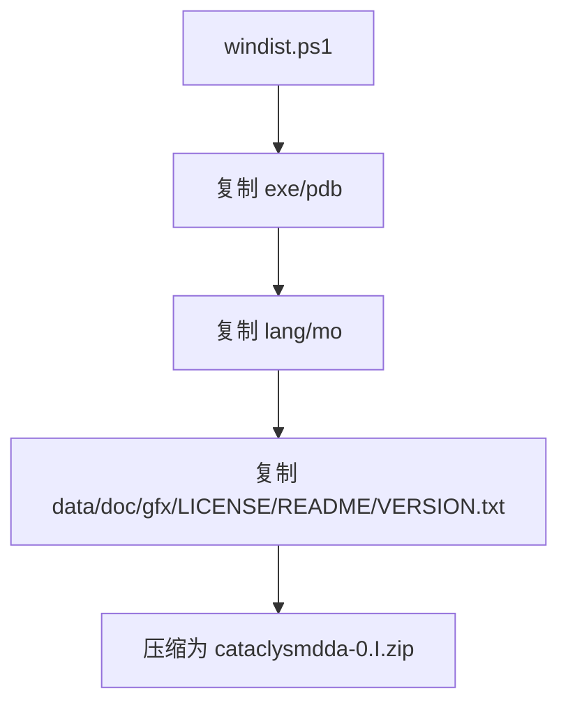

图表来源
- build-scripts/windist.ps1

章节来源
- build-scripts/windist.ps1

#### Web/Emscripten
- prepare-web.sh打包data与gfx，移除过时内容，使用Emscripten的file_packager生成预加载数据与JS/WASM产物，放置于build目录。

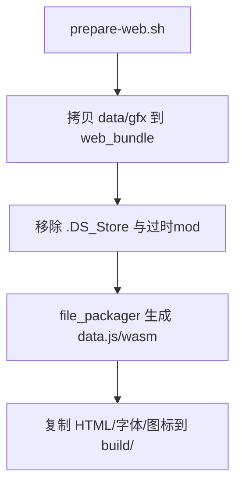

图表来源
- build-scripts/prepare-web.sh

章节来源
- build-scripts/prepare-web.sh

#### Android
- android/build.gradle定义Gradle与仓库，配合build.sh中的Gradle任务进行实验性release构建。

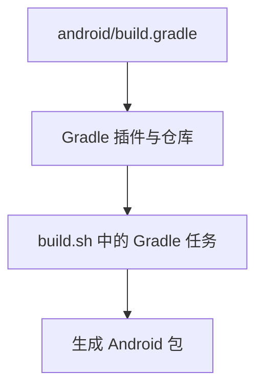

图表来源
- android/build.gradle
- build-scripts/build.sh

章节来源
- android/build.gradle
- build-scripts/build.sh

### 组件E：发布说明生成与变更日志管理
- 发布说明生成
  - generate-release-notes.js通过GitHub API检索最新预发布版标签，调用generate-notes接口生成说明，按段落截断以适配长度限制。
- 变更日志管理
  - doc/RELEASE_PROCESS.md提供实体计数差异统计流程与人工整理步骤，结合jq与join工具生成可读的变更摘要。

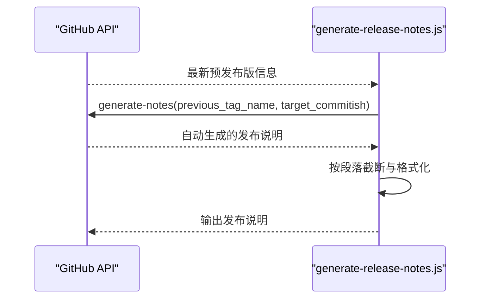

图表来源
- build-scripts/generate-release-notes.js
- doc/RELEASE_PROCESS.md

章节来源
- build-scripts/generate-release-notes.js
- doc/RELEASE_PROCESS.md

## 依赖关系分析
- 构建期依赖
  - CMakeLists对SDL2系列、ncurses、Gettext、Threads、ZLIB进行查找；未满足时抛出错误。
  - 静态链接时调整后缀与链接器标志，避免动态库依赖。
- 运行期依赖
  - Snap/Flatpak通过运行时与沙箱权限声明依赖；Windows便携包依赖系统运行库；Web依赖浏览器与WASM运行时。
- 交叉编译依赖
  - requirements.sh支持MXE工具链下载与校验，提供SDL2-devel与libbacktrace的预编译包。

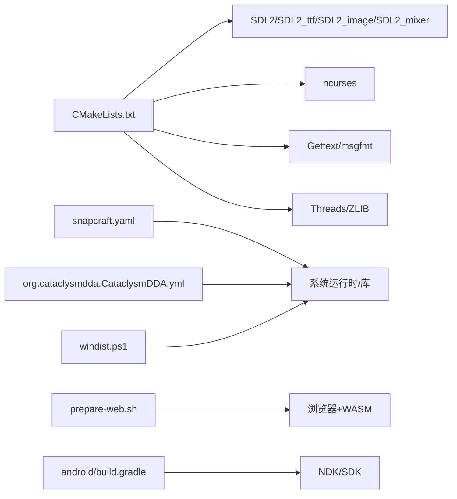

图表来源
- CMakeLists.txt
- snapcraft.yaml
- org.cataclysmdda.CataclysmDDA.yml
- build-scripts/windist.ps1
- build-scripts/prepare-web.sh
- android/build.gradle

章节来源
- CMakeLists.txt
- build-scripts/requirements.sh

## 性能考量
- 编译加速
  - 启用ccache并通过CMAKE_*_LAUNCHER注入；在requirements.sh中设置CCACHE_COMPILERCHECK=content以适配NDK编译器。
- 并行化
  - build.sh与requirements.sh使用parallel与多核make提升测试与构建效率。
- 链接与体积
  - 静态链接会增大体积但减少运行时依赖；动态链接需注意运行时库分发。
- Web打包
  - prepare-web.sh使用file_packager与LZ4压缩，平衡加载速度与包体大小。

章节来源
- build-scripts/build.sh
- build-scripts/requirements.sh
- build-scripts/prepare-web.sh

## 故障排查指南
- 依赖缺失
  - 症状：找不到SDL2/ncurses/Gettext等库。
  - 处理：安装对应开发包；在Windows使用VCPKG或MSVC静态链接预设；在Linux参考snapcraft.yaml中的构建包列表。
- 静态链接失败
  - 症状：链接器报错或运行时缺少库。
  - 处理：确认CMAKE_EXE_LINKER_FLAGS与BUILD_SHARED_LIBRARIES设置；必要时改为动态链接。
- 版本文件未更新
  - 症状：VERSION.txt或version.h未反映最新提交。
  - 处理：确保Git可用且有工作树变更；重新执行version.cmake。
- Snap/Flatpak运行异常
  - 症状：无法启动或音频/显示问题。
  - 处理：检查finish-args权限与运行时版本；对比org.cataclysmdda.CataclysmDDA.yml中的runtime-version。
- Windows便携包缺失资源
  - 症状：启动无画面/声音或语言包不生效。
  - 处理：确认windist.ps1复制了data、gfx、lang与LICENSE等文件。
- Web加载缓慢
  - 症状：首屏加载慢。
  - 处理：检查prepare-web.sh的file_packager参数与LZ4开关；确认build目录产物齐全。

章节来源
- CMakeLists.txt
- src/version.cmake
- snapcraft.yaml
- org.cataclysmdda.CataclysmDDA.yml
- build-scripts/windist.ps1
- build-scripts/prepare-web.sh

## 结论
本仓库提供了完善的多平台构建与发布基础设施：通过CMakePresets实现跨平台一致性，通过src/version.cmake与VERSION.txt保障版本可追溯，通过build-scripts与doc/RELEASE_PROCESS.md支撑自动化测试与发布说明生成。Snap、Flatpak、Windows便携包、Web与Android等多渠道配置清晰，便于社区与发行商集成。建议在实际发布前，严格遵循预设与脚本流程，确保依赖齐全、测试通过、说明准确。

## 附录

### A. 常用发布流程示例（概念性）
- 准备阶段
  - 切换至目标发布分支，更新版本号与变更日志。
- 构建阶段
  - 选择对应预设（如linux-tiles-sounds-x64或windows-tiles-sounds-x64-msvc），执行CMake配置与构建。
- 测试阶段
  - 运行测试套件与clang-tidy检查，确保无回归。
- 打包阶段
  - 根据目标平台调用相应脚本或配置文件生成分发包。
- 发布阶段
  - 上传至各分发渠道并生成发布说明。

### B. 关键脚本与参数速查
- build.sh
  - 支持CMAKE=1（CMake模式）与Make模式；可选CATA_CLANG_TIDY=plugin；控制TILES/SOUND/LIBBACKTRACE等。
- requirements.sh
  - 支持MXE交叉编译（MXE_TARGET）、Wine初始化、覆盖率收集、libbacktrace安装。
- windist.ps1
  - 复制exe/pdb、lang/mo与data/doc/gfx/LICENSE/README/VERSION.txt，打包zip。
- prepare-web.sh
  - 打包data/gfx，移除过时内容，生成data.js/wasm与HTML/字体/图标。
- generate-release-notes.js
  - 通过GitHub API生成发布说明，自动截断超长段落。

章节来源
- build-scripts/build.sh
- build-scripts/requirements.sh
- build-scripts/windist.ps1
- build-scripts/prepare-web.sh
- build-scripts/generate-release-notes.js