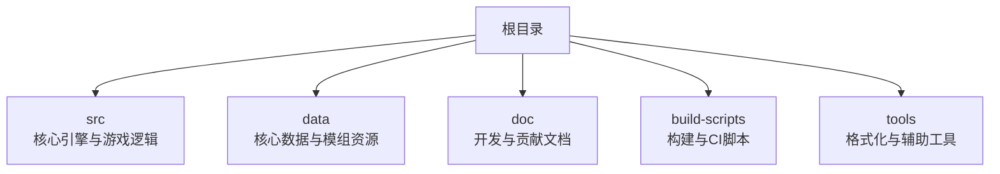
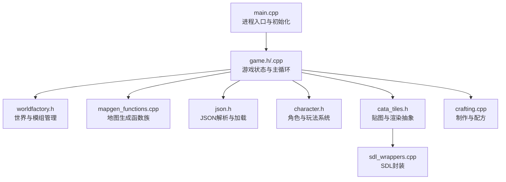
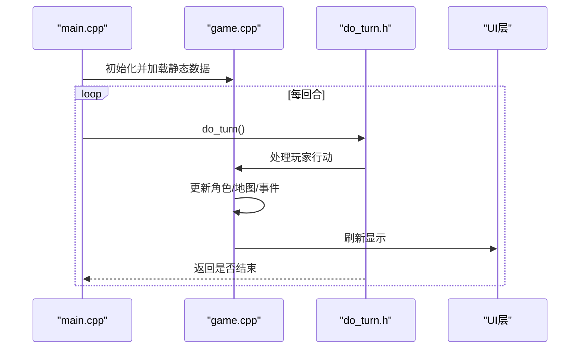
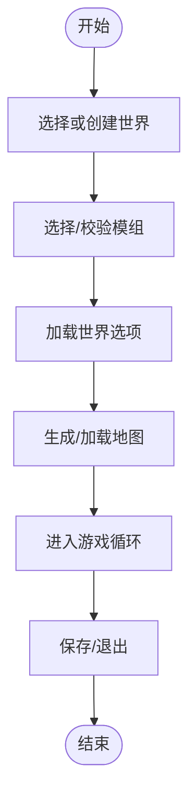
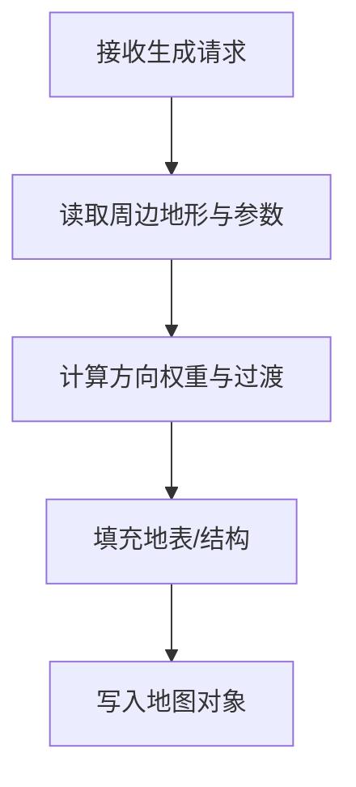
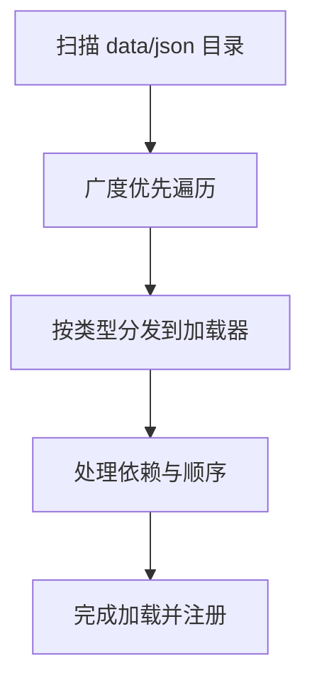
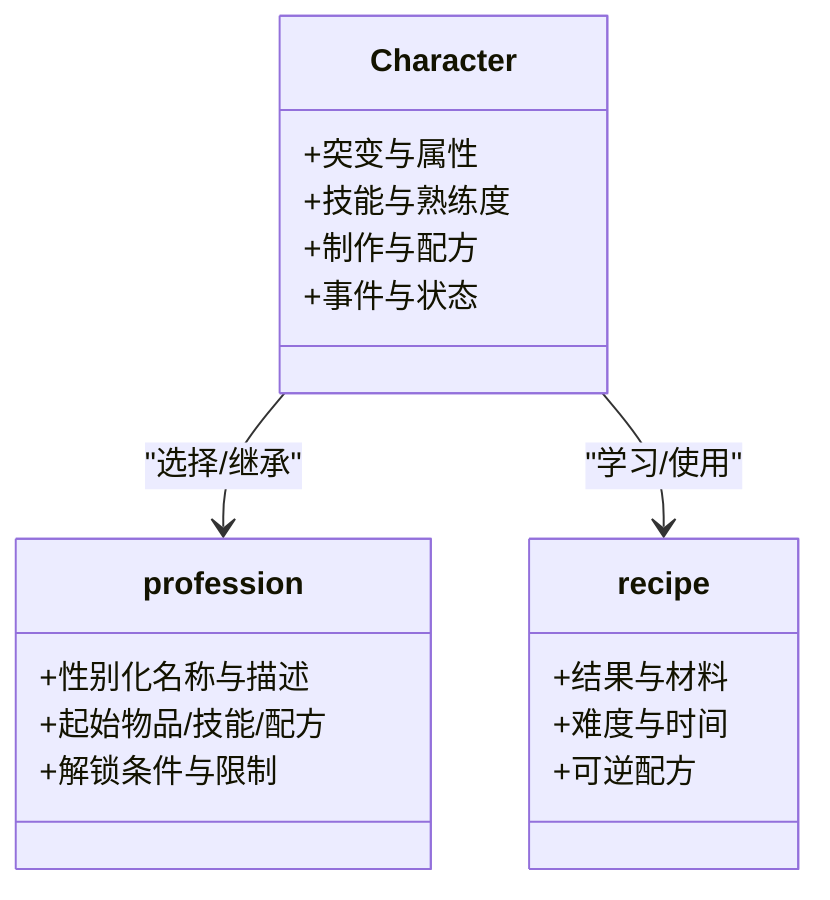
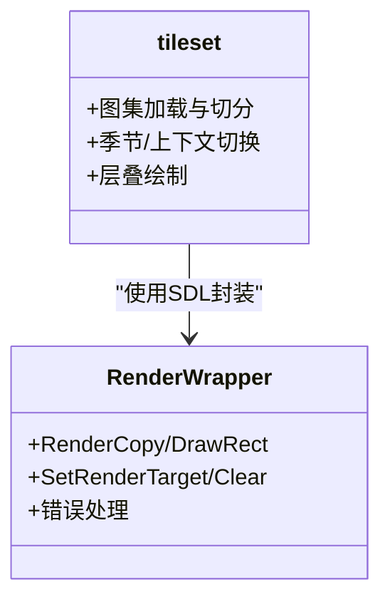
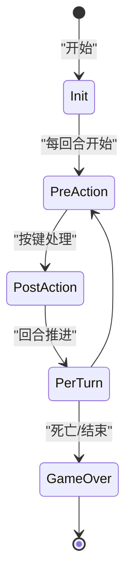
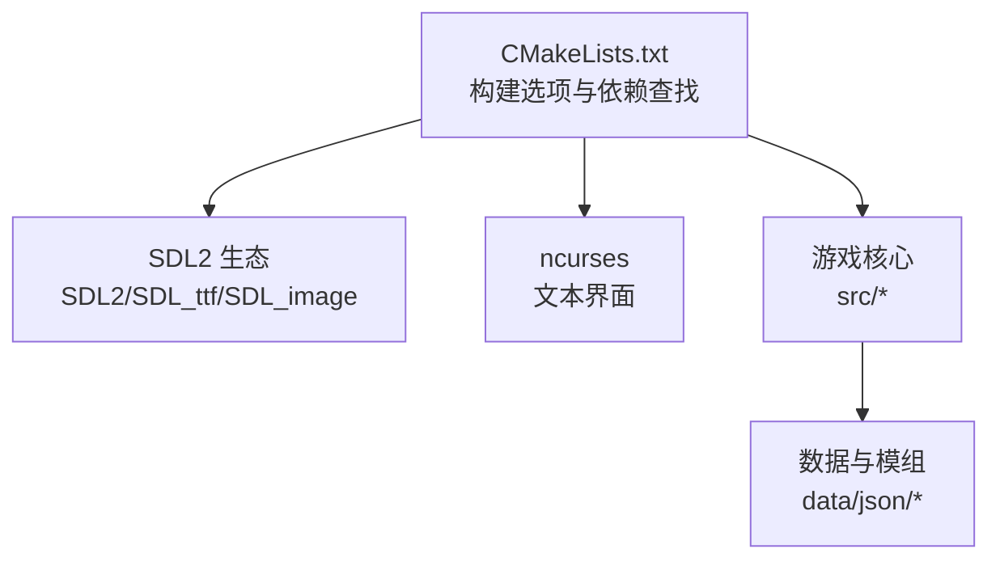

# 项目概述

<cite>
**本文档引用的文件**
- README.md
- LICENSE.txt
- doc/CONTRIBUTING.md
- CMakeLists.txt
- src/main.cpp
- src/game.h
- src/game.cpp
- src/do_turn.h
- src/gamemode.h
- src/worldfactory.h
- src/mapgen_functions.cpp
- src/mapgendata.h
- src/json.h
- src/init.cpp
- data/json/LOADING_ORDER.md
- src/profession.h
- src/character.h
- src/mutation.cpp
- src/crafting.cpp
- src/recipe_dictionary.cpp
- src/cata_tiles.h
- src/sdl_wrappers.cpp
- src/cata_tiles.cpp
</cite>

## 目录
1. [引言](#引言)
2. [项目结构](#项目结构)
3. [核心组件](#核心组件)
4. [架构总览](#架构总览)
5. [详细组件分析](#详细组件分析)
6. [依赖关系分析](#依赖关系分析)
7. [性能考量](#性能考量)
8. [故障排除指南](#故障排除指南)
9. [结论](#结论)
10. [附录](#附录)

## 引言
Cataclysm: Dark Days Ahead（简称 CDDA）是一款回合制后末日生存游戏，背景设定在核冬天后的废土世界。玩家需要在充满变异怪物与资源稀缺的环境中求生，通过探索、制作、战斗与策略决策来延续生存。项目强调持久化、程序化生成的世界、丰富的角色定制与模组生态，同时以开源协作的方式持续演进。

本项目概述旨在帮助不同背景的读者快速理解：游戏的核心价值主张、技术架构与创新点、关键功能模块、与其他同类游戏的差异化优势、历史与社区贡献模式、技术栈概览、构建与运行方式，以及面向初学者与资深开发者的认知框架与深入分析路径。

## 项目结构
仓库采用“按职责分层 + 按功能域划分”的组织方式：
- 根目录包含构建脚本、文档、许可证、图标与打包配置
- src 子目录为核心引擎与游戏逻辑，按模块拆分（地图生成、JSON加载、UI、角色、制作、地图、AI 等）
- data 子目录包含核心数据与模组资源（JSON 定义、字体、音效、贴图配置等）
- doc 子目录提供开发与贡献指南、翻译与本地化流程、设计文档等
- build-scripts、build-data、tools 等用于构建、测试与工具链支持

图表来源
- CMakeLists.txt
- README.md

章节来源
- CMakeLists.txt
- README.md

## 核心组件
- 游戏主循环与入口
  - 入口函数负责平台初始化、命令行参数解析、路径与语言设置、界面初始化、静态数据加载与主循环启动
- 游戏状态与世界工厂
  - 负责世界生成、模组管理、存档与选项加载、特殊游戏模式调度
- 地图生成与区域系统
  - 基于 overmap 与 mapgen 函数族实现程序化地形、地貌与建筑生成
- JSON 配置与动态加载
  - 自研 JSON 解析与加载器，支持类型安全读取、依赖顺序控制与热更新
- 角色与玩法系统
  - 包含职业、技能、制作、配方、基因突变、NPC 对战等
- 图形与音频子系统
  - SDL2 抽象层封装，支持贴图渲染、字体与声音播放；支持纯文本界面与图形界面双模式

章节来源
- src/main.cpp
- src/game.h
- src/worldfactory.h
- src/mapgen_functions.cpp
- src/json.h
- src/profession.h
- src/cata_tiles.h

## 架构总览
整体架构围绕“单例游戏实例 + 多子系统协同”的模式展开：
- 主进程负责生命周期管理、输入处理、UI 切换与事件派发
- 游戏实例承载世界、地图、角色、时间与事件总线
- 数据加载器通过 JSON 系统完成静态与动态内容装配
- 地图生成器与区域系统提供可扩展的程序化世界
- 图形与音频通过 SDL 抽象层适配多平台

图表来源
- src/main.cpp
- src/game.h
- src/worldfactory.h
- src/mapgen_functions.cpp
- src/json.h
- src/cata_tiles.h
- src/sdl_wrappers.cpp
- src/crafting.cpp

## 详细组件分析

### 组件A：主循环与生命周期（do_turn）
- 职责
  - 单步推进游戏逻辑，处理输入、更新角色状态、刷新 UI、检查退出条件
- 关键流程
  - 输入上下文收集与分发
  - 行动执行与副作用处理
  - 时间推进与事件触发
  - 退出判定与保存

图表来源
- src/main.cpp
- src/do_turn.h
- src/game.cpp

章节来源
- src/main.cpp
- src/do_turn.h

### 组件B：世界工厂与模组管理（worldfactory）
- 职责
  - 生成/选择/删除世界，维护世界选项与模组列表，驱动模组加载与校验
- 特性
  - 支持特殊游戏模式（如教程、竞速等）的注入
  - 世界与存档的持久化管理
  - 模组冲突检测与加载顺序控制

图表来源
- src/worldfactory.h

章节来源
- src/worldfactory.h

### 组件C：地图生成与区域系统（mapgen）
- 职责
  - 提供多种地图生成函数（森林、河流、地铁、湖岸等），根据周边地形与参数生成地表与地下结构
- 关键点
  - 使用 mapgendata 传递生成上下文（坐标、地形、密度、时间、任务等）
  - 通过方向权重与过渡函数实现自然边界与连接

图表来源
- src/mapgendata.h
- src/mapgen_functions.cpp

章节来源
- src/mapgendata.h
- src/mapgen_functions.cpp

### 组件D：JSON 配置与动态加载（json.h, init.cpp）
- 职责
  - 提供流式 JSON 解析、类型安全读取、错误定位与报告
  - 动态注册加载器，按类型分发到具体加载函数，支持依赖顺序与增量卸载
- 加载顺序
  - 通过广度优先遍历 data/json 目录，同层按字典序加载，确保依赖满足

图表来源
- src/json.h
- src/init.cpp
- data/json/LOADING_ORDER.md

章节来源
- src/json.h
- src/init.cpp
- data/json/LOADING_ORDER.md

### 组件E：角色、职业与制作系统（profession, character, crafting）
- 职业系统
  - 定义性别化名称、描述、起始物品、技能、CBM、配方、法术、任务等
- 角色系统
  - 突变、技能、熟练度、NPC 对战、事件与状态管理
- 制作系统
  - 配方字典、可制作清单缓存、失败概率与进度、批量制作与学习机制

图表来源
- src/profession.h
- src/character.h
- src/crafting.cpp
- src/recipe_dictionary.cpp

章节来源
- src/profession.h
- src/character.h
- src/mutation.cpp
- src/crafting.cpp
- src/recipe_dictionary.cpp

### 组件F：图形与音频子系统（cata_tiles, sdl_wrappers）
- 职责
  - 封装 SDL2 的纹理、渲染器与图像加载，提供统一的贴图层叠与渲染接口
- 特性
  - 支持图集切分、颜色键与 RLE 优化、软件渲染兼容
  - 错误处理与调试日志输出

图表来源
- src/cata_tiles.h
- src/sdl_wrappers.cpp
- src/cata_tiles.cpp

章节来源
- src/cata_tiles.h
- src/sdl_wrappers.cpp
- src/cata_tiles.cpp

### 组件G：特殊游戏模式（gamemode）
- 职责
  - 定义特殊游戏模式的生命周期钩子：初始化、每回合前/后、按键前后、死亡/结束回调
- 应用
  - 教程、竞速、无尽模式等

图表来源
- src/gamemode.h

章节来源
- src/gamemode.h

## 依赖关系分析
- 构建系统
  - CMake 控制编译选项（TILES、CURSES、SOUND、BACKTRACE 等），自动查找 SDL2、SDL2_ttf、SDL2_image、ncurses 等依赖
- 运行时
  - 可选图形模式依赖 SDL2 生态；文本模式依赖 ncurses；声音依赖 SDL2_mixer
- 数据与配置
  - JSON 文件作为唯一事实源，通过加载器集中装配；模组通过 worldfactory 注入

图表来源
- CMakeLists.txt
- src/main.cpp

章节来源
- CMakeLists.txt
- src/main.cpp

## 性能考量
- 地图生成
  - 使用方向权重与过渡函数减少不自然接缝；软件渲染下对图集切分进行优化
- JSON 加载
  - 单次扫描与类型分发避免重复遍历；同层按字典序保证确定性
- 渲染
  - 图像加载与颜色键设置、RLE 压缩提升透明像素处理效率
- 内存与缓存
  - 制作缓存与角色状态缓存降低重复计算成本

章节来源
- src/mapgen_functions.cpp
- src/cata_tiles.cpp
- src/crafting.cpp

## 故障排除指南
- 构建问题
  - 缺少 SDL2 或 ncurses 开发库会导致编译失败；请参考构建说明与依赖查找日志
- JSON 校验
  - 使用命令行参数验证 JSON 文件；加载器会报告错误位置与类型
- 运行时崩溃
  - 启用 BACKTRACE 与 libbacktrace 获取堆栈信息；查看调试日志输出

章节来源
- doc/CONTRIBUTING.md
- src/main.cpp

## 结论
CDDA 以回合制生存为核心体验，结合程序化生成、可扩展的 JSON 配置与强大的模组生态，在持久化与可塑性上形成差异化优势。其技术架构以 C++ 为核心，配合 SDL2 与 ncurses 实现跨平台图形与文本界面，并通过自研 JSON 工具链与加载器体系保障内容迭代的稳定性与一致性。对于初学者，建议从 README 与构建指南入手；对于开发者，可从 main.cpp、game.h、worldfactory.h、json.h 与地图生成模块切入，逐步深入到角色、制作与图形子系统。

## 附录
- 许可证与贡献
  - 代码与内容遵循 Creative Commons Attribution-ShareAlike 3.0；贡献需遵守许可与作者署名要求
- 社区与下载
  - 提供稳定版与实验版发布渠道，支持多平台包管理器与 Flatpak

章节来源
- LICENSE.txt
- README.md
- doc/CONTRIBUTING.md