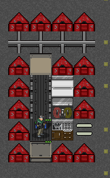

# 载具机制

载具是一种比步行更具效率的移动方式，考虑到游戏内的载具有着极为自由强大的改装系统，载具在一定程度上还可以担当移动仓库、医疗站、工作站甚至于移动基地、装甲战车等诸多角色；当然也可以是以上皆有的全能综合平台；

然而考虑到车体本身体积与移动、设备工作时可能存在的噪音，在市区等丧尸集聚场地，一时的驾驶失误也会导致载具变成一座钢制棺材，如果你的车体没有应对此类情况的改装或未配备武器……那还挺绝望的，所以说，道路千万条，安全第一条，行车不规范，艾特两行泪；

总之，我们先忘记那些远大的梦想、古巨圾什么的好东西，从基础开始；

### 如何找到载具

基本上城市里到处都有因事故、突发情况等各种各样原因而在大灾变当天不幸撞上各种东西的载具，一些车库、地点、道路上会有尚且完整的车辆，但并不绝对；

绝大部分载具实际上已经损毁严重，除了车体上那些零零散散的部件外基本失去了价值，但只要保持见到大体完整的车辆就上去检查一下的习惯，您仍然可以在各种地方找到可用的载具；

### 怎么样才算是「可用的载具」

要知道载具是否可用，也就是能不能动，你需要按「e」检查载具来查看车体基本情况，首先你必须确保几个基础事项：

1.  车内的「电池」内有剩余电量，油箱还有油量（自行车除外）
2.  轮胎数量须为「足够」；
3.  引擎、座椅、载具控制器能够正常工作；

以上基本都没问题，则你走到载具控制器方格，按下「\^」就能开走了，不过有些车内可能很不幸的没有插钥匙，这种情况下需要一把螺丝刀及相对冗长的时间以短接载具，短接一次后就不需要再短接了：

### 载具推荐
开局可以去奶牛场或城市里找自行车. 自行车速度快, 声音小, 不消耗耐力, 人力驱动, 前中期必备载具.

如果能找到, 也可以用轮椅, 轮椅相比自行车体积更小, 夜里在充满丧尸的城里飙车时更不容易撞车gg.

车的话可以选用轻工厂的货车, 大量的货仓可以提供非常多存储空间.

### 载具的一些基本概念

姑且来说你不用太在意这边的内容，但如果你对一些数据存在疑问……我姑且觉得我能提供一些帮助；

**名称**：载具名，可以自由修改，观察载具时会直接显示载具名称，因而通常用于辨识野生载具有啥东西；

**安全速度/最高速度**：安全速度是驾驶时不会出现故障或损坏的标定速度；最高速度是你载具所能抵达的最大速度，超出安全速度驾驶有可能导致引擎损坏；

**加速度**：每轮最多能增加多少速度，会受一些地形等因素影响；

**质量**：车体的总重量，承载货物或者储存罐里的液体等都会影响车体总重，车体总重除了关乎于你能不能徒手推车之外，还会影响阻力数值……我们之后再谈这个；

**载货量**：车体内所有可储物的储物空间总和，基本可以视为能带多少东西系，至于物品重量则全盘加在「质量」上；

**轮胎**：轮胎是否「足够」的概念，就是说车体重心（一般来说也是中心）最起码要在轮胎范围之内；只有当轮胎处于「足够」状态时，载具才能移动（飞机除外）；

比较简洁一点的形容就是说，你用笔沿着轮胎画一个矩形或者三角形或者直线，如果这个形状能够支撑车体，则轮胎视为「足够」；

更简洁一点的话……一般来说如果你的车体较大，则最好用三轮支撑或四轮支撑，如果是自行车这种竖长车体，则只需两个轮胎，如果是独轮车，一个轮子就撑得住；

大概就是这样，具体依然可能会有点奇奇怪怪的变化，具体取决于你到底想造个多离谱的车；

**阻力**：理论上影响车体的可控性，如加速度、刹车速度等各项数据，虽然通常来说越低越好，但你的车最终总会走向臃肿……所以也不用太强求；

**越野**：低于100%的越野会在「路面」之外的各种地形受到减益，增加载具的重量会降低越野；更多或者更大的轮子可以增加越野，推荐大轮子；

**噪音**：通常而言，各类引擎噪音程度是：汽油、柴油 \> 脚蹬 \> 电力引擎；只要引擎发动就会产生噪音，汽油及柴油引擎还会额外产生烟雾；噪音大小与烟雾程度取决于引擎性能及载具速度，多引擎产生的烟雾更多更强，但噪音水平只取决于最吵的那个；消音器可以降低60%的噪音水平及烟雾强度，并且让所有排热、排气从消音器所在位置排放，多个消音器不叠加，但如果消音器不幸受损，载具会自动更换成完好的消音器；

脚蹬、电力引擎都十分安静；相对而言汽油柴油则是性能越好就越吵闹；

**损坏**：如同武器损坏会降低攻击力，车体部件损坏也会降低工作效率；如电池、油箱损坏会发生泄漏，引擎偶尔会罢工或者难以启动，发电设备效率下降等等；所以坏了就修没什么问题。

**车体、车顶**：如果车体整体处于密封状态（即为有车身、车顶），则提供一定的环境保护并保护你不被淋湿；

**船体/能否浮起**：给车加上船壳，显示为可以浮起时就能在水上行驶；

**畜力动力**：马拉车一类的载具，一般没必要也不好用，但荒野求生时非常好用。

### 畜力车原理

可以将具有「PET_MOUNTABLE」和「PET_HARNESSABLE」的生物套到车辆的「挽具」和「强化挽具」上；

截至2025年4月，可被套上的生物需要是驯服的友好生物，包括混血拉布拉多、马、牛、猪、野猪、驼鹿、锹甲虫家族、食杂店机器人；

被套上的生物视为登上了载具，可以随载具漂浮在深水上，会增加载具整体的重量；

不同生物产出的功率不同，公式是：15W×（生物速度）×（[生物体型](常见问题%20Q&A.md/#46生物体型) - 1）×（骑乘重量系数，默认0.2）；

以马为例，速度为300，体型为huge（5），最终计算结果为3.6 kW，这就是该挽具能提供的最大功率；

如果你的车有两个挽具（相当于两个引擎），多引擎功率会受到惩罚，在这里是乘0.8倍，因此实际功率为2.88 kW，载具信息界面取整显示为2 kW。

锹甲虫家族很特殊，骑乘重量系数为六，因此能提供的功率远大于马（21.6 kW），但正常情况下没法将其驯服。

### 改车建议

想要开着坚实的装甲车在尸群中杀个七进七出？想要一箱油用到天荒地老？下面这些冷知识你必须要知道！

#### 载具伤害机制

1. 载具部件除了「耐久值」外，还有一个隐藏的「伤害抵抗」属性，低于该值的伤害将被忽略；普通车架有20抗伤，重型车架有30抗伤，装甲板抗伤普遍较高（如钢制装甲板为56），而撞锤抗伤更高（如钢撞锤有足足70的抗伤）；
2. 载具撞到生物、地形时，受到的伤害可以分为两类：一是直接碰撞伤害，作用于受到撞击的那一格；二是震动伤害，作用于载具的所有格，伤害初值与直接碰撞伤害相同，但随作用点与碰撞点的欧几里得距离增加而平方衰减；
3. 直接碰撞伤害作用在载具的某格时，装甲板一类的部件可以防护该格所有不为「车顶盖」和“位于车顶”（如外挂油箱）的部件，使得这些部件遭受的伤害减去装甲板的抗伤值；
4. 震动伤害作用在载具的某格时，减震器可以防护该格除了「结构件」（如车架）和具有「PROTRUSION」标识（如外挂油箱，起重吊臂）的所有部件，使得这些部件遭受的伤害减去减震器的抗伤值；

有了这些预备知识，我们就知道怎样设计载具才能最大程度减伤：**车体外围安装装甲板部件，内部安装减震器；**

撞击通常发生在车体外围，**脆弱的电子元件和玻璃、重要的引擎等部件应当尽量远离撞击源头，以减免震动伤害；**

如果将“容易修理+结实”的原则贯彻到极致，可以在车头第一排安装撞锤，第二排只安装车架，第三排再安装撞锤，这样绝大部分撞击都被挡在三格之外，车体第四排之后的部件只会受到原始伤害1/9甚至1/16的伤害；第二排的车架所受到的震动伤害无法防御，但距离为2的情况下，20抗伤已经足够高，此格无其他部件，车架修理和更换方便；撞锤不阻挡视线，完全可以使用「撞锤」代替大部分「装甲板+车架+隔板」，只在必要的地方保留隔板或车门；

**下图给出了一种装甲车设计：**

#### 载具阻力机制

载具的阻力分为「滚动阻力」和「空气阻力」两部分，其中空气阻力正比于速度的平方，正比于载具信息页面显示的“空气阻力”值；滚动阻力正比于载具信息页面显示的“滚动阻力”值，与“越野能力”成反比；

因此我们可以知道，**在重型载具和/或低速状态下，滚动阻力占主导；在高速状态下，空气阻力占主导；**

先聊聊如何应对滚动阻力：在载具质量一定时，有两款轮子能够达成越野性能和阻力的综合最优：**轻型载具首选「越野自行车轮」，重型载具首选「越野宽车轮」**。注意，「装甲车轮」并不利于减阻和提高越野性能；

滚动阻力与轮子个数有关，**在保证足够越野能力的情况下，应当尽量少安装轮子**（现实中大货车的提升桥也有这方面的考虑）；

空气阻力的计算过程复杂，这里只给出一些基本的原则：每个部件有一定的“高度”，计算出载具从左到右每一「列」的高度，再进行一定处理（考虑载具有多接近“流线型”），得到各列的空气阻力系数；整车的“空气阻力”系数是各列空气阻力系数的平均；

如何降低各列的空气阻力系数呢？一是要降低“高度”，二是要在“处理”过程下功夫。

高度方面，隔板高于半隔板和挡风玻璃；车顶盖、外挂油箱、直升机旋翼、风力发电机、炮塔、过道、太阳能板等都会提高该列的高度；处理方法一是少安装这些部件，二是把多个同类部件（如炮塔）安装在同一列，能够起到“遮蔽”的作用，优于将其安装在不同列；

处理方面，能够降低风阻的设计要点如下：座椅之前（不必相邻）有挡风玻璃；隔板或挡风玻璃之前有半隔板；车门关闭、载具“内部”格均有车顶盖；**载具长度是宽度的两倍以上**；车尾有后备箱门或半隔板；

值得注意的是，载具的“空气阻力”系数具有硬编码的最小值「0.1」。

综合上面所有讨论，我们就可以改造载具，使其具有尽可能小的阻力，从而最大化续航里程。

#### 载具动力机制

有内燃引擎或电力引擎的非飞行载具，在怠速状态或行驶状态下，引擎的功率总体上符合牛顿力学：
1. 静止状态的载具，若内燃引擎未关闭，会持续输出功率并消耗燃料，其数值取最大功率的1%和发电机负载的较大值；
2. 匀速运动的载具，根据F=f，P=Fv，引擎提供载具克服两种阻力所需的功率，以及发电机负载；
3. 加速运动的载具，根据F=ma+f，P=Fv，引擎还提供本回合载具的实际加速度（使得末速度不超过目标速度）；
4. 减速运动的载具，引擎还提供本回合载具的实际加速度超过「32km/h/s」的部分（轮胎制动可以提供32km/h/s的减速）；

**因此，尽量减少加减速过程，可以降低燃料消耗，这也与现实情况一致；**

对于飞行载具（直升机），引擎至少输出15%（同层飞行时）或30%（有升降时）最大功率，因此基础油耗极高；
直升机的飞行功率计算公式复杂，但从经验来看，速度在「150km/h」左右能够取得基础油耗和动态油耗的综合平衡，达到最远的续航；

对于有多个引擎的载具，同时开启多个引擎时，能够用来加速的有效总功率会受到惩罚，具体计算公式为：字面总功率×4 / (引擎个数 + 3)；

因此，双引擎载具的有效总功率是简单加和的「80%」；如果两个引擎功率差距过大，甚至会导致同时开两个引擎的功率还不如只开大引擎；

需要注意的是，燃料消耗并不因有效功率降低而降低，而挽具、帆、桨均属于引擎，因此记得及时关闭用不到的引擎。
